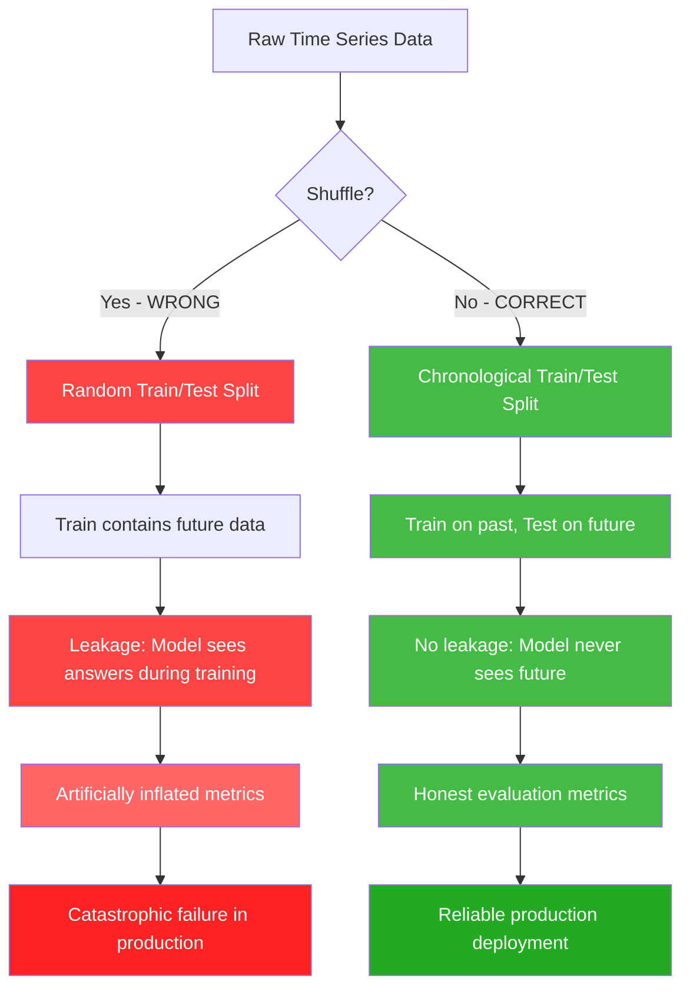
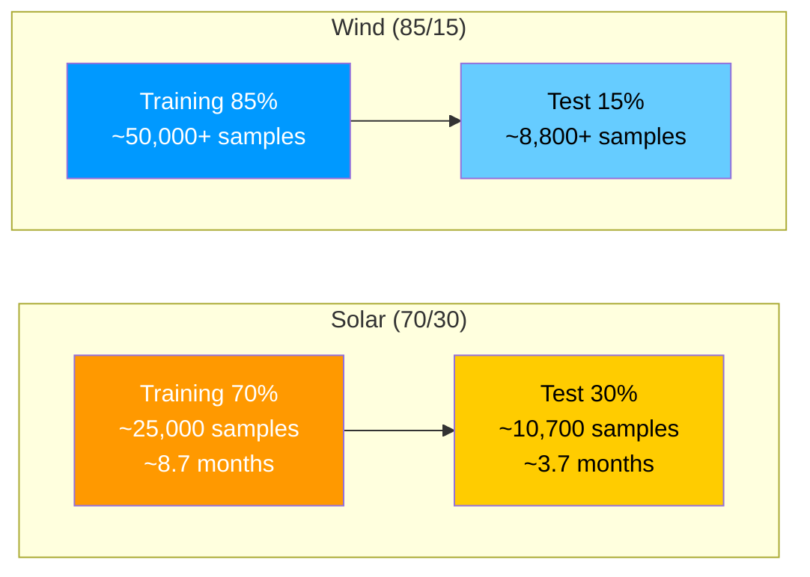
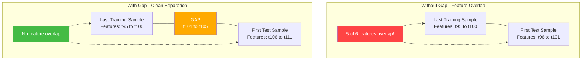
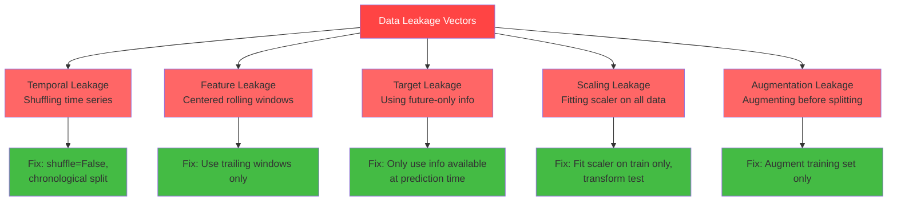

# 10.1 Chronological Integrity and Data Leakage

> **Important Reminder**: If you randomly shuffle time series data before splitting into train and test sets, your evaluation metrics are lies. They will look impressive, but they measure memorization — not prediction. In renewable energy forecasting, this mistake can lead to deploying a model that catastrophically fails the moment it encounters truly unseen future conditions.

## Why Random Shuffling Is Fatal in Time Series

When you work with tabular data where each row is independent — say, predicting whether a customer will churn, or classifying images of cats and dogs — the assumption of **independent and identically distributed (iid)** data holds. Under the iid assumption, every sample is a fresh draw from the same underlying distribution, and the order in which samples appear carries no information. In that world, randomly shuffling your data before splitting into training and test sets is not just acceptable — it is best practice. It ensures that both splits are representative of the overall distribution.

Time series data fundamentally violates the iid assumption. A solar irradiance reading at 2:00 PM on June 15th is not independent of the reading at 1:45 PM on the same day. Wind speed at 10:00 AM is correlated with wind speed at 10:10 AM. This autocorrelation — the dependence of current values on past values — is the defining characteristic of time series, and it is precisely what makes shuffling destructive.

Consider what happens when you shuffle solar power data from the UNISOLAR dataset recorded at 15-minute intervals. The model might be trained on a sample from December 21st (winter solstice, minimal sunlight) and then tested on a sample from June 21st (summer solstice, peak sunlight) that occurred chronologically *before* the training sample. Even worse, because of autocorrelation, the training set will contain samples that are just 15 minutes away from test samples — effectively giving the model the answer during training.



## The Difference Between IID Data and Time-Dependent Data

### Independent and Identically Distributed (IID) Data

In the iid regime, each observation $x_i$ is drawn independently from a probability distribution $P(X)$. The joint distribution factorizes:

$$P(x_1, x_2, \ldots, x_n) = \prod_{i=1}^{n} P(x_i)$$

This means knowing $x_1$ tells you nothing about $x_2$. Examples include coin flips, dice rolls, and many classification tasks where samples are unrelated. Under iid conditions:

- **Shuffling is safe** because order carries no information
- **Cross-validation works** because any random subset is representative
- **Exchangeability holds** — the distribution is invariant to permutation

### Time-Dependent Data

In time series, observations are **sequentially correlated**. The joint distribution does not factorize:

$$P(x_1, x_2, \ldots, x_n) = P(x_1) \cdot P(x_2|x_1) \cdot P(x_3|x_1,x_2) \cdots P(x_n|x_1,\ldots,x_{n-1})$$

This is a chain of conditional dependencies. Knowing $x_{t-1}$ tells you a great deal about $x_t$. The autocorrelation function (ACF) quantifies this:

$$\text{ACF}(k) = \frac{\text{Cov}(x_t, x_{t-k})}{\text{Var}(x_t)}$$

For solar power data at 15-minute intervals, the ACF at lag 1 (15 minutes) might be 0.95 or higher. For wind power at 10-minute intervals, ACF at lag 1 is typically 0.85-0.92. These are extraordinarily high correlations, meaning adjacent samples are almost redundant.

```mermaid
graph LR
    subgraph "IID Data (Shuffling OK)"
        A1[""] --> A2[""]
        A2 --> A3[""]
        A3 --> A4[""]
        A4 --> A5[""]
    end

    subgraph "Time Series (Shuffling FATAL)"
        B1["6:00 AM\n0 kW"] --> B2["6:15 AM\n5 kW"]
        B2 --> B3["6:30 AM\n22 kW"]
        B3 --> B4["6:45 AM\n68 kW"]
        B4 --> B5["7:00 AM\n145 kW"]
    end

    style B1 fill:#ffcc00
    style B2 fill:#ffdd33
    style B3 fill:#ffee66
    style B4 fill:#ffee88
    style B5 fill:#ffee99
```

In the solar power sequence above, each value is predictable from its neighbors. If the model is trained on 6:30 AM data and tested on 6:15 AM data, the correlation between the two means the model has essentially been given the answer. This is **temporal leakage** — information from the future (relative to the test point) leaking into the training set.

## The Project's Use of shuffle=False

In this project's codebase, the train-test split explicitly uses `shuffle=False`:

```python
from sklearn.model_selection import train_test_split

# Solar pipeline
X_train, X_test, y_train, y_test = train_test_split(
    X, y, test_size=0.30, shuffle=False
)

# Wind pipeline
X_train, X_test, y_train, y_test = train_test_split(
    X, y, test_size=0.15, shuffle=False
)
```

The `shuffle=False` parameter is not a minor detail — it is the single most important argument in the entire evaluation pipeline. Without it, every metric reported in this project would be meaningless.

When `shuffle=False` is specified, `train_test_split` preserves the original ordering of the data. Since the dataframes are sorted chronologically before splitting, the training set contains the earliest observations and the test set contains the latest observations. This mirrors the real-world deployment scenario: the model is trained on historical data and must predict future data it has never seen.

```mermaid
gantt
    title Chronological Data Split (Solar Example)
    dateFormat X
    axisFormat %s

    section Training Set (70%)
    Historical data - earliest to 70th percentile    :t1, 0, 700

    section Gap (Optional)
    Buffer zone to prevent leakage    :gap, 700, 710

    section Test Set (30%)
    Future data - 70th to 100th percentile    :t2, 710, 1000
```



## Chronological Split Ratios: Solar vs. Wind

### Solar Pipeline: 70/30 Split

The solar forecasting pipeline uses a 70/30 train/test split on the UNISOLAR dataset (Site 25, 15-minute intervals). This means:

- **Training set**: The first 70% of the chronological data (oldest observations)
- **Test set**: The remaining 30% (newest observations)

For a dataset spanning roughly one year at 15-minute intervals, this translates to approximately:
- Training: ~25,000 samples (about 8.7 months)
- Test: ~10,700 samples (about 3.7 months)

The 70/30 ratio is relatively generous to the test set. This is intentional — solar power has strong seasonal patterns (summer vs. winter irradiance), and a smaller test set might not capture the full range of seasonal variation. By allocating 30% to testing, the evaluation includes transitions across seasons, ensuring the model is stress-tested under diverse conditions.

### Wind Pipeline: 85/15 Split

The wind pipeline uses an 85/15 split on the combined SDWPF/NREL/Turkey dataset (10-minute intervals, 48-hour forecast horizon). The larger training fraction makes sense for several reasons:

1. **Wind is noisier**: Wind power exhibits higher variance and less predictable patterns than solar. More training data helps the Bi-GRU learn the complex dynamics.
2. **Multi-source dataset**: Combining SDWPF, NREL, and Turkey data means the model needs more examples to learn patterns across different wind regimes and turbine types.
3. **Physics features**: The physics-augmented features (AIR_DENSITY, WIND_CUBED, U/V vectors) add dimensionality, requiring more training samples to avoid overfitting.

For a dataset at 10-minute intervals spanning several months:
- Training: ~50,000+ samples
- Test: ~8,800+ samples



## The Gap Between Train and Test

One subtle but critical practice in time series evaluation is introducing a **gap** between the training set and the test set. This gap serves as a buffer against a specific form of leakage that even chronological splitting does not fully prevent.

### Why a Gap Is Needed

Consider a model that uses a lookback window of 96 timesteps (24 hours for solar at 15-minute intervals). The last training sample uses features from timesteps $t_{n-95}$ through $t_n$, where $t_n$ is the last training point. The first test sample uses features from $t_{n-94}$ through $t_{n+1}$. Notice the overlap: 95 out of 96 feature timesteps are shared between the last training sample and the first test sample.

This overlap means the model has effectively "seen" most of the features of the first test sample during training. While it hasn't seen the *target* of the first test sample, the near-complete overlap in the feature space creates an artificial advantage at the boundary between train and test.



The gap size should be at least as large as the maximum lookback window used by the model. For the solar LSTM with a 96-step lookback (24 hours), the gap should be at least 96 timesteps (24 hours). For the wind Bi-GRU with a 144-step lookback (24 hours at 10-minute intervals), the gap should be at least 144 timesteps.

### Practical Implementation

In this project, the gap can be implemented by simply discarding a buffer zone between training and test data:

```python
# After chronological split, remove gap samples
gap_size = lookback_window  # e.g., 96 for solar, 144 for wind

# Training data ends at index train_end
# Test data starts at train_end + gap_size
X_train_clean = X_train[:len(X_train) - gap_size]  # or simply: don't adjust, 
X_test_clean = X_test[gap_size:]                     # the windowing handles it
```

In practice, the way sequences are constructed for the LSTM/GRU (using a sliding window with the lookback) naturally creates a gap, because the first test sequence's features may overlap with the last few training targets, but the sequence generation process handles this boundary.

## Other Forms of Data Leakage in Time Series

Beyond temporal leakage from shuffling, there are several other leakage vectors that are easy to overlook:

### 1. Feature Leakage

Including future information in the features. For example, if you compute a 24-hour rolling average of wind speed and include it as a feature, but compute it using *centered* windows (which look both backward and forward), you have leaked future information into the features. Always use **trailing** (backward-looking) windows:

```python
# WRONG - centered window (uses future data)
df['wind_speed_24h_avg'] = df['wind_speed'].rolling(window=96, center=True).mean()

# CORRECT - trailing window (only uses past data)
df['wind_speed_24h_avg'] = df['wind_speed'].rolling(window=96, center=False).mean()
```

### 2. Target Leakage

Using information that is only available *after* the prediction time. For example, if you include the day's maximum temperature as a feature for predicting solar power at 10:00 AM, but the maximum temperature is only known at the end of the day, you have target leakage. In practice, you would need to use *forecasted* maximum temperature, which introduces its own uncertainty.

### 3. Scaling Leakage

Fitting the scaler (StandardScaler, MinMaxScaler, RobustScaler) on the entire dataset before splitting. If you normalize using statistics computed over all data (including the test set), the training data has been indirectly contaminated by test-set statistics. Always fit the scaler on the training set only, then transform both sets:

```python
# WRONG - fitting on all data
scaler = StandardScaler()
X_scaled = scaler.fit_transform(X)
X_train, X_test = X_scaled[:split], X_scaled[split:]

# CORRECT - fitting on training data only
X_train, X_test = X[:split], X[split:]
scaler = StandardScaler()
X_train_scaled = scaler.fit_transform(X_train)
X_test_scaled = scaler.transform(X_test)
```

### 4. Augmentation Leakage

If you use data augmentation techniques (jittering, window slicing, etc.) on the entire dataset before splitting, augmented versions of test samples may appear in the training set. Always augment only the training set.



## Why This Matters for Grid Operations

In the real world, a solar or wind power forecasting model is deployed to predict *future* power output. The grid operator uses these predictions to schedule reserves, plan dispatch, and manage energy trading. A model that was evaluated on shuffled data might report an R-squared of 0.99 but deliver an R-squared of 0.60 in production — a gap that could mean the difference between profitable operations and million-dollar imbalances.

The chronological split ensures that evaluation metrics reflect actual production performance. If a model achieves R-squared = 0.87 on a chronologically held-out test set, you can be confident that similar performance is achievable in the real world, because the evaluation faithfully simulates the train-on-past, predict-on-future paradigm.

## Cross-Validation for Time Series

Standard k-fold cross-validation is inappropriate for time series for the same reasons that random shuffling is inappropriate. Instead, use **time series cross-validation** (also called **walk-forward validation** or **expanding window validation**):

- **Expanding window**: Each fold adds more training data while always testing on the chronologically next block
- **Sliding window**: Each fold uses a fixed-size training window that slides forward in time
- **Blocked time series CV**: Divides data into chronological blocks and tests on each block in turn

```mermaid
gantt
    title Time Series Cross-Validation (Expanding Window)
    dateFormat X
    axisFormat %s

    section Fold 1
    Train :t1, 0, 200
    Test  :d1, 200, 300

    section Fold 2
    Train :t2, 0, 300
    Test  :d2, 300, 400

    section Fold 3
    Train :t3, 0, 400
    Test  :d3, 400, 500

    section Fold 4
    Train :t4, 0, 500
    Test  :d4, 500, 600
```



Each fold respects temporal ordering: training data always precedes test data. This provides a more robust estimate of out-of-sample performance than a single chronological split, at the cost of more computation.


## Advanced Temporal Validation Strategies

### Purged K-Fold Cross-Validation

For practitioners who need the statistical robustness of multiple evaluation folds while maintaining temporal integrity, **purged k-fold cross-validation** offers a rigorous solution. Developed originally for financial time series (where leakage concerns are equally critical), purged CV adds an embargo period between each training and test fold:

1. Split the data into k chronological folds
2. For each fold, use all prior folds as training data
3. **Purge** (remove) a gap of size $g$ at the boundary between the last training fold and the test fold
4. The gap $g$ must be at least as large as the maximum lookback window plus any autocorrelation decay period

This approach provides k independent estimates of out-of-sample performance while eliminating the feature overlap that plagues standard time series splits. The cost is reduced training data per fold (due to purging), but the benefit is more reliable performance estimates.

### Adaptive Split Points

Rather than using a fixed percentage split, consider splitting at meaningful temporal boundaries:

- **Season boundaries**: Train on spring+summer, test on fall+winter (captures seasonal generalization)
- **Weather regime boundaries**: Train on calm periods, test on volatile periods (stress-tests the model)
- **Operational phase boundaries**: Train on normal operations, test on maintenance periods (evaluates robustness)

These adaptive splits provide more targeted evaluation of specific failure modes that matter for grid operations.

### The Information Horizon Concept

Every forecasting model has an **information horizon** — the maximum time into the future for which it can provide useful predictions. Beyond this horizon, the model's predictions are no better than climatological averages. The information horizon depends on:

- **Autocorrelation decay**: How quickly does the correlation between current and future values drop to zero?
- **External forcing predictability**: How well can we forecast the external drivers (weather fronts, cloud systems)?
- **Nonlinear dynamics**: Chaotic systems have inherently limited predictability (Lorenz's butterfly effect)

For solar power, the information horizon for day-ahead forecasts is relatively long (24-48 hours) because the diurnal cycle provides a strong deterministic baseline. For wind power, the information horizon at 48 hours is near the edge of useful predictability — which explains the lower R-squared values.

Understanding the information horizon helps set realistic expectations for forecast accuracy and determines the optimal retraining frequency. If a model's performance degrades beyond 24 hours, there is no point generating 48-hour forecasts — instead, focus resources on improving the 0-24 hour range.

## Key Takeaways

1. **Never shuffle time series data** before splitting. The `shuffle=False` parameter in `train_test_split` is not optional — it is essential for honest evaluation.

2. **IID assumptions are violated** in time series. The autocorrelation structure means that adjacent samples are highly correlated, and shuffling destroys the information contained in temporal ordering while simultaneously creating leakage.

3. **Chronological splitting** (train on past, test on future) mirrors real-world deployment and produces evaluation metrics you can trust.

4. **The split ratios differ** between solar (70/30) and wind (85/15) pipelines, reflecting the differing noise levels and data requirements of each domain.

5. **Introduce a gap** between training and test sets that is at least as large as the lookback window to prevent feature overlap at the boundary.

6. **Scaling leakage** is a common and subtle bug — always fit scalers on training data only and transform test data using the training-fitted scaler.

7. **Feature leakage** from centered rolling windows is easy to introduce accidentally — always use trailing (backward-looking) windows for any temporal feature computation.

8. **Time series cross-validation** (expanding or sliding window) is the proper alternative to k-fold CV when you need more robust performance estimates.

9. **The real cost of leakage** is not just inflated metrics — it is deploying a model that fails catastrophically in production, potentially causing grid imbalances and financial losses.

10. **Every step of the pipeline** — from feature engineering to scaling to splitting — must respect temporal ordering. Consistency is the only defense against subtle leakage.
