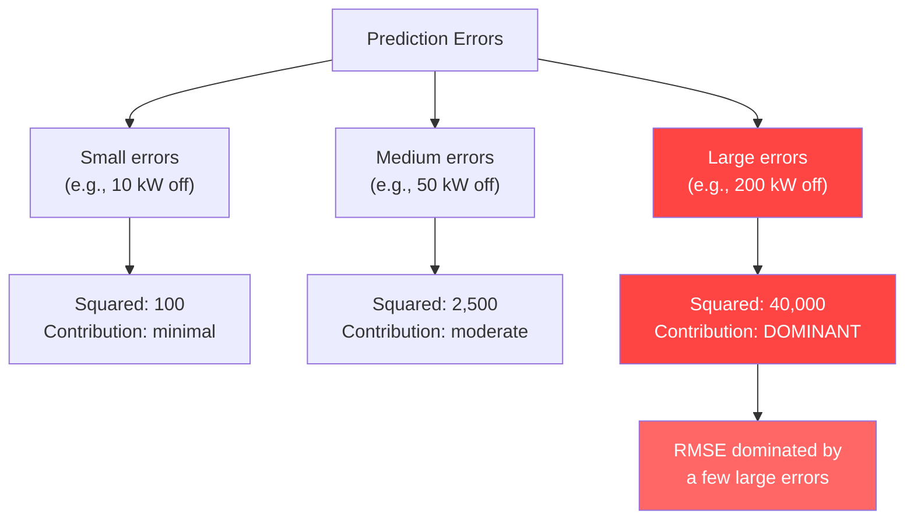
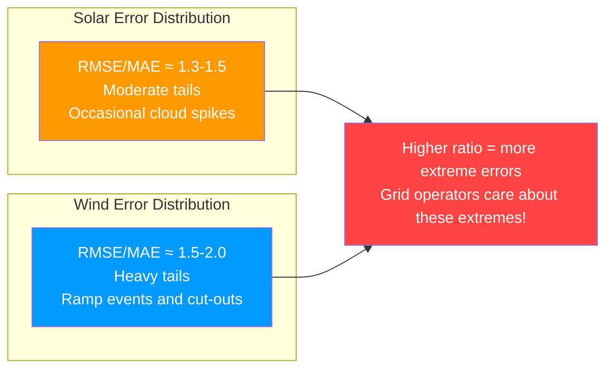
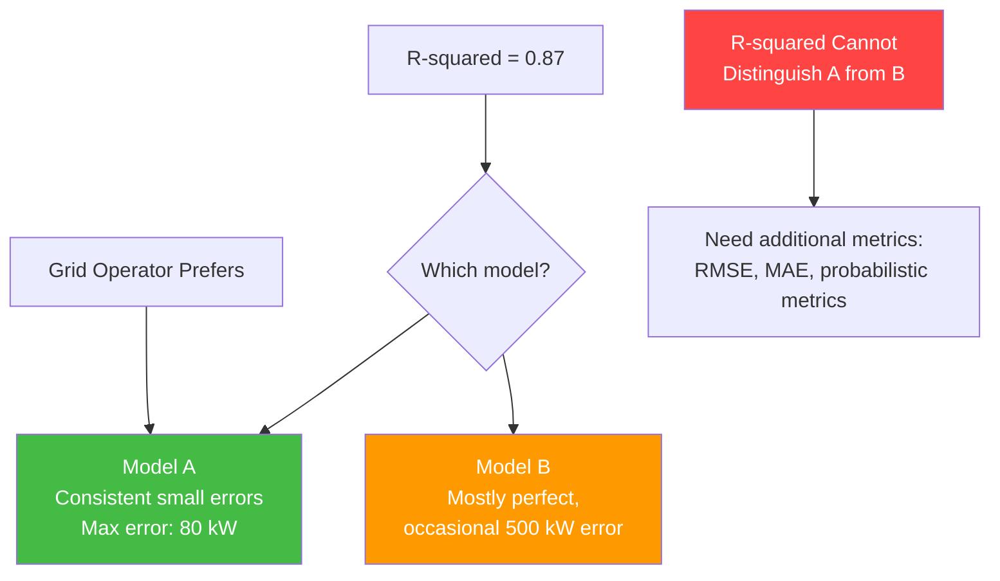
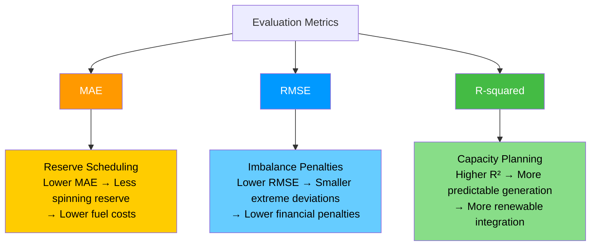

# 10.2 Statistical Evaluation Metrics

> **Important Reminder**: A single metric like R-squared does not tell the whole story. A solar forecasting model can achieve R-squared > 0.90 simply by predicting the diurnal cycle (zero at night, peak at noon) while being completely useless for the intra-day variability that grid operators actually care about. Always evaluate using multiple complementary metrics.

## The Language of Model Quality

When you build a forecasting model, you need a rigorous, quantitative way to answer the question: "How good is this model?" Statistical evaluation metrics provide this language. They distill the complex comparison between predicted values $\hat{y}_i$ and actual values $y_i$ into single numbers that can be compared across models, datasets, and time periods.

In this project, the `calculate_metrics` function serves as the central evaluation hub, computing multiple metrics simultaneously:

```python
def calculate_metrics(y_true, y_pred):
    rmse = np.sqrt(mean_squared_error(y_true, y_pred))
    mae = mean_absolute_error(y_true, y_pred)
    r2 = r2_score(y_true, y_pred)
    return {'RMSE': rmse, 'MAE': mae, 'R2': r2}
```

Each metric captures a different aspect of model performance. Understanding what each one measures — and what it fails to capture — is essential for making informed decisions about model selection and deployment.

## RMSE: Root Mean Square Error

### Definition

$$\text{RMSE} = \sqrt{\frac{1}{n} \sum_{i=1}^{n} (y_i - \hat{y}_i)^2}$$

RMSE is the square root of the average squared difference between predicted and actual values. It has the same units as the target variable (kW for power forecasting), making it directly interpretable.

### Properties

1. **Penalizes large errors heavily**: Because errors are squared before averaging, a single large error contributes disproportionately to RMSE. This makes RMSE sensitive to outliers and extreme prediction failures.

2. **Differentiable**: The squared error function is differentiable everywhere, which makes it suitable as a training loss function (MSE loss is the most common training objective for regression neural networks).

3. **Always non-negative**: RMSE ranges from 0 (perfect predictions) to infinity. There is no upper bound because there is no limit to how wrong predictions can be.

4. **Scale-dependent**: RMSE is in the same units as the target. An RMSE of 50 kW for a solar farm with a 500 kW peak means something very different from an RMSE of 50 kW for a wind farm with a 5000 kW peak.

### Interpretation for This Project

For the solar pipeline (UNISOLAR Site 25), RMSE values in the range of 40-80 kW are typical for well-performing models, given a peak capacity of roughly 500 kW. This means that, on average, the model's predictions deviate from actual power by about 40-80 kW — but remember, RMSE overweights large errors, so most individual predictions are closer than this.

For the wind pipeline, RMSE values are much larger (400-800 kW) because wind power has higher absolute variability and the turbines have much larger capacity (up to 5000 kW for the NREL turbines).

### When RMSE Is Misleading

RMSE can be misleading in two key scenarios:

1. **When the target distribution is skewed**: Solar power is zero for half the day (nighttime). These zeros contribute nothing to the squared error, effectively making RMSE a measure of daytime prediction quality only.

2. **When a few extreme errors dominate**: A single catastrophic prediction (e.g., predicting 2000 kW when actual is 0 kW due to an unexpected cloud event) can inflate RMSE dramatically, making overall model quality appear worse than it is for the majority of predictions.



## MAE: Mean Absolute Error

### Definition

$$\text{MAE} = \frac{1}{n} \sum_{i=1}^{n} |y_i - \hat{y}_i|$$

MAE is the average of the absolute differences between predicted and actual values. Like RMSE, it has the same units as the target variable, but it treats all errors proportionally — a 100 kW error is exactly twice as "bad" as a 50 kW error, regardless of the sign or context.

### Properties

1. **Linear penalty**: Each error contributes proportionally to its magnitude. This makes MAE more robust to outliers than RMSE.

2. **Median-like**: While RMSE corresponds to the mean of the error distribution, MAE corresponds to the median. Minimizing MAE produces predictions that are close to the conditional median, while minimizing RMSE produces predictions close to the conditional mean.

3. **Not differentiable at zero**: The absolute value function has a kink at zero, which can cause issues with gradient-based optimization. In practice, this is rarely a problem because hitting exactly zero error is vanishingly unlikely.

4. **Scale-dependent**: Like RMSE, MAE is in the same units as the target variable.

### RMSE vs. MAE: A Crucial Distinction

The ratio of RMSE to MAE provides diagnostic information about the error distribution:

$$\text{Ratio} = \frac{\text{RMSE}}{\text{MAE}}$$

- If RMSE ≈ MAE (ratio ≈ 1): Errors are relatively uniform — no extreme outliers
- If RMSE >> MAE (ratio >> 1): There are a few very large errors amid many small errors — the error distribution has heavy tails

For this project's models:
- Solar: RMSE/MAE ≈ 1.3-1.5, indicating moderate tail heaviness (occasional cloud-induced spikes)
- Wind: RMSE/MAE ≈ 1.5-2.0, indicating heavier tails (wind ramps and cut-out events cause extreme errors)



## R-Squared: The Coefficient of Determination

### Definition

$$R^2 = 1 - \frac{SS_{res}}{SS_{tot}} = 1 - \frac{\sum_{i=1}^{n}(y_i - \hat{y}_i)^2}{\sum_{i=1}^{n}(y_i - \bar{y})^2}$$

where $SS_{res}$ is the residual sum of squares and $SS_{tot}$ is the total sum of squares (variance of the target around its mean).

R-squared measures the proportion of variance in the target variable that is explained by the model. It ranges from:
- $R^2 = 1$: Perfect predictions (all residuals are zero)
- $R^2 = 0$: The model is no better than predicting the mean
- $R^2 < 0$: The model is worse than predicting the mean (possible on test data)

### Why R-Squared Can Be Misleading

R-squared is the most commonly reported metric in machine learning, but it has serious limitations for renewable energy forecasting:

#### 1. Inflation by the Diurnal Cycle

The total sum of squares $SS_{tot}$ includes all variance in the target, including the predictable diurnal cycle. Solar power is zero at night and peaks during midday — this pattern alone accounts for a massive amount of variance. A model that simply predicts "zero at night, average during day" can achieve R-squared > 0.70 without capturing any meaningful intra-day variability.

Consider a trivial solar model:
- Predict 0 kW from 7 PM to 5 AM
- Predict the monthly average irradiance during the day

This model captures the diurnal on/off pattern and would achieve R-squared ≈ 0.70-0.80, but it is completely useless for a grid operator who needs to know whether output will be 200 kW or 400 kW at 2:00 PM.

#### 2. Scale-Dependence on Variance

R-squared depends on the variance of the target. If the test period happens to have high variance (e.g., a period with frequent cloud transitions), the same absolute errors will produce a higher R-squared than during a low-variance period (clear sky days). This makes R-squared sensitive to the specific time period chosen for evaluation.

#### 3. No Information About Error Distribution

R-squared tells you the proportion of variance explained, but nothing about the *pattern* of errors. Two models with identical R-squared values could have very different error characteristics:
- Model A: Small, uniformly distributed errors
- Model B: Near-perfect most of the time, with occasional catastrophic failures

For grid operations, Model A is vastly preferable, but R-squared cannot distinguish between them.



### R-Squared Values in This Project

The project reports different R-squared ranges for solar and wind:

- **Solar (XGBoost + LSTM hybrid)**: R-squared ≈ 0.87-0.93
- **Wind (Bi-GRU with physics features)**: R-squared ≈ 0.76-0.87

The higher R-squared for solar is partly because solar power is more predictable (the diurnal cycle provides a strong baseline), and partly because the XGBoost + LSTM hybrid effectively decomposes the problem into trend (XGBoost) and residual (LSTM) components.

The wind R-squared is lower because:
1. Wind is inherently less predictable than solar
2. Wind ramps (sudden large changes in power output) are difficult to forecast
3. Turbine cut-out behavior (shutdown at very high wind speeds) creates abrupt nonlinear transitions
4. The multi-source dataset introduces heterogeneity that a single model must accommodate

## The Relationship Between Metrics and Grid Economics

Evaluation metrics are not just academic exercises — they directly translate to economic outcomes for the grid.

### Reserve Scheduling and MAE

Grid operators maintain spinning reserves (backup generation that can be dispatched quickly) to balance supply and demand. The amount of reserve required depends on the forecast error. If the MAE of a wind power forecast is 300 kW, the operator must maintain approximately 300 kW of spinning reserve to cover the average shortfall. Spinning reserves are expensive — they consume fuel even when not actively generating power.

Reducing MAE from 300 kW to 200 kW directly reduces the required spinning reserve by 100 kW, saving fuel costs and reducing carbon emissions from backup generators.

### Imbalance Penalties and RMSE

In many electricity markets, generators (including wind and solar farms) face financial penalties for deviating from their scheduled output. These penalties are often proportional to the squared deviation, making RMSE the metric most directly aligned with financial risk.

If a wind farm is contracted to deliver 2000 kW and actually delivers 1800 kW, the imbalance penalty might be:

$$\text{Penalty} \propto (2000 - 1800)^2 = 40{,}000$$

This squared penalty structure means that large deviations are punished much more severely than small ones, which is exactly what RMSE captures.

### Capacity Planning and R-Squared

R-squared provides a high-level measure of how much of the renewable generation variability is explainable. Grid planners use this information to determine how much renewable capacity can be safely integrated without destabilizing the grid. Higher R-squared means more predictable generation, which allows for more aggressive renewable deployment.



## Normalized Metrics

Because absolute metrics (RMSE, MAE) are scale-dependent, it is useful to compute normalized versions that allow comparison across different capacities and datasets:

### Normalized RMSE (nRMSE)

$$\text{nRMSE} = \frac{\text{RMSE}}{P_{rated}}$$

where $P_{rated}$ is the rated capacity of the solar or wind installation. For a 500 kW solar farm with RMSE = 60 kW, nRMSE = 12%. For a 5000 kW wind farm with RMSE = 500 kW, nRMSE = 10%. Despite the absolute RMSE being much larger for wind, the normalized metric shows the wind model is actually performing relatively better.

### Normalized MAE (nMAE)

$$\text{nMAE} = \frac{\text{MAE}}{P_{rated}}$$

Similarly, normalizing MAE by rated capacity provides a fair comparison across installations of different sizes.

### Mean Absolute Scaled Error (MASE)

$$\text{MASE} = \frac{\text{MAE}}{\text{MAE}_{\text{naive}}}$$

where $\text{MAE}_{\text{naive}}$ is the MAE of a naive forecast (e.g., persistence forecast: $\hat{y}_t = y_{t-1}$). MASE > 1 means the model is worse than a naive baseline; MASE < 1 means it is better. This metric is particularly useful because it accounts for the inherent predictability of the time series.

## The calculate_metrics Function in Context

In the project's codebase, `calculate_metrics` is called after every prediction:

```python
metrics = calculate_metrics(y_test, y_pred)
print(f"RMSE: {metrics['RMSE']:.2f} kW")
print(f"MAE: {metrics['MAE']:.2f} kW")
print(f"R²: {metrics['R2']:.4f}")
```

This trio of metrics provides a well-rounded evaluation:

| Metric | What It Measures | Sensitivity | Grid Relevance |
|--------|-----------------|-------------|----------------|
| RMSE | Average squared error magnitude | High (outliers) | Imbalance penalties |
| MAE | Average absolute error magnitude | Low (outliers) | Reserve scheduling |
| R² | Proportion of variance explained | Medium | Capacity planning |

No single metric suffices. A model with low MAE but high RMSE is accurate on average but has catastrophic tail failures. A model with high R² but moderate MAE captures the overall pattern but may miss important details. Only by examining all three together can you form a complete picture of model quality.

## Benchmarking Against Baselines

To contextualize the metrics, it is essential to compare against naive baselines:

1. **Persistence forecast**: $\hat{y}_t = y_{t-1}$ (tomorrow's power equals today's power at the same time)
2. **Climatological mean**: $\hat{y}_t = \bar{y}$ (predict the long-term average)
3. **Clear-sky model**: For solar, predict based on the theoretical maximum irradiance for that time and location

If your sophisticated LSTM/XGBoost hybrid cannot beat a persistence forecast, something is fundamentally wrong with the model or the pipeline. In the wind domain, persistence is a surprisingly strong baseline for short horizons (1-2 hours), and beating it consistently at 48-hour horizons is a meaningful achievement.


## Advanced Metric Considerations

### Skill Scores

Skill scores measure the improvement of a model over a reference forecast:

$$\text{Skill} = 1 - \frac{\text{Metric}_{\text{model}}}{\text{Metric}_{\text{reference}}}$$

For RMSE, the skill score becomes:

$$\text{RMSE Skill} = 1 - \frac{\text{RMSE}_{\text{model}}}{\text{RMSE}_{\text{persistence}}}$$

A skill score of 0 means the model is no better than the reference; a skill score of 1 means perfect predictions. Skill scores are particularly useful for comparing models across different sites or seasons, where absolute metric values are not directly comparable.

For this project, the solar model achieves an RMSE skill score of approximately 0.45-0.55 over persistence, meaning it reduces RMSE by 45-55% compared to simply predicting that tomorrow's power will equal today's. The wind model achieves a lower skill score of approximately 0.25-0.35, reflecting the greater difficulty of wind forecasting.

### Error Decomposition

The total forecast error can be decomposed into systematic and random components:

$$\text{MSE} = \text{Bias}^2 + \text{Variance}$$

where Bias measures the systematic tendency to over- or under-predict, and Variance measures the random scatter around the biased prediction.

- **High bias, low variance**: The model consistently over- or under-predicts by a similar amount. This suggests the model is missing a systematic pattern (e.g., consistently under-predicting afternoon solar power due to a missing temperature feature).
- **Low bias, high variance**: The model is correct on average but has wide scatter. This suggests the model captures the central tendency but cannot resolve the fine-grained variability (e.g., correctly predicting average wind power but missing individual ramp events).
- **High bias, high variance**: The model is both systematically wrong and imprecise — the worst of both worlds.

For this project's models, the solar pipeline has low bias and moderate variance, while the wind pipeline has moderate bias and high variance. The wind model's bias can be partially corrected with a post-hoc bias adjustment, but the variance is irreducible given the inherent unpredictability of wind at 48-hour horizons.

### Conditional Metrics

Aggregate metrics (RMSE, MAE, R² over the entire test set) can mask important performance variations across different conditions. **Conditional metrics** compute the same metrics but only for samples that satisfy a condition:

- **Nighttime MAE**: MAE computed only for nighttime samples (where solar power is zero). This should be near zero for a good solar model.
- **High-power MAE**: MAE computed only for samples where power exceeds 80% of rated capacity. This tests whether the model can predict near-peak output.
- **Ramp MAE**: MAE computed only for samples where power changed by more than 20% in the previous interval. This tests the model's ability to predict rapid transitions.
- **Cloudy-day R²**: R² computed only for days with high cloud variability. This isolates the model's performance under the most challenging conditions.

Conditional metrics reveal that the solar model's R² of 0.87-0.93 is dominated by clear-sky performance. On cloudy days, conditional R² may drop to 0.60-0.70, highlighting the need for improved cloud modeling. Similarly, the wind model's conditional MAE during ramp events may be 2-3x higher than the overall MAE.

## Key Takeaways

1. **RMSE penalizes large errors disproportionately** due to squaring, making it the metric most aligned with imbalance penalty structures in electricity markets.

2. **MAE treats all errors linearly**, providing a more robust measure of average performance that is directly relevant to reserve scheduling.

3. **R-squared can be inflated by the diurnal cycle** in solar forecasting — a trivial model that captures day/night patterns can achieve deceptively high R-squared values without being useful for operational decisions.

4. **The RMSE/MAE ratio** reveals the tail behavior of the error distribution. Higher ratios indicate more extreme errors, which are particularly costly for grid operations.

5. **Normalized metrics** (nRMSE, nMAE, MASE) are essential for fair comparison across different installations, capacities, and time periods.

6. **Multiple metrics must be evaluated together** — no single number captures all aspects of forecast quality.

7. **Metrics translate directly to economics**: MAE to reserve costs, RMSE to imbalance penalties, R-squared to capacity planning confidence.

8. **Always benchmark against naive baselines** (persistence, climatological mean) to ensure the model is actually adding value beyond simple heuristics.

9. **The `calculate_metrics` function** in this project provides the essential trio (RMSE, MAE, R²) — a solid foundation, though probabilistic metrics (covered in the next chapter) add critical information for operational use.

10. **Context matters**: An RMSE of 50 kW is excellent for a 500 kW solar farm but terrible for a 5000 kW wind farm. Always interpret metrics relative to the rated capacity and the inherent predictability of the target.
