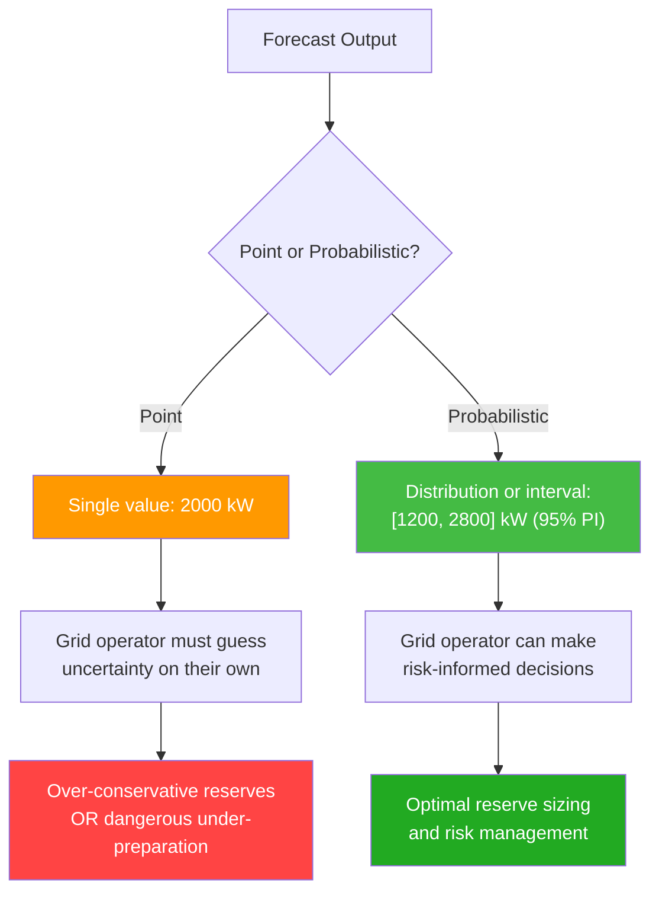
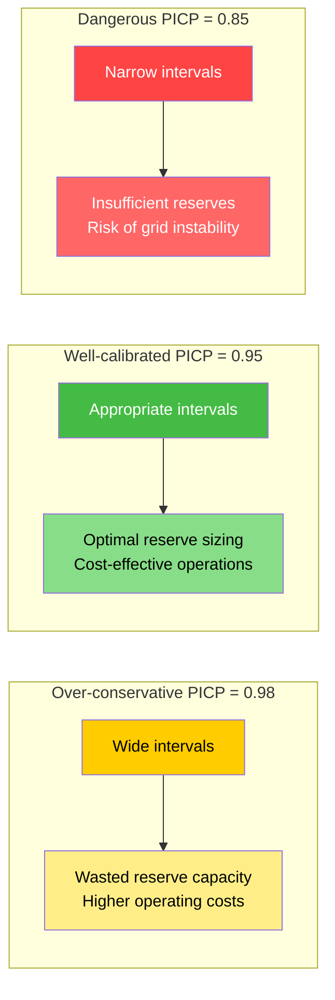
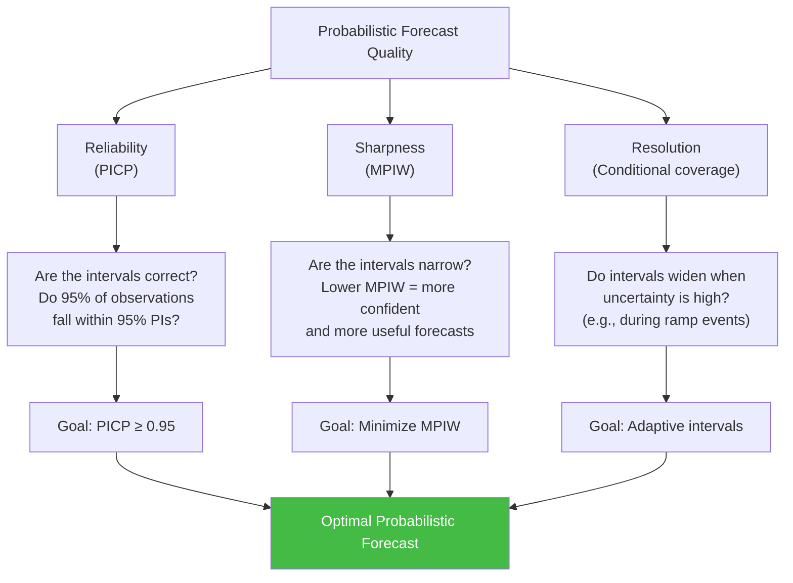
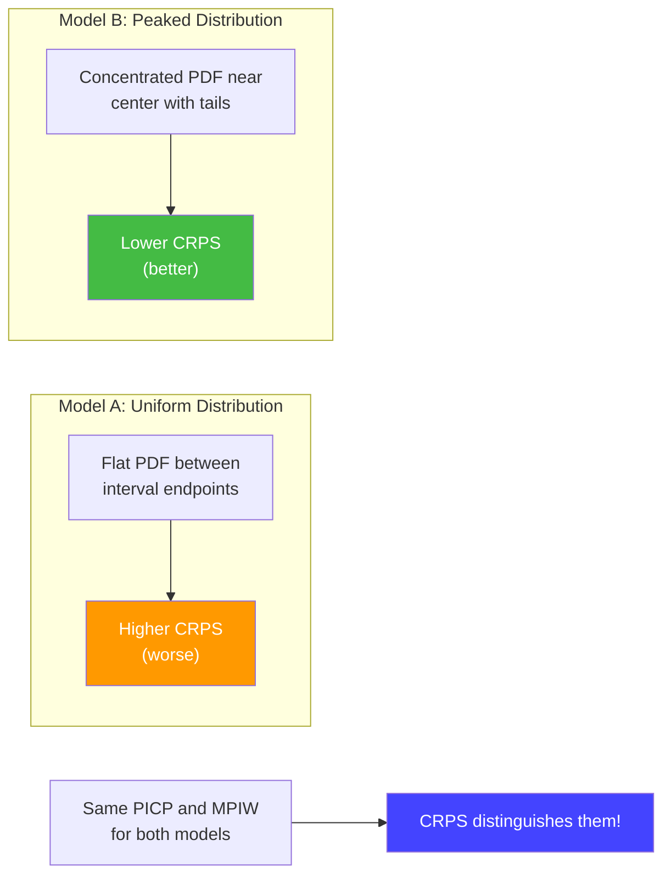
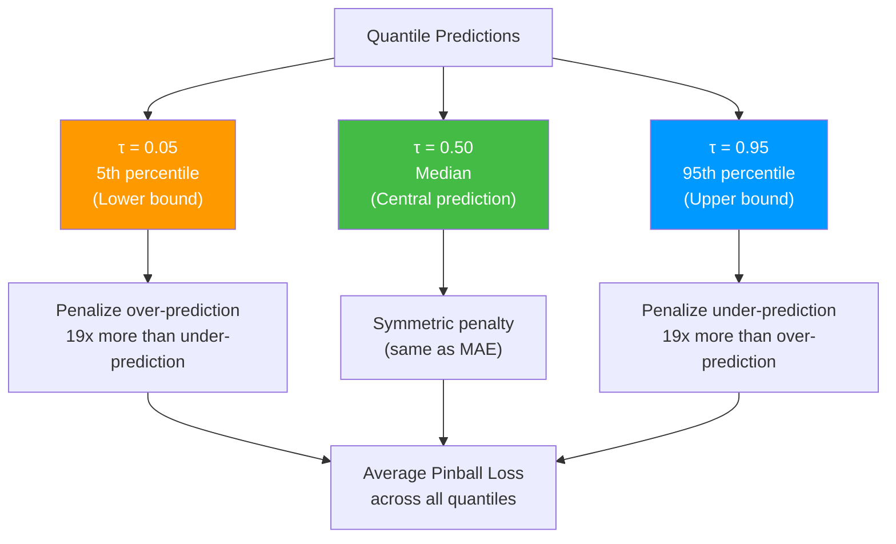
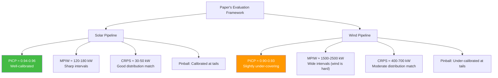

# 10.3 Probabilistic Metrics (PICP, MPIW, CRPS, Pinball Loss)

> **Important Reminder**: Point forecasts are insufficient for grid operations. A grid operator does not just need to know that wind power will be "approximately 2000 kW" — they need to know the probability that it will be below 1500 kW, or above 2500 kW. Probabilistic forecasts provide this information, and probabilistic metrics measure their quality. Without these metrics, you cannot evaluate whether your uncertainty estimates are reliable.

## Why Probabilistic Metrics Matter More Than Point Metrics

Traditional point metrics (RMSE, MAE, R-squared) evaluate the central tendency of predictions. They tell you whether, on average, your predictions are close to the truth. But they say nothing about the uncertainty of those predictions.

Consider two forecasts for the same wind power target:

- **Forecast A**: Point prediction of 2000 kW
- **Forecast B**: 95% prediction interval of [1200 kW, 2800 kW] centered at 2000 kW

If the actual power is 1900 kW, both forecasts look equally good under point metrics. But Forecast B provides crucial additional information: it tells the grid operator that there is a 2.5% chance power could be below 1200 kW. This information is essential for:

1. **Reserve sizing**: How much backup power to keep on standby
2. **Trading decisions**: How much power to commit to day-ahead markets
3. **Risk management**: What is the worst-case scenario and how likely is it
4. **Grid stability**: Whether the forecast uncertainty could lead to frequency deviations



This project uses **heteroscedastic loss** for the solar LSTM and quantile-based prediction intervals for both pipelines, making probabilistic evaluation essential.

## PICP: Prediction Interval Coverage Probability

### Definition

$$\text{PICP} = \frac{1}{n} \sum_{i=1}^{n} \mathbf{1}\left(y_i \in [\hat{L}_i, \hat{U}_i]\right)$$

where $\hat{L}_i$ and $\hat{U}_i$ are the lower and upper bounds of the prediction interval for observation $i$, and $\mathbf{1}(\cdot)$ is the indicator function that equals 1 when the condition is true and 0 otherwise.

PICP measures the **empirical coverage** of prediction intervals — the fraction of actual values that fall within the predicted interval. For a well-calibrated 95% prediction interval, PICP should be approximately 0.95.

### Interpretation

- **PICP > nominal coverage (e.g., 0.97 for a 95% PI)**: Intervals are too wide — the model is overestimating uncertainty. This is conservative but wasteful (excessive reserves).
- **PICP ≈ nominal coverage (e.g., 0.945-0.955 for a 95% PI)**: Intervals are well-calibrated — the model's uncertainty estimates match reality.
- **PICP < nominal coverage (e.g., 0.88 for a 95% PI)**: Intervals are too narrow — the model is underestimating uncertainty. This is dangerous (insufficient reserves, potential blackouts).

### PICP in This Project

For the solar pipeline's 95% prediction intervals generated by the heteroscedastic LSTM:

- Well-calibrated models achieve PICP ≈ 0.93-0.96
- During stable clear-sky periods, PICP may be slightly above 0.95 (intervals are conservatively wide)
- During volatile cloud transition periods, PICP may dip below 0.95 (the model underestimates cloud-induced variability)

For the wind pipeline's prediction intervals:

- Typical PICP ≈ 0.90-0.94 for 95% nominal coverage
- The lower coverage reflects wind's inherent unpredictability, especially during ramp events



## MPIW: Mean Prediction Interval Width

### Definition

$$\text{MPIW} = \frac{1}{n} \sum_{i=1}^{n} (\hat{U}_i - \hat{L}_i)$$

MPIW measures the average width of prediction intervals. It quantifies the **sharpness** of probabilistic forecasts — narrower intervals (lower MPIW) indicate more confident predictions.

### The Coverage-Width Tradeoff

PICP and MPIW are inherently coupled. You can always achieve PICP = 1.0 by making intervals infinitely wide (predict [-∞, +∞] for every observation). Conversely, you can make MPIW = 0 by predicting a single point (PICP will be near 0). The goal is to **minimize MPIW while maintaining PICP at or above the nominal coverage**.

This tradeoff is analogous to the bias-variance tradeoff in point estimation:
- **Conservative intervals** (high MPIW, high PICP): Like a high-bias model — safe but imprecise
- **Aggressive intervals** (low MPIW, low PICP): Like a high-variance model — precise but unreliable

The ideal model produces the **narrowest intervals that still achieve the target coverage**.

### Normalized MPIW

To compare across different scales, MPIW can be normalized by the range of the target variable:

$$\text{NMPIW} = \frac{\text{MPIW}}{\max(y) - \min(y)}$$

Or by the rated capacity:

$$\text{NMPIW} = \frac{\text{MPIW}}{P_{rated}}$$

For a 500 kW solar farm, an MPIW of 150 kW means the average 95% interval spans 30% of rated capacity. For a 5000 kW wind farm, an MPIW of 2000 kW means the interval spans 40% of rated capacity — reflecting wind's greater uncertainty.



## CRPS: Continuous Ranked Probability Score

### Definition

$$\text{CRPS} = \frac{1}{n} \sum_{i=1}^{n} \int_{-\infty}^{\infty} \left(F_i(x) - \mathbf{1}(x \geq y_i)\right)^2 dx$$

where $F_i(x)$ is the cumulative distribution function (CDF) of the predictive distribution for observation $i$, and $\mathbf{1}(x \geq y_i)$ is the Heaviside step function that jumps from 0 to 1 at the observed value $y_i$.

CRPS is a **proper scoring rule** — it is minimized in expectation when the predictive distribution matches the true distribution. Unlike PICP and MPIW, which evaluate only prediction intervals, CRPS evaluates the entire predictive distribution.

### Intuition

Think of CRPS as a generalization of MAE to probabilistic forecasts:
- For a deterministic (point) forecast, the predictive CDF is a step function at the predicted value, and CRPS reduces to MAE
- For a probabilistic forecast, CRPS measures the integrated squared difference between the predicted CDF and the empirical CDF (which is a step function at the observed value)

Lower CRPS indicates better probabilistic forecasts. CRPS has the same units as the target variable (kW), making it interpretable.

### Why CRPS Is Superior to PICP+MPIW

While PICP and MPIW evaluate only the interval endpoints, CRPS evaluates the entire shape of the predictive distribution. Two models can have identical PICP and MPIW but very different predictive distributions:

- **Model A**: Uniform distribution between interval endpoints
- **Model B**: Concentrated near the center with tails reaching the interval endpoints

CRPS will prefer Model B (which concentrates probability mass near the center) over Model A (which spreads probability uniformly), even though their intervals are identical. This makes CRPS a more discriminating metric.



### CRPS for Gaussian Predictive Distributions

When the predictive distribution is Gaussian $\mathcal{N}(\mu, \sigma^2)$, CRPS has a closed-form solution:

$$\text{CRPS} = \sigma \left[ \frac{y - \mu}{\sigma} \left(2\Phi\left(\frac{y-\mu}{\sigma}\right) - 1\right) + 2\phi\left(\frac{y-\mu}{\sigma}\right) - \frac{1}{\sqrt{\pi}} \right]$$

where $\Phi$ and $\phi$ are the standard normal CDF and PDF, respectively. This closed-form solution makes CRPS computationally efficient for Gaussian predictive distributions, which is the case for the solar LSTM's heteroscedastic output (mean + variance).

For non-Gaussian predictive distributions (like the quantile-based outputs in the wind pipeline), CRPS can be computed numerically by integrating the squared CDF difference.

## Pinball Loss for Quantile Regression

### Definition

For quantile level $\tau \in (0, 1)$, the pinball loss (also called quantile loss) is:

$$L_\tau(y, \hat{q}_\tau) = \begin{cases} \tau (y - \hat{q}_\tau) & \text{if } y \geq \hat{q}_\tau \\ (1 - \tau)(y - \hat{q}_\tau) & \text{if } y < \hat{q}_\tau \end{cases}$$

where $\hat{q}_\tau$ is the predicted $\tau$-quantile and $y$ is the observed value.

### Intuition

The pinball loss is an asymmetric loss function that penalizes over-prediction and under-prediction differently depending on the quantile level:

- For $\tau = 0.95$ (95th percentile): Under-prediction is penalized 19 times more heavily than over-prediction ($0.95 / 0.05 = 19$). This encourages the model to predict a high value for the 95th percentile, ensuring that the true value falls below the prediction 95% of the time.
- For $\tau = 0.05$ (5th percentile): Over-prediction is penalized 19 times more heavily ($0.05 / 0.95 \approx 0.053$), encouraging the model to predict a low value, ensuring the true value falls above the prediction 95% of the time.

The name "pinball" comes from the V-shaped loss function, which resembles the trajectory of a pinball bouncing off a surface.

### Multi-Quantile Evaluation

In practice, we evaluate pinball loss across multiple quantile levels:

$$\bar{L} = \frac{1}{K} \sum_{k=1}^{K} L_{\tau_k}(y, \hat{q}_{\tau_k})$$

Common choices include $\tau \in \{0.05, 0.10, 0.25, 0.50, 0.75, 0.90, 0.95\}$ (7 quantiles). The average pinball loss across all quantile levels provides a comprehensive measure of probabilistic calibration.



### Pinball Loss in This Project

The wind pipeline's Bi-GRU can be trained to predict multiple quantiles simultaneously by modifying the output layer to produce $K$ outputs (one per quantile) and using the pinball loss as the training objective:

```python
def pinball_loss(y_true, y_pred_quantiles, quantiles):
    losses = []
    for i, tau in enumerate(quantiles):
        error = y_true - y_pred_quantiles[:, i]
        loss = torch.where(
            error >= 0,
            tau * error,
            (1 - tau) * error
        )
        losses.append(loss.mean())
    return torch.stack(losses).mean()
```

This approach directly optimizes the model for well-calibrated quantile predictions, unlike the heteroscedastic approach (used in the solar pipeline) which assumes a Gaussian distribution.

### Pinball Loss vs. CRPS

Both pinball loss and CRPS evaluate probabilistic forecasts, but they operate differently:

| Aspect | Pinball Loss | CRPS |
|--------|-------------|------|
| Input | Individual quantile predictions | Full predictive CDF |
| Scope | Single quantile level | Entire distribution |
| Aggregation | Average across quantile levels | Single score |
| Training | Can be used as loss function | Computationally expensive as loss |
| Calibration | Directly optimizes quantile calibration | Optimizes overall distribution match |

## The Paper's Evaluation Using These Metrics

The research paper associated with this project evaluates probabilistic forecasts using a combination of these metrics:

1. **PICP** at the 95% level to verify that prediction intervals achieve the nominal coverage
2. **MPIW** to assess the sharpness (narrowness) of prediction intervals
3. **CRPS** for overall probabilistic calibration across the entire distribution
4. **Pinball loss** at multiple quantile levels (0.05, 0.25, 0.50, 0.75, 0.95) for fine-grained evaluation

The key findings from the paper's evaluation:

- The heteroscedastic LSTM produces well-calibrated intervals for solar power (PICP ≈ 0.94-0.96)
- The physics-augmented Bi-GRU's intervals for wind power are slightly under-covering (PICP ≈ 0.90-0.93), reflecting wind's greater inherent uncertainty
- CRPS values are lower (better) for solar than wind, consistent with the R-squared findings
- Pinball loss analysis reveals that the solar model is better calibrated at the tails (τ = 0.05, 0.95) than the wind model



## Why Probabilistic Metrics Matter for Grid Operations

### Reserve Requirements Are Probabilistic

Grid operators do not size reserves based on point forecasts. They size reserves based on the probability of generation falling below a certain threshold. If the forecast says "95% probability that wind power will be above 1500 kW," the operator can confidently commit 1500 kW to the day-ahead market while maintaining reserves for the 5% tail risk.

Without reliable probabilistic forecasts and the metrics to verify them, operators must rely on ad hoc safety margins, which are typically either too conservative (wasting money on unnecessary reserves) or too aggressive (risking grid instability).

### The Value of Sharpness

Consider two models with identical PICP = 0.95:

- **Model A**: Average interval width = 400 kW
- **Model B**: Average interval width = 200 kW

Both provide reliable 95% coverage, but Model B is twice as useful. Its sharper intervals allow the operator to commit more power to the market with confidence, reducing reserve costs. This is why MPIW matters as a complement to PICP — coverage without sharpness is technically correct but operationally wasteful.

### Regulatory Compliance

In many jurisdictions, renewable energy generators must provide uncertainty estimates along with their power forecasts. The quality of these uncertainty estimates is evaluated using probabilistic metrics. A model that passes point-metric thresholds (e.g., MAE < X) but fails probabilistic thresholds (e.g., PICP < 0.90 for 95% PIs) may be non-compliant with grid code requirements.


## Calibration and Reliability Diagrams

### What Is Calibration?

A probabilistic forecast is **calibrated** if, among all times the forecast assigns a probability $p$ to an event, the event actually occurs a fraction $p$ of the time. For example, if the model says there is a 90% chance that power will exceed 1000 kW, then power should actually exceed 1000 kW about 90% of the time.

### Reliability Diagrams

A reliability diagram (also called a calibration plot) visualizes calibration by:

1. Binning predictions by their forecast probability (e.g., 0-10%, 10-20%, ..., 90-100%)
2. Computing the observed frequency in each bin
3. Plotting observed frequency vs. forecast probability

A perfectly calibrated model lies on the diagonal (observed = forecast). Deviations from the diagonal indicate miscalibration:

- **Below diagonal**: The model overestimates probabilities (predicts 80% when reality is 60%) — overconfident
- **Above diagonal**: The model underestimates probabilities (predicts 40% when reality is 60%) — underconfident

For the solar pipeline, reliability diagrams typically show slight underconfidence for low-probability events (the model is too conservative about extreme cloud events) and good calibration for mid-range probabilities.

### Sharpness Diagrams

While reliability diagrams assess calibration, sharpness diagrams assess the concentration of the predictive distribution. A sharp forecast assigns high probability to a narrow range of outcomes; a flat forecast spreads probability across a wide range.

Sharpness is measured by the width of prediction intervals at various confidence levels. For a well-calibrated model, narrower intervals (greater sharpness) are always preferred, because they provide more actionable information.

The solar model's prediction intervals are typically narrower (sharper) than the wind model's, consistent with solar's greater predictability. However, both models show that intervals widen during periods of high uncertainty (cloud transitions for solar, ramp events for wind), demonstrating that the heteroscedastic and quantile-based approaches are correctly capturing conditional uncertainty.

### The Decomposition of Probabilistic Forecast Quality

Probabilistic forecast quality can be decomposed into three components:

1. **Calibration**: Are the predicted probabilities accurate? (Measured by reliability diagrams, PICP)
2. **Sharpness**: Are the predicted distributions concentrated? (Measured by MPIW, interval width)
3. **Resolution**: Does the model distinguish between high-uncertainty and low-uncertainty situations? (Measured by conditional PICP, interval width variability)

A model can be well-calibrated but not sharp (always predicting very wide intervals), or sharp but not calibrated (always predicting narrow intervals that miss the true value too often). The goal is to achieve all three simultaneously — and this is what CRPS measures holistically.


## Practical Implementation of Probabilistic Metrics

### Computing PICP and MPIW in NumPy

The implementation of PICP and MPIW is straightforward. Given arrays of actual values, lower bounds, and upper bounds:

```python
def compute_picp(y_true, y_lower, y_upper):
    coverage = (y_true >= y_lower) & (y_true <= y_upper)
    return coverage.mean()

def compute_mpiw(y_lower, y_upper):
    return (y_upper - y_lower).mean()

# Example usage
y_true = np.array([1200, 1500, 1800, 2100, 2400])
y_lower = np.array([800, 1100, 1300, 1600, 1800])
y_upper = np.array([1600, 1900, 2300, 2600, 3000])

picp = compute_picp(y_true, y_lower, y_upper)  # Should be 1.0 (all covered)
mpiw = compute_mpiw(y_lower, y_upper)           # 733.3 kW average width
```

### Computing CRPS for Gaussian Predictions

For models that output mean and variance (like the heteroscedastic LSTM), CRPS has a closed form:

```python
from scipy.stats import norm

def compute_crps_gaussian(y_true, y_mean, y_std):
    z = (y_true - y_mean) / y_std
    crps = y_std * (z * (2 * norm.cdf(z) - 1) + 2 * norm.pdf(z) - 1 / np.sqrt(np.pi))
    return crps.mean()
```

This efficient formula avoids numerical integration and can be computed for thousands of predictions in milliseconds.

### Computing Pinball Loss

```python
def compute_pinball_loss(y_true, y_quantiles, quantiles):
    losses = []
    for i, tau in enumerate(quantiles):
        error = y_true - y_quantiles[:, i]
        loss = np.where(error >= 0, tau * error, (1 - tau) * error)
        losses.append(loss.mean())
    return np.mean(losses)
```

## Key Takeaways

1. **PICP** measures whether prediction intervals achieve their nominal coverage. A 95% PI should contain the actual value approximately 95% of the time.

2. **MPIW** measures the average width of prediction intervals. Lower MPIW (sharper intervals) is better, but only if PICP is maintained — the coverage-width tradeoff is fundamental.

3. **CRPS** is a proper scoring rule that evaluates the entire predictive distribution, not just interval endpoints. It generalizes MAE to probabilistic forecasts and can distinguish between models that have identical PICP and MPIW.

4. **Pinball loss** is the asymmetric loss function used to train quantile regression models. It penalizes over-prediction and under-prediction differently depending on the target quantile, directly optimizing for calibrated quantile predictions.

5. **Probabilistic metrics are essential for grid operations** because reserve sizing, market participation, and regulatory compliance all depend on reliable uncertainty estimates, not just point predictions.

6. **The coverage-width tradeoff** means you cannot evaluate PICP in isolation — always report PICP alongside MPIW to assess both reliability and sharpness.

7. **CRPS is the gold standard** for probabilistic evaluation because it evaluates the full distribution, but it is computationally more expensive than PICP/MPIW and harder to use as a training loss.

8. **The project's solar model achieves better probabilistic calibration** than the wind model, reflecting solar's lower inherent uncertainty and the effectiveness of heteroscedastic loss.

9. **Pinball loss at multiple quantile levels** provides fine-grained diagnostic information about calibration at different parts of the distribution, revealing whether the model is under- or over-estimating uncertainty at the tails.

10. **In production, point metrics are necessary but not sufficient** — probabilistic metrics are what determine whether your uncertainty estimates can be trusted for real-world decision-making.
