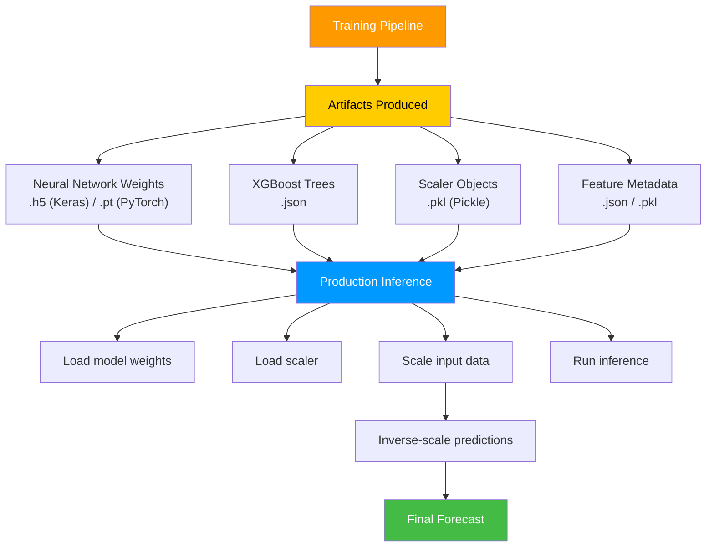
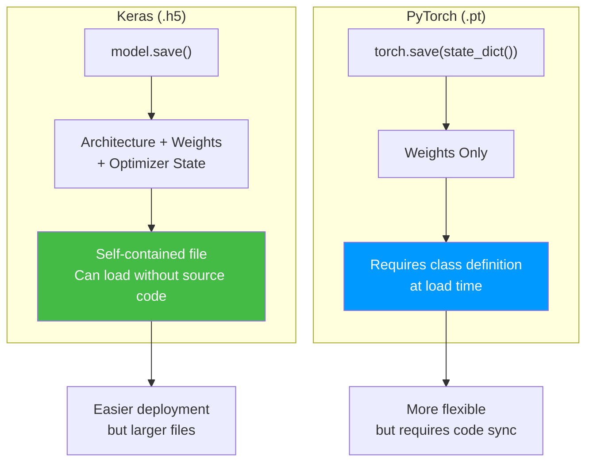
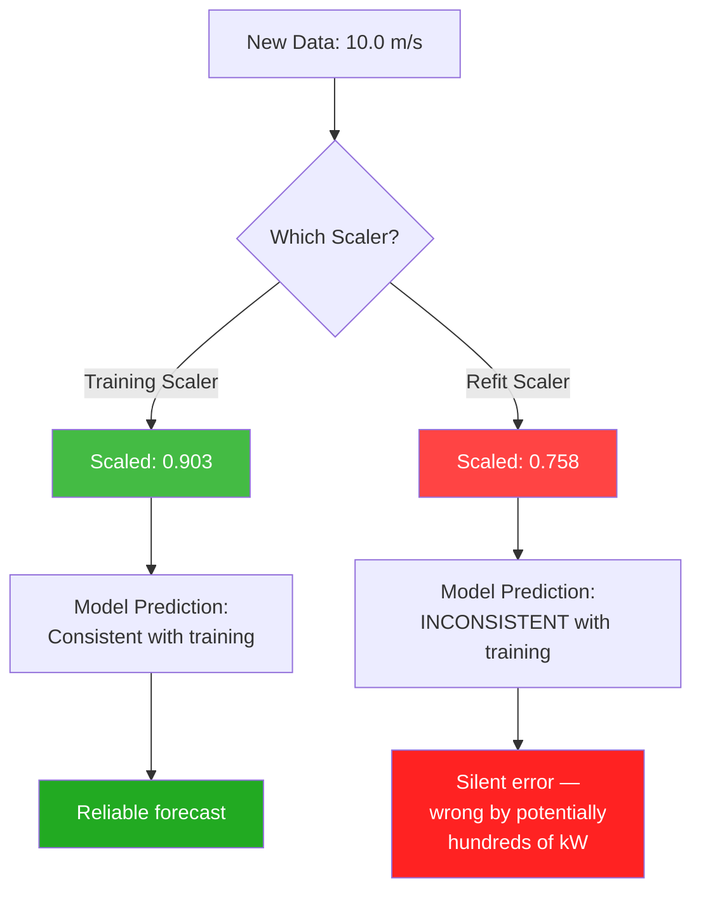
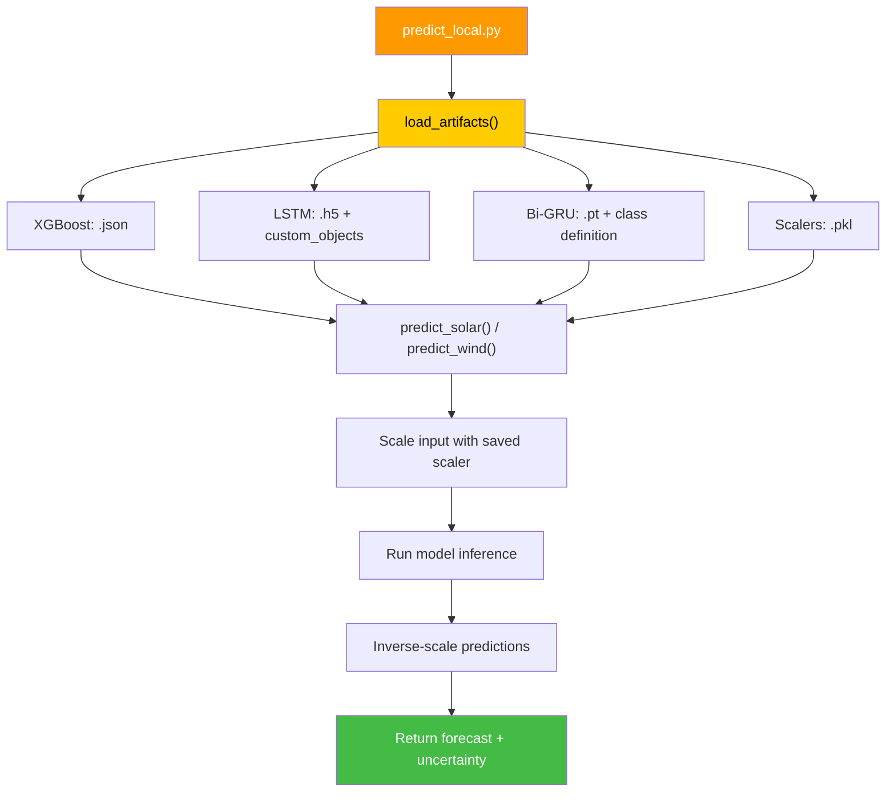

# 10.4 Model Artifacts and Serialization

> **Important Reminder**: The exact same scaler object that was fitted during training MUST be used during inference. If you refit the scaler on new data, or even on the same data with a slightly different order, the scaling parameters will differ, and every prediction will be wrong — silently wrong, with no error messages or warnings.

## The Artifact Landscape

When a machine learning model completes training, it produces a set of **artifacts** — persistent files that capture the model's learned parameters, the preprocessing pipeline's state, and any other information needed to reproduce predictions. In this project, the artifact landscape includes:

1. **Neural network weights** (`.h5` or `.pt` files)
2. **XGBoost tree structures** (`.json` files)
3. **Scaler objects** (`.pkl` files)
4. **Configuration metadata** (various formats)

These artifacts form a complete prediction package: load them in the right order, feed in new data, and out comes a forecast. But the simplicity of this description belies the complexity and fragility of the serialization process.



## .h5 and .pt Files for Neural Network Weights

### HDF5 Format (.h5) — Keras/TensorFlow

The `.h5` format (HDF5 — Hierarchical Data Format version 5) is the standard serialization format for Keras models. HDF5 is a binary format designed for storing large numerical datasets efficiently, with support for hierarchical organization, compression, and chunked I/O.

When you save a Keras model:

```python
model.save('solar_lstm_model.h5')
```

The `.h5` file contains:
- **Model architecture**: The layer graph, including layer types, connections, and configurations
- **Model weights**: The learned parameters (weight matrices and bias vectors) for every layer
- **Training configuration**: Optimizer state, loss function, metrics
- **Compilation metadata**: Everything needed to resume training or run inference

The LSTM model in the solar pipeline might have the following parameter breakdown:

| Layer | Parameters | Purpose |
|-------|-----------|---------|
| LSTM Layer 1 | 51,200 (hidden=64) | Sequence feature extraction |
| LSTM Layer 2 | 16,640 (hidden=64) | Temporal pattern learning |
| Dense (mean) | 65 | Predicting conditional mean |
| Dense (variance) | 65 | Predicting conditional variance |
| **Total** | **~68,000** | |

At 4 bytes per float32 parameter, this is approximately 272 KB of weight data — trivially small, but critical.

### PyTorch Format (.pt / .pth)

The `.pt` format (PyTorch's native format) stores model weights as a dictionary using Python's `pickle` module wrapped with PyTorch-specific handling:

```python
torch.save(model.state_dict(), 'wind_bigru_model.pt')
```

The `state_dict()` is an OrderedDict mapping layer names to parameter tensors. Unlike Keras's `.h5` format, PyTorch's `.pt` file contains **only the weights**, not the model architecture. You must define the model class separately in your inference code:

```python
class BiGRUModel(nn.Module):
    def __init__(self, input_size, hidden_size, num_layers, output_size):
        super().__init__()
        self.gru = nn.GRU(input_size, hidden_size, num_layers,
                         batch_first=True, bidirectional=True)
        self.fc = nn.Linear(hidden_size * 2, output_size)

    def forward(self, x):
        out, _ = self.gru(x)
        out = self.fc(out[:, -1, :])
        return out

# Loading requires the class definition
model = BiGRUModel(input_size=12, hidden_size=128, num_layers=2, output_size=1)
model.load_state_dict(torch.load('wind_bigru_model.pt', map_location=device))
model.eval()
```

This architectural separation has important implications:

1. **The model class must be available** at inference time — you cannot load weights without it
2. **Architectural changes** (different hidden sizes, layer counts) will cause load failures
3. **Version compatibility**: PyTorch state dicts are generally forward-compatible, but major version changes may introduce breaking changes in layer naming or tensor formats



## .json Files for XGBoost Tree Structures

XGBoost serializes its ensemble of decision trees in a JSON format that captures the complete tree structure:

```python
model.save_model('solar_xgboost_model.json')
```

The JSON file contains:
- **Tree structures**: Each tree's split conditions, feature indices, and leaf values
- **Learning parameters**: Learning rate, objective function, number of trees
- **Feature mapping**: Which feature indices correspond to which feature names
- **Base score**: The initial prediction before adding tree contributions

A sample tree in the JSON structure might look like:

```json
{
  "nodeid": 0,
  "split": 5,
  "split_condition": 245.3,
  "yes": 1,
  "no": 2,
  "children": [
    {"nodeid": 1, "leaf": 12.3},
    {"nodeid": 2, "split": 3, "split_condition": 0.85, ...}
  ]
}
```

This representation is:
- **Human-readable**: You can inspect the trees and understand which features are being split on
- **Portable**: JSON is language-agnostic; XGBoost models can be loaded in Python, R, Java, C++
- **Compact**: A 500-tree XGBoost model with depth 6 might be 5-20 MB in JSON format
- **Deterministic**: The same model always produces the same JSON representation

## .pkl (Pickle) Files for Scaler Objects

### What Pickle Does

Python's `pickle` module serializes Python objects into a byte stream. For this project, it is used primarily to save scaler objects:

```python
import pickle
from sklearn.preprocessing import StandardScaler

scaler = StandardScaler()
X_train_scaled = scaler.fit_transform(X_train)

# Save the fitted scaler
with open('solar_scaler.pkl', 'wb') as f:
    pickle.dump(scaler, f)

# Later, in production
with open('solar_scaler.pkl', 'rb') as f:
    scaler = pickle.load(f)

X_new_scaled = scaler.transform(X_new)  # Uses training-set statistics
```

The scaler object, after fitting, contains the following state:
- `mean_`: The mean of each feature computed from the training data
- `scale_`: The standard deviation of each feature
- `n_features_in_`: The number of features seen during fitting
- `feature_names_in_`: The names of features (if the input was a DataFrame)

These are precisely the parameters needed to transform new data in a way that is consistent with the training data. If the training data had a mean wind speed of 7.2 m/s and a standard deviation of 3.1 m/s, the scaler will subtract 7.2 and divide by 3.1 for every new data point — even if the new data has a different empirical mean.

### Why the Exact Same Scaler Must Be Used

The scaler encodes the statistical properties of the training data. Using a different scaler (even one fitted on very similar data) will produce different scaled values, which will produce different predictions.

Consider a concrete example:

| | Training Scaler | New Scaler |
|---|---|---|
| Mean wind speed | 7.2 m/s | 7.5 m/s |
| Std wind speed | 3.1 m/s | 3.3 m/s |

For a new observation of 10.0 m/s:
- **Training scaler**: $(10.0 - 7.2) / 3.1 = 0.903$
- **New scaler**: $(10.0 - 7.5) / 3.3 = 0.758$

The difference (0.903 vs. 0.758) is a 19% change in the input to the model. For a neural network, this can dramatically alter predictions, potentially shifting a forecast by hundreds of kilowatts.



### Pickle Security Warning

Pickle deserialization can execute arbitrary Python code. Loading a `.pkl` file from an untrusted source is a security risk — a malicious `.pkl` file could contain code that deletes files, steals data, or installs malware.

In this project, the `.pkl` files are generated locally and stored securely, so this risk is minimal. But in production deployments where artifacts might be stored in shared cloud storage (S3, GCS), it is important to ensure that only authorized processes can write to the artifact storage location.

### Pickle Compatibility

Pickle is Python-version and library-version dependent:
- A scaler pickled with scikit-learn 1.3 may not load correctly with scikit-learn 1.5
- A scaler pickled with Python 3.9 may not load with Python 3.11
- Cross-language deserialization is not supported (you cannot load a Python pickle in Java)

For long-term artifact storage, consider more portable formats:
- **ONNX** (Open Neural Network Exchange): Cross-platform model format
- **PMML** (Predictive Model Markup Language): XML-based model format
- **SAVM** (SavedModel): TensorFlow's production-ready format

## Joblib for Efficient Serialization

### What Joblib Does

`joblib` is an alternative to pickle that is optimized for objects containing large NumPy arrays:

```python
from joblib import dump, load

# Save
dump(scaler, 'solar_scaler.joblib', compress=3)

# Load
scaler = load('solar_scaler.joblib')
```

### Advantages over Pickle

1. **Memory-mapping**: Joblib can use memory-mapped files, allowing large arrays to be accessed without loading them entirely into RAM. This is useful for models with millions of parameters.

2. **Compression**: Joblib supports on-the-fly compression (gzip, lz4, etc.), reducing file sizes by 2-10x with minimal overhead.

3. **Faster for NumPy arrays**: Joblib uses a custom protocol for NumPy arrays that is 2-5x faster than pickle for large arrays.

4. **Better handling of large objects**: Pickle requires the entire object to fit in memory during serialization; joblib can handle objects that exceed available RAM through chunking.

### When to Use Joblib vs. Pickle

| Scenario | Pickle | Joblib |
|----------|--------|--------|
| Small objects (< 1 MB) |  |  |
| Large NumPy arrays | Slow | Fast |
| Models with many parameters | OK | Better |
| Need compression | Manual | Built-in |
| Compatibility | Wider support | sklearn ecosystem |
| Security | Same risks | Same risks |

For this project, either format works fine — the scaler objects are small (< 100 KB) and the model files are in their native formats (.h5, .pt, .json). But for production deployments with large models, joblib is generally preferred.

## The predict_local.py Script's Artifact Loading Pattern

The project includes a `predict_local.py` script that demonstrates the correct artifact loading pattern:

```python
import json
import pickle
import torch
import xgboost as xgb
import numpy as np

def load_artifacts(model_dir):
    '''Load all artifacts needed for local prediction.'''
    artifacts = {}

    # 1. Load the XGBoost model
    artifacts['xgb_model'] = xgb.XGBRegressor()
    artifacts['xgb_model'].load_model(
        os.path.join(model_dir, 'solar_xgboost_model.json')
    )

    # 2. Load the LSTM model (Keras)
    artifacts['lstm_model'] = tf.keras.models.load_model(
        os.path.join(model_dir, 'solar_lstm_model.h5'),
        custom_objects={'heteroscedastic_loss': heteroscedastic_loss}
    )

    # 3. Load the Bi-GRU model (PyTorch)
    artifacts['bigru_model'] = BiGRUModel(
        input_size=12, hidden_size=128, num_layers=2, output_size=1
    )
    artifacts['bigru_model'].load_state_dict(
        torch.load(
            os.path.join(model_dir, 'wind_bigru_model.pt'),
            map_location='cpu'
        )
    )
    artifacts['bigru_model'].eval()

    # 4. Load the scalers
    with open(os.path.join(model_dir, 'solar_scaler.pkl'), 'rb') as f:
        artifacts['solar_scaler'] = pickle.load(f)

    with open(os.path.join(model_dir, 'wind_scaler.pkl'), 'rb') as f:
        artifacts['wind_scaler'] = pickle.load(f)

    return artifacts

def predict_solar(features, artifacts):
    '''Make a solar power prediction using loaded artifacts.'''
    # Scale features using the saved scaler
    features_scaled = artifacts['solar_scaler'].transform(features)

    # XGBoost prediction (trend component)
    xgb_pred = artifacts['xgb_model'].predict(features_scaled)

    # LSTM prediction (residual component + uncertainty)
    lstm_input = features_scaled.reshape(1, -1, features_scaled.shape[1])
    lstm_pred = artifacts['lstm_model'].predict(lstm_input)

    # Combine predictions
    final_pred = xgb_pred + lstm_pred[0, 0]
    return final_pred
```

This pattern ensures:
1. **Consistent scaling**: The same scaler fitted during training is used for inference
2. **Correct model loading**: Each model type uses its native loading mechanism
3. **Custom objects**: The heteroscedastic loss function is registered as a custom object for Keras
4. **Device handling**: PyTorch models are loaded to the appropriate device (CPU or GPU)



## Version Control for Artifacts

Model artifacts should be versioned alongside the code that produces them. Best practices include:

1. **Semantic versioning**: `model_v1.2.3.h5` where major.minor.patch tracks architectural changes, hyperparameter changes, and retraining, respectively.

2. **Artifact registry**: Use a model registry (MLflow, Weights & Biases, DVC) to track which artifacts correspond to which code versions and training runs.

3. **Checksums**: Store SHA256 checksums of artifact files and verify them at load time to detect corruption.

4. **Immutability**: Once an artifact is saved, it should never be modified in place. New versions get new filenames.

5. **Metadata**: Store training metadata (dataset version, hyperparameters, random seeds) alongside the artifact so that any training run can be exactly reproduced.


## Production Artifact Pipelines

### The Artifact Registry Pattern

In a mature ML production system, artifacts are managed through an **artifact registry** — a centralized store that tracks:

- **Artifact ID**: A unique identifier (usually a hash or version number)
- **Artifact type**: Model weights, scaler, feature metadata, training config
- **Creation timestamp**: When the artifact was created
- **Training run ID**: Links to the training experiment that produced it
- **Validation status**: Whether the artifact has passed validation checks
- **Deployment status**: Which production endpoints are using this artifact

Popular artifact registry tools include MLflow, Weights & Biases, and DVC (Data Version Control). For this project, a simple file-based registry using JSON manifests is sufficient:

```python
# artifact_manifest.json
{
    "solar_xgboost": {
        "version": "1.2.0",
        "path": "artifacts/solar_xgboost_v1.2.0.json",
        "scaler_path": "artifacts/solar_scaler_v1.2.0.pkl",
        "r2_score": 0.9134,
        "mae": 42.7,
        "trained_on": "2024-01-15",
        "sha256": "a3f2b8c..."
    },
    "wind_bigru": {
        "version": "3.0.0",
        "path": "artifacts/wind_bigru_v3.0.0.pt",
        "scaler_path": "artifacts/wind_scaler_v3.0.0.pkl",
        "r2_score": 0.7581,
        "mae": 298.49,
        "trained_on": "2024-01-20",
        "sha256": "7d9e1f4..."
    }
}
```

### A/B Testing with Artifacts

When deploying a new model version, it is best practice to run both the old and new versions in parallel (A/B testing) before fully cutover. This requires:

1. **Running both models** on the same input data
2. **Logging predictions** from both models
3. **Comparing metrics** in real-time to ensure the new model is not worse
4. **Gradually shifting traffic** from old to new (canary deployment)

The artifact registry supports this by keeping both versions accessible and tracking which endpoints use which version.

### Model Drift and Retraining Triggers

Over time, the statistical properties of the input data may change (data drift) or the relationship between inputs and outputs may change (concept drift). Both degrade model performance. A production system must detect drift and trigger retraining:

- **Data drift**: Monitor the distribution of input features. If the mean wind speed shifts from 7.2 m/s to 8.5 m/s, the model's predictions may become biased.
- **Concept drift**: Monitor the residual between predictions and actuals. If the MAE increases by more than 20% from baseline, trigger retraining.
- **Scheduled retraining**: Regardless of drift detection, retrain monthly or quarterly to incorporate recent data.

Each retraining run produces new artifacts, which must be validated and registered before deployment. The old artifacts are archived (not deleted) for rollback capability.


## Cross-Platform Deployment Considerations

### ONNX for Framework Interoperability

The Open Neural Network Exchange (ONNX) format provides a framework-agnostic representation of machine learning models. Converting the Bi-GRU to ONNX enables deployment in environments where PyTorch is not available:

```python
import torch.onnx

# Export the Bi-GRU model to ONNX
dummy_input = torch.randn(1, 144, 12)  # batch=1, seq_len=144, features=12
torch.onnx.export(
    model,
    dummy_input,
    "wind_bigru_model.onnx",
    input_names=["input"],
    output_names=["output"],
    dynamic_axes={"input": {0: "batch_size"}, "output": {0: "batch_size"}}
)
```

ONNX Runtime can then load and run the model with lower latency than PyTorch:

```python
import onnxruntime as ort

session = ort.InferenceSession("wind_bigru_model.onnx")
input_name = session.get_inputs()[0].name
output = session.run(None, {input_name: input_data.astype(np.float32)})
```

ONNX Runtime typically provides 2-3x inference speedup over PyTorch for production workloads, with lower memory overhead. This makes it ideal for edge deployment on resource-constrained devices.

### Model Signing and Verification

For security-critical deployments, model artifacts should be cryptographically signed to prevent tampering:

```python
import hashlib

def compute_artifact_hash(filepath):
    sha256 = hashlib.sha256()
    with open(filepath, 'rb') as f:
        for chunk in iter(lambda: f.read(8192), b''):
            sha256.update(chunk)
    return sha256.hexdigest()

# Compute and store hash at training time
model_hash = compute_artifact_hash("wind_bigru_model.pt")
scaler_hash = compute_artifact_hash("wind_scaler.pkl")

# Verify hash at inference time
assert compute_artifact_hash("wind_bigru_model.pt") == model_hash, "Model tampered!"
assert compute_artifact_hash("wind_scaler.pkl") == scaler_hash, "Scaler tampered!"
```

This ensures that the artifacts loaded in production are exactly the ones produced during training, preventing supply chain attacks where a malicious actor replaces model weights with ones that produce incorrect predictions.


## Serialization Best Practices Summary

### The Golden Rule of Artifacts

The single most important principle of model serialization can be stated simply: **the inference pipeline must be a strict subset of the training pipeline**. Every transformation applied during training must be replicated exactly during inference, using the exact same parameters. This means:

1. The same scaler (not a refitted one)
2. The same feature order (not a reordered one)
3. The same clipping bounds (not slightly different ones)
4. The same physics formulas (not numerically different implementations)

Any deviation, no matter how small, introduces drift between training and inference that accumulates over time and can cause predictions to diverge significantly from their expected values. The artifact serialization system exists to enforce this principle by persisting all transformation parameters alongside the model weights.

## Key Takeaways

1. **Neural network weights** are saved in `.h5` (Keras) or `.pt` (PyTorch) format. Keras saves architecture + weights; PyTorch saves weights only and requires the model class at load time.

2. **XGBoost models** are serialized as `.json` files containing the complete tree structure, making them human-readable and cross-platform portable.

3. **Scaler objects** are serialized with `pickle` or `joblib`. The fitted scaler contains the training data's statistical properties (mean, std) and MUST be reused exactly during inference.

4. **Using a different scaler** during inference creates silent errors — predictions will be wrong by an unpredictable amount with no error messages or warnings.

5. **Pickle has security risks** — never load `.pkl` files from untrusted sources, as deserialization can execute arbitrary code.

6. **Joblib** is preferred over pickle for large NumPy arrays due to memory-mapping, compression, and faster serialization of numerical data.

7. **The predict_local.py script** demonstrates the correct artifact loading pattern: load all artifacts once, scale inputs with the saved scaler, run inference, and inverse-scale outputs.

8. **Custom loss functions** (like heteroscedastic loss) must be registered as `custom_objects` when loading Keras models, or the load will fail.

9. **PyTorch models** require the model class definition to be available at load time — this is a key difference from Keras's self-contained `.h5` format.

10. **Version control for artifacts** is essential for reproducibility and safe deployment. Use semantic versioning, artifact registries, checksums, and immutability to manage the artifact lifecycle.
