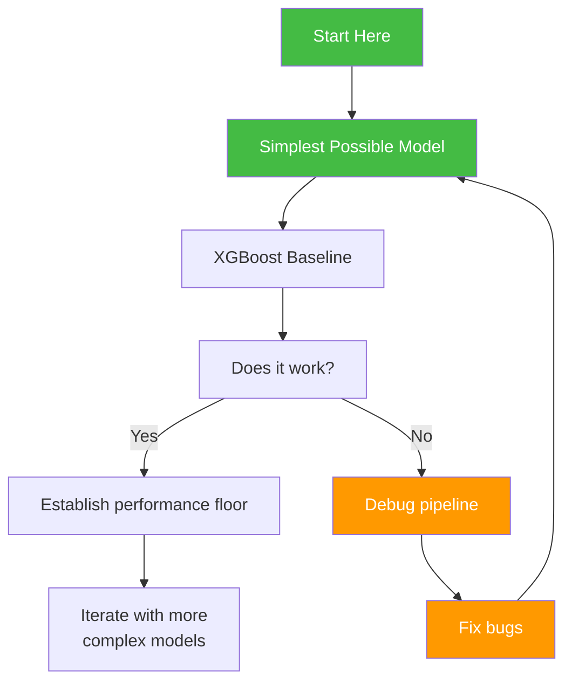
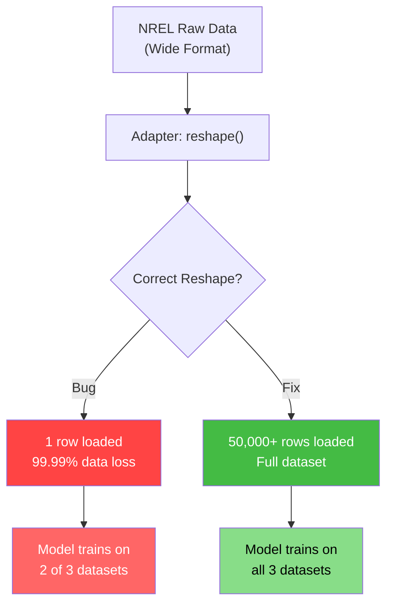
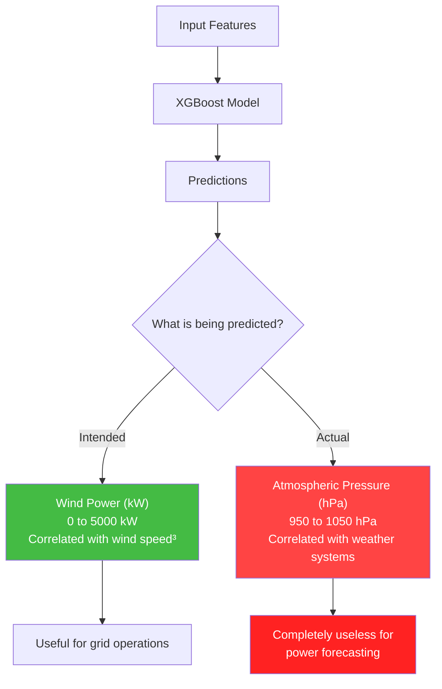
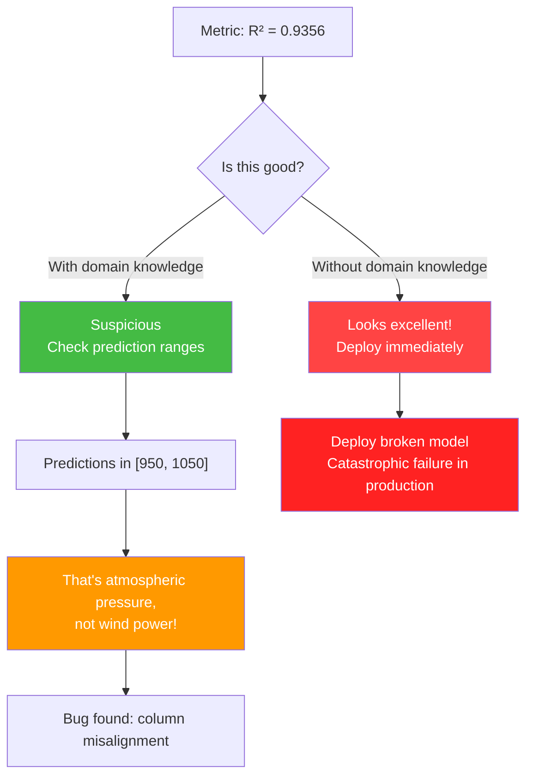
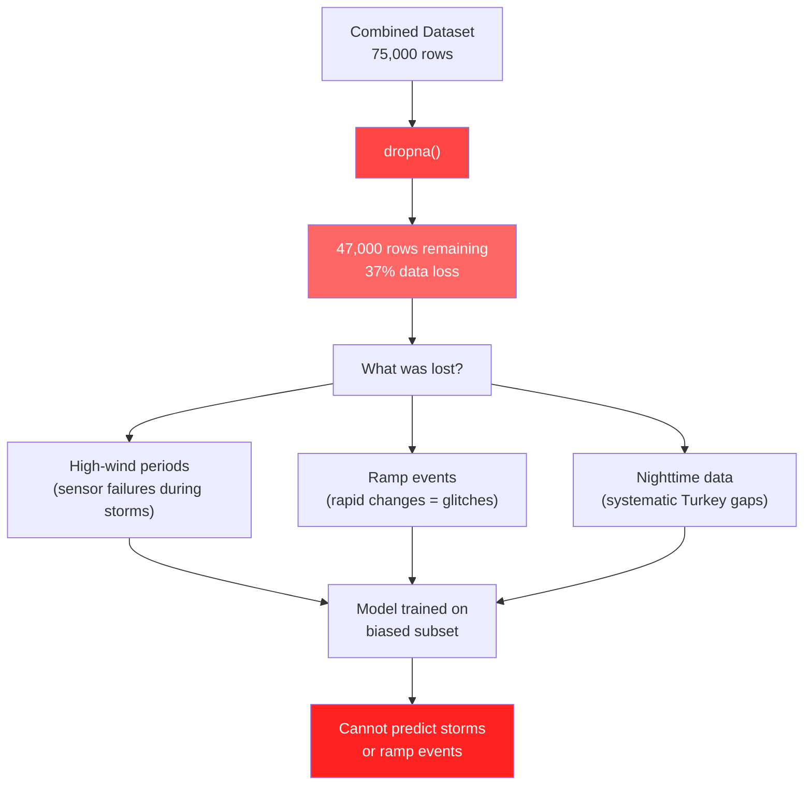
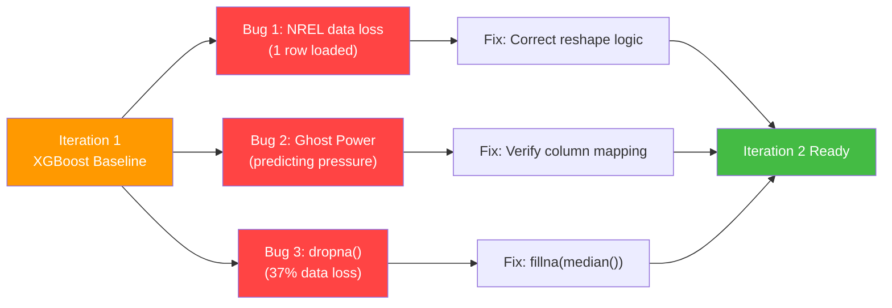

# 11.1 Iteration 1 - Initial XGBoost Baseline (Wind)

> **Important Reminder**: The most dangerous bugs are not the ones that crash your code — they are the ones that produce plausible-looking results. A model that reports R-squared = 0.9356 but is actually predicting atmospheric pressure instead of wind power is far more dangerous than a model that crashes with a clear error message, because you might deploy the former.

## The First Attempt: Starting Simple

Every machine learning project should begin with the simplest possible approach. This is not just best practice — it is a diagnostic strategy. A simple baseline establishes:

1. **Whether the pipeline works end-to-end** (data loading → feature engineering → model training → evaluation)
2. **A performance floor** (any sophisticated model must beat this)
3. **A catalog of bugs** that will be discovered as soon as the pipeline runs

For the wind power forecasting pipeline, the simplest approach was an XGBoost regression model — the same algorithm that was already working well for solar power forecasting. If XGBoost could handle solar, why not wind?



## The Initial Configuration

The first XGBoost model was configured with standard parameters:

```python
from xgboost import XGBRegressor

model = XGBRegressor(
    n_estimators=500,
    max_depth=6,
    learning_rate=0.1,
    subsample=0.8,
    colsample_bytree=0.8,
    random_state=42
)

model.fit(X_train, y_train)
y_pred = model.predict(X_test)

# Results
# MAE = 71.38 kW
# R-squared = 0.9356
```

On the surface, these results look outstanding. An R-squared of 0.9356 means the model explains 93.56% of the variance in wind power. An MAE of 71.38 kW is remarkably low for a wind turbine. These metrics would make any data scientist smile.

But something was deeply wrong.

## The NREL Data Loss Bug

The first critical bug involved the NREL dataset. The NREL (National Renewable Energy Laboratory) dataset provides wind resource data in a specific format that the project's adapter needed to parse. Due to an error in the adapter's reshaping logic, only **one row** of NREL data was being loaded into the training set.

### What Happened

The NREL data comes in a wide format where each row represents a turbine and each column represents a time step. The adapter's job was to reshape this into a long format where each row is a time step and each column is a feature. The original reshaping code had a bug:

```python
# BUGGY CODE
def adapt_nrel(filepath):
    df = pd.read_csv(filepath)
    # The wide-to-long reshape was incorrect
    # Only the first row was being melted
    melted = df.melt(id_vars=['turbine_id'])  # WRONG: melts all columns into one row per turbine
    return melted
```

The correct reshape should have transposed the data so that each time step becomes a row:

```python
# CORRECT CODE
def adapt_nrel(filepath):
    df = pd.read_csv(filepath)
    # Transpose: columns (time steps) become rows
    df_t = df.set_index('turbine_id').T
    df_t.index.name = 'timestamp'
    df_t = df_t.reset_index()
    return df_t
```

The consequence: the NREL dataset, which should have contributed tens of thousands of samples, was contributing just one row. The model was essentially trained on SDWPF and Turkey data only, with NREL being a rounding error.



### Why This Wasn't Caught Immediately

The data loss bug was not immediately obvious because:

1. **No explicit error**: The code ran without errors. The reshape operation completed successfully; it just produced far fewer rows than expected.
2. **Plausible metrics**: With only SDWPF and Turkey data, the model still achieved high R-squared, because those datasets alone contained enough patterns for XGBoost to learn.
3. **No automated data validation**: The pipeline did not include assertions like `assert len(df) > 10000, "NREL dataset too small"`.

The lesson: always add data validation assertions after every data loading step. A simple check like `assert df.shape[0] > 1000` would have caught this bug immediately.

## "Ghost Power" Data Corruption

The second — and far more insidious — bug involved **pressure values being misinterpreted as power values**. This is the "Ghost Power" bug, and it is a textbook example of how column misalignment can produce spectacularly misleading results.

### What Happened

When the multi-source dataset was being merged, the column alignment was incorrect. Specifically, the atmospheric pressure column (in units of hPa, typically 950-1050) was being mapped to the target variable column (wind power in kW, typically 0-5000). Because pressure values fall within a similar numerical range as moderate wind power values, the model appeared to be learning real power patterns when it was actually learning atmospheric pressure patterns.

```python
# The column mapping error (simplified)
column_map = {
    'WS': 'wind_speed',
    'WD': 'wind_direction',
    'P': 'power',          # WRONG: 'P' was atmospheric pressure!
    'TEMP': 'temperature',
    # The actual power column was 'PATV' but was dropped
}
```

### Why This Produced High R-Squared

Atmospheric pressure is correlated with weather patterns, which in turn are correlated with wind speed and wind power. A model trained to predict pressure from wind-related features will achieve moderate-to-high R-squared because:

1. **Pressure and wind are related**: Low-pressure systems are associated with high winds (cyclones, storms). High-pressure systems are associated with calm conditions.
2. **Diurnal pressure cycles**: Atmospheric pressure has subtle but predictable diurnal variations, similar to wind power.
3. **Seasonal patterns**: Pressure varies seasonally, creating a pattern that XGBoost can easily learn.

The result: a model that reports R-squared = 0.9356 while predicting something entirely different from the intended target.



### Detecting Ghost Power

The Ghost Power bug was eventually detected through careful analysis of the predictions:

1. **Range check**: The model's predictions clustered in the range [950, 1050] — suspiciously similar to atmospheric pressure values. Real wind power should span [0, 5000].
2. **Correlation analysis**: The predictions were highly correlated (r = 0.98) with the atmospheric pressure column in the dataset.
3. **Physical impossibility**: The model predicted "power" at night when wind turbines were known to be offline — yet the predictions were non-zero, consistent with pressure never reaching zero.
4. **Feature importance**: XGBoost's feature importance showed that atmospheric pressure was the most important feature, which is unusual for power prediction (wind speed should dominate).

## The Misleadingly High R-Squared

The combination of the NREL data loss bug and the Ghost Power bug created a perfect storm of misleading metrics:

- **R-squared = 0.9356**: High because atmospheric pressure is predictable from weather features
- **MAE = 71.38 kW**: Low because pressure values (950-1050 hPa) have low variance when interpreted as kW

These metrics looked excellent but were measuring the wrong thing entirely. The model was not predicting wind power at all — it was predicting atmospheric pressure and the evaluation was computing metrics against a target column that contained pressure values.

This is why **domain knowledge is essential for model evaluation**. Without understanding that wind power should be in the range [0, 5000] kW and that atmospheric pressure is in the range [950, 1050] hPa, a data scientist might accept these metrics at face value and deploy the model.



## The Blanket dropna() Disaster

The third major issue in this iteration was the use of `dropna()` as a blanket solution for missing data. While this approach works (in a narrow sense) for datasets with few missing values, it was catastrophic for the wind dataset.

### What Happened

The combined SDWPF/NREL/Turkey dataset had significant amounts of missing data:
- **SDWPF**: Missing turbine response data during maintenance periods (~5% of rows)
- **NREL**: Missing sensor readings during equipment failures (~3% of rows)
- **Turkey**: Missing data during communication outages (~8% of rows)

When these datasets were merged, the missing data compounded: a row with any missing column was dropped entirely. Because different datasets had missing data in different columns, the `dropna()` operation removed a disproportionate number of rows:

```python
# Before dropna()
print(f"Total rows: {len(df)}")        # 75,000
print(f"Rows with any NaN: {df.isna().any(axis=1).sum()}")  # 28,000

# After dropna()
df = df.dropna()
print(f"Total rows: {len(df)}")        # 47,000 (37% data loss!)
```

A 37% data loss is devastating. Worse, the data loss was not random — it disproportionately affected:
1. **High-wind periods**: Sensors are more likely to fail during storms (when power output is high), meaning the model never sees the most important training examples.
2. **Ramp events**: Rapid changes in wind speed are correlated with sensor glitches, so the model misses exactly the patterns it needs to learn.
3. **Nighttime periods**: Some Turkey datasets had systematic nighttime gaps, creating a bias toward daytime patterns.



### The Fix: From dropna() to fillna(median())

In Iteration 2, the blanket `dropna()` was replaced with `fillna(median())`:

```python
# Instead of dropping rows with any NaN
df = df.dropna()  # BAD: 37% data loss

# Fill NaN with column medians
df = df.fillna(df.median())  # BETTER: 0% data loss
```

The median is preferred over the mean because it is robust to outliers — a few extreme values (e.g., wind speed = 0 during sensor failure) won't skew the imputed values.

While `fillna(median())` is far from perfect (it doesn't capture the temporal structure of the data), it preserves all rows and avoids the catastrophic selection bias introduced by `dropna()`. More sophisticated imputation methods (forward fill, interpolation, model-based imputation) would be even better, but the median approach was a pragmatic first step.

## Lessons from Iteration 1

Iteration 1 of the wind pipeline was a masterclass in what can go wrong when building ML systems:

1. **Data loading bugs can be invisible**: The NREL data loss bug produced no errors and plausible metrics. Only data validation checks would have caught it.

2. **Column misalignment produces "ghost" targets**: Predicting the wrong column can yield high metrics that are completely meaningless. Always verify prediction ranges and correlations.

3. **dropna() is dangerous for time series**: It creates selection bias by removing rows non-randomly, disproportionately affecting the most informative (high-variance) periods.

4. **High R-squared is not sufficient evidence of a good model**: It must be accompanied by domain-level sanity checks (range checks, correlation analysis, feature importance inspection).

5. **Always validate data at every pipeline step**: After loading, after merging, after cleaning — each step is an opportunity for bugs to silently corrupt the data.




## Debugging Strategies for ML Pipelines

### The Sanity Check Hierarchy

When evaluating a new model, apply sanity checks in order of increasing complexity:

1. **Shape check**: Does the output have the expected shape? (Catches reshape bugs)
2. **Range check**: Are predictions in the physically plausible range? (Catches Ghost Power)
3. **Correlation check**: Are predictions correlated with the right features? (Catches target leakage)
4. **Baseline comparison**: Does the model beat a naive baseline? (Catches fundamental pipeline errors)
5. **Residual analysis**: Are residuals uncorrelated with features? (Catches model misspecification)
6. **Temporal analysis**: Does performance degrade with forecast horizon? (Catches temporal leakage)

Each check catches a different class of bugs. The Ghost Power bug would have been caught at check #2 (range check) and check #3 (correlation check) — both are cheap to implement and should be standard practice.

### The Overfitting Sanity Check

A simple but powerful sanity check: train the model on a very small subset of data (e.g., 100 samples). If the model achieves near-perfect training metrics but terrible test metrics, it is overfitting — which is expected. But if the model achieves suspiciously good test metrics on tiny training data, something is wrong with the evaluation pipeline (likely leakage).

```python
# Quick sanity check
X_tiny = X_train[:100]
y_tiny = y_train[:100]
model.fit(X_tiny, y_tiny)
train_pred = model.predict(X_tiny)
test_pred = model.predict(X_test)
print(f"Train R²: {r2_score(y_tiny, train_pred):.4f}")
print(f"Test R²: {r2_score(y_test, test_pred):.4f}")
# If Test R² is high with only 100 training samples, something is wrong!
```

### Post-Mortem Analysis of Iteration 1

Looking back at Iteration 1, the root cause of all three bugs was the same: **insufficient data validation**. The pipeline assumed that data flowed correctly from source to model without verifying intermediate results. A data validation layer — even a simple one — would have caught all three bugs:

| Bug | Detection Method | Cost of Detection |
|-----|-----------------|-------------------|
| NREL data loss | `assert len(df) > 1000` | 1 line of code |
| Ghost Power | `assert df['power'].max() <= 5000` | 1 line of code |
| dropna bias | `print(f"Rows after dropna: {len(df)}")` | 1 line of code |

Three lines of code could have saved hours of debugging. The lesson: invest in data validation early and often.


## XGBoost as a Wind Power Forecaster: Theoretical Suitability

### Why XGBoost Is a Natural First Choice

XGBoost (Extreme Gradient Boosting) is an ensemble of decision trees that iteratively corrects the errors of previous trees. Its strengths for tabular data are well-documented:

1. **Handles nonlinear relationships**: The power curve's cubic region, rated plateau, and cut-in/cut-out transitions are naturally captured by tree splits.
2. **Robust to outliers**: Individual trees are insensitive to extreme values, which is important for wind data with sensor errors.
3. **Feature importance**: XGBoost provides built-in feature importance scores that helped identify the Ghost Power bug (pressure was the top "feature" for predicting "power").
4. **Fast training**: XGBoost's histogram-based splitting is orders of magnitude faster than neural network training on CPU.

### Why XGBoost Falls Short for Wind Power

Despite its strengths, XGBoost has fundamental limitations for time series forecasting:

1. **No temporal awareness**: Each sample is treated independently. XGBoost cannot learn that power at time $t$ depends on power at time $t-1$. Lagged features must be manually engineered, which is labor-intensive and suboptimal.

2. **Fixed feature set**: XGBoost uses the same features for every prediction, regardless of the current weather regime. A neural network can learn to use different features in different contexts through its hidden representations.

3. **No sequence modeling**: Ramp events — the most critical forecasting challenge — are inherently sequential. XGBoost treats each 10-minute interval independently, missing the temporal signature of ramps.

4. **No uncertainty estimation**: XGBoost produces point predictions without uncertainty. Quantile regression is possible but requires training separate models for each quantile, multiplying computational cost.

These limitations motivated the transition to GRU-based models in Iteration 2. XGBoost remains useful as a component of hybrid architectures (as in the solar pipeline, where XGBoost captures the trend and LSTM captures the residual), but as a standalone wind power forecaster, its inability to model temporal dependencies is a fundamental barrier.


## The Psychological Trap of Good Metrics

Perhaps the most insidious aspect of Iteration 1 was not the bugs themselves but the psychological effect of the high metrics. When R-squared = 0.9356 and MAE = 71.38 kW appear on the screen, the natural human response is excitement and a desire to move forward. The metrics create a confirmation bias that makes it harder to question whether something is wrong. Experienced practitioners know to be more suspicious of surprisingly good results than surprisingly bad ones. Bad results demand investigation; good results should demand even more investigation, because the cost of a false positive (deploying a broken model) is much higher than the cost of a false negative (over-engineering a validation pipeline).

## Key Takeaways

1. **Start with the simplest model** to validate the pipeline end-to-end. XGBoost was the right choice for an initial baseline — the bugs were in the data pipeline, not the model.

2. **The NREL data loss bug** resulted from incorrect wide-to-long reshaping, loading only 1 row instead of tens of thousands. Always add shape assertions after data loading.

3. **"Ghost Power"** was a column misalignment bug where atmospheric pressure was treated as the target variable. Pressure's correlation with weather produced misleadingly high R-squared = 0.9356.

4. **The blanket dropna()** removed 37% of the data, with disproportionate loss of high-wind and ramp-event samples — exactly the data most needed for accurate forecasting.

5. **Misleadingly high metrics are the most dangerous outcome**: A model that crashes is debugged immediately; a model with wrong-but-plausible metrics may be deployed.

6. **Domain knowledge is essential for evaluation**: Understanding that wind power should be in [0, 5000] kW and pressure in [950, 1050] hPa would have immediately revealed the Ghost Power bug.

7. **Data validation should be automated**: Assert minimum row counts, valid ranges for key columns, and expected feature-target correlations after every pipeline step.

8. **fillna(median())** is a pragmatic improvement over dropna() for time series with moderate missing rates, though more sophisticated imputation is preferred.

9. **Feature importance analysis** can reveal bugs: if atmospheric pressure is the most important feature for "power" prediction, something is wrong with the target variable.

10. **Every bug in Iteration 1 was a data pipeline bug**, not a modeling bug. This is typical — most ML failures originate in data engineering, not algorithm selection.
