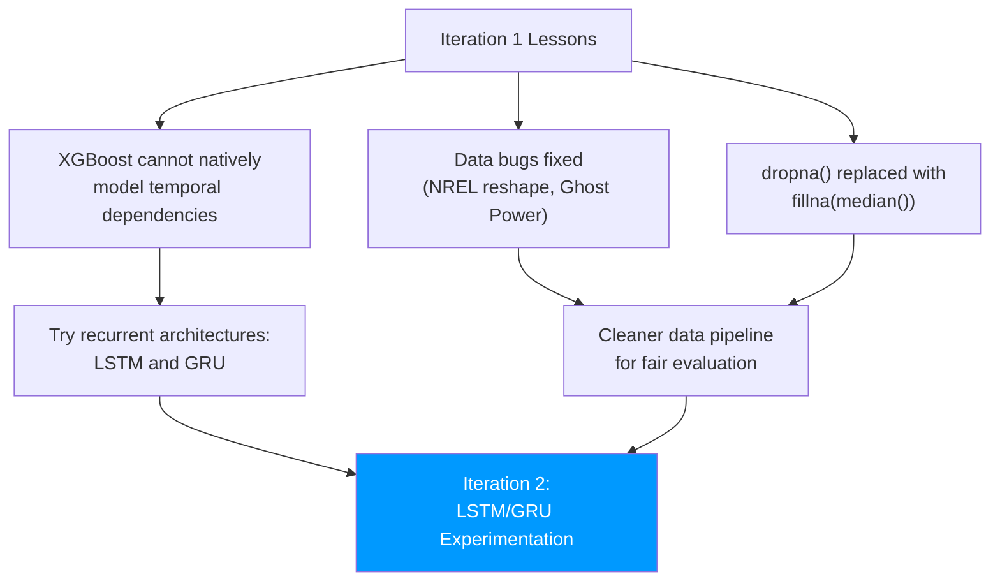
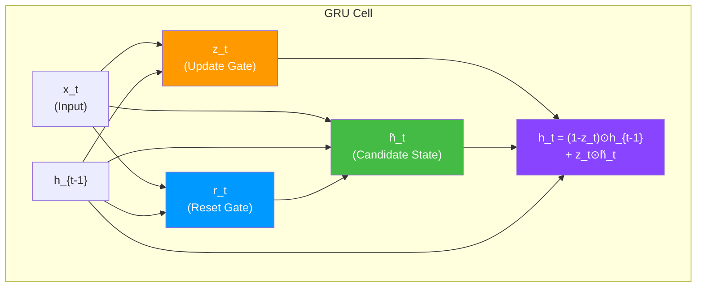
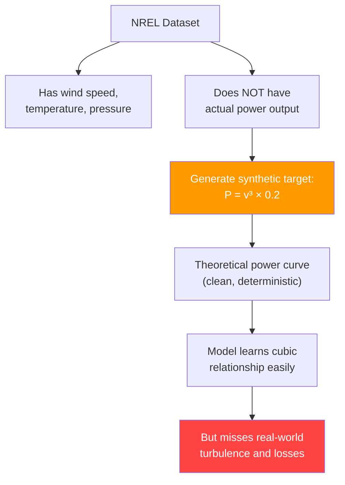
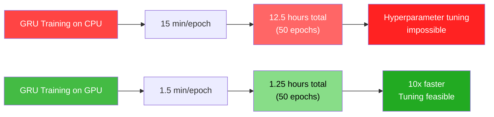
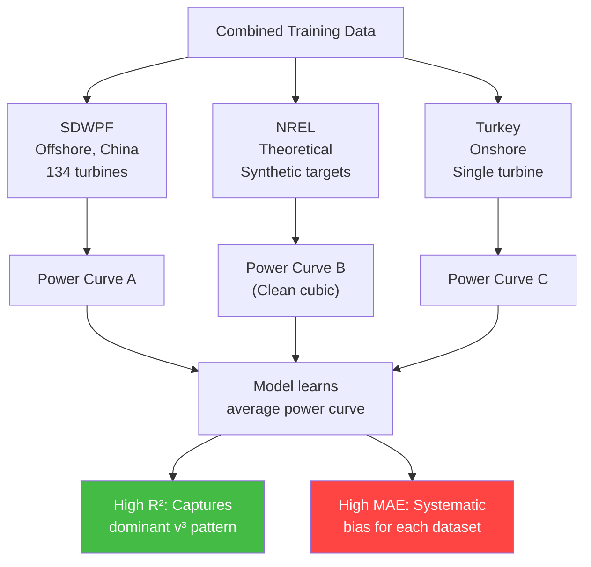

# 11.2 Iteration 2 - Initial LSTM+GRU Experimentation (Wind)

> **Important Reminder**: Mixing datasets from fundamentally different sources without a way to distinguish them is a recipe for conflicting gradients. If the model cannot tell whether a sample comes from an offshore turbine in Denmark or an onshore turbine in Turkey, it will learn a compromise that fits neither well. The is_real flag in Iteration 3 was the key insight that solved this problem.

## Moving Beyond XGBoost

Iteration 1 exposed critical data pipeline bugs, but it also revealed a limitation of the XGBoost approach: XGBoost treats each sample independently. It has no inherent mechanism for capturing temporal dependencies — the fact that wind power at time $t$ depends on wind power at time $t-1$, $t-2$, etc. While lagged features can be manually engineered for XGBoost, recurrent neural networks (RNNs) natively model sequential dependencies.

This motivated the shift to LSTM and GRU architectures in Iteration 2.



## Introduction of GRU

### Why GRU Over LSTM

Gated Recurrent Units (GRU) were chosen over Long Short-Term Memory (LSTM) for the wind pipeline for several reasons:

1. **Simpler architecture**: GRU has two gates (reset and update) compared to LSTM's three gates (input, forget, output). This means fewer parameters, faster training, and less risk of overfitting on the relatively noisy wind data.

2. **Comparable performance**: Research consistently shows that GRU matches or slightly exceeds LSTM performance on time series forecasting tasks, particularly when the dataset is not extremely large.

3. **Faster convergence**: With fewer parameters, GRU typically converges faster during training, which is important when iterating rapidly.

4. **Less memory**: GRU's simpler architecture requires less GPU memory, allowing for larger batch sizes.

### GRU Architecture

The GRU's update mechanism is:

$$z_t = \sigma(W_z \cdot [h_{t-1}, x_t])$$
$$r_t = \sigma(W_r \cdot [h_{t-1}, x_t])$$
$$\tilde{h}_t = \tanh(W \cdot [r_t \odot h_{t-1}, x_t])$$
$$h_t = (1 - z_t) \odot h_{t-1} + z_t \odot \tilde{h}_t$$

where $z_t$ is the update gate (how much of the new candidate state to incorporate), $r_t$ is the reset gate (how much of the previous state to forget when computing the candidate), and $\tilde{h}_t$ is the candidate hidden state.

The key difference from LSTM: GRU lacks a separate cell state $C_t$. It merges the cell state and hidden state into a single $h_t$, which simplifies the architecture at the cost of slightly less expressive power for very long sequences.



## NREL Reshaping Refinement

The NREL data loss bug from Iteration 1 was fixed by implementing a proper wide-to-long reshape. The corrected adapter now:

1. **Identifies the time columns** in the wide-format data
2. **Melts** the data to convert columns to rows
3. **Pivots** to create a proper feature matrix (rows = time steps, columns = features)
4. **Validates** the output shape with assertions

```python
def adapt_nrel_v2(filepath):
    df = pd.read_csv(filepath)

    # Correct wide-to-long reshape
    # Time steps are in columns, features are in rows
    id_vars = ['turbine_id', 'feature_name']
    value_vars = [c for c in df.columns if c not in id_vars]

    melted = df.melt(id_vars=id_vars, value_vars=value_vars,
                     var_name='timestep', value_name='value')
    pivoted = melted.pivot_table(index='timestep',
                                  columns='feature_name',
                                  values='value').reset_index()

    # Validation
    assert len(pivoted) > 1000, f"NREL data too small: {len(pivoted)} rows"
    assert 'wind_speed' in pivoted.columns, "Missing wind_speed column"

    return pivoted
```

This fix restored the NREL dataset to its full size, adding tens of thousands of training samples.

## Physics-Guided Target Generation for NREL

The NREL dataset presented a unique challenge: it provides wind resource data (wind speed, direction, temperature, pressure) but **not actual power output**. Unlike the SDWPF dataset (which includes measured power) and the Turkey dataset (which also includes power), NREL only provides the meteorological inputs.

### The Power Curve Approximation

To generate synthetic target values for NREL, the project used the theoretical relationship between wind speed and wind power:

$$P = \frac{1}{2} \rho A v^3 C_p$$

where:
- $P$ is the power output (W)
- $\rho$ is the air density (kg/m³)
- $A$ is the rotor swept area (m²)
- $v$ is the wind speed (m/s)
- $C_p$ is the power coefficient (dimensionless, max ≈ 0.593 by Betz limit)

Simplified with assumed constants for the NREL turbines:

$$P_{\text{synthetic}} = v^3 \times 0.2$$

The 0.2 coefficient absorbs $\frac{1}{2} \rho A C_p$ into a single constant, calibrated to produce power values in the approximate range [0, 5000] kW for the expected wind speed range.

### Implications of Synthetic Targets

Using synthetic targets has important implications:

1. **The model learns the power curve**: With synthetic targets, the GRU learns the cubic relationship $P \propto v^3$ very well, because it is a deterministic function of wind speed.

2. **Real-world turbulence is missing**: The synthetic target does not include the effects of turbulence, yaw misalignment, blade degradation, or wake effects that cause real power to deviate from the theoretical curve.

3. **Training signal is "too clean"**: When the model is trained on a mix of NREL (synthetic targets) and SDWPF/Turkey (real targets), the NREL samples provide an unrealistically easy learning signal, potentially causing the model to overfit to the theoretical curve at the expense of learning real-world dynamics.



## Shift from dropna() to fillna(median())

The blanket `dropna()` from Iteration 1 was replaced with `fillna(median())`:

```python
# Iteration 1: 37% data loss
df = df.dropna()

# Iteration 2: 0% data loss, but imputed values
for col in df.select_dtypes(include=[np.number]).columns:
    df[col] = df[col].fillna(df[col].median())
```

### Why Median, Not Mean

The median is preferred over the mean for imputation because:

1. **Robust to outliers**: A single extreme wind speed value (e.g., 50 m/s during a hurricane) would pull the mean upward but leave the median unchanged.

2. **Appropriate for skewed distributions**: Wind speed follows a Weibull distribution, which is right-skewed. The median better represents the "typical" value than the mean for skewed distributions.

3. **Preserves the distribution shape**: Median imputation adds mass at the center of the distribution, while mean imputation can shift the entire distribution if there are asymmetric outliers.

### Limitations of Median Imputation

While `fillna(median())` preserves all rows, it has significant limitations:

1. **Breaks temporal structure**: If wind speed at 10:00 AM is missing and is filled with the median (say, 6.5 m/s), the temporal continuity between the 9:50 AM reading (8.2 m/s) and the 10:10 AM reading (7.8 m/s) is broken. The model sees an artificial dip at 10:00 AM.

2. **Reduces variance**: Imputed values are always the same (the median), reducing the apparent variance of the feature. This can make the model underestimate uncertainty.

3. **Biases toward the center**: Extreme values (which are the most informative for grid operations) are replaced with the median, losing important information about rare but critical events.

Better alternatives include:
- **Forward fill** (`ffill()`): Use the last known value, preserving temporal continuity
- **Linear interpolation**: Smoothly connect neighboring values
- **Model-based imputation**: Use a separate model to predict missing values from available features

## Clipping to [0, 5000] kW

After imputation, the target variable was clipped to a physically realistic range:

```python
df['power'] = df['power'].clip(lower=0, upper=5000)
```

This clipping serves several purposes:

1. **Physical constraint**: Wind turbines cannot produce negative power (they consume small amounts for onboard systems, but this is not the target of our forecast). The upper bound of 5000 kW corresponds to the rated capacity of the largest turbines in the dataset.

2. **Removes outliers**: Sensor errors can produce negative "power" readings or values exceeding the turbine's rated capacity. Clipping removes these without discarding the entire row.

3. **Stabilizes training**: Neural networks with unbounded targets can produce very large gradients during early training, causing instability. Clipping bounds the target range and stabilizes the loss landscape.

4. **Consistent with production**: In deployment, predictions will also be clipped to [0, 5000] kW, so training and inference are consistent.

## CPU Bottleneck

Iteration 2 was also where the computational limitations of CPU training became apparent. Training a GRU on 50,000+ sequences with a lookback window of 144 timesteps required:

- **Per-epoch time**: ~15 minutes on CPU
- **Total training time** (50 epochs): ~12.5 hours
- **Hyperparameter exploration**: Essentially impossible at this speed

The bottleneck was not the GRU's forward pass (which is fast even on CPU) but the backpropagation through time (BPTT), which requires storing intermediate activations for every timestep in the lookback window. With a 144-step lookback and a hidden size of 128, the memory requirements for gradient computation were substantial.



This CPU bottleneck motivated the GPU acceleration that became a core feature of Iteration 3.

## High MAE with High R-Squared: The Dataset Mixing Conflict

Iteration 2's most puzzling result was the combination of **high MAE and high R-squared** — an apparent contradiction. How can a model explain most of the variance (high R²) while having large average errors (high MAE)?

The answer lies in the **dataset mixing conflict**. The training data combined:
- **SDWPF**: Chinese offshore wind farm, 134 turbines, measured power
- **NREL**: US wind resource, theoretical power (synthetic target)
- **Turkey**: Turkish onshore wind farm, measured power

These datasets represent fundamentally different wind regimes, turbine types, and measurement protocols. When mixed without any way to distinguish them, the model learned a compromise:

1. **High R-squared**: The overall variance in the combined dataset is dominated by the wind speed → power relationship, which is present in all three datasets. The model captures this dominant pattern, producing high R².

2. **High MAE**: Within each dataset, the model's predictions are systematically biased because it is optimizing for the average of three different power curves. A prediction that is correct for SDWPF may be 500 kW off for Turkey, and vice versa.



### The Dataset Mixing Problem in Detail

Consider a specific wind speed: 10 m/s.

| Dataset | Expected Power at 10 m/s |
|---------|--------------------------|
| SDWPF (offshore) | 1,800 kW |
| NREL (theoretical) | 2,000 kW (10³ × 0.2) |
| Turkey (onshore) | 1,200 kW |

The model, trained on all three datasets without distinguishing them, might predict 1,600 kW for 10 m/s — a reasonable compromise. But this prediction is:
- 200 kW below the SDWPF actual (11% error)
- 400 kW below the NREL synthetic (20% error)
- 400 kW above the Turkey actual (33% error)

The average error is large (MAE contribution ≈ 333 kW for this wind speed), yet the model captures the overall v³ relationship (high R²).

This analysis directly motivated the `is_real` flag innovation in Iteration 3, which allows the model to condition its predictions on the data source.


## The Physics of Wind Power Prediction

### The Power Curve and Its Non-Idealities

The theoretical power curve $P = \frac{1}{2}\rho A v^3 C_p$ describes a smooth cubic relationship between wind speed and power. In reality, the power curve has several non-ideal features that make prediction challenging:

1. **Cut-in speed**: Turbines do not generate power below a minimum wind speed (typically 3-4 m/s). Below cut-in, the rotor cannot overcome friction and generator losses.

2. **Cubic region**: Between cut-in and rated speed, power follows approximately $P \propto v^3$, but with significant scatter due to turbulence and yaw misalignment.

3. **Rated power plateau**: Above rated wind speed (typically 12-15 m/s), the pitch control system limits power to the generator's rated capacity. Power is constant regardless of further wind speed increases.

4. **Cut-out speed**: At very high wind speeds (typically 25 m/s), turbines shut down to prevent mechanical damage. Power drops abruptly from rated to zero — a dramatic nonlinear transition that is difficult to forecast.

5. **Hysteresis**: The cut-out and cut-back-in wind speeds are different. After a cut-out event, the turbine does not restart until wind speed drops well below the cut-out threshold (typically 20 m/s for restart vs. 25 m/s for shutdown).

These non-idealities mean that the relationship between wind speed and power is not a simple function — it is a complex, state-dependent, hysteretic system. The physics features (WIND_CUBED, U/V vectors) help the model learn these nonlinearities, but they cannot fully capture the discrete transitions at cut-in, rated, and cut-out speeds.

### Turbulence Intensity and Its Impact

Turbulence intensity (TI) is defined as:

$$TI = \frac{\sigma_v}{\bar{v}}$$

where $\sigma_v$ is the standard deviation of wind speed and $\bar{v}$ is the mean wind speed over a 10-minute period. High turbulence intensity means:

- **More power variability**: Power fluctuates rapidly around the mean power curve value
- **Lower average power**: Turbulence losses reduce average output below the steady-state power curve
- **Harder to forecast**: The 10-minute average power is less representative of actual power output

The Turkey dataset, being from an onshore site with complex terrain, typically has higher turbulence intensity (TI > 0.15) than the SDWPF offshore dataset (TI < 0.08). This is one reason the Turkey data is harder to predict, and why a single model struggles to handle both datasets without the is_real flag.

### Wake Effects in Wind Farms

In a wind farm, upwind turbines create wakes — regions of reduced wind speed and increased turbulence downstream. The SDWPF dataset with 134 turbines is heavily affected by wake interactions:

- **Single-wake losses**: A turbine directly behind another may experience 20-40% power reduction
- **Multiple-wake superposition**: Turbines deep in a wind farm may see compounding wake effects
- **Wake steering**: Modern wind farms can intentionally yaw upwind turbines to deflect wakes, adding another layer of complexity

The SDWPF dataset's is_real flag implicitly captures some of these effects, since the measured power already includes wake losses. However, the model has no explicit representation of the wind farm layout or turbine positions, which limits its ability to generalize to different wind farm configurations.


## Gradient Problems in Recurrent Networks

### Vanishing Gradients

The fundamental challenge of training RNNs on long sequences is the vanishing gradient problem. During backpropagation through time (BPTT), gradients are multiplied at each timestep. If the Jacobian of the hidden state transition has eigenvalues less than 1, gradients shrink exponentially:

$$\frac{\partial h_T}{\partial h_1} = \prod_{t=2}^{T} \frac{\partial h_t}{\partial h_{t-1}}$$

For a 144-step lookback (24 hours of wind data), this product involves 144 matrix multiplications. If each multiplication shrinks the gradient by a factor of 0.95, the total gradient is reduced by $0.95^{144} \approx 0.0006$ — a 99.94% reduction.

GRU addresses this through the **update gate** $z_t$, which can learn to pass information through unchanged ($z_t \approx 0$ means "keep the old hidden state"), creating a gradient highway that allows the gradient to flow through many timesteps without vanishing.

### Exploding Gradients

The opposite problem — gradients growing exponentially — is less common with GRU (thanks to the gated architecture) but can still occur. The standard solution is **gradient clipping**:

```python
torch.nn.utils.clip_grad_norm_(model.parameters(), max_norm=1.0)
```

This caps the total gradient norm at 1.0, preventing any single gradient update from being too large. Without gradient clipping, a single anomalous training sample (e.g., a wind speed of 50 m/s caused by a sensor error) could produce a massive gradient that destabilizes the entire model.

### The Impact of Sequence Length

The 144-step lookback for the wind pipeline is at the upper end of what GRU can handle reliably. For longer sequences (e.g., weekly patterns with 1008 timesteps), the Transformer architecture's self-attention mechanism provides a more scalable alternative, as it can attend to any position in the sequence in O(1) propagation steps rather than O(T).

## Key Takeaways

1. **GRU was chosen over LSTM** for the wind pipeline due to its simpler architecture, fewer parameters, faster convergence, and comparable performance on time series tasks.

2. **NREL reshaping was fixed** in Iteration 2, restoring tens of thousands of training samples that were lost in Iteration 1 due to the wide-to-long reshape bug.

3. **Physics-guided target generation** ($P = v^3 \times 0.2$) was used for NREL data that lacked measured power output, but this introduced unrealistically clean training signals.

4. **fillna(median()) replaced dropna()**, eliminating the 37% data loss from Iteration 1 at the cost of breaking temporal structure and reducing variance.

5. **Clipping to [0, 5000] kW** enforces physical constraints, removes sensor outliers, stabilizes training, and ensures consistency between training and inference.

6. **CPU bottleneck** made hyperparameter exploration infeasible, motivating the GPU acceleration in Iteration 3. Training time dropped from 12.5 hours to 1.25 hours with GPU.

7. **High MAE with high R-squared** was caused by the dataset mixing conflict — the model learned an average power curve that fit no individual dataset well.

8. **The dataset mixing problem** arises when fundamentally different data sources are combined without a way for the model to distinguish them. The model's compromise predictions are systematically biased for each source.

9. **Synthetic targets** (NREL) provide a clean learning signal for the theoretical power curve but lack the real-world turbulence, wake effects, and mechanical losses that characterize actual power output.

10. **Iteration 2 identified the key insight** that would drive Iteration 3: the need for a mechanism to distinguish between data sources, enabling the model to learn dataset-specific patterns rather than a single compromise.
