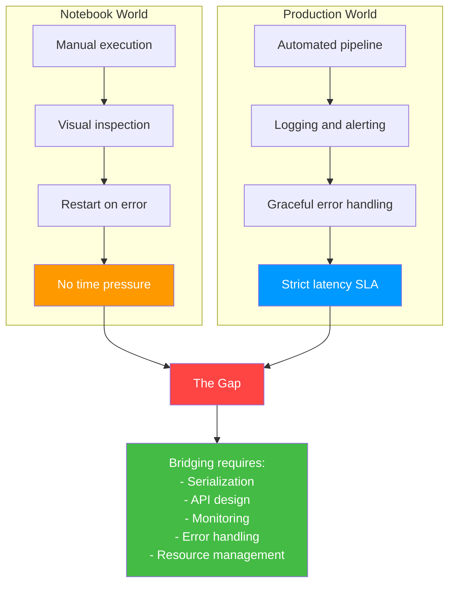
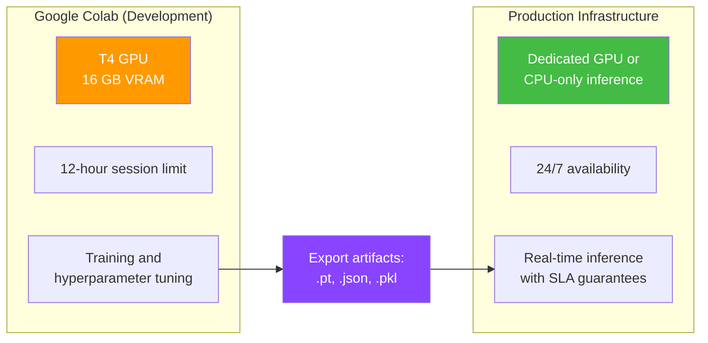
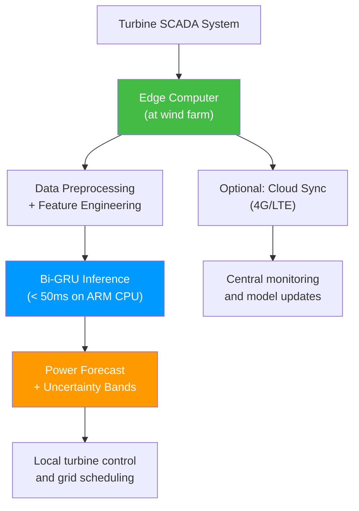
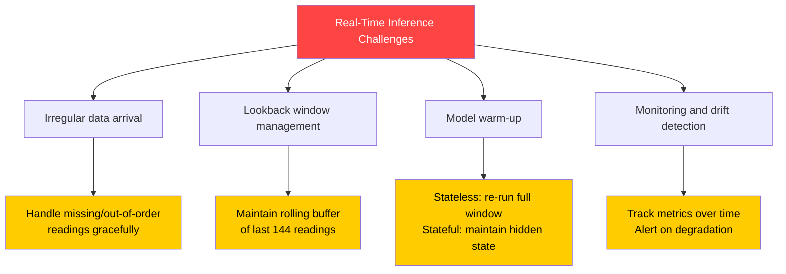
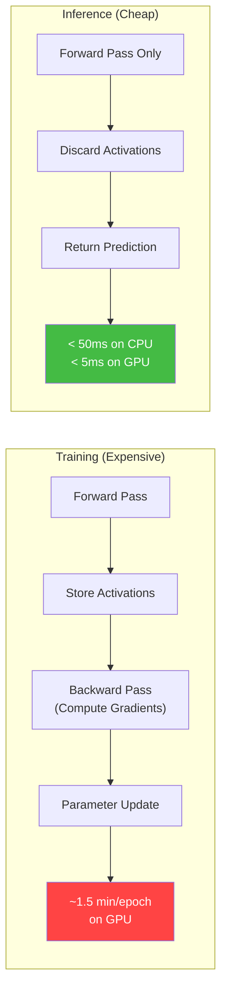
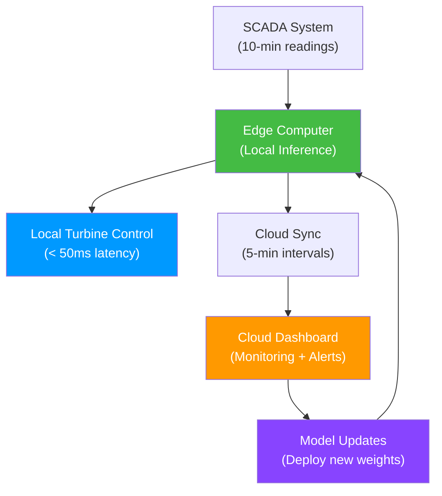

# 12.1 Real-World Edge Deployment

> **Important Reminder**: A model in a Jupyter notebook is not a product. A model in a Jupyter notebook is a prototype. The gap between "works in a notebook" and "works reliably in production" is vast, and it is where most machine learning projects fail. Deployment is not an afterthought — it is half the project.

## From Colab Notebooks to Production

The journey from a Google Colab notebook to a production deployment involves several fundamental shifts in thinking:

### The Notebook Mindset

In a notebook, you:
- Run cells manually and inspect outputs
- Restart kernels when things go wrong
- Have unlimited time between data loading and prediction
- Use the same environment for training and evaluation
- Don't worry about memory leaks, concurrent access, or error handling

### The Production Mindset

In production, you must:
- Run automatically without human intervention
- Handle errors gracefully and continue operating
- Respond within strict latency budgets (often < 100ms)
- Manage resources (GPU memory, CPU, RAM) across concurrent requests
- Monitor performance and detect degradation over time



## The Google Colab T4 GPU Environment

This project was developed on Google Colab, which provides free access to NVIDIA T4 GPUs. Understanding this environment is crucial for deployment planning.

### T4 GPU Specifications

| Specification | Value |
|--------------|-------|
| GPU | NVIDIA Tesla T4 |
| CUDA Cores | 2,560 |
| Tensor Cores | 320 (Gen 3) |
| GPU Memory | 16 GB GDDR6 |
| Memory Bandwidth | 320 GB/s |
| FP32 Performance | 8.1 TFLOPS |
| FP16 Performance | 65 TFLOPS (with Tensor Cores) |
| TDP | 70W |

The T4 is a cost-effective GPU designed for inference workloads. It supports INT8 quantization and FP16 precision, which can further accelerate inference.

### Colab Limitations

| Limitation | Impact |
|-----------|--------|
| 12-hour session limit | Long training runs must be checkpointed and resumed |
| Random disconnects | Must save artifacts frequently |
| Shared GPU | May be preempted or throttled |
| No persistent storage | Must save to Google Drive or download |
| Limited RAM (~12 GB) | Large datasets must be processed in chunks |

These limitations mean that Colab is excellent for development and experimentation but inadequate for production deployment. The trained model artifacts (weights, scalers) must be exported and deployed on dedicated infrastructure.



## Edge Computing at Turbine Sites

In the renewable energy industry, there is a growing trend toward **edge computing** — deploying inference models directly at wind farms and solar installations, rather than in centralized cloud data centers.

### Why Edge Computing for Power Forecasting

1. **Latency**: SCADA systems at wind farms generate data every 1-10 seconds. Sending this data to a cloud server, running inference, and returning predictions can take 500ms-2s — too slow for real-time turbine control.

2. **Bandwidth**: A wind farm with 100 turbines, each generating 50 sensor readings per second, produces 5,000 data points per second. Uploading all of this to the cloud is expensive and unreliable over rural internet connections.

3. **Reliability**: Wind farms are often in remote locations with unreliable internet. Edge deployment ensures forecasting continues even during connectivity outages.

4. **Privacy**: Some wind farm operators prefer to keep their operational data on-site for competitive and security reasons.

5. **Cost**: Cloud inference at scale can be expensive. A one-time hardware investment for edge deployment may be more cost-effective for continuous operation.

### Edge Hardware Requirements

For the Bi-GRU model (~198,000 parameters), the hardware requirements are minimal:

| Component | Minimum | Recommended |
|-----------|---------|-------------|
| CPU | ARM Cortex-A72 | Intel Core i5 or better |
| RAM | 2 GB | 4 GB |
| Storage | 1 GB | 10 GB (for logs and data) |
| GPU | Not required | NVIDIA Jetson Nano (optional) |
| Network | None (standalone) | 4G/LTE for cloud sync |

The model can run inference on a Raspberry Pi 4 in under 50ms, making it suitable for even the most resource-constrained edge environments.



## The Challenge of Real-Time Inference

Real-time inference introduces challenges that do not exist in batch prediction:

### 1. Data Arrival Patterns

SCADA data arrives at irregular intervals:
- Most readings arrive every 10 minutes (for wind) or 15 minutes (for solar)
- Sensor glitches may produce delayed or missing readings
- Network latency varies, so readings may arrive out of order

The inference system must handle these irregularities without producing incorrect predictions.

### 2. Lookback Window Management

The Bi-GRU requires the last 144 timesteps (24 hours for wind at 10-minute intervals) as input. In real-time, this means maintaining a rolling buffer of the most recent 144 readings:

- When a new reading arrives, append it to the buffer
- If the buffer has fewer than 144 readings, the model cannot make a prediction (or must use zero-padding)
- If a reading is missing, the system must decide whether to use the last known value, interpolate, or flag the prediction as low-confidence

### 3. Model Warm-Up

Neural networks typically produce poor predictions during the first few timesteps (before the hidden state has "warmed up"). In a batch setting, this is handled by discarding early predictions. In a real-time setting, the model's hidden state must be maintained across inference calls.

For the Bi-GRU, this means either:
- **Stateless inference**: Re-run the entire lookback window on every new data point (simple but redundant)
- **Stateful inference**: Maintain the hidden state between calls and update it with only the new data point (efficient but more complex)

This project uses stateless inference because the 144-step lookback is small enough that re-running it takes < 50ms, making the efficiency gain of stateful inference unnecessary.

### 4. Monitoring and Drift Detection

In production, the model's performance may degrade over time due to:
- **Seasonal drift**: Wind patterns change between summer and winter
- **Turbine aging**: Blade degradation changes the power curve
- **Sensor drift**: Calibration drift in wind speed or direction sensors
- **Environmental changes**: New buildings, trees, or other turbines affecting wind patterns

A production system must monitor prediction quality in real-time and alert operators when performance degrades beyond acceptable thresholds.



## Why Inference Is Cheap (No Backpropagation)

The fundamental reason that inference is computationally cheap compared to training is that inference requires only the **forward pass**, while training requires both the forward pass and **backpropagation**.

### Forward Pass (Inference)

For the Bi-GRU with 198,000 parameters:
- Process 144 timesteps through 2 GRU layers (bidirectional)
- One fully connected layer
- Total: ~198,000 multiply-accumulate operations per parameter
- Time: < 50ms on CPU, < 5ms on GPU

### Backward Pass (Training)

For the same model during training:
- Forward pass: Same as above
- Store all intermediate activations: ~198,000 × 144 × 2 values (forward + backward GRU)
- Compute gradients for all parameters: ~198,000 gradient computations
- Update parameters: ~198,000 parameter updates
- Time: ~1.5 minutes per epoch on GPU

The key difference: training must store intermediate activations (for gradient computation) and process them backward through the network. This is both memory-intensive and compute-intensive. Inference only needs the final output, so intermediate activations can be discarded immediately.



### Memory Comparison

| Operation | Memory Required |
|-----------|----------------|
| Inference | ~2 MB (model weights only) |
| Training | ~500 MB (weights + activations + gradients) |

This 250x memory difference explains why the model can run inference on a Raspberry Pi but requires a GPU for training.

## Deployment Architectures

### Architecture 1: Edge-Only

```
SCADA → Edge Computer (inference) → Local Control System
```

- Pros: Low latency, no internet dependency, data privacy
- Cons: No central monitoring, manual model updates

### Architecture 2: Cloud-Only

```
SCADA → Cloud API (inference) → Grid Operator
```

- Pros: Easy monitoring, automatic updates, scalable
- Cons: High latency, internet dependency, bandwidth costs

### Architecture 3: Hybrid (Recommended)

```
SCADA → Edge Computer (inference) → Local Control
              ↓ (periodic sync)
         Cloud Dashboard (monitoring + updates)
```

- Pros: Low latency for control, cloud for monitoring and updates
- Cons: More complex architecture




## Deployment Checklist

Before deploying a forecasting model to production, verify every item on this checklist:

### Data Pipeline
- [ ] SCADA data arrives at the expected frequency (10 min for wind, 15 min for solar)
- [ ] Missing readings are detected and handled (interpolation or forward fill)
- [ ] Out-of-range values are flagged and corrected (e.g., negative wind speeds)
- [ ] Timestamps are normalized to a common timezone
- [ ] Physics features are computed using the same formulas as in training

### Model Artifacts
- [ ] Model weights file is present and loads without errors
- [ ] Scaler object is the exact same one fitted during training (verify by checking mean_/scale_ attributes)
- [ ] Feature column order matches the training pipeline
- [ ] SHA256 checksum of artifact files matches the registry
- [ ] Model version is recorded in the artifact manifest

### Inference Pipeline
- [ ] Input data is scaled using the saved scaler (not refitted)
- [ ] Model predictions are inverse-scaled to original units (kW)
- [ ] Predictions are clipped to physical bounds ([0, 5000] for wind, [0, 500] for solar)
- [ ] Uncertainty bands are computed and returned alongside point predictions
- [ ] Inference latency is within the SLA (< 50ms for real-time, < 5s for batch)

### Monitoring
- [ ] Prediction logs are written to persistent storage
- [ ] MAE is tracked over time and compared to baseline
- [ ] Drift alerts are configured (MAE increase > 20% triggers investigation)
- [ ] Model retraining pipeline is tested and ready for deployment
- [ ] Rollback procedure is documented and tested (can revert to previous model version in < 5 minutes)

### Security
- [ ] Artifact files are read-only in production (prevent accidental overwriting)
- [ ] API endpoints are authenticated (prevent unauthorized access)
- [ ] Input data is validated (prevent injection attacks)
- [ ] Pickle files are loaded only from trusted sources (prevent arbitrary code execution)

## Containerization with Docker

For reproducible deployment, the entire inference pipeline should be containerized:

```dockerfile
FROM python:3.9-slim

# Install dependencies
RUN pip install torch --index-url https://download.pytorch.org/whl/cpu
RUN pip install scikit-learn xgboost streamlit numpy pandas

# Copy artifacts and code
COPY artifacts/ /app/artifacts/
COPY src/ /app/src/

# Health check
HEALTHCHECK --interval=30s --timeout=10s \
    CMD python -c "import requests; requests.get('http://localhost:8501/_stcore/health')"

# Run Streamlit app
CMD ["streamlit", "run", "/app/src/app.py", "--server.port=8501"]
```

Containerization ensures that:
1. **Dependencies are pinned**: The exact same library versions are used in production as in development
2. **Environment is reproducible**: Anyone can rebuild the deployment environment from the Dockerfile
3. **Isolation**: The inference service is isolated from other processes on the host machine
4. **Scalability**: Containers can be deployed on Kubernetes for horizontal scaling


## Operational Considerations for Grid-Scale Forecasting

### Forecast Communication Protocols

In real grid operations, forecasts must be communicated to multiple stakeholders through standardized protocols:

1. **IEC 61850**: The international standard for communication in electrical substations. Forecasts can be transmitted as IEC 61850 objects alongside real-time measurements.

2. **CIM (Common Information Model)**: The IEC standard for representing power system data as XML or RDF. Forecast data can be serialized as CIM objects for integration with Energy Management Systems (EMS).

3. **REST API**: The simplest integration method — forecasts are served via HTTP endpoints in JSON format. This is the approach used by the Streamlit dashboard.

4. **MQTT**: A lightweight publish-subscribe protocol ideal for IoT devices. Edge-deployed models can publish forecasts to an MQTT broker, which distributes them to all subscribed systems.

### Regulatory Requirements

Different jurisdictions have different regulatory requirements for renewable energy forecasting:

- **ERCOT (Texas)**: Requires wind power forecasts with uncertainty bands updated every 15 minutes. Penalties for deviations exceeding 5% of installed capacity.
- **CAISO (California)**: Requires day-ahead and hour-ahead solar and wind forecasts. Participating in the day-ahead market requires probabilistic forecasts.
- **ENTSO-E (Europe)**: Requires wind and solar forecasts for transmission system operators, with accuracy benchmarks that must be met.
- **National Grid (UK)**: Requires wind power forecasts at 30-minute resolution for balancing mechanism participation.

These regulatory requirements directly influence the metrics and methods used in the forecasting pipeline. A model that meets academic performance standards but fails regulatory requirements is not deployable.

### Cybersecurity for Critical Infrastructure

Power forecasting systems are classified as critical infrastructure in most jurisdictions and must meet cybersecurity standards:

- **NERC CIP (North America)**: Requires access controls, monitoring, and incident response plans for systems that affect grid operations.
- **IEC 62351**: International standard for cybersecurity in power systems, covering authentication, encryption, and intrusion detection.
- **NIST Cybersecurity Framework**: Provides guidelines for identifying, protecting, detecting, responding to, and recovering from cyber incidents.

For the forecasting pipeline, this means:
- All API endpoints must be authenticated and encrypted (HTTPS/TLS)
- Model artifacts must be integrity-checked (SHA256 checksums)
- SCADA connections must be firewalled and monitored
- Audit logs must be maintained for all forecast requests and responses


## Failure Modes and Mitigation Strategies

### Model Failure Modes

In production, forecasting models can fail in several distinct ways, each requiring different mitigation strategies:

1. **Silent failure**: The model produces predictions, but they are systematically wrong (e.g., due to a scaler mismatch). Mitigation: Continuous monitoring of prediction ranges and residual distributions.

2. **Latent failure**: The model produces reasonable predictions on average but fails catastrophically on rare events (e.g., during storms). Mitigation: Conditional metrics on high-wind and ramp-event subsets.

3. **Gradual degradation**: Performance slowly declines over months as the data distribution shifts. Mitigation: Rolling window MAE tracking with automated retraining triggers.

4. **Sudden failure**: A hardware or software change causes the model to crash or produce garbage. Mitigation: Health checks on every prediction, with fallback to persistence forecast.

### Redundancy and Failover

A production forecasting system should never have a single point of failure. Recommended redundancy patterns include:

- **Hot standby**: A second instance of the model runs in parallel, ready to take over instantly if the primary fails
- **Cold standby**: A backup model (e.g., a simpler persistence model) that can be activated manually if the primary fails
- **Ensemble fallback**: If one model in an ensemble fails, the remaining models can continue providing reduced-quality forecasts

The persistence model (predict that the next period's power will equal the current period's power) is the ultimate fallback — it requires no ML infrastructure and provides a reasonable baseline for short-term forecasting.

## Key Takeaways

1. **The gap between notebook and production** is vast — deployment requires automated execution, error handling, latency management, resource management, and monitoring.

2. **Google Colab T4 GPU** provides free GPU access for development but has session limits, random disconnects, and no persistent storage, making it unsuitable for production.

3. **Edge computing at turbine sites** reduces latency, bandwidth requirements, and cloud dependency while improving reliability and privacy.

4. **The Bi-GRU model's modest size** (~198,000 parameters, ~2 MB) makes it suitable for edge deployment on hardware as small as a Raspberry Pi.

5. **Real-time inference challenges** include irregular data arrival, lookback window management, model warm-up, and drift detection.

6. **Inference is cheap** because it requires only the forward pass — no activation storage, gradient computation, or parameter updates. This is why the same model that needs a GPU for training can run on a CPU in under 50ms for inference.

7. **Stateless inference** (re-running the full lookback window on each new data point) is the simplest approach and is fast enough for this project's requirements (< 50ms per inference).

8. **The hybrid deployment architecture** (edge inference + cloud monitoring) provides the best balance of low latency for control and cloud convenience for monitoring and updates.

9. **Monitoring and drift detection** are essential in production — model performance can degrade over time due to seasonal changes, turbine aging, sensor drift, and environmental changes.

10. **Production is half the project** — a model that works perfectly in a notebook but cannot be deployed reliably is a failed project.
