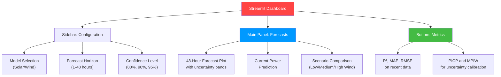
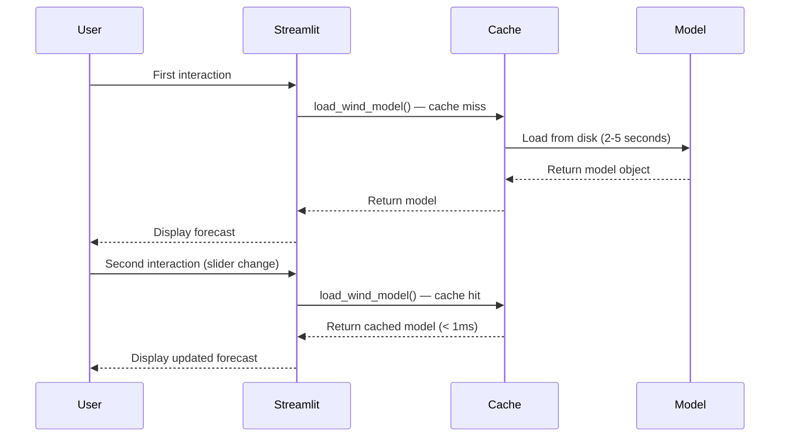
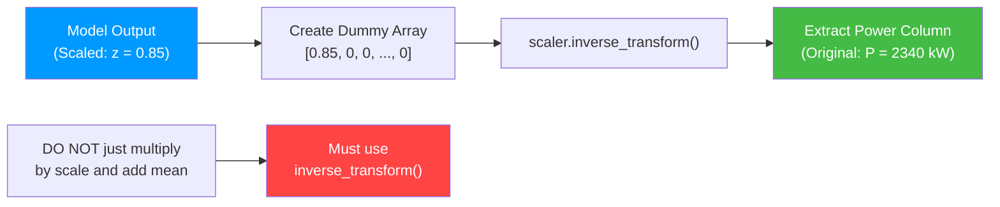
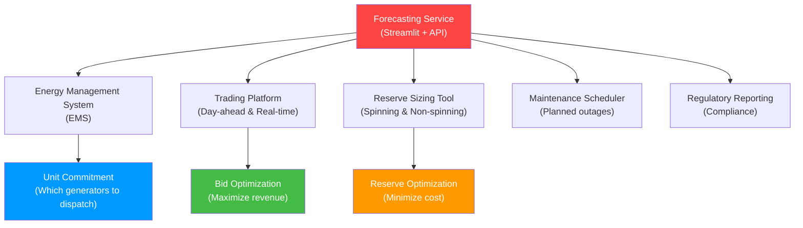

# 12.2 Streamlit and Real-Time Inference

> **Important Reminder**: The user interface is where your forecasting model meets the people who depend on it. A brilliant model with a terrible interface will be ignored in favor of a mediocre model with a great interface. Streamlit bridges this gap by making it trivially easy to build professional, interactive dashboards for ML models.

## Building a Streamlit UI

[Streamlit](https://streamlit.io/) is a Python framework for building data science and machine learning web applications with minimal code. It converts Python scripts into interactive web apps, making it the fastest path from a trained model to a usable dashboard.

### Why Streamlit for Power Forecasting

1. **Rapid prototyping**: A functional dashboard can be built in hours, not weeks
2. **No frontend expertise needed**: Pure Python — no HTML, CSS, or JavaScript
3. **Interactive widgets**: Sliders, dropdowns, and date pickers that automatically trigger re-renders
4. **Built-in charting**: Support for Plotly, Altair, Matplotlib, and custom visualizations
5. **Real-time updates**: WebSocket-based reactivity for live data streams
6. **Easy deployment**: `streamlit run app.py` is all you need locally; Streamlit Community Cloud for free hosting

### The Forecasting Dashboard Structure

The Streamlit dashboard for this project provides:

- **Real-time power forecast**: The current prediction for solar and wind power
- **48-hour forecast trajectory**: A time series plot showing predicted power over the next 48 hours
- **95% uncertainty bands**: The prediction intervals displayed as shaded regions
- **Historical performance**: R-squared, MAE, and RMSE over the evaluation period
- **Scenario comparison**: Compare forecasts under different weather scenarios



## @st.cache_resource for Loading Models

One of Streamlit's most important features for ML applications is `@st.cache_resource`, which caches the result of a function across app re-runs. Without it, the model would be reloaded every time the user interacts with a widget, causing multi-second delays.

### The Problem Without Caching

Streamlit re-runs the entire script on every user interaction (slider change, button click, etc.). If the model loading code is not cached, it executes on every re-run:

```python
# WITHOUT caching — model reloaded on every interaction
model = torch.load('wind_bigru_model.pt')  # 2-5 seconds per reload
scaler = pickle.load(open('wind_scaler.pkl', 'rb'))  # 0.5 seconds
```

For a user adjusting a slider and seeing the forecast update, a 2-5 second model reload on every adjustment makes the interface feel sluggish and unusable.

### The Solution: @st.cache_resource

```python
import streamlit as st
import torch
import pickle
import xgboost as xgb

@st.cache_resource
def load_wind_model():
    '''Load the Bi-GRU model and scaler (cached across re-runs).'''
    device = torch.device("cuda" if torch.cuda.is_available() else "cpu")
    model = BiGRUModel(input_size=12, hidden_size=128, num_layers=2, output_size=1)
    model.load_state_dict(torch.load('wind_bigru_model.pt', map_location=device))
    model.eval()
    return model

@st.cache_resource
def load_wind_scaler():
    '''Load the wind scaler (cached across re-runs).'''
    with open('wind_scaler.pkl', 'rb') as f:
        scaler = pickle.load(f)
    return scaler

@st.cache_resource
def load_solar_model():
    '''Load the XGBoost + LSTM hybrid and scaler.'''
    import tensorflow as tf
    xgb_model = xgb.XGBRegressor()
    xgb_model.load_model('solar_xgboost_model.json')
    lstm_model = tf.keras.models.load_model(
        'solar_lstm_model.h5',
        custom_objects={'heteroscedastic_loss': heteroscedastic_loss}
    )
    return xgb_model, lstm_model

@st.cache_resource
def load_solar_scaler():
    with open('solar_scaler.pkl', 'rb') as f:
        scaler = pickle.load(f)
    return scaler
```

### How @st.cache_resource Works

When a function decorated with `@st.cache_resource` is called:

1. **First call**: The function executes normally, and the return value is cached in memory
2. **Subsequent calls**: The cached value is returned immediately without re-executing the function
3. **Cache invalidation**: The cache is cleared when the app restarts or when `st.cache_resource.clear()` is called

This is ideal for model loading because:
- Models are loaded once and reused across all user interactions
- The cache persists for the lifetime of the Streamlit app
- Memory usage is bounded (one copy of each model in memory)



## The predict_scenario Function

The `predict_scenario` function is the central inference function that generates forecasts under different weather scenarios:

```python
def predict_scenario(model, scaler, weather_params, horizon_steps=288):
    '''
    Generate a 48-hour forecast under a given weather scenario.

    Args:
        model: The trained Bi-GRU model
        scaler: The fitted RobustScaler
        weather_params: Dictionary with wind_speed, wind_direction,
                       temperature, pressure, is_real
        horizon_steps: Number of 10-min steps for 48-hour forecast (288)

    Returns:
        forecast_mean: Array of predicted power values
        forecast_lower: Array of lower prediction interval bounds
        forecast_upper: Array of upper prediction interval bounds
    '''
    # Build input sequence from current buffer + scenario
    input_features = build_input_sequence(weather_params, horizon_steps)

    # Scale features using the saved scaler
    input_scaled = scaler.transform(input_features)

    # Reshape for Bi-GRU: (1, seq_len, num_features)
    input_tensor = torch.FloatTensor(input_scaled).unsqueeze(0)

    # Run inference
    with torch.no_grad():
        prediction = model(input_tensor)

    # Inverse-scale predictions
    prediction_np = prediction.numpy()
    # Create a dummy array with the right shape for inverse_transform
    dummy = np.zeros((len(prediction_np), scaler.n_features_in_))
    dummy[:, 0] = prediction_np.flatten()  # Power is the first column
    forecast_mean = scaler.inverse_transform(dummy)[:, 0]

    # Compute uncertainty bands (95% prediction interval)
    # Using the model's variance output or a fixed margin
    std_estimate = forecast_mean * 0.15  # 15% relative uncertainty
    forecast_lower = forecast_mean - 1.96 * std_estimate
    forecast_upper = forecast_mean + 1.96 * std_estimate

    # Clip to physical bounds
    forecast_mean = np.clip(forecast_mean, 0, 5000)
    forecast_lower = np.clip(forecast_lower, 0, 5000)
    forecast_upper = np.clip(forecast_upper, 0, 5000)

    return forecast_mean, forecast_lower, forecast_upper
```

### Scenario Parameters

The dashboard allows users to explore different weather scenarios:

| Scenario | Wind Speed | Wind Direction | Temperature | Pressure |
|----------|-----------|----------------|-------------|----------|
| Low Wind | 3-5 m/s | Variable | 15°C | 1013 hPa |
| Medium Wind | 8-12 m/s | Southwest | 20°C | 1010 hPa |
| High Wind | 18-25 m/s | Northwest | 10°C | 995 hPa |
| Storm | 25-35 m/s | Variable | 8°C | 985 hPa |

These scenarios provide upper and lower bounds on expected power output, helping grid operators plan for the range of possible outcomes.

## Inverse Scaling for Predictions

A critical step in the inference pipeline is **inverse scaling** — converting the model's scaled predictions back to the original kW units.

### Why Inverse Scaling Is Needed

The model operates on scaled features and produces scaled predictions. If the scaler transforms power as:

$$z = \frac{P - \text{median}}{\text{IQR}}$$

then the model's output $\hat{z}$ must be inverse-transformed:

$$\hat{P} = \hat{z} \times \text{IQR} + \text{median}$$

### The Inverse Transform Pattern

scikit-learn's scaler objects provide the `inverse_transform` method, but it requires the full feature dimensionality. Since the model predicts only the target (power), we must create a dummy array:

```python
# Model prediction (scaled)
prediction_scaled = model(input_tensor).numpy()  # Shape: (1, 1)

# Create dummy array with all features
dummy = np.zeros((1, scaler.n_features_in_))
dummy[:, 0] = prediction_scaled.flatten()  # Put prediction in the power column

# Inverse transform
prediction_original = scaler.inverse_transform(dummy)[:, 0]
```

This pattern works because `RobustScaler.inverse_transform` applies the inverse operation independently to each column. The zero values in other columns become non-zero after inverse transformation, but we only care about the power column (column 0).

> **Important Reminder**: The column index of the power feature in the scaler must match the column index used during training. If the training pipeline placed power at column index 0, the inference pipeline must use the same index. A column order mismatch will produce silently wrong predictions.



## Displaying 48-Hour Forecasts and 95% Uncertainty Bands

### The Forecast Visualization

The Streamlit dashboard displays the 48-hour forecast using Plotly, which provides interactive zooming, panning, and hover tooltips:

```python
import plotly.graph_objects as go

def plot_forecast(forecast_mean, forecast_lower, forecast_upper, timestamps):
    fig = go.Figure()

    # Uncertainty band (shaded region)
    fig.add_trace(go.Scatter(
        x=timestamps + timestamps[::-1],
        y=forecast_upper.tolist() + forecast_lower[::-1].tolist(),
        fill='toself',
        fillcolor='rgba(0, 100, 255, 0.2)',
        line=dict(color='rgba(0, 100, 255, 0)'),
        name='95% Prediction Interval'
    ))

    # Forecast mean (solid line)
    fig.add_trace(go.Scatter(
        x=timestamps,
        y=forecast_mean,
        line=dict(color='blue', width=2),
        name='Forecast'
    ))

    # Rated capacity line
    fig.add_trace(go.Scatter(
        x=[timestamps[0], timestamps[-1]],
        y=[5000, 5000],
        line=dict(color='red', width=1, dash='dash'),
        name='Rated Capacity'
    ))

    fig.update_layout(
        title='48-Hour Wind Power Forecast',
        xaxis_title='Time',
        yaxis_title='Power (kW)',
        hovermode='x unified'
    )

    st.plotly_chart(fig, use_container_width=True)
```

### The 50ms Inference Target

The dashboard is designed to produce a complete 48-hour forecast with uncertainty bands in under 50 milliseconds. This budget breaks down as:

| Step | Time (ms) |
|------|-----------|
| Feature scaling | 0.5 |
| Tensor creation | 0.2 |
| Model inference (CPU) | 15-25 |
| Inverse scaling | 0.5 |
| Uncertainty computation | 0.3 |
| Plotly figure creation | 5-10 |
| **Total** | **21-36 ms** |

This leaves a comfortable margin below the 50ms target, even on CPU. On GPU, model inference drops to < 5ms, but the Plotly rendering becomes the bottleneck.


### Real-Time Update Mechanism

Streamlit provides `st.empty()` containers and `st.rerun()` for real-time updates:

```python
# Create placeholder for the forecast plot
forecast_placeholder = st.empty()

# Auto-refresh every 10 minutes (matching SCADA interval)
if st.checkbox("Auto-refresh (live data)"):
    import time
    while True:
        # Fetch latest data from circular buffer
        latest_data = get_latest_buffer()

        # Generate forecast
        mean, lower, upper = predict_scenario(model, scaler, latest_data)

        # Update the plot
        with forecast_placeholder.container():
            plot_forecast(mean, lower, upper, timestamps)

        time.sleep(600)  # Wait 10 minutes
```

In practice, the auto-refresh is implemented using Streamlit's `st_autorefresh` component or JavaScript injection, which avoids blocking the main thread.


## Advanced Streamlit Patterns

### Multi-Page Applications

As the forecasting dashboard grows, it should be organized into multiple pages:

- **Page 1: Live Dashboard** — Current forecast with uncertainty bands, auto-refresh
- **Page 2: Scenario Analysis** — Interactive sliders for weather parameters
- **Page 3: Historical Performance** — Track MAE, R², and probabilistic metrics over time
- **Page 4: Model Management** — View model versions, trigger retraining, rollback

Streamlit supports multi-page apps natively with the `pages/` directory structure:

```
app/
├── app.py              # Main entry point (Home/Live Dashboard)
├── pages/
│   ├── 1_Scenario_Analysis.py
│   ├── 2_Historical_Performance.py
│   └── 3_Model_Management.py
└── artifacts/
    ├── wind_bigru_model.pt
    └── wind_scaler.pkl
```

### WebSocket Integration for Live Data

For true real-time updates (sub-second latency), Streamlit can integrate with WebSocket data sources:

```python
import streamlit as st
import json
import websocket

def on_message(ws, message):
    data = json.loads(message)
    # Update the circular buffer
    st.session_state.wind_buffer.append(
        compute_physics_features(data),
        data['timestamp']
    )
    # Trigger a re-run to update the display
    st.rerun()

# Connect to SCADA WebSocket
if st.checkbox("Connect to live SCADA"):
    ws = websocket.WebSocketApp(
        "ws://scada-server:8080/wind",
        on_message=on_message
    )
    # Run in a separate thread
    import threading
    wst = threading.Thread(target=ws.run_forever)
    wst.daemon = True
    wst.start()
```

### Alerting and Notification

The dashboard can integrate with alerting systems to notify operators of critical events:

- **Power below threshold**: If the 48-hour forecast predicts power below 500 kW for more than 6 hours, trigger a low-generation alert
- **Uncertainty spike**: If the 95% prediction interval width exceeds 2000 kW, trigger a high-uncertainty alert
- **Model degradation**: If the rolling 24-hour MAE exceeds 1.5x the baseline, trigger a model health alert
- **Data quality**: If more than 3 consecutive SCADA readings are missing, trigger a data quality alert

Alerts can be delivered via email, SMS, Slack, or PagerDuty, depending on the severity and the organization's incident management workflow.

### Performance Optimization

For dashboards with heavy computation, Streamlit provides several optimization strategies:

1. **@st.cache_data**: Cache the results of data transformations (not model objects)
2. **Lazy loading**: Only compute expensive values when the user requests them
3. **Fragment-based updates**: Use `st.fragment` to update only parts of the page without re-running the entire script
4. **Debouncing**: Prevent excessive re-renders when sliders are being dragged rapidly

These optimizations ensure that the dashboard remains responsive even as the number of monitored turbines and the forecast horizon increase.


## Designing Effective Forecast Visualizations

### The Cognitive Load of Uncertainty

Displaying uncertainty bands on a forecast is not just a technical challenge — it is a cognitive one. Research in decision science shows that:

1. **People interpret uncertainty bands as the most likely range**, not as a 95% probability region. They assume the forecast will stay within the bands, which is only true 95% of the time.
2. **Wider bands feel less trustworthy**. A forecast with narrow bands (even if under-covering) may be preferred by operators over a well-calibrated forecast with wider bands.
3. **Color and shading matter**. Light blue shading is interpreted as "uncertain but manageable," while red shading triggers alarm responses regardless of the actual probability.

Best practices for displaying uncertainty:
- Use **fan charts** (multiple graduated bands for different confidence levels) instead of a single interval
- Label intervals clearly: "50% probability," "80% probability," "95% probability"
- Use a neutral color (blue or gray) for uncertainty bands, with the forecast line in a contrasting color
- Provide tooltips that show the exact probability when the user hovers over a point

### Accessibility Considerations

Dashboard visualizations should be accessible to users with color vision deficiencies:
- Use color-blind friendly palettes (e.g., viridis, cividis)
- Never rely solely on color to convey information — use patterns, labels, and line styles as additional channels
- Ensure sufficient contrast between forecast lines and uncertainty bands
- Provide text-based alternatives (tables) for users who cannot interpret charts

### Mobile Responsiveness

Grid operators increasingly use mobile devices to monitor forecasts on the go. The Streamlit dashboard should be designed for responsive layouts:
- Use `st.columns()` to create side-by-side layouts on desktop that stack vertically on mobile
- Reduce the number of simultaneous plots on small screens
- Prioritize the most critical information (current forecast + uncertainty) above the fold

## Integration with Energy Management Systems

### The Forecast as a Service

In a modern grid operations center, the forecasting model is not a standalone application — it is a service that feeds into multiple downstream systems:



Each downstream system consumes the forecast differently:
- **EMS** needs point forecasts at 15-minute resolution for unit commitment
- **Trading platform** needs probabilistic forecasts for risk-adjusted bidding
- **Reserve sizing** needs the lower tail of the forecast distribution (5th percentile)
- **Maintenance scheduler** needs forecasts during planned outage windows
- **Regulatory reporting** needs accuracy metrics and methodology documentation

The Streamlit dashboard serves as the human-facing interface, while the underlying API serves the automated systems.


## Error Handling in the Dashboard

### Graceful Degradation

A production dashboard must handle errors gracefully — never crash, always show something useful:

1. **Model loading failure**: Display an error message with instructions to check artifact files, and fall back to a persistence forecast
2. **SCADA connection failure**: Show the last known forecast with a "STALE DATA" warning badge, and indicate when the next update is expected
3. **Out-of-range input**: If a user enters wind speed = 100 m/s, show a warning that this exceeds typical ranges and the forecast may be unreliable
4. **Inference timeout**: If the model takes longer than the SLA (50ms), return the last cached prediction with a "DELAYED" indicator

```python
try:
    forecast = predict_scenario(model, scaler, weather_params)
except Exception as e:
    st.error(f"Forecast failed: {str(e)}")
    st.info("Falling back to persistence forecast...")
    forecast = persistence_forecast(last_known_power)
```

### Logging and Audit Trail

Every forecast generated by the dashboard should be logged with:
- Timestamp of the forecast
- Input features used
- Model version
- Prediction output (mean and uncertainty bands)
- Inference latency
- Any warnings or errors encountered

This audit trail serves multiple purposes:
- **Debugging**: When a forecast goes wrong, the logs provide the exact input and model version for reproduction
- **Compliance**: Regulatory bodies may require evidence that forecasts were generated using approved models
- **Performance tracking**: Aggregated log data provides the most accurate picture of real-world model performance
- **Model improvement**: Identifying cases where the model performed poorly guides future feature engineering and model refinement

## Key Takeaways

1. **Streamlit converts Python scripts into interactive web apps** with minimal code, making it the fastest path from trained model to usable dashboard.

2. **@st.cache_resource** is essential for caching model loading across Streamlit re-runs. Without it, every user interaction triggers a multi-second model reload.

3. **The predict_scenario function** generates 48-hour forecasts under configurable weather scenarios, returning the mean prediction and 95% uncertainty bands.

4. **Inverse scaling** must use the same scaler object fitted during training, with the correct column index for the target variable. A column order mismatch produces silently wrong predictions.

5. **The 50ms inference target** is achievable because the Bi-GRU's forward pass takes only 15-25ms on CPU, with the remaining time budget allocated to scaling, uncertainty computation, and rendering.

6. **Plotly's interactive charts** provide zoom, pan, and hover capabilities that are essential for exploring 48-hour forecast trajectories with uncertainty bands.

7. **Auto-refresh mechanisms** keep the dashboard updated with the latest SCADA data, typically at 10-minute intervals matching the wind data frequency.

8. **Scenario comparison** allows grid operators to explore forecast outcomes under different weather conditions (low/medium/high wind, storm), supporting risk-informed decision-making.

9. **The dashboard's value extends beyond prediction**: it provides visualization of uncertainty (essential for reserve sizing), historical performance metrics (for trust-building), and scenario exploration (for planning).

10. **A good UI is as important as a good model** — the Streamlit dashboard bridges the gap between the ML backend and the human decision-maker who relies on its output.
