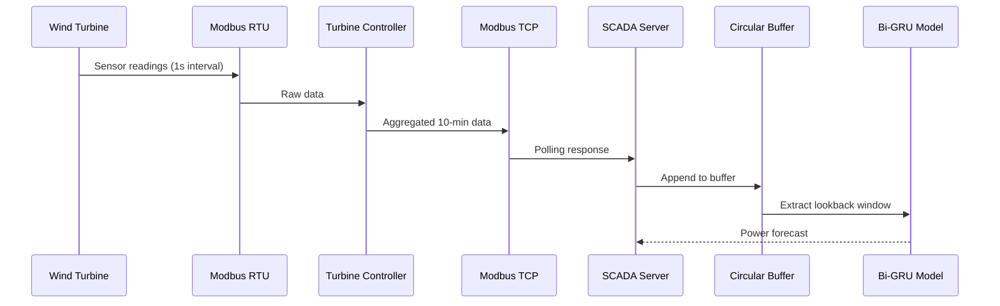
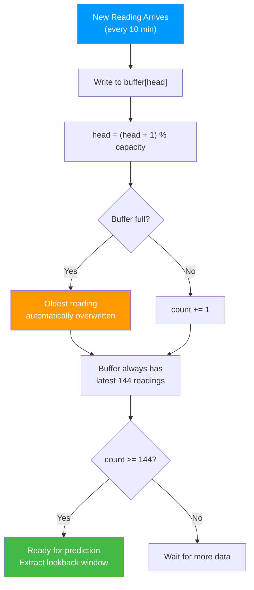
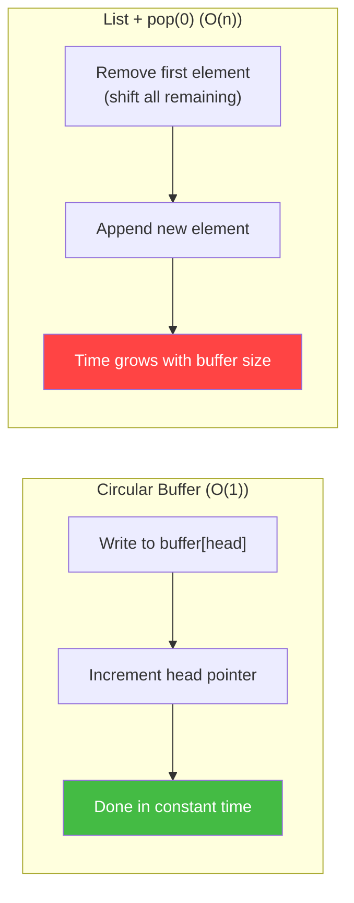
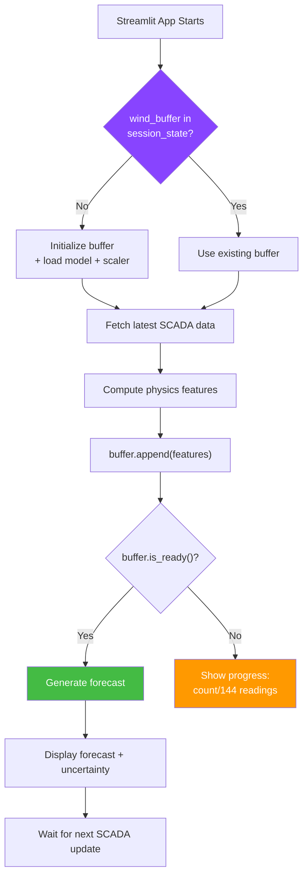

# 12.3 The Circular Buffer Pattern

> **Important Reminder**: In a real-time forecasting system, you cannot store all historical data indefinitely — memory is finite and growing arrays will eventually cause out-of-memory crashes. The circular buffer is the elegant solution: it maintains a fixed-size window of the most recent data, automatically discarding the oldest readings as new ones arrive. It is the data structure that makes real-time inference possible.

## How Real-Time Data Arrives: SCADA Modbus Every 10 Minutes

### The SCADA System

Supervisory Control and Data Acquisition (SCADA) systems are the nervous system of wind farms and solar installations. They continuously monitor and collect data from turbines, inverters, meteorological stations, and grid connection points.

### Modbus Protocol

Modbus is the dominant communication protocol in industrial automation. It defines how devices exchange data:

- **Modbus RTU**: Serial communication (RS-485), commonly used for local turbine-to-controller communication
- **Modbus TCP**: Ethernet-based communication, used for controller-to-SCADA-server communication
- **Data registers**: Each sensor value (wind speed, power output, temperature) is stored in a specific register address
- **Polling interval**: The SCADA server polls each device at regular intervals (typically 1-10 seconds for local, 10 minutes for aggregated reporting)

For this project, the relevant data arrives in aggregated 10-minute intervals for wind and 15-minute intervals for solar. Each reading contains:

| Register | Value | Unit |
|----------|-------|------|
| Wind Speed | 8.5 | m/s |
| Wind Direction | 225 | degrees |
| Temperature | 18.3 | °C |
| Pressure | 1012.5 | hPa |
| Active Power | 1847 | kW |
| Reactive Power | -45 | kVAr |
| Rotor Speed | 14.2 | rpm |
| Pitch Angle | 5.3 | degrees |
| Nacelle Position | 222 | degrees |
| Status Code | 1 | (1=running) |



### Data Quality Issues in SCADA

Real SCADA data is messy:

1. **Communication timeouts**: If the Modbus TCP connection drops, readings are missed. The SCADA server records NaN for that interval.

2. **Sensor faults**: A frozen anemometer reports the same wind speed repeatedly. A failing temperature sensor reports -999 or 9999.

3. **Time synchronization**: Different devices may have slightly different clocks, causing readings to appear out of order.

4. **Turbine curtailment**: During grid constraints, turbines are deliberately curtailed (producing less than available power). This creates "censored" data where the observed power is not the true available power.

5. **Maintenance mode**: Turbines in maintenance mode report zero power regardless of wind conditions, creating misleading training examples.

A robust circular buffer implementation must handle all of these edge cases.

## The Circular Buffer: Maintaining the Last 144 Readings

### The Concept

A circular buffer (also called a ring buffer) is a fixed-size data structure that overwrites the oldest data when full. It is the ideal data structure for maintaining the lookback window required by the Bi-GRU model.

For the wind pipeline with 10-minute intervals and a 24-hour lookback:
- **Buffer size**: 144 readings (24 hours × 6 readings/hour)
- **Data per reading**: 12 features (wind speed, direction, temperature, pressure, physics features, is_real)
- **Memory per reading**: 12 × 8 bytes (float64) = 96 bytes
- **Total buffer memory**: 144 × 96 = 13,824 bytes ≈ 13.5 KB

This is trivially small, making the circular buffer suitable for even the most memory-constrained edge devices.

### Implementation

```python
import numpy as np

class CircularBuffer:
    def __init__(self, capacity, num_features):
        '''
        Initialize a circular buffer.

        Args:
            capacity: Maximum number of readings to store
            num_features: Number of features per reading
        '''
        self.capacity = capacity
        self.num_features = num_features
        self.buffer = np.zeros((capacity, num_features))
        self.timestamps = np.zeros(capacity, dtype='datetime64[m]')
        self.head = 0  # Index of the next write position
        self.count = 0  # Number of valid readings in the buffer

    def append(self, reading, timestamp):
        '''
        Add a new reading, overwriting the oldest if the buffer is full.

        Args:
            reading: numpy array of shape (num_features,)
            timestamp: datetime of the reading
        '''
        self.buffer[self.head] = reading
        self.timestamps[self.head] = timestamp
        self.head = (self.head + 1) % self.capacity
        if self.count < self.capacity:
            self.count += 1

    def get_sequence(self):
        '''
        Get the current sequence in chronological order.

        Returns:
            numpy array of shape (count, num_features) in chronological order
        '''
        if self.count < self.capacity:
            # Buffer not yet full — return only valid readings
            return self.buffer[:self.count]
        else:
            # Buffer is full — reorder from oldest to newest
            return np.roll(self.buffer, -self.head, axis=0)

    def is_ready(self):
        '''Check if the buffer has enough data for prediction.'''
        return self.count >= self.capacity

    def get_latest(self):
        '''Get the most recent reading.'''
        if self.count == 0:
            return None
        idx = (self.head - 1) % self.capacity
        return self.buffer[idx]
```



### How the Circular Buffer Works: A Visual Example

Consider a buffer with capacity=5 (simplified for illustration):

| Step | Action | Buffer State | head | count |
|------|--------|-------------|------|-------|
| 1 | Append A | [A, _, _, _, _] | 1 | 1 |
| 2 | Append B | [A, B, _, _, _] | 2 | 2 |
| 3 | Append C | [A, B, C, _, _] | 3 | 3 |
| 4 | Append D | [A, B, C, D, _] | 4 | 4 |
| 5 | Append E | [A, B, C, D, E] | 0 | 5 (full) |
| 6 | Append F | [F, B, C, D, E] | 1 | 5 |
| 7 | Append G | [F, G, C, D, E] | 2 | 5 |

After step 7, the chronological sequence (oldest to newest) is: C, D, E, F, G. Reading A was overwritten by F, and B was overwritten by G. The buffer always contains the 5 most recent readings.

## Dropping Oldest and Adding Newest

The circular buffer's key operation is the overwrite: when the buffer is full and a new reading arrives, the oldest reading is automatically replaced by the newest one. This is achieved through modular arithmetic:

$$\text{head} = (\text{head} + 1) \bmod \text{capacity}$$

This elegant formula wraps the write pointer back to the beginning of the array when it reaches the end, creating the circular behavior. No data needs to be physically moved or shifted — only the head pointer changes.

### Comparison with Naive Approaches

| Approach | Append Time | Memory | Complexity |
|----------|------------|--------|------------|
| **Circular Buffer** | O(1) | Fixed (capacity × features) | Simple |
| **List + pop(0)** | O(n) | Grows then fixed | Simple but slow |
| **Deque (collections)** | O(1) | Grows then fixed | Simple |
| **Numpy roll** | O(n) | Fixed | Wasteful (copies entire array) |

The circular buffer's O(1) append time is crucial for real-time systems where delays can cascade. If appending takes O(n) time (like `list.pop(0)` which shifts all elements), the system can fall behind when data arrives rapidly.



## Why This Is Memory-Efficient

### Fixed Memory Allocation

The circular buffer allocates memory once during initialization and never reallocates:

```python
# Initialization: allocate fixed-size array
buffer = np.zeros((capacity, num_features))  # 144 × 12 × 8 bytes = 13.5 KB

# This is the ONLY memory allocation — ever
# No growing lists, no reallocation, no garbage collection pauses
```

This is critical for:
1. **Embedded systems**: Wind turbine controllers have limited RAM (often 512 MB or less)
2. **Long-running processes**: No memory leaks from growing data structures
3. **Deterministic performance**: No garbage collection pauses from list resizing
4. **Multi-tenant environments**: Memory usage is predictable and bounded

### Comparison with Alternative Approaches

| Approach | Memory Usage | Memory Growth | GC Pressure |
|----------|-------------|---------------|-------------|
| Circular Buffer | 13.5 KB | None | None |
| Growing List | 13.5 KB → ∞ | Unbounded | High (frequent GC) |
| Deque with maxlen | ~13.5 KB | None | Moderate |
| Pandas DataFrame | ~100 KB | None if fixed | High (object overhead) |

The circular buffer wins on all dimensions: minimal memory, zero growth, and no garbage collection pressure.

## Session State Management in Streamlit

Streamlit's `st.session_state` provides a dictionary-like object that persists across re-runs of the app. This is where the circular buffer lives.

### Why Session State Is Needed

Without `st.session_state`, the circular buffer would be re-created on every Streamlit re-run (every user interaction), losing all accumulated data:

```python
# WRONG: Buffer is recreated on every re-run
buffer = CircularBuffer(capacity=144, num_features=12)
buffer.append(new_reading, timestamp)  # Works on first run
# On second run, buffer is empty again!

# CORRECT: Buffer persists across re-runs
if 'wind_buffer' not in st.session_state:
    st.session_state.wind_buffer = CircularBuffer(capacity=144, num_features=12)
st.session_state.wind_buffer.append(new_reading, timestamp)
```

### Full Session State Pattern

```python
import streamlit as st
import numpy as np
from datetime import datetime

# Initialize session state
if 'wind_buffer' not in st.session_state:
    st.session_state.wind_buffer = CircularBuffer(capacity=144, num_features=12)
    st.session_state.wind_model = load_wind_model()
    st.session_state.wind_scaler = load_wind_scaler()
    st.session_state.last_update = None

# Process new data
new_data = fetch_latest_scada_reading()  # From SCADA API or file
if new_data is not None:
    # Compute physics features
    features = compute_physics_features(new_data)
    st.session_state.wind_buffer.append(features, new_data['timestamp'])
    st.session_state.last_update = datetime.now()

# Generate forecast if buffer is ready
if st.session_state.wind_buffer.is_ready():
    sequence = st.session_state.wind_buffer.get_sequence()
    forecast = predict_scenario(
        st.session_state.wind_model,
        st.session_state.wind_scaler,
        sequence
    )
    plot_forecast(forecast)
else:
    st.warning(f"Collecting data... {st.session_state.wind_buffer.count}/144 readings")
```



### Handling Missing Readings

In real-time operation, some SCADA readings may be missing. The circular buffer handles this by:

1. **Detecting gaps**: If the time between consecutive readings exceeds 10 minutes (wind) or 15 minutes (solar), a gap is detected.

2. **Interpolation**: For small gaps (1-2 missing readings), linear interpolation fills in the missing values.

3. **Forward fill**: For larger gaps, the last known value is repeated (forward fill).

4. **Flagging low-confidence predictions**: If the gap exceeds a threshold (e.g., 1 hour), the forecast is flagged as low-confidence, and the UI displays a warning.

```python
def handle_gap(buffer, new_timestamp, expected_interval_minutes=10):
    '''Handle gaps in SCADA data.'''
    if buffer.count == 0:
        return  # First reading, no gap possible

    last_timestamp = buffer.timestamps[(buffer.head - 1) % buffer.capacity]
    gap_minutes = (new_timestamp - last_timestamp).total_seconds() / 60
    expected_intervals = int(gap_minutes / expected_interval_minutes)

    if expected_intervals > 1:
        # Gap detected — fill with interpolated values
        last_reading = buffer.get_latest()
        for i in range(1, expected_intervals):
            interp_time = last_timestamp + timedelta(minutes=i * expected_interval_minutes)
            # Simple forward fill (can be replaced with linear interpolation)
            buffer.append(last_reading, interp_time)
```

### Buffer Reset and Recovery

If the model or scaler is updated (new version deployed), the circular buffer must be reset because the new model may expect a different feature set:

```python
# Reset buffer when model version changes
if 'model_version' not in st.session_state or st.session_state.model_version != CURRENT_MODEL_VERSION:
    st.session_state.wind_buffer = CircularBuffer(capacity=144, num_features=12)
    st.session_state.model_version = CURRENT_MODEL_VERSION
    st.info(f"Buffer reset for model version {CURRENT_MODEL_VERSION}")
```


## Advanced Circular Buffer Patterns

### Multi-Resolution Buffers

For models that require features at multiple time resolutions (e.g., 10-minute wind speed and 1-hour atmospheric pressure), a multi-resolution buffer maintains separate circular buffers at different granularities:

```python
class MultiResolutionBuffer:
    def __init__(self):
        self.buffer_10min = CircularBuffer(capacity=144, num_features=12)   # 24 hours
        self.buffer_1hr = CircularBuffer(capacity=168, num_features=8)       # 7 days
        self.buffer_1day = CircularBuffer(capacity=90, num_features=6)       # 3 months

    def update(self, reading_10min, timestamp):
        # Always update the 10-minute buffer
        self.buffer_10min.append(reading_10min, timestamp)

        # Update hourly buffer if a new hour has started
        if self._is_new_hour(timestamp):
            hourly_reading = self._aggregate_hourly(self.buffer_10min)
            self.buffer_1hr.append(hourly_reading, timestamp)

        # Update daily buffer if a new day has started
        if self._is_new_day(timestamp):
            daily_reading = self._aggregate_daily(self.buffer_1hr)
            self.buffer_1day.append(daily_reading, timestamp)
```

This pattern allows the model to access both fine-grained recent data and coarse-grained historical context, improving predictions that depend on both short-term trends and long-term patterns.

### Thread-Safe Circular Buffers

In production, the circular buffer is accessed by multiple threads:
- **SCADA listener thread**: Writes new readings to the buffer
- **Inference thread**: Reads from the buffer to generate predictions
- **Logging thread**: Reads from the buffer to persist data to disk

Without thread safety, race conditions can corrupt the buffer. The simplest solution is a read-write lock:

```python
import threading

class ThreadSafeCircularBuffer(CircularBuffer):
    def __init__(self, capacity, num_features):
        super().__init__(capacity, num_features)
        self._lock = threading.Lock()

    def append(self, reading, timestamp):
        with self._lock:
            super().append(reading, timestamp)

    def get_sequence(self):
        with self._lock:
            # Return a copy to prevent mutation during inference
            return super().get_sequence().copy()
```

The lock ensures that writes and reads are atomic — no thread can read a partially-written reading. The copy in `get_sequence()` prevents the inference thread from seeing data that is being modified by the SCADA listener.

### Buffer Persistence Across Restarts

If the Streamlit app or edge device restarts, the circular buffer is lost and must be refilled from scratch (which takes 24 hours for the wind pipeline at 10-minute intervals). To avoid this warm-up period, the buffer should be persisted to disk:

```python
import pickle

def save_buffer(buffer, filepath):
    state = {
        'buffer': buffer.buffer,
        'timestamps': buffer.timestamps,
        'head': buffer.head,
        'count': buffer.count
    }
    with open(filepath, 'wb') as f:
        pickle.dump(state, f)

def load_buffer(filepath, capacity, num_features):
    buffer = CircularBuffer(capacity, num_features)
    try:
        with open(filepath, 'rb') as f:
            state = pickle.load(f)
        buffer.buffer = state['buffer']
        buffer.timestamps = state['timestamps']
        buffer.head = state['head']
        buffer.count = state['count']
    except FileNotFoundError:
        pass  # Start with empty buffer
    return buffer
```

The buffer should be saved periodically (e.g., every hour) and on graceful shutdown. On restart, it is loaded from disk, and the model can immediately begin generating predictions without waiting for the buffer to fill.

### Handling SCADA Data Quality Flags

Real SCADA systems include data quality flags with each reading:
- **Flag 0**: Good quality — normal reading
- **Flag 1**: Questionable — sensor may be malfunctioning
- **Flag 2**: Estimated — value was interpolated or estimated
- **Flag 3**: Bad — sensor is known to be faulty

The circular buffer can incorporate these flags by adding a quality column and adjusting the inference logic to weight or exclude low-quality readings:

```python
# Extended buffer with quality tracking
class QualityAwareCircularBuffer(CircularBuffer):
    def __init__(self, capacity, num_features):
        super().__init__(capacity, num_features + 1)  # +1 for quality flag
        self.quality_threshold = 1  # Only use readings with quality <= 1

    def get_sequence(self):
        seq = super().get_sequence()
        quality = seq[:, -1]
        features = seq[:, :-1]
        # Mask low-quality readings with NaN
        features[quality > self.quality_threshold] = np.nan
        return features
```

This approach allows the inference pipeline to be aware of data quality and either exclude or downweight suspicious readings, improving the reliability of forecasts during sensor malfunction events.


## Memory Layout Optimization

### Contiguous Memory for NumPy Efficiency

The circular buffer's underlying array should be stored in **C-contiguous order** (row-major), where each row is a complete reading and rows are stored consecutively in memory. This layout ensures that:

1. **Cache-friendly access**: Sequential access to timesteps (which is how the GRU reads the data) hits the CPU cache efficiently
2. **Vectorized operations**: NumPy operations on rows or columns are optimized for contiguous memory
3. **No memory fragmentation**: The buffer is allocated once and never reallocated

### Avoiding Memory Copies

When extracting the lookback window for model input, it is tempting to create a new array. But this triggers a memory copy, which can be expensive at high frequency. The `np.roll` operation used in `get_sequence()` does create a copy, but for a 144 × 12 float64 array (13.5 KB), this copy takes less than 1 microsecond — negligible compared to the 15ms inference time.

For ultra-low-latency applications (sub-millisecond inference), a zero-copy approach would use two pointers (start and end) to read the circular buffer directly without reordering, and handle the wrap-around in the model's data loader. However, this optimization is unnecessary for the 50ms inference budget.

## Key Takeaways

1. **SCADA systems deliver data via Modbus protocol** at regular intervals (10 minutes for wind, 15 minutes for solar), but real-world data is messy with missing readings, sensor faults, and time synchronization issues.

2. **The circular buffer** maintains the last 144 readings (24 hours for wind at 10-minute intervals) in a fixed-size data structure that automatically overwrites the oldest data when new data arrives.

3. **O(1) append time** makes the circular buffer ideal for real-time systems — no shifting, no copying, no growing data structures.

4. **Memory is fixed and minimal**: 144 readings × 12 features × 8 bytes = 13.5 KB — trivially small even for embedded devices.

5. **Modular arithmetic** (`head = (head + 1) % capacity`) creates the circular behavior without physically moving any data.

6. **Session state in Streamlit** (`st.session_state`) ensures the circular buffer persists across app re-runs, preventing data loss on every user interaction.

7. **Missing readings must be handled** through interpolation (small gaps) or forward fill (larger gaps), with low-confidence flags for extended outages.

8. **Buffer reset** is necessary when deploying new model versions that expect different features, ensuring consistency between the buffer's data and the model's expectations.

9. **The circular buffer is the bridge** between the continuous stream of SCADA data and the fixed-size input required by the Bi-GRU model — it transforms a real-time data feed into a model-ready input.

10. **Deterministic memory usage** is critical for long-running production systems — the circular buffer never grows, never triggers garbage collection, and never runs out of memory.
