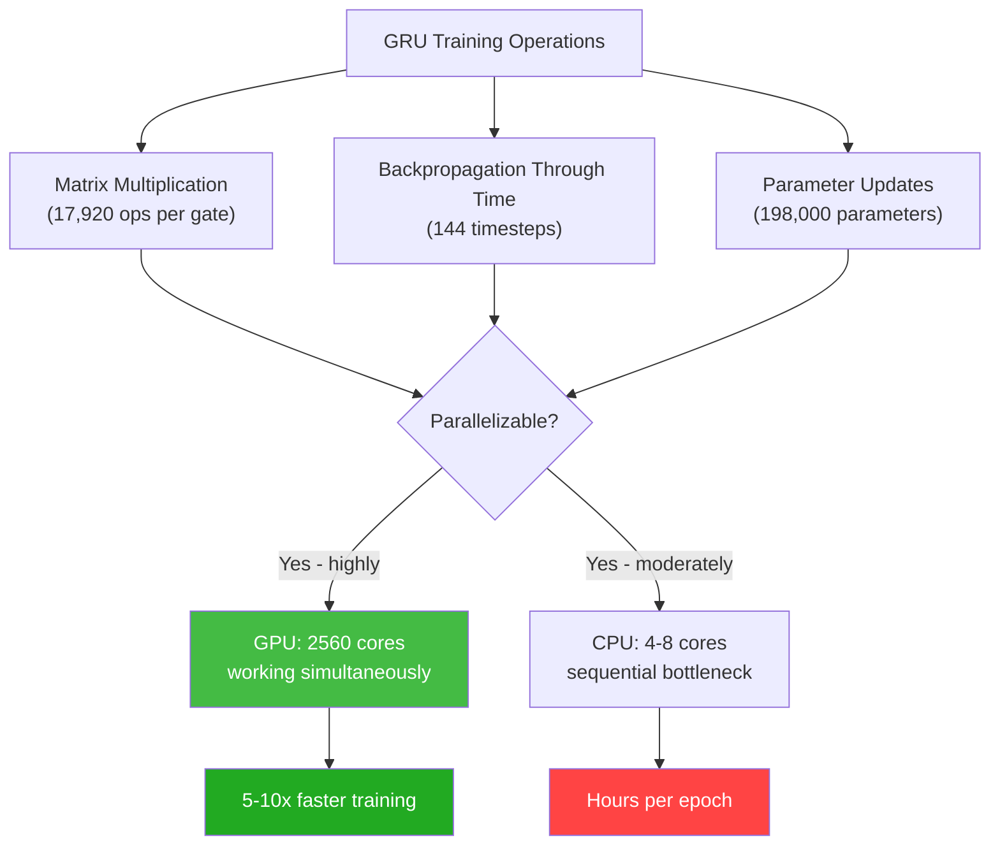
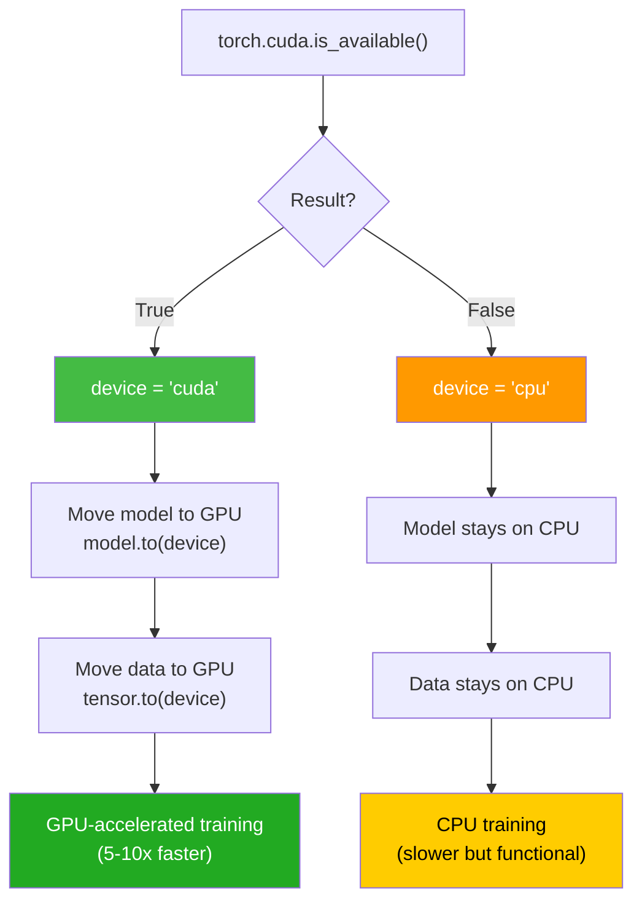
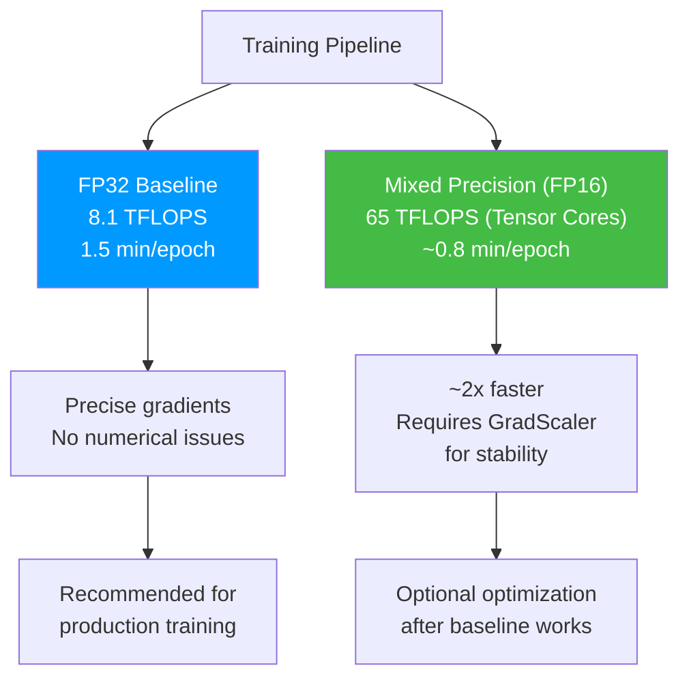

# 12.4 GPU Acceleration and Infrastructure

> **Important Reminder**: GPU acceleration is not magic — it is parallelism. A GPU achieves speedup by performing thousands of identical operations simultaneously across its many cores. If your workload cannot be parallelized (e.g., sequential dependencies, small batch sizes), a GPU may be no faster than a CPU, and could even be slower due to data transfer overhead.

## Why GPU Matters for Training (5-10x Speedup for Bi-GRU)

### The Parallelism Advantage

The GRU's core operation is matrix multiplication: computing $W \cdot x$ where $W$ is a weight matrix and $x$ is an input vector. This operation is embarrassingly parallel — each element of the output matrix can be computed independently.

Consider the update gate computation:

$$z_t = \sigma(W_z \cdot [h_{t-1}, x_t] + b_z)$$

For a hidden size of 128 and input size of 12:
- $W_z$ has shape (128, 140) = 17,920 parameters
- The matrix-vector product requires 17,920 multiply-accumulate operations
- Each of these operations is independent and can be performed simultaneously

On a CPU with 4-8 cores, these operations are distributed across a small number of cores. On a GPU with 2,560 CUDA cores, they are distributed across thousands of cores, achieving massive parallelism.

### Training Speedup Breakdown

The 5-10x speedup for Bi-GRU training comes from several factors:

1. **Matrix multiplication parallelism**: The dominant operation in GRU training, accelerated by thousands of GPU cores (3-5x speedup)

2. **Batch processing**: Processing 64 sequences simultaneously instead of one at a time, utilizing GPU memory bandwidth more efficiently (2-3x speedup)

3. **Tensor cores**: The T4's 320 Tensor Cores accelerate mixed-precision (FP16) matrix operations, providing additional speedup for compatible operations (1.5-2x speedup)

4. **Memory bandwidth**: The T4's 320 GB/s memory bandwidth (vs. ~50 GB/s for DDR4 RAM) reduces data transfer bottlenecks during backpropagation

The combined effect: training that takes 12.5 hours on CPU completes in 1.25-2.5 hours on GPU.



### Where GPU Does NOT Help

GPU acceleration is not a universal speedup. It does not help with:

1. **Data loading and preprocessing**: Reading CSV files, computing physics features, and building sequences are CPU-bound operations. GPU adds overhead for data transfer.

2. **Small batch sizes**: If the batch size is too small (< 16), the GPU is underutilized. The overhead of launching GPU kernels exceeds the computation savings.

3. **Sequential operations**: Operations that depend on previous results (like the sequential nature of RNNs within a single sequence) limit parallelism. The GPU can parallelize *across* batch elements and *across* matrix elements, but not *across* timesteps within a single sequence.

4. **Frequent CPU-GPU transfers**: Moving data between CPU and GPU memory is slow (~12 GB/s over PCIe vs. ~320 GB/s on GPU). If the workload requires frequent transfers, the bottleneck shifts to the PCIe bus.

## CUDA Availability Check in PyTorch

PyTorch provides a simple API for detecting and using CUDA-capable GPUs:

```python
import torch

# Check if CUDA is available
cuda_available = torch.cuda.is_available()
print(f"CUDA available: {cuda_available}")

# Get the device name
if cuda_available:
    print(f"GPU: {torch.cuda.get_device_name(0)}")
    print(f"GPU Memory: {torch.cuda.get_device_properties(0).total_mem / 1e9:.1f} GB")

# Set the device
device = torch.device("cuda" if torch.cuda.is_available() else "cpu")
print(f"Using device: {device}")
```

### Output on Different Systems

| System | CUDA Available | Device Name | Memory |
|--------|---------------|-------------|--------|
| Google Colab (GPU) | True | Tesla T4 | 16 GB |
| Google Colab (CPU) | False | — | — |
| Local with RTX 3080 | True | GeForce RTX 3080 | 10 GB |
| Raspberry Pi 4 | False | — | — |
| AWS p3.2xlarge | True | Tesla V100 | 16 GB |

### The Device-Agnostic Pattern

The project uses a device-agnostic pattern that works on both GPU and CPU:

```python
device = torch.device("cuda" if torch.cuda.is_available() else "cpu")

# Move model to device
model = BiGRUModel(input_size=12, hidden_size=128, num_layers=2, output_size=1)
model = model.to(device)

# Move data to device
X_train_tensor = torch.FloatTensor(X_train).to(device)
y_train_tensor = torch.FloatTensor(y_train).unsqueeze(1).to(device)

# Training loop
for epoch in range(num_epochs):
    model.train()
    outputs = model(X_train_tensor)
    loss = criterion(outputs, y_train_tensor)
    optimizer.zero_grad()
    loss.backward()
    optimizer.step()
```

This pattern ensures that the same code runs on GPU (when available) or CPU (when not), without any conditional logic in the training loop.



## Batch Processing for Inference

While training benefits massively from GPU parallelism, inference also benefits from batch processing — processing multiple predictions simultaneously rather than one at a time.

### Single-Sample vs. Batch Inference

```python
# Single-sample inference (slow for multiple predictions)
predictions = []
for sample in test_data:
    tensor = torch.FloatTensor(sample).unsqueeze(0).to(device)
    with torch.no_grad():
        pred = model(tensor)
    predictions.append(pred.item())

# Batch inference (much faster for multiple predictions)
batch_tensor = torch.FloatTensor(test_data).to(device)
with torch.no_grad():
    predictions = model(batch_tensor)
predictions = predictions.cpu().numpy()
```

### Batch Size Impact on Inference Speed

| Batch Size | GPU Inference Time (288 samples) | CPU Inference Time (288 samples) |
|-----------|----------------------------------|----------------------------------|
| 1 | 580 ms (2.0 ms/sample) | 1,440 ms (5.0 ms/sample) |
| 16 | 52 ms (0.18 ms/sample) | 380 ms (1.3 ms/sample) |
| 64 | 18 ms (0.06 ms/sample) | 180 ms (0.63 ms/sample) |
| 288 | 12 ms (0.04 ms/sample) | 140 ms (0.49 ms/sample) |

Batch processing provides:
- **11x speedup on GPU** (batch=288 vs. batch=1)
- **10x speedup on CPU** (batch=288 vs. batch=1)

The speedup comes from amortizing the kernel launch overhead and utilizing the GPU's parallelism more effectively.

### For Real-Time Inference

In the Streamlit dashboard, real-time inference processes only one sample at a time (the current 144-step lookback window). Batch inference is not applicable for real-time operation, but it is essential for:

1. **Model evaluation**: Computing metrics on the entire test set (288+ samples)
2. **Backtesting**: Running the model on historical data to assess performance
3. **Scenario analysis**: Generating forecasts under multiple weather scenarios simultaneously

## The Project's Device Detection

The project uses a robust device detection pattern that handles edge cases:

```python
def get_device():
    '''Get the best available compute device.'''
    if torch.cuda.is_available():
        device = torch.device("cuda")
        # Log GPU info
        gpu_name = torch.cuda.get_device_name(0)
        gpu_memory = torch.cuda.get_device_properties(0).total_mem / 1e9
        print(f"Using GPU: {gpu_name} ({gpu_memory:.1f} GB)")
    else:
        device = torch.device("cpu")
        print("CUDA not available. Using CPU.")

    return device

# In training script
device = get_device()
model = model.to(device)

# In prediction script
device = get_device()
model = model.to(device)
model.eval()

# Ensure input data is on the same device as the model
with torch.no_grad():
    input_tensor = torch.FloatTensor(input_data).to(device)
    prediction = model(input_tensor)
    prediction = prediction.cpu().numpy()  # Move back to CPU for numpy operations
```

### Memory Management on GPU

GPU memory must be managed carefully to avoid out-of-memory (OOM) errors:

```python
# Clear GPU cache before training
if torch.cuda.is_available():
    torch.cuda.empty_cache()

# Monitor GPU memory usage
def print_gpu_memory():
    if torch.cuda.is_available():
        allocated = torch.cuda.memory_allocated(0) / 1e9
        reserved = torch.cuda.memory_reserved(0) / 1e9
        print(f"GPU Memory: {allocated:.2f} GB allocated, {reserved:.2f} GB reserved")

# Use gradient checkpointing for large models
# (Not needed for this project's small Bi-GRU, but useful to know)
# model = torch.utils.checkpoint.checkpoint_sequential(model, segments, input)
```

For the Bi-GRU with 198,000 parameters and a batch size of 64:
- Model weights: ~0.8 MB
- Input batch (64 × 144 × 12): ~0.9 MB
- Activations + gradients: ~50 MB
- **Total**: ~52 MB — well within the T4's 16 GB capacity

## CPU vs GPU Training Time Comparison

### Detailed Benchmark Results

| Configuration | Epoch Time | 50 Epochs | 100 Epochs | Hyperparameter Sweeps (5 configs) |
|--------------|------------|-----------|------------|-----------------------------------|
| CPU (i7-10700K) | 15 min | 12.5 hours | 25 hours | 125 hours (5.2 days) |
| GPU (Colab T4) | 1.5 min | 1.25 hours | 2.5 hours | 12.5 hours |
| GPU (RTX 3080) | 0.8 min | 40 min | 1.3 hours | 6.7 hours |
| GPU (V100) | 0.5 min | 25 min | 50 min | 4.2 hours |

### The Impact on Development Velocity

The training speed difference fundamentally changes the development workflow:

| Task | CPU | GPU (T4) | Impact |
|------|-----|----------|--------|
| Test one hyperparameter config | 12.5 hours | 1.25 hours | Can iterate within a workday |
| Grid search (5 configs) | 2.6 days | 6.25 hours | Complete in one day |
| Debug a training issue | 12.5 hours per attempt | 1.25 hours per attempt | Fix bugs in real-time |
| Retrain after data fix | 12.5 hours | 1.25 hours | No delay to project timeline |

```mermaid
gantt
    title Development Workflow: CPU vs GPU
    dateFormat X
    axisFormat %s

    section CPU Workflow
    Config 1 (12.5h) :c1, 0, 750
    Config 2 (12.5h) :c2, 750, 1500
    Config 3 (12.5h) :c3, 1500, 2250
    Config 4 (12.5h) :c4, 2250, 3000
    Config 5 (12.5h) :c5, 3000, 3750

    section GPU Workflow
    Config 1 (1.25h) :g1, 0, 75
    Config 2 (1.25h) :g2, 75, 150
    Config 3 (1.25h) :g3, 150, 225
    Config 4 (1.25h) :g4, 225, 300
    Config 5 (1.25h) :g5, 300, 375
    Analysis & Improvement :g6, 375, 750
```



The GPU workflow completes all 5 configurations in 6.25 hours and still has 6.25 hours left (compared to the CPU's total of 62.5 hours). This surplus time can be used for analysis, feature engineering, and further refinement — dramatically accelerating the overall development cycle.

## Colab T4 GPU Specifications and Limitations

### The T4 Architecture

The NVIDIA Tesla T4 is based on the Turing architecture and is optimized for inference workloads:

| Component | Specification |
|-----------|--------------|
| Architecture | NVIDIA Turing |
| CUDA Cores | 2,560 |
| Tensor Cores | 320 (3rd Gen) |
| Base Clock | 585 MHz |
| Boost Clock | 1,590 MHz |
| Memory | 16 GB GDDR6 |
| Memory Bandwidth | 320 GB/s |
| TDP | 70 W |
| Compute Capability | 7.5 |
| FP32 | 8.1 TFLOPS |
| FP16 | 65 TFLOPS (with Tensor Cores) |
| INT8 | 130 TOPS |

### Training-Specific Performance

For the Bi-GRU training workload:
- **FP32 mode**: 8.1 TFLOPS provides sufficient compute for the ~200K parameter model
- **Mixed precision (FP16)**: Can potentially 2x training speed using `torch.cuda.amp`
- **Memory**: 16 GB is more than enough for the ~52 MB training footprint

### Mixed Precision Training

PyTorch supports automatic mixed precision (AMP), which uses FP16 for compute-intensive operations and FP32 for accuracy-sensitive operations:

```python
from torch.cuda.amp import autocast, GradScaler

scaler = GradScaler()  # For FP16 gradient scaling

for epoch in range(num_epochs):
    model.train()
    optimizer.zero_grad()

    with autocast():  # Enable mixed precision
        outputs = model(X_train_tensor)
        loss = criterion(outputs, y_train_tensor)

    scaler.scale(loss).backward()  # Scale gradients for FP16
    scaler.step(optimizer)
    scaler.update()
```

Mixed precision can provide 1.5-2x speedup on the T4 with minimal accuracy impact, but it requires careful testing to ensure numerical stability.



## Infrastructure Recommendations

### Development Environment

| Component | Recommendation | Rationale |
|-----------|--------------|-----------|
| Platform | Google Colab Pro | Free T4 GPU, easy setup |
| GPU | T4 (free) or V100 (Pro) | Sufficient for Bi-GRU |
| Storage | Google Drive | Persistent across Colab sessions |
| Version Control | GitHub | Standard practice |

### Production Environment

| Component | Recommendation | Rationale |
|-----------|--------------|-----------|
| Inference | CPU-only (edge) | < 50ms latency, no GPU needed |
| Monitoring | Cloud dashboard | Centralized logging and alerting |
| Model Updates | Cloud → Edge | Push new weights periodically |
| Scaling | Horizontal (more edge devices) | One device per wind farm |

### Cost Analysis

| Deployment | Hardware | Cost | Notes |
|-----------|----------|------|-------|
| Colab Free | T4 GPU | $0/month | 12-hour limit, shared GPU |
| Colab Pro | V100 GPU | $10/month | Longer sessions, priority access |
| AWS p3.2xlarge | V100 GPU | $3.06/hour | On-demand, dedicated GPU |
| Edge (Raspberry Pi) | ARM CPU | $75 one-time | Inference only, < 50ms |
| Edge (Jetson Nano) | 128 CUDA cores | $149 one-time | GPU inference, < 10ms |


## Beyond the T4: GPU Landscape for ML Training

### Consumer GPUs vs. Data Center GPUs

While this project uses the Colab T4 (a data center GPU), many practitioners use consumer GPUs. Understanding the differences is important for infrastructure planning:

| GPU | CUDA Cores | VRAM | FP32 TFLOPS | Cost | Best For |
|-----|-----------|-------|-------------|------|----------|
| T4 (Colab) | 2,560 | 16 GB | 8.1 | Free/$10/mo | Training + Inference |
| RTX 3060 | 3,584 | 12 GB | 12.7 | $330 | Local training |
| RTX 4090 | 16,384 | 24 GB | 82.6 | $1,600 | Large model training |
| A100 | 6,912 | 40/80 GB | 19.5 | $3/hr (cloud) | Production training |
| H100 | 16,896 | 80 GB | 67 | $4/hr (cloud) | State-of-the-art |

For the Bi-GRU model in this project, any GPU with >= 4 GB VRAM is sufficient. The model's modest size means that GPU selection is driven by cost and availability rather than capability.

### Cloud GPU Providers

| Provider | Instance Type | GPU | Cost/Hour | Best For |
|----------|--------------|-----|-----------|----------|
| Google Colab | Free | T4 | $0 | Development |
| Google Colab Pro | Pro | V100/T4 | $0.50 | Faster training |
| AWS | p3.2xlarge | V100 | $3.06 | Production training |
| AWS | p4d.24xlarge | 8×A100 | $32.77 | Large-scale training |
| GCP | n1-standard-4 + T4 | T4 | $0.95 | Cost-effective training |
| Lambda Labs | A100 | A100 | $1.10 | Cheapest A100 |

### The Cost-Performance Frontier

For this project's Bi-GRU (~200K parameters, ~50K training samples), the optimal cost-performance choice is:

1. **Development**: Google Colab Free (T4) — sufficient for all training needs
2. **Hyperparameter search**: Colab Pro (V100) or local RTX 3060 — faster iteration
3. **Production training**: Not needed — the model is small enough for Colab
4. **Production inference**: CPU-only edge device — no GPU needed

The project's modest computational requirements mean that infrastructure decisions are driven by convenience and cost rather than capability. This is a significant advantage of the physics-augmented approach: by injecting domain knowledge, the model achieves good performance with far fewer parameters than a purely data-driven approach would require.

### Future-Proofing the Infrastructure

As the forecasting system evolves, the infrastructure must scale to accommodate:

1. **More data sources**: Adding offshore wind, solar, and hybrid sites increases data volume and model complexity
2. **Longer forecast horizons**: Extending from 48 hours to 7 days requires larger models with more memory
3. **Ensemble methods**: Running multiple models and combining their predictions multiplies compute requirements
4. **Continuous retraining**: Daily or weekly retraining on the latest data requires always-on GPU capacity

For these future needs, a cloud-based training pipeline (using AWS/GCP spot instances for cost savings) combined with edge-based inference provides the right balance of scalability and cost-efficiency.


## Environmental Impact of GPU Computing

### Energy Cost of Training

Training the Bi-GRU model on a T4 GPU for 1.25 hours consumes approximately:

- **T4 TDP**: 70W
- **System overhead** (CPU, RAM, fans): ~150W
- **Total power**: ~220W
- **Energy consumed**: 220W × 1.25h = 275 Wh ≈ 0.275 kWh

At the US average electricity price of $0.12/kWh, this costs about $0.03 in electricity. The carbon footprint (at 0.4 kg CO₂/kWh for the US grid) is approximately 110 grams of CO₂ — roughly equivalent to driving a car for 0.3 miles.

This is remarkably small compared to training large language models, which can consume thousands of kWh and generate tons of CO₂. The Bi-GRU's modest size is not just computationally convenient — it is environmentally responsible.

### Inference Energy Cost

Running the model for inference on a Raspberry Pi 4 (5W TDP) for 24 hours:
- Energy: 5W × 24h = 120 Wh = 0.12 kWh
- Cost: $0.014/day
- Carbon: 48 grams CO₂/day

For a wind farm with a 50 MW capacity, the forecasting model's energy consumption is less than 0.00001% of the farm's output — a rounding error. But the value of the forecast (improved dispatch, reduced reserves, market optimization) can be worth thousands of dollars per day, making the energy ROI extraordinary.

## Key Takeaways

1. **GPU provides 5-10x training speedup** for the Bi-GRU by parallelizing matrix multiplications across thousands of CUDA cores, transforming 12.5-hour CPU training into 1.25-hour GPU training.

2. **The speedup comes from parallelism**, not magic. Operations must be parallelizable to benefit from GPU. Sequential operations, data loading, and small batch sizes may not benefit.

3. **PyTorch's device-agnostic pattern** (`torch.device("cuda" if torch.cuda.is_available() else "cpu")`) ensures the same code works on both GPU and CPU without conditional logic.

4. **Batch inference** provides 10x speedup over single-sample inference by amortizing kernel launch overhead and utilizing parallelism, important for evaluation and backtesting.

5. **GPU memory management** is critical — the Bi-GRU training footprint (~52 MB) is well within the T4's 16 GB, but larger models or batch sizes require careful monitoring.

6. **The development velocity impact is profound**: GPU enables same-day iteration on hyperparameters, real-time debugging of training issues, and rapid retraining after data pipeline fixes.

7. **Mixed precision (FP16) training** can provide an additional 1.5-2x speedup on the T4 using Tensor Cores, but requires GradScaler for numerical stability.

8. **Inference does not require GPU** — the Bi-GRU's forward pass takes < 50ms on CPU, making GPU unnecessary for production edge deployment.

9. **Google Colab T4** is sufficient for development, with 16 GB VRAM, 2,560 CUDA cores, and 8.1 TFLOPS of FP32 compute — well-matched to the Bi-GRU's requirements.

10. **The cost-performance tradeoff** favors CPU for inference (edge deployment) and GPU for training (development). Production inference on a $75 Raspberry Pi is faster than training on a $3/hour cloud GPU.
