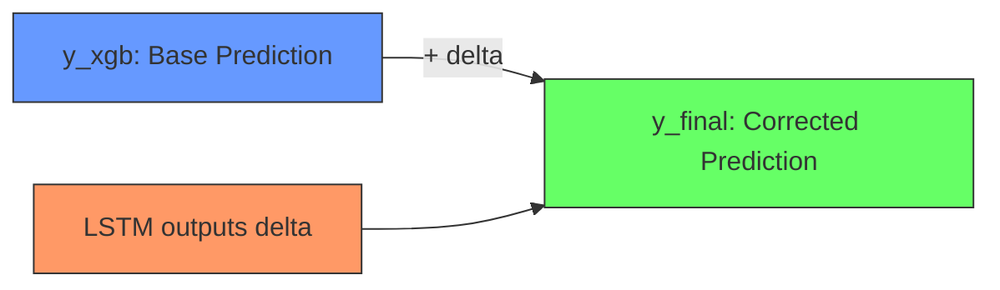

# 2.1 Linear Algebra Essentials for ML

## Why Linear Algebra Matters for This Project

Every neural network operation in this project, from the LSTM's hidden state computation to the XGBoost tree traversal, is fundamentally a linear algebra operation. When the LSTM processes a sequence of wind speed measurements, it multiplies matrices. When StandardScaler normalizes features, it shifts and scales vectors. Understanding these operations conceptually is what separates someone who can run code from someone who can debug it, improve it, and extend it.

This note covers the linear algebra concepts that are directly used in the project's code and models. Every concept here appears somewhere in the codebase, often hidden inside library calls.

## Vectors: The Fundamental Data Structure

A **vector** is an ordered list of numbers. In this project, every data point is represented as a vector. For example, a single timestep of the wind dataset contains 6 features: `[wind_speed, wind_direction, wind_speed_cubed, wind_u, wind_v, is_real]`. This is a vector in 6-dimensional space.

Key vector operations used in the project:

- **Addition**: When the LSTM adds the input transformation to the hidden state transformation, it is adding two vectors element by element.
- **Scalar Multiplication**: When StandardScaler divides by standard deviation, it multiplies the vector by 1/sigma.
- **Dot Product**: The fundamental operation in neural networks. When a Dense layer computes `output = W * x + b`, the `W * x` part is a dot product between the weight vector and the input vector.

## Matrices: Batches of Vectors

A **matrix** is a rectangular grid of numbers. In deep learning, matrices represent:
- **Weights**: The learnable parameters of a neural network
- **Batches**: Multiple data points processed simultaneously
- **Sequences**: A time series window as a 2D array

When the LSTM processes a batch of 64 sequences, each with 24 timesteps of 1 feature, the input tensor has shape `(64, 24, 1)`. This is a **3D tensor** (a generalization of a matrix to more dimensions).

The most critical matrix operation is **matrix multiplication**. When the LSTM computes `h_t = tanh(W_ih * x_t + W_hh * h_{t-1} + b)`, both `W_ih * x_t` and `W_hh * h_{t-1}` are matrix-vector multiplications. The result is the new hidden state vector.

### Matrix Multiplication Rules

For two matrices A (m x n) and B (n x p), the product C = A * B has dimensions (m x p). The inner dimensions (n) must match. Each element C[i,j] is the dot product of row i of A with column j of B.

In the project's LSTM:
- `W_ih` has shape `(4 * hidden_dim, input_dim)` which equals `(256, 1)` for hidden_dim=64, input_dim=1
- `x_t` has shape `(input_dim,)` which equals `(1,)`
- `W_ih * x_t` has shape `(256,)` which gets reshaped into 4 gates of size `(64,)`

## Tensors: Extending to Higher Dimensions

A **tensor** is the generalization of vectors (1D) and matrices (2D) to any number of dimensions. In PyTorch (used for the solar LSTM), tensors are the fundamental data structure.

The project uses tensors of various dimensions:

| Tensor | Dimensions | Meaning |
|--------|-----------|---------|
| Feature vector | (6,) | 6 wind features at one timestep |
| Weight matrix | (64, 1) | LSTM input-to-hidden weights for one gate |
| Input batch | (64, 24, 1) | 64 sequences, 24 timesteps, 1 feature |
| Hidden state | (2, 64, 64) | 2 layers, 64 batch, 64 hidden units |

Understanding tensor shapes is critical for debugging. The most common error in deep learning code is a shape mismatch. These errors always trace back to a misunderstanding of dimensions.

## The Geometry of Neural Network Operations

### Linear Transformations

A neural network layer performs a linear transformation: `y = Wx + b`. Geometrically:
- `Wx` rotates and scales the input vector
- `+b` translates the result
- The activation function (tanh, sigmoid, ReLU) introduces nonlinearity

In the LSTM, there are four such transformations per timestep (for the four gates), and they are computed simultaneously as one large matrix multiplication followed by slicing.

### The Residual Connection

The hybrid model's prediction is `y_final = y_xgb + delta`. This is vector addition: the base prediction vector plus the correction vector. Geometrically, the LSTM "moves" the XGBoost prediction in a direction that reduces error.

## Norms and Distances

Norms measure the "size" of vectors and are used throughout the project:

- **L1 Norm** (Manhattan distance): Sum of absolute values. Used in MAE (Mean Absolute Error).
- **L2 Norm** (Euclidean distance): Square root of sum of squares. Used in RMSE (Root Mean Square Error).
- **L-infinity Norm** (Max absolute value): Maximum component. Used for gradient clipping in some training loops.

The choice of norm in the loss function directly affects model behavior. L2 loss (MSE) penalizes large errors disproportionately, making the model conservative. L1 loss (MAE) treats all errors equally, making the model robust to outliers. **Huber loss** (used in the wind model) combines both: it is L2 for small errors and L1 for large errors, providing the best of both worlds.

## Key Takeaways

- Vectors represent individual data points; matrices represent batches and weights; tensors generalize to any dimension
- Matrix multiplication is the core operation in every neural network layer
- The LSTM computes four gate transformations as one large matrix multiply for efficiency
- Tensor shape mismatches are the most common source of bugs in deep learning code
- The residual correction in the hybrid model is vector addition in prediction space
- L1 and L2 norms correspond directly to MAE and RMSE evaluation metrics
- Huber loss combines L1 and L2 properties for robust training

> **Important Reminder**: When debugging shape errors, always print the shape of every tensor at every step. A single transposed matrix or missing batch dimension can cause cascading errors that are very hard to trace. In PyTorch, use `tensor.shape` to inspect dimensions at any point.
