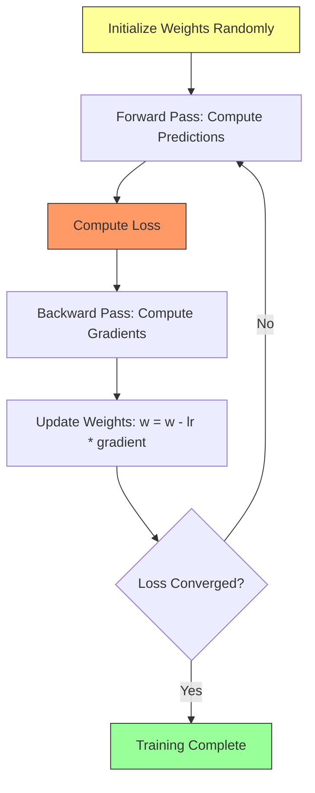

# 2.2 Calculus and Optimization

## Why Calculus Matters

Every time a neural network learns, it uses calculus. Specifically, it uses **derivatives** to determine how to adjust its parameters to reduce the prediction error. This process, called **gradient descent**, is the engine that powers all machine learning. Without understanding calculus conceptually, you cannot understand why models converge, why they sometimes diverge, or why specific tricks (like learning rate scheduling or gradient clipping) are necessary.

## Derivatives: The Rate of Change

A **derivative** measures how much a function's output changes when its input changes by a tiny amount. If `f(x)` is the loss function and `x` is a model parameter, then `df/dx` tells you: "If I increase parameter x by a small amount, will the loss go up or down, and by how much?"

For a simple function like `f(x) = x^2`, the derivative is `f'(x) = 2x`. At `x = 3`, the derivative is 6, meaning the function is increasing rapidly. At `x = 0`, the derivative is 0, meaning we are at the minimum (the bottom of the bowl).

In neural networks, we do not have a simple function with one variable. We have a complex function with millions of variables (the weights). For each weight, we need to know the derivative of the loss with respect to that weight. This collection of derivatives is called the **gradient**.

## The Gradient: A Vector of Derivatives

The **gradient** of a function is a vector containing all its partial derivatives. For a function f(x1, x2, x3), the gradient is a vector of the partial derivative of f with respect to each variable. The gradient points in the direction of steepest ascent. To minimize the loss (descend), we move in the opposite direction: `w_new = w_old - alpha * gradient`, where alpha is the learning rate.

## Gradient Descent: How Models Learn

### Step-by-Step in the Project's LSTM

1. **Forward pass**: The LSTM processes the residual sequence and outputs `[delta, log_var]` for each sample in the batch.
2. **Loss computation**: The heteroscedastic loss computes `0.5 * exp(-log_var) * (residual - delta)^2 + 0.5 * log_var` and averages across the batch.
3. **Backward pass** (backpropagation): PyTorch automatically computes the gradient of the loss with respect to every parameter in the LSTM using the chain rule.
4. **Weight update**: The Adam optimizer adjusts each weight using the gradient (plus momentum terms).

### The Chain Rule: Backpropagation's Foundation

The chain rule states that if y = f(g(x)), then dy/dx = dy/dg multiplied by dg/dx. In a neural network, the output is a composition of many functions (layer after layer). The gradient of the loss with respect to an early weight is the product of gradients through all subsequent layers.

This is where the **vanishing gradient problem** arises. If each layer's gradient is less than 1, multiplying many of them together produces an exponentially small number. The early layers receive almost no gradient, meaning they learn extremely slowly. This is precisely why LSTMs were invented: their gating mechanism creates paths through which gradients can flow without shrinking.

## The Adam Optimizer

The project uses the **Adam optimizer** for both the LSTM and GRU models. Adam (Adaptive Moment Estimation) maintains two running averages for each parameter:

1. **First moment** (mean of gradients): `m = beta1 * m + (1 - beta1) * gradient`
2. **Second moment** (mean of squared gradients): `v = beta2 * v + (1 - beta2) * gradient^2`

The parameter update is: `w = w - alpha * m / (sqrt(v) + epsilon)`

Adam adapts the learning rate for each parameter individually. Parameters with large, consistent gradients get smaller effective learning rates (they are already moving fast enough). Parameters with small or noisy gradients get larger effective learning rates (they need more encouragement).

The default hyperparameters in this project are:
- `learning_rate = 0.001` (step size)
- `beta1 = 0.9` (first moment decay)
- `beta2 = 0.999` (second moment decay)
- `epsilon = 1e-8` (numerical stability)

## The Heteroscedastic Loss Derivatives

The heteroscedastic loss has two outputs that are jointly optimized: `L = 0.5 * exp(-s) * (y - y_hat)^2 + 0.5 * s`

The partial derivative with respect to the prediction delta pushes the prediction toward the true value, weighted by the inverse variance (high confidence means large gradient).

The partial derivative with respect to log-variance s creates a self-regulating mechanism: when the squared error is large, the gradient pushes s upward (increasing uncertainty); when the error is small, it pulls s toward zero. At equilibrium, `s = log((y - y_hat)^2)`, meaning the model learns to predict the log of its own squared error.

## Learning Rate and Convergence

The learning rate is the most sensitive hyperparameter. Too high, and the optimizer overshoots the minimum, causing the loss to oscillate or diverge. Too low, and training takes unreasonably long. In this project, Solar LSTM uses `learning_rate = 0.001` (standard for Adam) and the Wind GRU uses Adam with default settings.

## Key Takeaways

- Derivatives measure how changes in parameters affect the loss
- The gradient is a vector of all partial derivatives, pointing toward steepest ascent
- Gradient descent moves parameters in the opposite direction of the gradient
- The chain rule enables backpropagation through many layers
- Adam optimizer adapts learning rates per-parameter using first and second moments
- The heteroscedastic loss creates a self-regulating system where uncertainty increases when errors are large
- Learning rate is the most critical hyperparameter and must be tuned carefully

> **Important Reminder**: If your training loss is not decreasing, first check the learning rate. Then check that gradients are flowing (not zero or NaN). Then check that your data is properly scaled. These three issues account for 90% of training failures.
