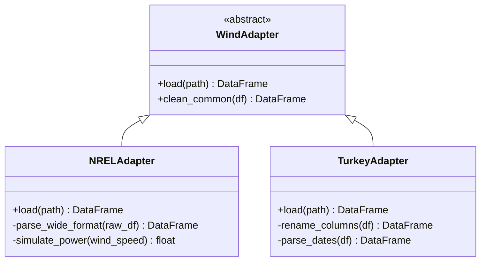

# 3.1 The Adapter Design Pattern

## The Problem: Incompatible Data Sources

In real-world machine learning projects, data never comes in a clean, unified format. This project uses data from at least four different sources, each with its own schema, naming conventions, time formats, and quirks. If you write a single data-loading function that handles all of these with if-else statements, the code becomes an unmaintainable mess. The **Adapter Pattern** solves this elegantly.

## The Adapter Pattern Explained

The Adapter Pattern is a structural design pattern that allows incompatible interfaces to work together. It acts as a translator between two incompatible systems, much like a power adapter lets you plug a European device into an American outlet.

The key idea: define a **common interface** (a standard way of loading data), then write a separate adapter for each data source that translates its specific format into the common interface.

## Implementation in the Project

### The Base Adapter

The `WindAdapter` base class defines `clean_common`: the shared cleaning logic that all wind datasets need (converting to numeric types, removing infinities, and dropping rows where essential columns are missing). This is the **common interface**.

### The NREL Adapter

The NREL (National Renewable Energy Laboratory) wind data comes in a "wide format" where 8 years of data for a single turbine is stored as repeating 11-column blocks across the same row. The NREL adapter loops through columns in steps of 11, extracts chunks, assigns canonical names, and concatenates them into long format. Missing power values are simulated using the cubic wind speed relationship: `Power = v^3 * 0.18`, clipped to the range [0, 5000] kW.

### The Turkey Adapter

The Turkey wind data has a completely different format: proper CSV headers, day-first date parsing, and different column names like "LV ActivePower (kW)". The Turkey adapter renames columns and parses dates in the Turkish format, then delegates to the shared `clean_common` method.

## The `is_real` Flag: A Design Decision with Consequences

The `is_real` feature (0.0 for NREL, 1.0 for Turkey) is an adapter-level decision that has profound consequences for the model. It tells the GRU which "physics regime" each data point belongs to. Without this flag, the model would try to learn a single relationship that averages both regimes, resulting in poor performance on both. With this flag, the model can learn separate behaviors for each regime while sharing the lower-level feature extraction.

## Benefits of the Adapter Pattern

1. **Single Responsibility**: Each adapter handles exactly one data source
2. **Testability**: You can test each adapter independently with mock data
3. **Extensibility**: Adding a new data source requires only a new adapter class
4. **Separation of Concerns**: Downstream code never sees raw data formats
5. **Type Safety**: The canonical schema enforces consistent column names

## Key Takeaways

- The Adapter Pattern translates incompatible data sources into a common format
- A canonical schema defines the "contract" that all adapters must fulfill
- The `clean_common` method provides shared cleaning logic
- The `is_real` flag encodes data source identity, allowing the model to adapt its behavior
- Adding new data sources requires only a new adapter, no changes to the pipeline

> **Important Reminder**: When building an adapter, always validate the output against the schema. A common bug is an adapter that silently drops columns or produces NaN-heavy data because of an edge case in the source format.
