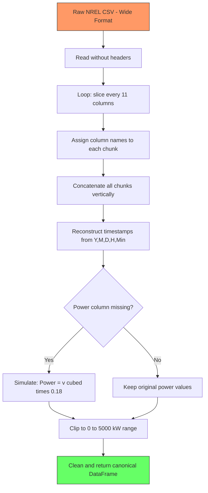

# 3.2 The Wide Format Disaster and Reshaping

## The Problem: NREL's Bizarre Data Layout

The NREL (National Renewable Energy Laboratory) provides wind data in a format that is almost designed to confuse data scientists. Instead of a standard "long format" CSV where each row represents one timestamp and each column represents one variable, the NREL data stores **8 years of hourly observations for a single turbine as repeating 11-column blocks** arranged horizontally. There are no headers and no indication of where one year ends and the next begins.

## The Reshaping Algorithm

The NRELAdapter handles this with a loop that slices the wide DataFrame into 11-column chunks and stacks them vertically. The algorithm works as follows:

1. **Read without headers**: `pd.read_csv(path, header=None)` reads the raw data without treating any row as column names.
2. **Loop in steps of 11**: Iterates over column indices 0, 11, 22, 33, etc. Each starting index represents the beginning of a new time block.
3. **Slice each block**: Extracts columns i through i+10 (11 columns total) as a chunk.
4. **Assign canonical names**: Each chunk gets the same column names: Year, Month, Day, Hour, Minute, WindSpeed, WindDirection, Temperature, Pressure, Speed80m, Power.
5. **Concatenate vertically**: `pd.concat(all_blocks, axis=0)` stacks all chunks, converting wide format to long format.
6. **Reconstruct timestamps**: The separate Y, M, D, H, Min columns are combined into a single datetime column.

## The Power Simulation Problem

The NREL data has another quirk: the `Power` column is often missing or invalid. The adapter compensates by **simulating power** from wind speed using the cubic relationship: `sim_power = (wind_speed**3) * 0.18`, clipped to [0, 5000] kW. The coefficient 0.18 is an empirical estimate of the power coefficient.

## Why This Matters

The wide format disaster illustrates a crucial lesson: **data ingestion is often the hardest part of a real ML project**. In this project, the first iteration of the NREL adapter produced only 1 row from 70,000, leading to a model that trained exclusively on Turkey data with misleadingly high accuracy. The fix required understanding the wide format structure, writing a robust slicing algorithm, adding power simulation, and validating the output.

## Key Takeaways

- NREL wind data uses a wide format with repeating 11-column blocks that must be manually sliced and stacked
- The adapter loops through columns in steps of 11, extracts chunks, assigns names, and concatenates
- Missing power values are simulated using the cubic wind speed relationship
- Data ingestion bugs can silently destroy model performance
- Always validate adapter output: check row counts, value ranges, and timestamp consistency

> **Important Reminder**: After reshaping, always check `len(df)` and timestamp ranges. In this project, the first broken adapter produced 1 row instead of 70,000. The model trained successfully and reported R-squared = 0.93, which looked great but was completely meaningless.
