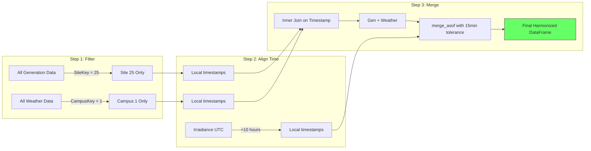

# 3.3 Data Harmonization and Canonical Schemas

## The Problem: Babel in the Data

When data comes from multiple sources, each source speaks its own language. The UNISOLAR generation data says `SolarGeneration`, the weather data says `Ghi`, the irradiance data says `GHI` (uppercase), and the wind data says `LV ActivePower (kW)`. The solution is **data harmonization** through a **canonical schema**.

## What Is a Canonical Schema?

A canonical schema is a **single, authoritative definition** of what the data looks like after all adapters have done their work. It defines the exact column names, data types, units, and expected value ranges that downstream code will use.

In this project, there are two canonical schemas:

### Solar Schema (Implicit in Config)
- `TIME_COL = "Timestamp"`, `TARGET_COL = "SolarGeneration"`
- Weather columns renamed to: `ghi`, `temp`, `humidity`, `wind_speed`

### Wind Schema (Explicit in WindSchema class)
- `TIMESTAMP = "timestamp"`, `WIND_SPEED = "wind_speed_ms"`, `WIND_DIRECTION = "wind_direction_deg"`
- `ACTIVE_POWER = "active_power_kw"`, `WIND_CUBED = "wind_speed_cubed"`, `WIND_U = "wind_u"`, `WIND_V = "wind_v"`, `IS_REAL = "is_real"`

## Time Alignment: The Trickiest Part

The solar project uses `pd.merge_asof` to handle imperfect timestamp alignment. This performs an **as-of join**: for each row in the left DataFrame, it finds the closest row in the right DataFrame (within a specified tolerance of 15 minutes). This handles small timestamp drifts gracefully.

## Key Takeaways

- A canonical schema defines authoritative column names, types, and units for all downstream code
- Harmonization happens through column renaming, unit conversion, and timezone alignment
- `pd.merge_asof` handles imperfect timestamp alignment with configurable tolerance
- Timezone conversion is critical when merging data from global sources
- Always verify row counts and check for unexpected NaN after every merge operation

> **Important Reminder**: Never skip the harmonization step and use raw column names throughout the code. It leads to subtle bugs where "Ghi" and "ghi" refer to different columns.
