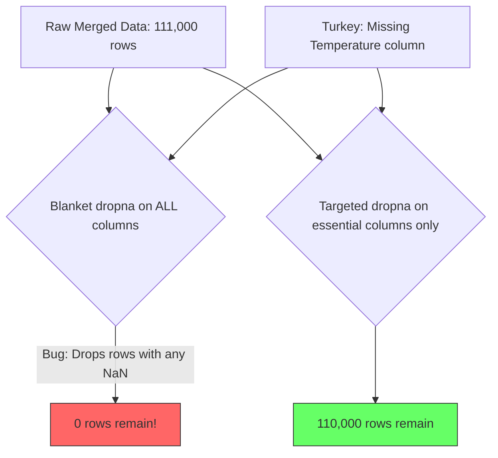

# 3.4 Handling Missing Data and The dropna Trap

## The Missing Data Landscape

Missing data is the silent killer of machine learning projects. In the UNISOLAR solar dataset, approximately 53% of the target variable (SolarGeneration) is missing. Understanding how and why data goes missing, and what to do about it, is one of the most impactful skills in this project.

## Types of Missing Data

- **MCAR (Missing Completely At Random)**: Missingness has no relationship to any variable. Least problematic.
- **MAR (Missing At Random)**: Missingness depends on observed variables. Can be handled by conditioning on observed variables.
- **MNAR (Missing Not At Random)**: Missingness depends on the unobserved value itself. Most dangerous because it introduces bias.

In the solar dataset, nighttime missing values are effectively **MAR**: the missingness depends on the time of day (which is observed), and we know from physics that nighttime power must be zero.

## The Physics-Guided Imputation Strategy

### Stage 1: Nighttime Zero-Fill
If the sun is below the horizon (GHI < 5 W/m^2), solar panels produce zero power. This is a physical law, not a statistical inference. This single step recovers approximately 18,000 missing rows.

### Stage 2: Linear Interpolation for Small Gaps
During the day, small gaps (1-4 consecutive readings) are filled with linear interpolation. The `limit=4` parameter prevents interpolation across large gaps.

### Stage 3: Drop Remaining Large Gaps
After zero-fill and interpolation, any remaining NaN values represent gaps too large to fill reliably and are dropped.

## The `dropna` Trap

The wind project encountered a devastating bug: a blanket `dropna()` that dropped **any** row with **any** NaN in **any** column. When the Turkey dataset (which lacks PRESSURE and TEMPERATURE columns) was merged with NREL data, all Turkey rows had NaN in those columns, and `dropna()` eliminated **every single Turkey row**, leaving only NREL data.

The fix: use `dropna(subset=[essential_columns_only])`.

## Imputation vs Dropping: Decision Framework

| Condition | Strategy | Rationale |
|-----------|----------|-----------|
| Missing at night (solar) | Fill with 0 | Physics dictates zero output |
| Small daytime gap (1-4 steps) | Linear interpolation | Gradual changes between known values |
| Large daytime gap (>4 steps) | Drop row | Too uncertain to fabricate |
| Missing essential feature | Drop row | Cannot infer from other features |
| Missing non-essential feature | Fill with median | Provides reasonable default |
| Calculated feature is infinite | Replace with NaN, then handle | np.inf crashes most algorithms |

## Key Takeaways

- 53% of solar generation data is missing, mostly at night where physics dictates zero output
- Physics-guided zero-fill for nighttime recovers 18,000 rows without introducing bias
- Linear interpolation handles small daytime gaps; large gaps should be dropped
- Blanket `dropna()` is extremely dangerous and can eliminate entire datasets
- Always use `dropna(subset=[essential_columns])` to target only critical missingness
- The imputation strategy must be fit only on training data to prevent leakage

> **Important Reminder**: The order of imputation steps matters. Always apply the most confident imputations first (physics-based rules), then interpolation for moderate gaps, then drop the rest.
