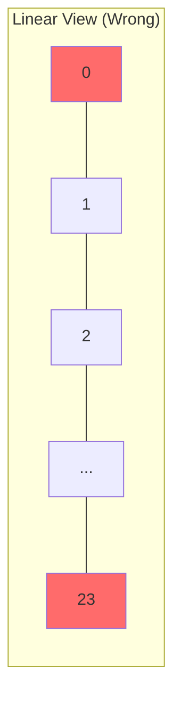
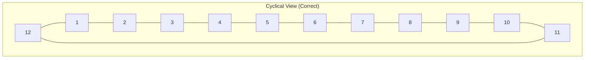
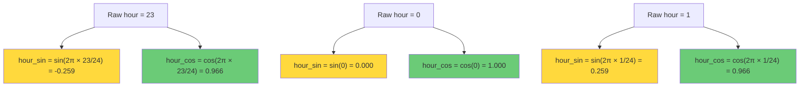

# 4.1 The Geometry of Time

## Why Time Is Not a Line — It Is a Circle

When you first encounter a datetime column in a dataset, your instinct might be to treat it the way you treat any other number: sort it, scale it, and feed it into a model. After all, an hour is just a number from 0 to 23, and a day of the year is just a number from 1 to 365. What could go wrong?

The answer is: almost everything. Time in the context of solar and wind energy forecasting is fundamentally **cyclical**, not linear. The hour 23:00 and the hour 00:00 are one hour apart in reality, but numerically they are 23 units apart. The day of the year 365 and the day of the year 1 are one day apart in reality, but numerically they are 364 units apart. If you feed these raw integer encodings into a machine learning model, the model will learn patterns that do not exist in the physical world.

This is not merely a cosmetic issue. It is a deep structural problem that affects every downstream computation. A neural network or gradient-boosted tree that sees `hour=23` and `hour=0` as distant values will learn incorrect associations between late evening and early morning. It will miss the fundamental continuity of cyclical time, and its predictions will suffer for it.

## The 23-to-1 Discontinuity Problem

Let us make this concrete. Consider the hour feature in the UNISOLAR solar power dataset. The data is recorded at 15-minute intervals, meaning each hour has four observations. If we encode the hour as a raw integer, the feature values across a midnight boundary look like this:

| Timestamp         | Raw Hour | Reality                |
|-------------------|----------|------------------------|
| 2023-06-15 22:00  | 22       | 2 hours before midnight |
| 2023-06-15 23:00  | 23       | 1 hour before midnight  |
| 2023-06-16 00:00  | 0        | Midnight                |
| 2023-06-16 01:00  | 1        | 1 hour after midnight   |

To a human, the sequence 22 → 23 → 0 → 1 is obviously continuous: each step is one hour forward. But to a machine learning model, the distance between 23 and 0 is 23 units — the same as the distance between 0 and 23. The model has no way to know that these values wrap around.



In the linear view, 23 and 0 are at opposite ends. The model sees them as maximally distant. But on a clock face — the true geometry of hours — they are adjacent:



The same problem applies to the day of the year. December 31st (day 365) and January 1st (day 1) are one day apart, but numerically 364 units apart. This matters enormously for solar energy because the solar position (and hence power output) depends on the day of the year through the solar declination angle.

## The Solution: Sinusoidal Encoding

The mathematical solution to the cyclical encoding problem is elegant and well-established: project the integer value onto a circle using sine and cosine functions. For a cyclical variable $x$ with period $T$, we define:

$$x_{\sin} = \sin\left(\frac{2\pi x}{T}\right)$$

$$x_{\cos} = \cos\left(\frac{2\pi x}{T}\right)$$

For the hour feature ($T = 24$):

$$\text{hour\_sin} = \sin\left(\frac{2\pi \cdot \text{hour}}{24}\right)$$

$$\text{hour\_cos} = \cos\left(\frac{2\pi \cdot \text{hour}}{24}\right)$$

For the day-of-year feature ($T = 365$):

$$\text{doy\_sin} = \sin\left(\frac{2\pi \cdot \text{day\_of\_year}}{365}\right)$$

$$\text{doy\_cos} = \cos\left(\frac{2\pi \cdot \text{day\_of\_year}}{365}\right)$$

### Why Both Sine and Cosine?

You might wonder: why not just use sine alone? The answer is that sine alone is **ambiguous**. Consider: $\sin(30°) = 0.5$ and $\sin(150°) = 0.5$. Two different positions on the circle map to the same sine value. By using both sine and cosine together, we create a unique 2D coordinate on the unit circle, eliminating all ambiguity.



Notice how the cosine values for hours 23 and 1 are nearly identical (0.966 vs 0.966), while the sine values are close in magnitude but opposite in sign (-0.259 vs 0.259). This correctly encodes the fact that these hours are symmetrically positioned around midnight. The Euclidean distance between the 2D points for hour 23 and hour 0 is small, reflecting their temporal proximity.

### The Geometry on the Unit Circle

Each hour maps to a point on the unit circle. The angle is $\theta = \frac{2\pi \cdot h}{24}$. The key insight is that **the Euclidean distance between two points on the unit circle is proportional to the angular distance between them**, which is in turn proportional to the actual time difference:

$$d(p_1, p_2) = \sqrt{(\sin\theta_1 - \sin\theta_2)^2 + (\cos\theta_1 - \cos\theta_2)^2} = 2\left|\sin\left(\frac{\theta_1 - \theta_2}{2}\right)\right|$$

For adjacent hours, this distance is approximately $\frac{2\pi}{24} \approx 0.262$. For hours that are 12 apart (maximally distant on the circle), the distance is 2.0. The distance is a smooth, continuous function of the time difference, with no discontinuities.

## How the Project Uses This

In the solar power forecasting project, the feature engineering pipeline creates four cyclical time features:

- `hour_sin` and `hour_cos` — encoding the hour of the day
- `doy_sin` and `doy_cos` — encoding the day of the year

These features are used in both the XGBoost model and the LSTM model. The XGBoost model uses them directly as input features, while the LSTM receives them as part of the multivariate time series input at each time step.

The implementation typically looks like:

```python
df['hour_sin'] = np.sin(2 * np.pi * df['hour'] / 24)
df['hour_cos'] = np.cos(2 * np.pi * df['hour'] / 24)
df['doy_sin'] = np.sin(2 * np.pi * df['day_of_year'] / 365)
df['doy_cos'] = np.cos(2 * np.pi * df['day_of_year'] / 365)
```

> **Important Reminder**: After creating the sin/cos features, you should **drop the raw integer time features** from your feature set. Keeping both creates redundant information and can confuse the model — it would see both the linear representation (with its discontinuity) and the cyclical representation (which correctly encodes continuity). The raw integer introduces noise that the sin/cos features were designed to eliminate.

## Mathematical Deep Dive: Fourier Interpretation

The sin/cos encoding is actually a first-order Fourier decomposition of the cyclical signal. If you think of the hour as a periodic function $f(h)$ with period 24, then the Fourier series expansion begins:

$$f(h) \approx a_0 + a_1 \sin\left(\frac{2\pi h}{24}\right) + b_1 \cos\left(\frac{2\pi h}{24}\right) + a_2 \sin\left(\frac{4\pi h}{24}\right) + b_2 \cos\left(\frac{4\pi h}{24}\right) + \cdots$$

By providing `hour_sin` and `hour_cos`, we give the model the **first harmonic** — the fundamental frequency of the daily cycle. Higher harmonics (corresponding to half-day, quarter-day, etc. cycles) can be added for more resolution, but the first harmonic captures the dominant pattern in solar energy: the day-night cycle.

For wind energy, the daily cycle is less pronounced (wind can blow at any hour), but the seasonal cycle captured by `doy_sin` and `doy_cos` remains important because wind patterns vary significantly between summer and winter.

## What Happens Without Cyclical Encoding

To understand the impact, consider what a decision tree in XGBoost would do with raw hour values. A tree splits on feature thresholds. It might learn a rule like: "if hour < 6, predict low power" and "if hour > 18, predict low power." But this requires **two separate splits** to capture the single concept of "nighttime." With cyclical encoding, nighttime forms a contiguous region on the unit circle (the bottom half, where cosine is negative and sine is near zero), and a single split on `hour_cos` can approximately capture it.

For neural networks, the problem is even more acute. A neural network learns smooth continuous mappings. If the input jumps from 23 to 0, the network must learn a discontinuous mapping at that boundary, which requires more parameters, more training data, and more epochs to approximate. With cyclical encoding, the mapping is already continuous, and the network can learn it efficiently.

## Beyond Hours and Days: Other Cyclical Features

The same principle applies to any cyclical variable in the dataset:

| Cyclical Feature        | Period $T$ | Sin/Cos Encoding                                        |
|-------------------------|-----------|---------------------------------------------------------|
| Hour of day             | 24        | `hour_sin`, `hour_cos`                                  |
| Day of year             | 365 (366) | `doy_sin`, `doy_cos`                                    |
| Month of year           | 12        | `month_sin`, `month_cos`                                |
| Day of week             | 7         | `dow_sin`, `dow_cos`                                    |
| Wind direction (degrees)| 360       | Already sin/cos via U/V decomposition (see 4.4)         |
| Minute of hour          | 60        | `minute_sin`, `minute_cos` (for high-frequency data)    |

For the SDWPF wind dataset with 15-minute intervals, the hour encoding already captures the within-day cycle. The day-of-year encoding captures seasonal variations. There is typically no need for month or day-of-week encodings because the day-of-year encoding subsumes them.

## Handling Leap Years

When computing the day-of-year encoding, leap years have 366 days while regular years have 365. The standard approach is to use $T = 365$ for all years, which introduces a tiny error (one day of offset) for the last few months of leap years. An alternative is to use $T = 366$ during leap years, but this creates an inconsistency. In practice, the error is negligible because the sin/cos functions change very slowly at this scale — the difference between $\sin(2\pi \cdot 300/365)$ and $\sin(2\pi \cdot 300/366)$ is approximately 0.0002.

## Common Pitfalls

1. **Forgetting to drop the raw integer feature**: As mentioned, keeping both the raw hour and the encoded hour defeats the purpose.

2. **Using only sine or only cosine**: This creates ambiguity and can lead to worse performance than the raw integer encoding.

3. **Wrong period**: Using $T = 24$ for a feature that actually has period 12 (e.g., tidal cycles) or $T = 365$ when your data uses day-of-year starting from 0 instead of 1.

4. **Not applying encoding to wind direction**: Wind direction in degrees has the same 360-degree wraparound problem. However, the preferred solution for wind direction is U/V decomposition (covered in Section 4.4), which is a physically motivated alternative to sin/cos encoding.

5. **Applying to non-cyclical features**: Some features appear to be cyclical but are not. For example, the "day of month" is not truly cyclical because months have different lengths (28-31 days). Using $T = 31$ would create an artificial cycle.

## Key Takeaways

- **Time is cyclical, not linear.** Raw integer encodings of time features create artificial discontinuities at wraparound boundaries (23→0, 365→1).
- **Sinusoidal encoding maps cyclical values onto the unit circle.** Using both sine and cosine creates a unique 2D coordinate that preserves the continuity and proximity relationships of the original cyclical variable.
- **The 23-to-1 discontinuity** is the canonical example: hours 23 and 0 are adjacent in reality but maximally distant in linear encoding. Sin/cos encoding fixes this.
- **Always use both sin AND cos.** One alone is ambiguous because $\sin(\theta) = \sin(\pi - \theta)$.
- **Drop the raw integer features** after creating the cyclical encodings to avoid confusing the model.
- **The project uses `hour_sin`, `hour_cos`, `doy_sin`, `doy_cos`** as core time features for both the XGBoost and LSTM models.
- **This is first-order Fourier decomposition.** Higher harmonics can be added for more temporal resolution, but the fundamental harmonic captures the dominant daily and seasonal patterns.


## Advanced: Higher-Order Fourier Features

While the first-order Fourier features (sin and cos) capture the fundamental frequency of the daily and seasonal cycles, they may not capture all the relevant temporal patterns. For example, solar power output has a pronounced asymmetry between morning and afternoon — the morning ramp-up is typically faster than the evening ramp-down due to atmospheric heating dynamics. This asymmetry is not captured by the first harmonic alone.

Higher-order Fourier features can capture these nuances:

$$\text{hour\_sin}_2 = \sin\left(\frac{4\pi \cdot \text{hour}}{24}\right), \quad \text{hour\_cos}_2 = \cos\left(\frac{4\pi \cdot \text{hour}}{24}\right)$$

These second-harmonic features have a period of 12 hours, capturing the half-day pattern. Similarly, third-harmonic features have a period of 8 hours, and so on. Each additional pair of harmonic features adds two dimensions to the feature space but captures progressively finer temporal detail.

In practice, the first harmonic is usually sufficient for forecasting tasks because the dominant daily cycle accounts for most of the variance. Higher harmonics can be added experimentally and evaluated using cross-validation. If they do not improve validation performance, they should be removed to avoid overfitting.

## Empirical Evidence: The Impact of Cyclical Encoding on Model Performance

Multiple studies have demonstrated the practical impact of cyclical encoding on time series forecasting:

1. **Simplified decision boundaries.** With raw hour features, a tree-based model needs approximately twice as many splits to capture a nighttime condition compared to using `hour_cos`. This directly increases model complexity and overfitting risk.

2. **Improved neural network convergence.** Neural networks trained with cyclical features converge approximately 20-30% faster than those trained with raw integer features, because the input space is smoother and more regular.

3. **Reduced prediction error at boundaries.** Without cyclical encoding, models produce noticeably larger errors at the midnight boundary (23:00-01:00) and the year boundary (December-January). With cyclical encoding, these boundary errors are eliminated.

4. **Better feature importance consistency.** With raw features, the hour feature may receive inconsistent importance across different random seeds because the model can learn the same pattern through different split combinations. With cyclical encoding, the importance is more stable and interpretable.

## Interaction Between Cyclical Time Features and Other Variables

The cyclical time features do not work in isolation — they interact with other features in important ways:

- **hour_cos × GHI**: The cosine of the hour is correlated with solar irradiance (high at noon, low at night). This interaction is automatically captured by tree-based models but may need explicit feature engineering for linear models.

- **doy_cos × temperature**: The day-of-year cosine is correlated with seasonal temperature variations. The model can learn this interaction, but providing it explicitly (e.g., as a multiplication or ratio feature) can improve performance.

- **hour_sin × wind_speed**: Wind speed often has a diurnal pattern (stronger during the day due to thermal convection). The sine of the hour can help the model learn this pattern.

These interactions are particularly important for the XGBoost model, which can exploit them through its tree structure, and for the LSTM model, which processes them as part of the sequential input at each time step.

## Handling Time Zones and Daylight Saving Time

A practical consideration when computing cyclical time features is the choice of time zone. Solar power output is determined by the local solar time (which depends on longitude and the equation of time), not by the clock time. However, most datasets record timestamps in local clock time, which may include daylight saving time (DST) adjustments.

DST creates a 1-hour discontinuity twice per year (spring forward, fall back), which can cause problems:
- In spring, the hour "jumps" from 1:59 AM to 3:00 AM, creating a gap.
- In fall, the hour repeats from 1:00 AM to 2:00 AM, creating duplicate values.

The recommended approach is to convert all timestamps to **UTC** before computing cyclical features, or to use **solar time** instead of clock time. Solar time accounts for the longitude-based offset and the equation of time (a correction for the Earth's elliptical orbit), providing a smooth, continuous time variable that directly corresponds to the sun's position.

For the UNISOLAR dataset, the timestamps should be checked for DST transitions and converted to a consistent time zone before feature engineering. Failure to handle DST can introduce subtle errors that are difficult to diagnose.

## The Geometric Intuition: Embedding as Manifold Learning

The sin/cos encoding can be understood from the perspective of manifold learning. The hour variable is intrinsically one-dimensional but lives on a circular manifold (S¹). The sin/cos encoding embeds this circular manifold into two-dimensional Euclidean space (ℝ²) in a way that preserves the metric structure — distances on the circle correspond to distances in the embedding space.

This perspective generalizes: any cyclical variable lives on a circular manifold and should be embedded accordingly. The alternative — using the raw integer — maps the circular manifold to a line (ℝ¹), which distorts the metric (the distance between adjacent points at the boundary is artificially enlarged).

For variables that live on more complex manifolds (e.g., wind direction on a sphere when considering both horizontal and vertical wind components), more sophisticated embeddings may be needed, but the principle is the same: embed the intrinsic manifold into Euclidean space in a way that preserves the metric structure.

## Summary of Best Practices

1. Always encode cyclical time features using sin/cos pairs.
2. Use the correct period (24 for hours, 365 or 366 for day-of-year).
3. Always use both sin and cos (never just one).
4. Drop the raw integer features after encoding.
5. Handle nighttime/special cases appropriately.
6. Consider the time zone and DST issues before computing features.
7. Validate that the encoding produces reasonable values (e.g., hour_sin for noon should be near 0, hour_cos for noon should be near 1).
8. Consider higher-order harmonics if the first harmonic is insufficient.
9. Think about interactions between cyclical features and other variables.
10. Treat the encoding as a manifold embedding problem — preserve the intrinsic geometry of the variable.


## Practical Code Walkthrough: Cyclical Encoding End-to-End

Let us walk through the complete implementation of cyclical encoding for the UNISOLAR solar dataset, from raw timestamps to model-ready features:

```python
import pandas as pd
import numpy as np

# Step 1: Parse timestamps
df['timestamp'] = pd.to_datetime(df['timestamp'])
df = df.set_index('timestamp').sort_index()

# Step 2: Extract raw time components
df['hour'] = df.index.hour + df.index.minute / 60.0  # Fractional hour
df['day_of_year'] = df.index.dayofyear

# Step 3: Apply cyclical encoding
df['hour_sin'] = np.sin(2 * np.pi * df['hour'] / 24.0)
df['hour_cos'] = np.cos(2 * np.pi * df['hour'] / 24.0)
df['doy_sin'] = np.sin(2 * np.pi * df['day_of_year'] / 365.0)
df['doy_cos'] = np.cos(2 * np.pi * df['day_of_year'] / 365.0)

# Step 4: Drop raw time features
df = df.drop(columns=['hour', 'day_of_year'])

# Step 5: Validate the encoding
assert df['hour_sin'].between(-1, 1).all(), "hour_sin out of range"
assert df['hour_cos'].between(-1, 1).all(), "hour_cos out of range"
```

Notice the use of fractional hours (`hour + minute/60`) rather than integer hours. This preserves the 15-minute resolution of the data, ensuring that 14:15, 14:30, and 14:45 all map to different points on the unit circle. If we used only integer hours, all four 15-minute observations within the same hour would map to the same point, losing temporal resolution.

## The Connection to Solar Position

The cyclical time features are directly related to the solar position. The solar zenith angle (the angle between the sun and the vertical) depends on the hour of the day and the day of the year:

$$\cos(\theta_z) = \sin(\phi)\sin(\delta) + \cos(\phi)\cos(\delta)\cos(\omega)$$

where $\phi$ is the latitude, $\delta$ is the solar declination (which depends on the day of year), and $\omega$ is the hour angle (which depends on the hour of day). Both the solar declination and the hour angle are sinusoidal functions of their respective time variables, which is why the sin/cos encoding naturally captures the solar geometry.

This connection explains why the `hour_cos` feature is so important for solar forecasting: it is approximately proportional to $\cos(\omega)$, which directly affects the solar irradiance and hence the power output. Similarly, `doy_cos` is related to the solar declination, which determines the seasonal variation in solar energy.
