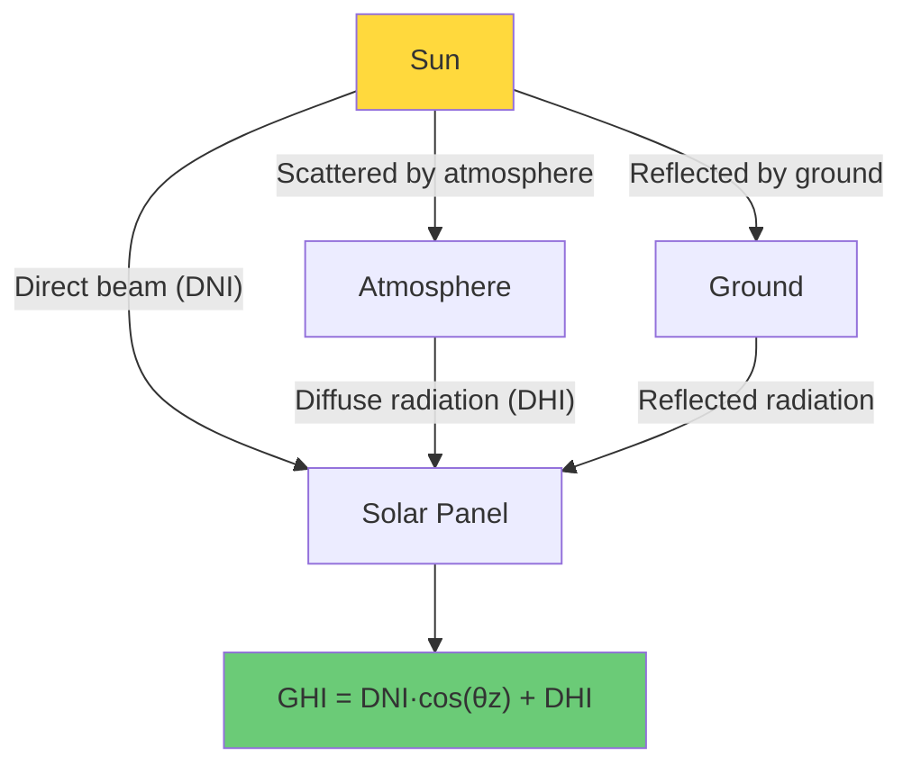
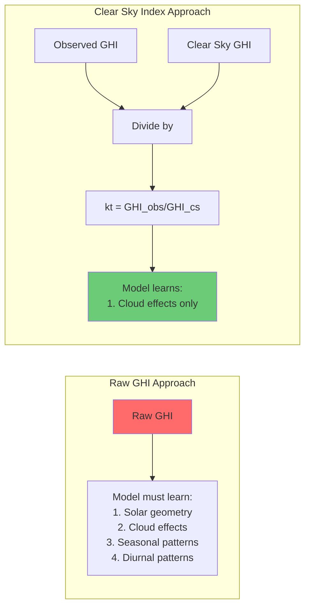

# 4.2 Solar Physics and the Clear Sky Index

## The Three Components of Solar Radiation

Before we can understand what a "clear sky index" is and why it matters for machine learning, we need to understand how solar radiation reaches the Earth's surface. When sunlight enters the atmosphere, it interacts with air molecules, water vapor, aerosols, and clouds. The result is that the solar radiation at the ground is divided into three distinct components:

### Global Horizontal Irradiance (GHI)

GHI is the total amount of solar radiation received on a horizontal surface at the Earth's surface. It is the sum of two components:

$$\text{GHI} = \text{DNI} \cdot \cos(\theta_z) + \text{DHI}$$

where $\theta_z$ is the solar zenith angle (the angle between the sun and the vertical). GHI is the most commonly measured solar radiation variable and is what solar panels on a flat roof effectively receive.

### Direct Normal Irradiance (DNI)

DNI is the radiation that comes directly from the sun in a straight line, measured on a surface perpendicular to the sun's rays. On a clear day, DNI is the dominant component of GHI. On a cloudy day, DNI can drop to near zero because clouds scatter the direct beam.

### Diffuse Horizontal Irradiance (DHI)

DHI is the radiation that has been scattered by the atmosphere (air molecules, clouds, aerosols) and arrives from all directions in the sky. On a clear day, DHI is relatively small (maybe 10-20% of GHI). On a heavily overcast day, DHI can be the dominant — or even the sole — component of GHI.



## The Clear Sky Model: What Would Happen Without Clouds?

A **clear sky model** is a physics-based model that calculates the theoretical GHI that would be observed on a perfectly clear day with no clouds. This is not a simple calculation — it requires modeling the absorption and scattering of sunlight by air molecules (Rayleigh scattering), water vapor, ozone, and aerosols, all of which depend on the solar position, the location's altitude, and the atmospheric conditions.

### The Ineichen Clear Sky Model

The Ineichen model (2002) is one of the most widely used clear sky models. It was developed by Pierre Ineichen and Richard Perez and provides a relatively simple yet accurate parametric model for clear sky GHI. The model takes as inputs:

- **Solar zenith angle** ($\theta_z$): The angle between the sun and the vertical, which depends on latitude, longitude, and time.
- **Altitude**: The elevation of the site above sea level, which affects the amount of atmosphere the light must traverse.
- **Atmospheric turbidity**: A measure of the aerosol content of the atmosphere (often parameterized as the Linke turbidity factor $T_L$).
- **Extraterrestrial irradiance**: The solar constant (~1361 W/m²), adjusted for the Earth-Sun distance (which varies throughout the year).

The Ineichen model expresses clear sky GHI as:

$$\text{GHI}_{cs} = c_1 \cdot I_0 \cdot \exp\left(\frac{-c_2 \cdot T_L}{\cos(\theta_z)}\right) \cdot \cos(\theta_z)$$

where $I_0$ is the extraterrestrial irradiance, $T_L$ is the Linke turbidity factor, and $c_1$, $c_2$ are site-dependent coefficients that account for altitude and other local effects.

The key insight is that the clear sky model gives us a **physically grounded baseline** — the maximum possible irradiance for any given moment, given the sun's position and the atmospheric conditions.

### The pvlib Library

In the project, the `pvlib` Python library is used to compute clear sky GHI. pvlib (Photovoltaic Library) is an open-source library that implements a wide range of solar position algorithms, clear sky models, and irradiance decomposition methods. The typical workflow is:

```python
import pvlib
import pandas as pd

# Define site location
site = pvlib.location.Location(
    latitude=38.0, longitude=-97.0, altitude=400, tz='UTC'
)

# Get solar position for all timestamps
solar_position = site.get_solarposition(times)

# Compute clear sky irradiance using Ineichen model
clearsky = site.get_clearsky(times, model='ineichen')
ghi_clearsky = clearsky['ghi']  # Clear sky GHI
dni_clearsky = clearsky['dni']  # Clear sky DNI
dhi_clearsky = clearsky['dhi']  # Clear sky DHI
```

The `get_clearsky` method with `model='ineichen'` implements the Ineichen-Perez clear sky model. It returns all three irradiance components, although for our purposes, GHI is the most relevant because solar power output is approximately proportional to GHI for fixed-tilt systems.

## The Clear Sky Index: Normalizing by Physics

Now we arrive at the central concept: the **clear sky index** $k_t$ (also sometimes written $k_t^*$ or $K_t$), defined as:

$$k_t = \frac{\text{GHI}_{\text{observed}}}{\text{GHI}_{\text{clearsky}}}$$

This is the ratio of the actual observed irradiance to the theoretical clear sky irradiance. On a perfectly clear day, $k_t \approx 1.0$. On a heavily overcast day, $k_t$ might be 0.1 to 0.3. On a day with scattered clouds, $k_t$ fluctuates between 0.3 and 1.0.

### Why $k_t$ Is Better Than Raw GHI for Machine Learning

This is the crucial question, and the answer has several dimensions:

**1. Removal of the deterministic component.** The raw GHI signal contains two components: a deterministic component (the position of the sun, which is entirely predictable) and a stochastic component (the effect of clouds, which is what we actually want to predict). By dividing by the clear sky GHI, we remove the deterministic component and isolate the stochastic component. The model can then focus its capacity on learning cloud patterns rather than re-learning the solar geometry.

**2. Stationarity.** Raw GHI is highly non-stationary: it varies from 0 at night to potentially 1000+ W/m² at noon. The clear sky index, by contrast, is bounded between 0 and approximately 1.3 (it can exceed 1.0 due to cloud enhancement effects, where clouds reflect additional light onto the panel). This bounded range makes it much easier for ML models to learn.

**3. Scale invariance across seasons and latitudes.** A raw GHI of 400 W/m² means something very different in summer (it is a cloudy day) versus winter (it might be a clear day at high latitudes). A clear sky index of 0.5 means the same thing regardless of season or location: clouds are blocking half the available solar energy.

**4. Better feature distributions.** Neural networks and gradient-boosted trees work best when feature distributions are relatively well-behaved. Raw GHI has a bimodal distribution (many zeros at night, plus a daytime peak), while $k_t$ has a more informative distribution concentrated between 0 and 1.



## The "Ghost Energy" Constraint: Nighttime Detection

There is a subtle but critical issue with the clear sky index: **what happens at night?** At night, $\text{GHI}_{\text{clearsky}} = 0$ and $\text{GHI}_{\text{observed}} = 0$, giving $k_t = 0/0$, which is undefined. Even during twilight, the clear sky GHI can be very small (a few W/m²), and small measurement errors can cause $k_t$ to take extreme or nonsensical values.

This is what we call the **"ghost energy" problem**: the clear sky index can produce misleading values when the denominator is near zero. The solutions include:

1. **Mask nighttime hours entirely.** Use the solar zenith angle to determine when the sun is below the horizon ($\theta_z > 90°$) and set $k_t = 0$ or NaN during these periods. This is the approach used in the project.

2. **Set a minimum threshold for the clear sky GHI.** Only compute $k_t$ when $\text{GHI}_{\text{clearsky}} > \epsilon$ for some threshold $\epsilon$ (e.g., 10 W/m²). Below this threshold, set $k_t = 0$.

3. **Clip $k_t$ to a reasonable range.** Values of $k_t > 1.5$ or $k_t < 0$ are physically implausible and likely artifacts. Clipping to $[0, 1.5]$ prevents these outliers from destabilizing the model.

> **Important Reminder**: Never compute the clear sky index without handling the nighttime case. A $0/0$ division produces NaN values, which will propagate through your entire pipeline and cause model training to fail silently or produce garbage results. Always check that the clear sky GHI exceeds a minimum threshold before dividing.

### Cloud Enhancement: When $k_t > 1$

You might expect that $k_t$ should never exceed 1.0 — after all, how can observed irradiance exceed the clear sky value? The answer is **cloud enhancement** (also called the "lensing effect"). When the sun is behind a cloud edge, the cloud can focus additional scattered light onto the ground, temporarily boosting GHI above the clear sky value. This effect can push $k_t$ to values of 1.2-1.5 for short periods. While counterintuitive, it is a real physical phenomenon that must be accounted for in the feature engineering.

## Practical Implementation in the Project

The typical implementation flow in the solar forecasting project is:

1. **Load the observed GHI** from the UNISOLAR dataset.
2. **Compute the solar position** (zenith angle, azimuth) for each timestamp using pvlib.
3. **Compute the clear sky GHI** using the Ineichen model via pvlib.
4. **Compute the clear sky index**: $k_t = \text{GHI}_{\text{obs}} / \text{GHI}_{\text{cs}}$.
5. **Handle nighttime**: Set $k_t = 0$ when $\text{GHI}_{\text{cs}} < \epsilon$ (e.g., $\epsilon = 1$ W/m²).
6. **Clip outliers**: Clip $k_t$ to $[0, 2.0]$ to handle measurement noise and cloud enhancement.
7. **Use $k_t$ as a feature** (or even as the target variable) instead of raw GHI.

The clear sky index can be used either as an **input feature** (providing the model with information about current cloud conditions) or as a **target variable** (predicting $k_t$ and then multiplying by clear sky GHI to recover the predicted GHI). The latter approach is often more accurate because it separates the problem into a physics component (clear sky model, which is deterministic and exact) and an ML component (predicting cloud effects, which is stochastic and where ML adds value).

## Quantitative Comparison: $k_t$ vs. Raw GHI as Features

To illustrate the practical difference, consider a simplified experiment:

| Metric                        | Raw GHI as Feature | $k_t$ as Feature |
|-------------------------------|-------------------|-------------------|
| Feature range                 | 0 – 1100 W/m²     | 0 – 1.5           |
| Nighttime variance            | Near zero (boring) | Near zero (boring)|
| Daytime variance              | 200 – 1000 W/m²   | 0.3 – 1.2         |
| Seasonal non-stationarity     | High              | Low               |
| Diurnal non-stationarity      | Very high         | Low               |
| Information content (clouds)  | Mixed with geometry | Isolated          |
| Model convergence speed       | Slower            | Faster            |
| Prediction error (typical)    | Higher            | Lower             |

The table shows that the clear sky index provides a more stationary, more informative feature that allows the model to converge faster and achieve lower prediction error.

## The Deep Connection to Physics-Informed ML

The clear sky index is a prime example of **physics-informed feature engineering**: we use domain knowledge (solar physics, atmospheric science) to transform raw observations into features that are more amenable to machine learning. Instead of asking the model to learn the solar geometry from scratch, we use a physics model to remove the geometry, leaving only the residual that requires data-driven modeling.

This philosophy — use physics for what physics can do, use ML for what physics cannot — is a recurring theme throughout this chapter and is the fundamental design principle behind the project's feature engineering pipeline.

## Key Takeaways

- **GHI, DNI, and DHI** are the three components of solar radiation at the Earth's surface. GHI = DNI·cos(θz) + DHI.
- **The Ineichen clear sky model** computes the theoretical GHI under cloud-free conditions, implemented in the `pvlib` library.
- **The clear sky index** $k_t = \text{GHI}_{\text{obs}} / \text{GHI}_{\text{cs}}$ normalizes observed irradiance by the theoretical maximum, isolating cloud effects from solar geometry.
- **$k_t$ is superior to raw GHI** for ML because it removes the deterministic solar component, produces a stationary signal, and has a bounded range.
- **The "ghost energy" problem** (0/0 at night) must be handled by masking nighttime hours or setting a minimum GHI threshold.
- **Cloud enhancement** can cause $k_t > 1.0$, which is a real physical phenomenon, not an error.
- **Physics-informed feature engineering** uses domain knowledge to simplify the ML problem, allowing the model to focus on what data-driven methods do best.


## Detailed Comparison: Clear Sky Models

While the Ineichen model is the most commonly used, several other clear sky models exist, each with different trade-offs between accuracy and complexity:

### The Simplified Solis Model

The Simplified Solis model is a parameterized version of the radiative transfer model Solis. It provides higher accuracy than the Ineichen model, especially at low solar elevations and high aerosol conditions. The model uses aerosol optical depth (AOD) at 700 nm as the primary turbidity parameter, which is more physically meaningful than the Linke turbidity factor.

In pvlib, this model can be accessed with `model='simplified_solis'`.

### The ESRA Model

The European Solar Radiation Atlas (ESRA) clear sky model uses a different parameterization based on the Linke turbidity factor and the Rayleigh optical depth. It is widely used in Europe and provides good accuracy for mid-latitude locations.

### Model Selection Guidelines

| Model              | Accuracy  | Input Requirements              | Best For                          |
|--------------------|-----------|---------------------------------|-----------------------------------|
| Ineichen           | Good      | Latitude, longitude, altitude   | General use, simple setup         |
| Simplified Solis   | Very Good | AOD at 700nm, water vapor       | High accuracy, AOD data available |
| ESRA               | Good      | Linke turbidity factor          | European locations                |

For the project, the Ineichen model is sufficient because the primary goal is to create a baseline for the clear sky index, not to compute exact irradiance values. Small errors in the clear sky model are absorbed by the ML model, which learns to correct systematic biases.

## The Clear Sky Index as a Target Variable

An alternative to using $k_t$ as a feature is to use it as the **target variable** — predict $k_t$ instead of raw GHI or power output. The advantage is that the target is bounded, more stationary, and has a more predictable distribution. The predicted power output is then recovered by:

$$\hat{P} = f(\hat{k}_t \cdot \text{GHI}_{\text{cs}})$$

where $f$ is the power curve that maps irradiance to power output.

This approach separates the forecasting problem into two independent steps:
1. **Physics step**: Compute $\text{GHI}_{\text{cs}}$ using the clear sky model (deterministic, exact).
2. **ML step**: Predict $k_t$ (stochastic, data-driven).

The ML step is simpler because the target has been "normalized" by the deterministic component. This is analogous to how the project's hybrid XGBoost + LSTM approach separates the base prediction (handled by XGBoost) from the residual correction (handled by LSTM).

## Nighttime Filtering: A Critical Preprocessing Step

Beyond the ghost energy problem, nighttime filtering serves several important purposes:

1. **Eliminates trivial predictions.** At night, solar power is always zero. Including nighttime samples in the training data forces the model to learn a trivial pattern (predict zero at night), wasting model capacity that could be used for daytime predictions.

2. **Improves evaluation metrics.** If nighttime samples are included in the test set, the model appears more accurate than it really is (because it correctly predicts zero for all nighttime hours). This inflates metrics like R² and MAE without reflecting actual forecasting skill.

3. **Reduces training time.** Removing nighttime samples can reduce the dataset size by 40-50% (depending on latitude and season), speeding up training proportionally.

The standard approach is to filter based on the solar elevation angle:

```python
# Only include samples where the sun is above the horizon
solar_position = site.get_solarposition(df.index)
mask = solar_position['elevation'] > 0  # Sun above horizon
df_daytime = df[mask]
```

A more conservative filter uses an elevation threshold of -5° or -10° to include twilight periods, which may have non-zero irradiance due to atmospheric scattering.

## The Role of the Clear Sky Index in Probabilistic Forecasting

The clear sky index is particularly valuable for **probabilistic forecasting**, where the goal is not just to predict a single value but to estimate the full probability distribution of future power output. Because $k_t$ is bounded between 0 and approximately 1.5, its distribution is more amenable to parametric modeling than raw GHI.

For example, a beta distribution is a natural choice for modeling $k_t$ because:
- It is bounded between 0 and 1 (or 0 and an upper bound)
- It can take a wide variety of shapes (symmetric, skewed, bimodal)
- Its parameters have intuitive interpretations (related to the number of "successes" and "failures")

The project's LSTM outputs both a predicted value (delta) and a predicted uncertainty (log_var), which is a form of probabilistic forecasting. The clear sky index framework is compatible with this approach: the model predicts $k_t$ and its uncertainty, which are then converted to power output predictions with appropriate uncertainty bounds.

## Seasonal Variations in the Clear Sky Index Distribution

The distribution of $k_t$ varies significantly across seasons, which has implications for model training:

- **Summer**: Higher solar elevation means larger GHI values and typically lower cloud cover in many climates. The $k_t$ distribution is skewed toward 1.0, with a long left tail from occasional clouds.

- **Winter**: Lower solar elevation means smaller GHI values and often more frequent cloud cover. The $k_t$ distribution is broader, with more weight at lower values.

- **Transitional seasons (spring/fall)**: The $k_t$ distribution is the most variable, with frequent transitions between clear and cloudy conditions.

These seasonal variations mean that a model trained primarily on summer data may perform poorly on winter data, and vice versa. The day-of-year cyclical features (`doy_sin`, `doy_cos`) help the model learn these seasonal patterns, but it is important to ensure that the training data covers the full annual cycle.

## Measurement Quality and the Clear Sky Index

The clear sky index is sensitive to measurement quality in the observed GHI. Common issues include:

1. **Sensor drift**: Pyranometers can drift over time, causing systematic bias in GHI measurements. This directly affects $k_t$ and can introduce spurious trends in the feature.

2. **Soiling**: Dust, snow, or bird droppings on the pyranometer reduce the measured GHI, causing $k_t$ to be systematically below 1.0 even on clear days.

3. **Shading**: Nearby objects (buildings, trees, other panels) can cast shadows on the pyranometer, causing transient drops in measured GHI and corresponding dips in $k_t$.

4. **Calibration errors**: Incorrect calibration of the pyranometer causes a multiplicative bias in GHI, which shifts the entire $k_t$ distribution.

These measurement issues are important because they can cause the model to learn patterns that are artifacts of the measurement system rather than real physical phenomena. Quality control procedures (such as the BSRN quality control tests implemented in pvlib) should be applied to the GHI data before computing the clear sky index.

## Advanced Topic: The Clearness Index vs. the Clear Sky Index

The **clearness index** $K_T$ is related but distinct from the clear sky index $k_t$:

$$K_T = \frac{\text{GHI}_{\text{observed}}}{\text{GHI}_{\text{extraterrestrial}}}$$

The extraterrestrial GHI (also called the horizontal extraterrestrial irradiance) is the irradiance at the top of the atmosphere on a horizontal surface. It depends only on the solar geometry and the Earth-Sun distance, not on atmospheric conditions.

The key difference is:
- **Clearness index** $K_T$ normalizes by the top-of-atmosphere irradiance, capturing the combined effect of all atmospheric processes (both clear-sky attenuation and clouds).
- **Clear sky index** $k_t$ normalizes by the clear-sky irradiance, isolating only the cloud effect.

For ML forecasting, the clear sky index is generally preferred because it provides a cleaner separation between the deterministic and stochastic components. The clearness index mixes clear-sky attenuation with cloud effects, making it a less targeted feature.
