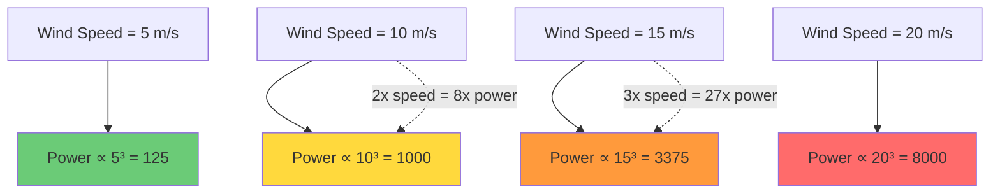
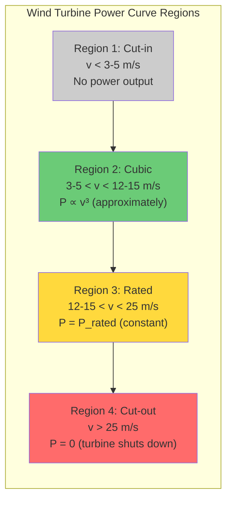

# 4.3 Fluid Dynamics in Wind Power

## The Fundamental Law: Wind Power and the Cube of Velocity

The single most important equation in wind energy is the **cubic power law**. The kinetic power available in the wind is:

$$P_{\text{wind}} = \frac{1}{2} \rho A v^3$$

where:
- $\rho$ is the air density (kg/m³)
- $A$ is the cross-sectional area perpendicular to the wind flow (m²)
- $v$ is the wind speed (m/s)

This equation tells us that the power in the wind is **proportional to the cube of the wind speed**. This is not a linear relationship, not a quadratic relationship — it is cubic. A doubling of wind speed results in an **eight-fold** increase in available power. A 10% increase in wind speed results in a 33% increase in power.



### Derivation from First Principles

The cubic relationship comes from the kinetic energy of moving air. Consider a cylinder of air moving at velocity $v$ through a cross-sectional area $A$ in time $\Delta t$:

1. The **volume** of air passing through the area in time $\Delta t$ is: $V = A \cdot v \cdot \Delta t$
2. The **mass** of this air is: $m = \rho \cdot V = \rho \cdot A \cdot v \cdot \Delta t$
3. The **kinetic energy** of this air is: $E = \frac{1}{2} m v^2 = \frac{1}{2} \rho A v \Delta t \cdot v^2 = \frac{1}{2} \rho A v^3 \Delta t$
4. The **power** (energy per unit time) is: $P = \frac{E}{\Delta t} = \frac{1}{2} \rho A v^3$

The cubic dependence arises because the mass flow rate itself depends linearly on velocity (faster wind = more mass passing through per second), and the kinetic energy per unit mass depends on $v^2$. The product gives $v^3$.

## The `wind_speed_cubed` Feature in the Code

Given the cubic power law, it is natural to include $v^3$ as a feature in a wind power forecasting model. The project computes:

```python
df['wind_speed_cubed'] = df['wind_speed'] ** 3
```

This feature directly encodes the physics: the model does not need to learn the cubic relationship from data — we provide it explicitly. This is another example of physics-informed feature engineering.

### Why Not Let the Model Learn It?

You might argue: "Neural networks are universal function approximators — they can learn any nonlinear relationship, including the cubic law. Why hard-code it?" There are several reasons:

1. **Sample efficiency.** Learning a cubic relationship from data requires the network to discover the nonlinearity from scratch, which requires many training examples covering the full range of wind speeds. By providing $v^3$ directly, we reduce the learning burden.

2. **Extrapolation.** If the training data has wind speeds up to 15 m/s but the test data includes 18 m/s, a model that has learned an approximate cubic relationship may extrapolate poorly. With $v^3$ as an explicit feature, the extrapolation is guaranteed to be physically correct.

3. **Feature importance.** In XGBoost, the $v^3$ feature will receive high importance, confirming that the model is using the correct physics. Without it, the model might distribute importance across several features in a way that is harder to interpret.

4. **Training stability.** The cubic relationship creates very large values at high wind speeds. If the model must learn this from scratch, the loss landscape becomes steep and training can be unstable.

### Clipping `wind_cubed` to 100,000

The project clips the `wind_speed_cubed` feature to a maximum of 100,000:

```python
df['wind_speed_cubed'] = df['wind_speed'] ** 3
df['wind_speed_cubed'] = df['wind_speed_cubed'].clip(upper=100000)
```

Why? Because $v^3$ grows extremely fast. At wind speeds of 30 m/s, $v^3 = 27{,}000$. At 40 m/s, $v^3 = 64{,}000$. At 50 m/s, $v^3 = 125{,}000$. But wind turbines shut down at around 25 m/s (the cut-out speed), so the actual power output at very high wind speeds is zero, not $v^3$. The cubic feature would mislead the model at these extreme speeds. Clipping prevents the feature from taking values that correspond to physically impossible power outputs.

## Air Density Effects

The cubic power law includes air density $\rho$, which is not constant. It depends on:

- **Temperature**: $\rho \propto 1/T$ (ideal gas law)
- **Pressure**: $\rho \propto P$ (ideal gas law)
- **Humidity**: Moist air is less dense than dry air (water vapor molecules are lighter than $N_2$ and $O_2$)
- **Altitude**: Higher altitude = lower pressure = lower density

The standard air density at sea level and 15°C is approximately $\rho = 1.225$ kg/m³. At an altitude of 2000m, it drops to about 1.0 kg/m³. This means the same wind speed produces about 18% less power at 2000m than at sea level.

For the SDWPF dataset, if temperature and pressure data are available, a more accurate power estimate can be computed using:

$$\rho = \frac{P}{R_{\text{specific}} \cdot T}$$

where $R_{\text{specific}} = 287.05$ J/(kg·K) is the specific gas constant for dry air, $P$ is atmospheric pressure in Pascals, and $T$ is temperature in Kelvin.

In the project, if air density data is available, a more physically accurate feature would be:

$$\text{wind\_power\_proxy} = \frac{1}{2} \rho v^3$$

However, in practice, the simple `wind_speed_cubed` feature often suffices because $\rho$ varies much less than $v^3$, and the model can learn to account for density variations through other features (temperature, pressure) without explicit density calculation.

## The Wind Turbine Power Curve

A wind turbine does not convert all the available wind power into electricity. The actual power output follows a characteristic **power curve** that has four distinct regions:



### Region 1: Cut-in (v < 3-5 m/s)

Below the **cut-in speed** (typically 3-5 m/s), there is not enough wind to overcome the turbine's internal friction and generator losses. The turbine produces no power. This is important for forecasting because the relationship between wind speed and power is flat (zero) in this region, regardless of the exact speed.

### Region 2: Cubic Region (3-5 m/s < v < 12-15 m/s)

In this region, the power output increases approximately as $v^3$ (modified by the power coefficient $C_p$, which we discuss in Section 4.6). This is the most important region for forecasting because most turbines operate in this region for a significant fraction of the time.

### Region 3: Rated Power (12-15 m/s < v < 25 m/s)

Above the **rated wind speed** (typically 12-15 m/s), the turbine's control system (pitch control) limits the power output to the **rated power** $P_{\text{rated}}$ to protect the generator and mechanical components. The power output is constant regardless of how fast the wind blows. This creates a plateau in the power curve.

### Region 4: Cut-out (v > 25 m/s)

Above the **cut-out speed** (typically 25 m/s), the turbine shuts down entirely to prevent structural damage. The power output drops abruptly to zero. This creates a sharp discontinuity in the power curve that is very difficult for ML models to learn without explicit encoding.

## Implications for Feature Engineering

The power curve's four regions have direct implications for how we engineer features:

1. **In Region 1**, `wind_speed_cubed` is near zero, which correctly indicates no power. No special handling needed.

2. **In Region 2**, `wind_speed_cubed` is the most informative feature, directly encoding the physics.

3. **In Region 3**, `wind_speed_cubed` continues to increase, but the actual power is constant. The model must learn to "ignore" the cubic feature in this range, which is possible but wasteful. An alternative is to add a `is_rated` binary feature that indicates when the turbine is in the rated power region.

4. **In Region 4**, `wind_speed_cubed` is very large, but the actual power is zero. The clipping at 100,000 partially addresses this, but a more explicit approach would be to add an `is_cutout` binary feature.

## The Relationship Between Wind Speed and Power Output

The actual power output of a wind turbine is:

$$P_{\text{turbine}} = \frac{1}{2} \rho A v^3 C_p$$

where $C_p$ is the **power coefficient** — the fraction of the available wind power that the turbine extracts. The power coefficient is not constant; it depends on the tip speed ratio (the ratio of the blade tip speed to the wind speed) and the blade pitch angle. We discuss the theoretical maximum of $C_p$ (the Betz limit) in detail in Section 4.6.

For feature engineering purposes, the key takeaway is that the relationship between wind speed and power output is **highly nonlinear** and **piecewise** (different relationships in different speed ranges). By providing physics-informed features like `wind_speed_cubed`, we give the model a strong prior about this relationship, allowing it to focus its capacity on the deviations from the idealized physics (e.g., turbulence, wake effects, yaw misalignment).

## Turbulence Intensity and Wind Variability

Another important fluid dynamics concept is **turbulence intensity** (TI), defined as:

$$\text{TI} = \frac{\sigma_v}{\bar{v}}$$

where $\sigma_v$ is the standard deviation of wind speed over a short period (typically 10 minutes) and $\bar{v}$ is the mean wind speed over the same period. TI is a dimensionless measure of how variable the wind is. High turbulence intensity (TI > 0.2) means the wind is gusty and unpredictable, which reduces turbine efficiency and increases mechanical stress.

In the project, if high-frequency wind speed data is available, turbulence intensity can be computed as a rolling feature:

```python
df['turbulence_intensity'] = df['wind_speed'].rolling(96).std() / df['wind_speed'].rolling(96).mean()
```

This feature captures the "gustiness" of the wind, which is correlated with lower power output and higher forecast uncertainty.

## Wind Shear and the Power Law Profile

Wind speed increases with height above ground due to the **wind shear** effect. The relationship is approximately:

$$v(h) = v_{\text{ref}} \left(\frac{h}{h_{\text{ref}}}\right)^{\alpha}$$

where $\alpha$ is the wind shear exponent (typically 0.1-0.4, depending on terrain). This means that if you measure wind speed at 10m height and the turbine hub is at 80m, the wind speed at hub height is:

$$v(80) = v(10) \left(\frac{80}{10}\right)^{0.2} \approx 1.52 \cdot v(10)$$

This correction can significantly affect power estimates because of the cubic relationship: a 52% increase in wind speed results in a 3.5× increase in power. If the SDWPF or NREL data provides wind speed at a different height than the turbine hub height, this correction must be applied.

> **Important Reminder**: Always check the height at which wind speed is measured in your dataset. A wind speed of 5 m/s at 10m height corresponds to approximately 7.6 m/s at 80m height, which produces roughly 3.5 times more power. Failing to account for wind shear can introduce systematic bias in your forecasts.

## Key Takeaways

- **Wind power is proportional to $v^3$** (the cubic power law), derived from the kinetic energy of moving air.
- **The `wind_speed_cubed` feature** directly encodes this physics, improving model efficiency and extrapolation.
- **Clipping `wind_speed_cubed` to 100,000** prevents extreme values at high wind speeds where turbines are shut down.
- **Air density $\rho$** affects power output but varies less than $v^3$, so the simple cubic feature often suffices.
- **The power curve has four regions**: cut-in (no power), cubic (P ∝ v³), rated (constant power), and cut-out (no power, turbine shuts down).
- **Turbulence intensity** and **wind shear** are additional fluid dynamics concepts that can improve feature engineering.
- **Physics-informed features** give the model a strong prior, allowing it to focus on deviations from idealized physics.


## Detailed Power Curve Modeling

The wind turbine power curve is the single most important relationship in wind energy forecasting. Let us examine each region in greater detail and discuss the modeling implications.

### Region 1: Cut-in Behavior

The cut-in speed is determined by the generator's minimum operating speed and the mechanical friction of the drive train. Below cut-in, the aerodynamic torque is insufficient to overcome the resistive torque, and the turbine remains stationary. However, the transition from stationary to rotating is not sharp — there is a small region near the cut-in speed where the turbine may intermittently produce power, depending on the turbulence intensity and the control strategy.

For forecasting, this means that the power output near cut-in is highly variable. A prediction of "zero power" at wind speeds just below cut-in will sometimes be wrong (the turbine may produce brief bursts of power during gusts). This uncertainty should be reflected in probabilistic forecasts.

### Region 2: The Cubic Region in Detail

In the cubic region, the power output is approximately:

$$P = \frac{1}{2} \rho A v^3 C_p(\lambda, \beta)$$

The power coefficient $C_p$ is not constant in this region — it varies with the tip speed ratio $\lambda$, which is itself a function of wind speed and rotor speed. Modern variable-speed turbines adjust their rotor speed to maintain the optimal tip speed ratio, keeping $C_p$ near its maximum value. However, at very low wind speeds (near cut-in), the rotor cannot slow down further (it has a minimum rotational speed), and $C_p$ drops below its maximum.

The practical consequence is that the cubic relationship is an approximation. The actual power output follows a slightly different curve that may be steeper near cut-in and gentler near the rated speed. The ML model must learn these deviations from the idealized cubic law, which is why additional features (like `wind_speed_cubed` alongside `wind_speed`) are valuable — the model can use `wind_speed` to capture deviations and `wind_speed_cubed` to capture the dominant trend.

### Region 3: Rated Power and Pitch Control

Above the rated wind speed, the turbine's control system activates **pitch control** — the blades are rotated (pitched) to reduce their aerodynamic efficiency, limiting the power extracted from the wind to the rated value. This is necessary to protect the generator and mechanical components from overloading.

The pitch control system introduces a dynamic element to the power curve. The transition from the cubic region to the rated region is not instantaneous — there is a small transition zone where the pitch control is partially engaged, causing the power to gradually plateau rather than abruptly level off. The width of this transition zone depends on the turbine's control strategy and the rate of change of wind speed.

For forecasting, this means that predictions near the rated speed are more uncertain than predictions in the middle of the cubic region. The model should account for this uncertainty, ideally by producing wider prediction intervals near the rated speed.

### Region 4: Cut-out and Emergency Shutdown

The cut-out speed is a safety mechanism that protects the turbine from structural damage during extreme winds. When the wind speed exceeds the cut-out threshold (typically 25 m/s), the turbine's safety system activates, pitching the blades to a neutral position and applying mechanical brakes. The power output drops from the rated value to zero, creating a dramatic discontinuity in the power curve.

The cut-out event is not always deterministic. Some turbines have a **re-cut-in** hysteresis: after shutting down at 25 m/s, they do not restart until the wind speed drops to a lower threshold (e.g., 20 m/s). This prevents rapid cycling between on and off states during turbulent conditions near the cut-out speed.

For forecasting, the cut-out behavior is extremely challenging because:
1. The transition is abrupt (from rated power to zero in minutes)
2. It depends on the turbine's specific control logic, which may not be documented
3. Turbulence can cause the 10-minute average wind speed to be below cut-out while instantaneous gusts exceed it
4. The hysteresis behavior means the power output depends on the recent history, not just the current wind speed

Including features like `is_above_cutout` (a binary indicator for wind speed > 25 m/s) and `time_since_cutout` can help the model learn the cut-out behavior.

## The Impact of Atmospheric Stability

Atmospheric stability affects the wind profile and turbulence intensity, which in turn affect power output:

- **Unstable conditions** (daytime, strong solar heating): The boundary layer is well-mixed, wind shear is low, and turbulence intensity is high. Power output is more variable but the wind profile is more uniform with height.

- **Stable conditions** (nighttime, clear skies): The boundary layer is stratified, wind shear is high, and turbulence intensity is low. Power output is more predictable but the wind profile varies significantly with height.

- **Neutral conditions** (cloudy, windy): Intermediate behavior.

Atmospheric stability can be estimated from the temperature difference between two heights (e.g., 2m and 10m) or from the Richardson number:

$$Ri = \frac{g \Delta \theta \Delta z}{\theta (\Delta u)^2}$$

where $g$ is gravity, $\theta$ is potential temperature, and $u$ is wind speed. If the dataset includes temperature at multiple heights, this feature can significantly improve wind power forecasting.

## Wake Effects in Wind Farms

In a wind farm, the turbines are arranged in rows, and the wake from upstream turbines reduces the wind speed and increases turbulence for downstream turbines. This **wake effect** can reduce the power output of downstream turbines by 20-40% compared to the free-stream turbines.

The Jensen wake model estimates the wind speed deficit behind a turbine:

$$\frac{\Delta v}{v_0} = \frac{1 - \sqrt{1 - C_T}}{(1 + k \cdot x/R)^2}$$

where $C_T$ is the thrust coefficient, $x$ is the downstream distance, $R$ is the rotor radius, and $k$ is the wake decay constant (typically 0.04-0.08 for onshore wind farms).

For the SDWPF dataset, which includes data from multiple turbines in a wind farm, the wake effect is a significant factor. The wind direction feature (after U/V decomposition) is critical for determining which turbines are in the wake of others at any given time.

## Rotor Equivalent Wind Speed

A final advanced concept is the **rotor equivalent wind speed** (REWS), which accounts for the variation in wind speed across the rotor disk. If wind speed is measured at hub height only, it does not capture the wind shear effect on the rotor. The REWS is defined as:

$$v_{\text{REWS}} = \left(\frac{1}{A} \int_A v(z)^3 \, dA\right)^{1/3}$$

This is the wind speed that, if uniform across the rotor disk, would produce the same available power as the actual sheared wind profile. If multiple height measurements are available, the REWS provides a more accurate power estimate than the hub-height wind speed alone.
