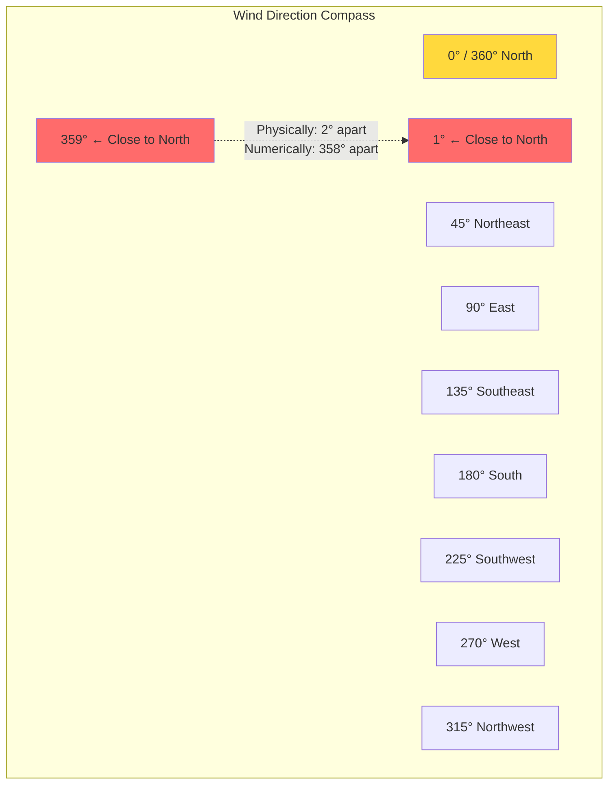
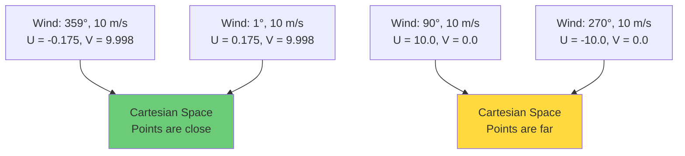

# 4.4 Wind Vectors and Dimensional Continuity

## The 360-Degree Boundary Problem

Wind direction is measured in degrees from north, ranging from 0° (north) to 360° (also north, completing the circle). This creates the same kind of discontinuity problem we saw with hours in Section 4.1, but with even more severe consequences.

Consider two wind observations:
- Observation A: direction = 359°, speed = 10 m/s (a wind from just west of north)
- Observation B: direction = 1°, speed = 10 m/s (a wind from just east of north)

Physically, these two winds are nearly identical — both are from the north, with a barely perceptible 2° difference. But numerically, the difference is 358°, which makes them appear almost maximally different. A machine learning model that treats direction as a raw numerical feature will learn incorrect patterns at this boundary.



This problem is not merely theoretical. In the SDWPF dataset and NREL wind data, the predominant wind direction may cluster around a specific angle (e.g., 350°-10° for northerly winds). A significant fraction of the data may cross the 0°/360° boundary, causing the model to misinterpret these patterns.

### Why the Problem Is Worse Than the Hour Problem

The hour problem (Section 4.1) was bad enough, but the wind direction problem is worse for several reasons:

1. **The boundary is data-dependent.** For hours, the boundary is always at midnight (23→0). For wind direction, the boundary is at 360°→0°, but the data cluster may straddle this boundary in unpredictable ways depending on the site's prevailing wind patterns.

2. **Direction matters for power output.** The relationship between wind direction and power output depends on the turbine's yaw angle (the direction the turbine is facing). A turbine facing north will produce maximum power when the wind comes from the north. If the model cannot correctly represent the continuity of direction near 0°/360°, it will make systematic errors for northerly winds.

3. **Direction interacts with terrain.** Wind from different directions encounters different terrain features (hills, buildings, forests), creating direction-dependent turbulence and speed variations. The model needs to learn these direction-dependent patterns, which is impossible if the direction feature has a discontinuity.

## The U/V Decomposition: A Physically Motivated Solution

The standard solution in meteorology and wind energy is to decompose the wind vector into its **east-west (U)** and **north-south (V)** components:

$$U = v \cdot \sin(\theta)$$

$$V = v \cdot \cos(\theta)$$

where $v$ is the wind speed and $\theta$ is the wind direction in degrees (meteorological convention: direction the wind is coming FROM, measured clockwise from north).

> **Important Reminder**: The meteorological convention for wind direction is the direction the wind is coming FROM, not the direction it is going TO. A wind direction of 0° means wind coming from the north (i.e., blowing southward). This affects the sign of the U/V components.

### Mathematical Justification

The U/V decomposition converts the polar coordinates (speed, direction) into Cartesian coordinates (U, V). On the Cartesian plane, there is no boundary discontinuity. The point (U, V) for a wind from 359° at 10 m/s is:

$$U = 10 \cdot \sin(359°) = 10 \cdot (-0.0175) = -0.175$$

$$V = 10 \cdot \cos(359°) = 10 \cdot 0.9998 = 9.998$$

And for a wind from 1° at 10 m/s:

$$U = 10 \cdot \sin(1°) = 10 \cdot 0.0175 = 0.175$$

$$V = 10 \cdot \cos(1°) = 10 \cdot 0.9998 = 9.998$$

The Euclidean distance between these two points is:

$$d = \sqrt{(-0.175 - 0.175)^2 + (9.998 - 9.998)^2} = 0.350$$

This correctly reflects the small angular difference. Compare this with the raw direction difference of 358°, which vastly overstates the dissimilarity.



### Why U/V Is Better Than Sin/Cos Encoding for Wind Direction

You might notice that the U/V decomposition is essentially the same as the sin/cos encoding we used for hours in Section 4.1. The difference is:

1. **Physical meaning.** U and V have direct physical interpretations as the east-west and north-south components of the wind vector. `hour_sin` and `hour_cos` are purely mathematical encodings with no physical interpretation.

2. **Speed integration.** The U/V components incorporate the wind speed: $U = v \cdot \sin(\theta)$, $V = v \cdot \cos(\theta)$. This means that both speed and direction information are encoded in just two features. A separate speed feature is still useful, but the U/V components carry joint speed-direction information.

3. **Additivity.** U and V components can be meaningfully averaged. The average of $U_1$ and $U_2$ gives the average east-west wind component. You cannot meaningfully average wind directions (the average of 350° and 10° is 180° if done naively, which is completely wrong — it should be approximately 0°/360°).

### Reconstructing Speed and Direction from U/V

If needed, you can reconstruct the wind speed and direction from the U and V components:

$$v = \sqrt{U^2 + V^2}$$

$$\theta = \text{atan2}(U, V) \cdot \frac{180}{\pi}$$

Note the use of `atan2(U, V)` (not `atan2(V, U)`) because of the meteorological convention. The `atan2` function returns values in $[-180°, 180°]$, which must be shifted to $[0°, 360°]$ by adding 360° to negative values.

## The Directional Derivative Perspective

There is a deeper mathematical reason why U/V decomposition works. The wind power output depends on the wind speed and the angle between the wind direction and the turbine's facing direction (yaw error). The relevant quantity is the component of wind perpendicular to the rotor disk:

$$v_{\perp} = v \cdot \cos(\theta_{\text{wind}} - \theta_{\text{yaw}})$$

where $\theta_{\text{wind}}$ is the wind direction and $\theta_{\text{yaw}}$ is the turbine's yaw angle. This is essentially a directional derivative — it measures how much of the wind is "flowing through" the rotor disk.

In the U/V framework, this can be computed as:

$$v_{\perp} = U \cdot \sin(\theta_{\text{yaw}}) + V \cdot \cos(\theta_{\text{yaw}})$$

This is a simple dot product, which is a linear operation in the U/V space. In the original (speed, direction) space, the same computation requires trigonometric functions, introducing nonlinearity and boundary effects.

## Implementation in the Project

The feature engineering pipeline for the wind forecasting models creates U and V components from the wind speed and direction columns:

```python
# Convert degrees to radians
wind_dir_rad = np.deg2rad(df['wind_direction'])

# Compute U (east-west) and V (north-south) components
df['wind_u'] = df['wind_speed'] * np.sin(wind_dir_rad)
df['wind_v'] = df['wind_speed'] * np.cos(wind_dir_rad)
```

After creating these features, the raw `wind_direction` column is typically dropped from the feature set, while `wind_speed` is retained because it still provides unique information (the overall magnitude) that is not fully captured by U and V individually (they encode the magnitude jointly).

## Common Pitfalls

1. **Using the wrong trigonometric convention.** The meteorological convention for wind direction is "coming from," while the mathematical convention for angles is typically "going to." Make sure you use `sin` for U (east-west) and `cos` for V (north-south), not the other way around.

2. **Forgetting to convert degrees to radians.** NumPy's `sin` and `cos` functions expect radians, not degrees. Use `np.deg2rad()` before applying trigonometric functions.

3. **Keeping the raw direction feature.** After creating U/V components, the raw direction feature should be dropped to avoid redundancy and the discontinuity problem.

4. **Treating U and V as independent features.** While U and V are mathematically independent (they span a 2D space), they are physically coupled through the wind speed. Some models may benefit from also including `wind_speed` as a separate feature.

5. **Not handling calm winds.** When wind speed is very low (near zero), the direction is undefined and may contain random values. The U/V components will both be near zero, which is correct, but any features derived from direction alone (e.g., sector-based features) will be unreliable.

## Wind Rose Visualization

Wind roses are a standard visualization tool in meteorology that show the distribution of wind speed and direction. In the U/V framework, a wind rose is essentially a 2D histogram of (U, V) pairs. The U/V decomposition makes it straightforward to compute:

- The frequency of winds from each sector (using the angle of the U/V vector)
- The average speed from each sector (using the magnitude of the U/V vectors in that sector)
- The distribution of wind conditions across sectors

## Extension: Turbine-Level U/V Features

In the SDWPF dataset, which contains data from multiple turbines in a wind farm, each turbine has its own wind speed and direction measurements. The U/V decomposition can be applied to each turbine individually, creating a set of features that captures the spatial variation of wind across the farm. This is particularly important for capturing **wake effects**, where the turbulence from one turbine affects the power output of turbines downstream.

## Key Takeaways

- **The 360-degree boundary problem** causes raw wind direction features to create artificial discontinuities at the 0°/360° boundary, severely degrading model performance.
- **The U/V decomposition** converts wind speed and direction from polar coordinates to Cartesian coordinates, eliminating the boundary discontinuity.
- **U and V have physical meaning** as the east-west and north-south components of the wind vector, making them more interpretable than pure sin/cos encodings.
- **U/V components incorporate speed information**, encode joint speed-direction relationships, and can be meaningfully averaged.
- **Always convert degrees to radians** before applying trigonometric functions in Python.
- **Drop the raw direction feature** after creating U/V components to avoid redundancy.
- **The directional derivative perspective** shows that the U/V framework makes the computation of yaw-related quantities (which directly affect power output) into simple linear operations.


## Deeper Analysis: The Topology of Wind Direction

The wind direction problem is fundamentally a topological issue. The space of wind directions is a circle $S^1$, which is topologically different from a line segment $\mathbb{R}^1$. The key topological property that distinguishes them is that $S^1$ is **compact** (it can be covered by a finite number of open sets) and **has no boundary**, while $[0, 360)$ is not compact (in the induced topology from $\mathbb{R}$) and has a boundary at 0/360.

When we encode wind direction as a raw degree value, we are trying to embed the circle into a line, which is topologically impossible to do continuously. Any embedding of $S^1$ into $\mathbb{R}$ must have a discontinuity somewhere — this is a theorem from topology. The discontinuity at 0°/360° is not a bug; it is a mathematical necessity of the linear encoding.

The U/V decomposition solves this by embedding $S^1$ into $\mathbb{R}^2$ (the plane), which can be done continuously (the standard embedding of a circle in the plane). This is why the discontinuity disappears with U/V encoding — we are using a topologically appropriate embedding.

## Practical Implementation: Handling Edge Cases

When implementing the U/V decomposition, several edge cases require careful handling:

### Zero Wind Speed

When the wind speed is zero (calm conditions), the direction is undefined. The U/V components are both zero, which is correct. However, if the direction sensor reports a specific value (e.g., 0° or 360°) during calm conditions, this value is meaningless and should not be used. A common practice is to set both U and V to zero when the wind speed is below a threshold (e.g., 0.5 m/s).

### Sensor Errors

Wind direction sensors (typically wind vanes) can produce erroneous readings due to:
- Stuck sensors (reporting the same direction continuously)
- Overshoot (the vane oscillates around the true direction)
- Integer rounding (some sensors report directions in 10° increments)

These errors can create artifacts in the U/V components that degrade model performance. Quality control procedures should flag and correct these errors before computing U/V.

### Missing Data

When wind direction data is missing, the U/V components are also missing. Interpolation of missing U/V values is straightforward (linear interpolation in Cartesian coordinates), but interpolation of missing direction values is problematic (linear interpolation between 350° and 10° gives 180°, which is wrong). This is another advantage of the U/V representation — it enables correct interpolation.

```python
# WRONG: Interpolating raw direction
direction_interp = df['wind_direction'].interpolate()  # 350° + 10° / 2 = 180° (WRONG!)

# CORRECT: Interpolate U/V, then reconstruct direction if needed
df['wind_u'] = df['wind_u'].interpolate()
df['wind_v'] = df['wind_v'].interpolate()
```

## Wind Sector Analysis

Wind sector analysis is a common technique in wind energy that groups wind directions into sectors (typically 12 or 16 sectors of 30° or 22.5° each) and analyzes the wind characteristics (frequency, speed distribution, power output) within each sector. This analysis is important for:

1. **Site assessment**: Identifying the dominant wind directions and their seasonal variation.
2. **Wake analysis**: Determining which turbines are affected by wakes from specific directions.
3. **Feature engineering**: Creating sector-based features that capture direction-dependent patterns.

In the U/V framework, sectors can be defined using the angle of the (U, V) vector:

```python
# Compute wind sector (16 sectors of 22.5° each)
wind_angle = np.arctan2(df['wind_u'], df['wind_v']) * 180 / np.pi
wind_angle = wind_angle % 360  # Shift to [0, 360)
df['wind_sector'] = (wind_angle / 22.5).astype(int) % 16
```

The sector feature can be one-hot encoded and used alongside the continuous U/V features, providing the model with both fine-grained directional information and coarse sector membership.

## The Relationship to Coriolis Force and Geostrophic Wind

At larger spatial scales, the wind direction is influenced by the Coriolis force, which causes the wind to deflect to the right in the Northern Hemisphere and to the left in the Southern Hemisphere. The balance between the pressure gradient force and the Coriolis force produces the **geostrophic wind**, which blows parallel to isobars (lines of constant pressure).

The geostrophic wind is a good approximation of the actual wind at altitudes above the boundary layer (typically > 1 km). Near the surface, friction reduces the wind speed and causes the wind to blow at an angle to the isobars (typically 10-30° over land, less over water).

For wind power forecasting, the geostrophic wind provides a reference direction that can be used as a feature. The difference between the actual wind direction and the geostrophic direction indicates the influence of surface friction and local terrain effects.

## Wind Direction Variability as a Feature

Beyond the instantaneous wind direction, the **variability** of wind direction over recent time steps is an informative feature:

```python
# Direction variability (standard deviation of U/V components)
df['wind_u_roll_std'] = df['wind_u'].rolling(4).std().shift(1)
df['wind_v_roll_std'] = df['wind_v'].rolling(4).std().shift(1)
```

High directional variability indicates:
- Turbulent, gusty conditions
- Passage of a weather front
- Convective activity

Low directional variability indicates:
- Stable, persistent wind flow
- Dominant wind regime

This feature is complementary to the wind speed variability (turbulence intensity) and provides additional information about the atmospheric conditions that affect power output.

## Multi-Turbine Directional Features

In the SDWPF dataset with data from multiple turbines, directional features can be computed for each turbine individually, and the differences between turbines can reveal spatial patterns:

- **Directional coherence**: If all turbines report similar wind directions, the wind flow is spatially coherent. If directions vary widely, the flow is turbulent or affected by local terrain.

- **Directional gradient**: The change in wind direction across the wind farm indicates the curvature of the flow field, which is related to the pressure gradient and can predict imminent wind changes.

These multi-turbine features require careful handling to avoid high dimensionality (if there are 134 turbines, the feature space grows rapidly). Dimensionality reduction techniques (PCA, autoencers) or aggregation strategies (mean and variance of directions across the farm) can help manage this complexity.


## Extended Example: Computing U/V for the SDWPF Dataset

The SDWPF (Spatial Dynamic Wind Power Forecasting) dataset contains wind speed and wind direction measurements from 134 turbines in a wind farm. Here is a complete walkthrough of the U/V decomposition:

```python
import numpy as np
import pandas as pd

# Load the dataset (example columns: turbine_id, timestamp, wind_speed, wind_direction)
df = pd.read_csv('sdpwf_data.csv')

# Convert wind direction from degrees to radians
df['wind_dir_rad'] = np.deg2rad(df['wind_direction'])

# Compute U (east-west) and V (north-south) components
# Meteorological convention: direction the wind is coming FROM
df['wind_u'] = df['wind_speed'] * np.sin(df['wind_dir_rad'])
df['wind_v'] = df['wind_speed'] * np.cos(df['wind_dir_rad'])

# Handle calm winds (speed < 0.5 m/s): set U and V to zero
calm_mask = df['wind_speed'] < 0.5
df.loc[calm_mask, 'wind_u'] = 0.0
df.loc[calm_mask, 'wind_v'] = 0.0

# Drop the raw direction and intermediate columns
df = df.drop(columns=['wind_direction', 'wind_dir_rad'])

# Validate: reconstruct speed and check consistency
reconstructed_speed = np.sqrt(df['wind_u']**2 + df['wind_v']**2)
assert np.allclose(reconstructed_speed, df['wind_speed'], atol=0.1)
```

The validation step is crucial: it catches errors in the trigonometric convention, the degree-to-radian conversion, or the handling of special cases. If the reconstructed speed does not match the original speed, something is wrong with the decomposition.

## The Relationship Between U/V Decomposition and Principal Component Analysis

Interestingly, the U/V decomposition can be related to Principal Component Analysis (PCA) of the wind vector. If we compute the PCA of the (U, V) vectors over a long time period, the first principal component will align with the dominant wind direction, and the second component will align with the cross-wind direction. The PCA-transformed coordinates provide a direction-invariant representation that may be more informative for certain tasks.

However, the U/V decomposition is preferred over PCA for feature engineering because:
1. U/V has a fixed coordinate system (east-north), which is interpretable and consistent across time.
2. PCA directions change with the data distribution, making the features unstable across training/test splits.
3. U/V preserves the physical meaning of the wind vector, which is important for interpretation and debugging.


## Summary: The Complete Wind Feature Transformation Pipeline

The complete pipeline for transforming raw wind speed and direction data into model-ready features involves the following steps:

1. **Load raw data**: wind_speed (m/s), wind_direction (degrees)
2. **Quality control**: Flag and handle sensor errors, calm winds, missing data
3. **U/V decomposition**: Convert polar (speed, direction) to Cartesian (U, V)
4. **Calm wind handling**: Set U=0, V=0 when speed < threshold
5. **Drop raw direction**: Remove the discontinuous wind_direction feature
6. **Add derived features**: wind_speed_cubed, turbulence_intensity, etc.
7. **Validate**: Reconstruct speed from U/V and check consistency

This pipeline ensures that all wind features are continuous, physically meaningful, and free from the 360-degree boundary discontinuity that plagues raw direction features. The U/V decomposition is the single most important transformation in the wind feature engineering pipeline, and its correct implementation is essential for the success of the wind power forecasting model.
