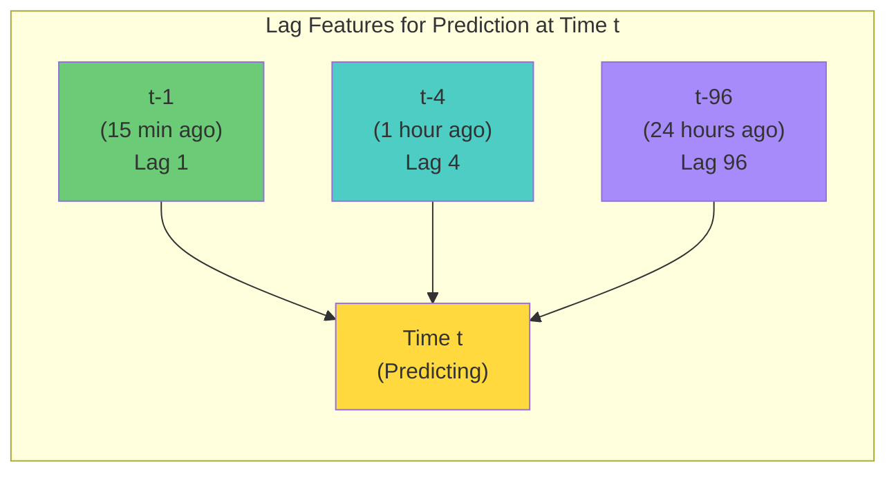
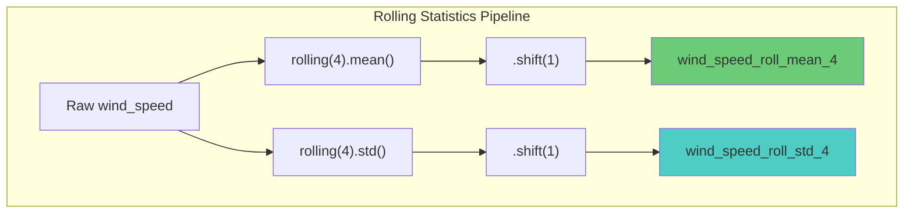
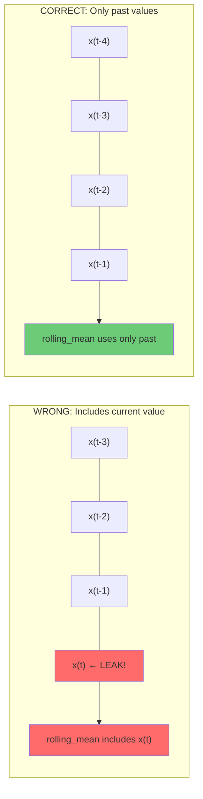

# 4.5 Lag Features and Rolling Statistics

## The Fundamental Insight: Time Series Have Memory

Unlike cross-sectional data (where each observation is independent), time series data has **temporal dependence** — what happened in the recent past influences what will happen in the near future. A solar panel's output at 2:00 PM is strongly correlated with its output at 1:45 PM. A wind turbine's power generation at noon is informative about its generation at 12:15 PM.

Lag features and rolling statistics are the primary mechanisms by which we inject this temporal memory into our machine learning models. Without them, each prediction would be made in isolation, using only the current conditions, with no awareness of recent trends, momentum, or persistence.

## Lag Features: Looking Back in Time

A **lag feature** is simply a past value of a variable, shifted forward in time. For a time series $x_t$, the lag-$k$ feature is $x_{t-k}$. In pandas, this is implemented using the `.shift()` operation:

```python
df['power_lag_1'] = df['power'].shift(1)   # Previous timestep
df['power_lag_4'] = df['power'].shift(4)   # 4 timesteps ago
df['power_lag_96'] = df['power'].shift(96)  # 96 timesteps ago
```

### The Project's Lag Configuration: Config.LAGS = [1, 4, 96]

The project uses three lag values that correspond to three physically meaningful time scales (for 15-minute resolution data):

| Lag | Time Offset | Physical Meaning                                         |
|-----|-------------|----------------------------------------------------------|
| 1   | 15 minutes  | Immediate persistence — what just happened               |
| 4   | 1 hour      | Short-term trend — how conditions were an hour ago       |
| 96  | 24 hours    | Diurnal cycle — what happened at the same time yesterday |



### Why These Three Lags?

**Lag 1 (15 minutes): Persistence.** The most fundamental forecasting heuristic is "persistence" — assume the future will be the same as the present. Lag 1 encodes this directly. For solar power, the output 15 minutes ago is the single most predictive feature for the current output, especially under clear skies.

**Lag 4 (1 hour): Short-term trends.** While lag 1 captures the current state, lag 4 captures the short-term trend. If power output was 500 kW at lag 4 and 450 kW at lag 1, the output is declining — information that is crucial for forecasting. A single lag value cannot capture trends, but multiple lags can.

**Lag 96 (24 hours): Diurnal cycle.** The solar power output at 2:00 PM today is highly correlated with the output at 2:00 PM yesterday. This is because the solar geometry (sun position) repeats with a 24-hour period. Lag 96 directly encodes this diurnal persistence. For wind power, the correlation is weaker but still significant due to persistent weather patterns.

### Why Not More Lags?

You could include lags at every time step from 1 to 96 (or beyond). However, each additional lag feature:
- Increases the dimensionality of the feature space
- Increases the risk of overfitting
- Adds computational cost
- Provides diminishing returns (the marginal information from lag 5 over lag 4 is small)

The three chosen lags [1, 4, 96] provide information at three distinct and physically meaningful time scales while keeping the feature set manageable.

### Lags for Different Variables

In the project, lag features are created not just for the target variable (power output) but also for meteorological variables:

```python
for lag in Config.LAGS:
    df[f'wind_speed_lag_{lag}'] = df['wind_speed'].shift(lag)
    df[f'wind_direction_lag_{lag}'] = df['wind_direction'].shift(lag)
    df[f'temperature_lag_{lag}'] = df['temperature'].shift(lag)
    # ... etc.
```

This gives the model access to the recent history of all input variables, not just the target. A change in wind direction over the past hour (captured by the difference between `wind_direction_lag_1` and `wind_direction_lag_4`) can be a strong predictor of future power output changes.

## Rolling Statistics: Capturing Trends and Volatility

While lag features provide point-in-time snapshots of past values, **rolling statistics** provide summary information about a window of past values. The most common rolling statistics are:

### Rolling Mean (Moving Average)

The rolling mean smooths out short-term fluctuations and reveals the underlying trend:

$$\text{rolling\_mean}_t = \frac{1}{W} \sum_{i=1}^{W} x_{t-i}$$

where $W$ is the window size. A rolling mean with window $W=4$ (1 hour for 15-minute data) captures the average conditions over the past hour. This is particularly useful for filtering out noise in wind speed measurements.

### Rolling Standard Deviation

The rolling standard deviation measures the **volatility** or **variability** of the recent past:

$$\text{rolling\_std}_t = \sqrt{\frac{1}{W-1} \sum_{i=1}^{W} (x_{t-i} - \bar{x})^2}$$

High rolling standard deviation indicates turbulent, gusty conditions that make forecasting more difficult. Low rolling standard deviation indicates stable, predictable conditions.

### Implementation in the Project

```python
# Rolling mean for wind speed (1-hour window = 4 timesteps)
df['wind_speed_roll_mean_4'] = df['wind_speed'].rolling(window=4).mean().shift(1)

# Rolling std for wind speed (1-hour window)
df['wind_speed_roll_std_4'] = df['wind_speed'].rolling(window=4).std().shift(1)

# Rolling mean for a longer window (6-hour = 24 timesteps)
df['wind_speed_roll_mean_24'] = df['wind_speed'].rolling(window=24).mean().shift(1)
```



## The Critical Importance of `.shift(1)`: Preventing Data Leakage

This is perhaps the single most important detail in lag and rolling feature engineering, and it is the one that students and practitioners get wrong most frequently.

> **Important Reminder**: You MUST apply `.shift(1)` to ALL rolling statistics before using them as features. Without this shift, you are using future information to predict the present, which is **data leakage** — the most insidious error in time series modeling.

### What Is Data Leakage?

Data leakage occurs when information from the future (that would not be available at prediction time) is accidentally included in the training features. It causes the model to appear highly accurate during training and validation but fail catastrophically in production, where future information is genuinely unavailable.

### Why Rolling Statistics Are Vulnerable

Consider the rolling mean with window 4:

$$\text{rolling\_mean}_t = \frac{x_{t-3} + x_{t-2} + x_{t-1} + x_t}{4}$$

This includes $x_t$ — the value at the CURRENT time step! When predicting the value at time $t$, we would be using the value at time $t$ as an input, which is circular and constitutes data leakage.

The fix is simple: shift the rolling statistic by 1 before using it as a feature:

```python
# WRONG — data leakage!
df['wind_speed_roll_mean_4'] = df['wind_speed'].rolling(window=4).mean()

# CORRECT — no data leakage
df['wind_speed_roll_mean_4'] = df['wind_speed'].rolling(window=4).mean().shift(1)
```

After the shift, the rolling mean becomes:

$$\text{rolling\_mean}_{t,\text{shifted}} = \frac{x_{t-4} + x_{t-3} + x_{t-2} + x_{t-1}}{4}$$

Now it only uses past values, which is correct.



### Does Lag 1 Need a Shift?

Lag features created with `.shift(k)` where $k \geq 1$ are already using past values, so they do not need an additional shift. However, be careful with `.shift(0)`, which is the current value and constitutes leakage if used as a feature for predicting the current time step.

## Why Rolling Statistics Capture Trends

Rolling statistics are valuable because they capture **dynamic properties** of the time series that point-in-time lag features cannot:

1. **Trend direction.** If the rolling mean is increasing, the variable is trending upward. If decreasing, it is trending downward. The model can learn to extrapolate this trend.

2. **Momentum.** The difference between the current value and the rolling mean indicates whether the variable is above or below its recent average — a measure of momentum that helps predict reversals.

3. **Volatility regime.** High rolling standard deviation indicates a volatile regime where predictions should be more uncertain. Low rolling standard deviation indicates a stable regime where persistence-based predictions are more reliable.

4. **Regime changes.** A sudden increase in rolling standard deviation often signals a regime change (e.g., the onset of a storm), which is a critical event for wind power forecasting.

## Exponential Weighted Moving Averages (EWMA)

An alternative to simple rolling statistics is the **exponential weighted moving average**, which gives more weight to recent observations:

$$\text{EWMA}_t = \alpha \cdot x_{t-1} + (1 - \alpha) \cdot \text{EWMA}_{t-1}$$

where $\alpha$ is the smoothing parameter (0 < α < 1). A higher α gives more weight to recent observations. The EWMA has the advantage of providing a smooth, exponentially decaying memory of the past, rather than the abrupt cutoff of a fixed-window rolling mean.

## Feature Engineering Best Practices for Lag and Rolling Features

1. **Always apply `.shift(1)` to rolling statistics.** This is non-negotiable.

2. **Choose lags that correspond to physical time scales.** Lag 96 for 15-minute data corresponds to 24 hours, which is physically meaningful. Lag 73 does not correspond to anything.

3. **Use multiple window sizes** for rolling statistics to capture different time scales (e.g., 4-step and 24-step windows for 1-hour and 6-hour averages).

4. **Handle NaN values carefully.** Lag and rolling features produce NaN values for the first few time steps. These must be handled (typically by dropping the rows with NaN or imputing with the first valid value).

5. **Consider interactions between lags.** The difference between lag 1 and lag 4 captures the rate of change. The difference between lag 1 and lag 96 captures how today differs from yesterday.

6. **Be consistent between training and inference.** At inference time, you must compute lag features from the most recent available data, ensuring the same lag structure is maintained.

## Key Takeaways

- **Lag features inject temporal memory** into ML models by providing past values as input features.
- **The project uses LAGS = [1, 4, 96]** for 15-minute data, corresponding to 15 minutes, 1 hour, and 24 hours — three physically meaningful time scales.
- **Rolling statistics (mean, std)** capture trends, momentum, and volatility that point-in-time lag features cannot.
- **The `.shift(1)` operation is critical** for preventing data leakage in rolling statistics. Without it, the current value is included in the feature, making it circular.
- **Lag features with shift ≥ 1 are already safe** because they only use past values.
- **Rolling statistics capture dynamic properties** like trend direction, momentum, volatility regime, and regime changes.
- **Multiple window sizes** provide information at different time scales, analogous to how multiple lags provide information at different lookback distances.


## Advanced Lag Strategies

### Adaptive Lags Based on Autocorrelation

Instead of using fixed lag values, the optimal lags can be determined from the autocorrelation function (ACF) of the time series. The ACF measures the correlation between a time series and its lagged values:

$$\text{ACF}(k) = \frac{\text{Cov}(x_t, x_{t-k})}{\text{Var}(x_t)}$$

For solar power output:
- ACF(1) ≈ 0.99 (very high persistence)
- ACF(4) ≈ 0.95 (1-hour correlation still high)
- ACF(96) ≈ 0.90 (24-hour correlation very high, due to diurnal cycle)
- ACF(48) ≈ -0.20 (12-hour anti-correlation, night vs. day)

The ACF suggests that lags 1, 4, and 96 are indeed good choices, as they correspond to peaks in the autocorrelation function. However, there may also be value in including lag 48 (12 hours), which captures the anti-correlation between day and night.

### Difference Features

In addition to raw lag features, **difference features** capture the rate of change between lags:

```python
df['power_diff_1'] = df['power'] - df['power'].shift(1)  # 15-min change
df['power_diff_4'] = df['power'] - df['power'].shift(4)  # 1-hour change
df['power_diff_96'] = df['power'] - df['power'].shift(96)  # Day-over-day change
```

Difference features are particularly informative for detecting ramps (sudden changes in power output) and regime transitions. They are also more stationary than raw lag features, which improves model training.

### Ratio Features

Ratio features capture relative changes:

```python
df['power_ratio_1'] = df['power'] / (df['power'].shift(1) + 1e-6)
df['power_ratio_96'] = df['power'] / (df['power'].shift(96) + 1e-6)
```

The day-over-day ratio (`power_ratio_96`) is particularly useful for solar forecasting because it captures how today's conditions compare to yesterday's at the same time. A ratio of 0.5 means today's power is half of yesterday's, indicating increased cloud cover. A ratio of 1.2 means today is slightly better than yesterday, perhaps due to clearer skies.

## Rolling Statistics: Advanced Techniques

### Exponentially Weighted Moving Average (EWMA) in Detail

The EWMA with smoothing parameter $\alpha$ gives more weight to recent observations:

$$\text{EWMA}_t = \alpha \cdot x_{t-1} + (1 - \alpha) \cdot \text{EWMA}_{t-1}$$

The effective window size of the EWMA is approximately $1/\alpha$. For $\alpha = 0.1$, the effective window is about 10 time steps (2.5 hours for 15-minute data). For $\alpha = 0.01$, the effective window is about 100 time steps (25 hours).

The advantage of EWMA over simple rolling means is that it provides a smooth, exponentially decaying memory that does not have the abrupt cutoff of a fixed window. This means that a data point from 5 steps ago still contributes to the EWMA (with weight $\alpha(1-\alpha)^4$), while it contributes equally to the most recent point in a simple rolling mean.

```python
# EWMA features
df['power_ewma_01'] = df['power'].ewm(alpha=0.1).mean().shift(1)
df['power_ewma_01'] = df['power'].ewm(alpha=0.01).mean().shift(1)
```

### Rolling Quantiles

In addition to the mean and standard deviation, rolling quantiles provide information about the distribution of recent values:

```python
df['power_roll_q25'] = df['power'].rolling(24).quantile(0.25).shift(1)
df['power_roll_q75'] = df['power'].rolling(24).quantile(0.75).shift(1)
df['power_roll_iqr'] = df['power_roll_q75'] - df['power_roll_q25']
```

The interquartile range (IQR) is a robust measure of spread that is less sensitive to outliers than the standard deviation. The 25th and 75th percentiles give the model information about the range of recent conditions.

### Rolling Min and Max

The rolling minimum and maximum capture the extremes of recent conditions:

```python
df['power_roll_min'] = df['power'].rolling(24).min().shift(1)
df['power_roll_max'] = df['power'].rolling(24).max().shift(1)
df['power_roll_range'] = df['power_roll_max'] - df['power_roll_min']
```

The rolling range is a simple but effective measure of variability that is easy to interpret. A large rolling range indicates highly variable conditions, while a small rolling range indicates stable conditions.

## Lag Features for Multi-Step Forecasting

When forecasting multiple steps ahead (e.g., predicting power output for the next 1, 2, 3, ..., 24 hours), the lag features must be adjusted to account for the forecast horizon:

- For 1-step ahead forecasting: lag 1 is the previous time step (15 minutes ago)
- For 4-step ahead forecasting: lag 1 is the value from 1 hour ago, which is the most recent available value
- For 96-step ahead forecasting: lag 1 is the value from 24 hours ago, which is the most recent available value

The general rule is: for an $h$-step ahead forecast, the most recent available lag is $h$ (not 1). This means that the lag features must be recomputed for each forecast horizon, or the model must be trained with lags that are all $\geq h$.

This is a common source of error in multi-step forecasting: using lag 1 features for a 24-hour ahead forecast constitutes data leakage because the value 15 minutes ago is not available when making a 24-hour ahead prediction.

## The Impact of Temporal Resolution on Lag Design

The choice of lag values depends critically on the temporal resolution of the data:

| Resolution | Lag 1   | Lag 4   | Lag 96  | Physical Meaning              |
|-----------|---------|---------|---------|-------------------------------|
| 5 min     | 5 min   | 20 min  | 8 hours | Short/medium/long-term        |
| 15 min    | 15 min  | 1 hour  | 24 hours| Immediate/hourly/diurnal      |
| 1 hour    | 1 hour  | 4 hours | 4 days  | Hourly/daily/multi-day        |
| 1 day     | 1 day   | 4 days  | 96 days | Daily/weekly/seasonal         |

For the project's 15-minute resolution data, the lags [1, 4, 96] map naturally to 15 minutes, 1 hour, and 24 hours. For different resolutions, the lag values would need to be adjusted to capture the same physical time scales.

## Feature Engineering for Seasonal Decomposition

Lag and rolling features can be designed to capture the components of a seasonal decomposition:

1. **Trend component**: Long-window rolling mean (e.g., rolling mean with window = 672 for 1 week)
2. **Seasonal component**: Day-over-day lag feature (lag 96 for 15-minute data)
3. **Residual component**: Difference between the actual value and the sum of trend and seasonal components

This decomposition is closely related to the STL (Seasonal-Trend decomposition using LOESS) method, which is a standard tool in time series analysis. By providing the model with features that approximate the trend and seasonal components, we reduce the burden on the model to discover these patterns from scratch.

## The Computational Cost of Lag Features

Creating lag features for many variables and many lag values can be computationally expensive. For a dataset with $F$ features and $L$ lag values, the total number of lag features is $F \times L$. For the wind dataset with 20 features and 3 lags, this gives 60 additional features. For the rolling statistics with 3 window sizes and 2 statistics (mean, std) per variable, this gives another 120 features.

The total feature count can quickly grow to several hundred, which increases the dimensionality of the input space and may require feature selection or dimensionality reduction. The key is to focus on the most informative lag and rolling features based on domain knowledge and cross-validation, rather than blindly creating all possible combinations.


## Theoretical Foundation: Why Lag Features Work

The theoretical justification for lag features comes from **Wold's decomposition theorem**, which states that any covariance-stationary time series can be decomposed into:

$$X_t = \sum_{j=0}^{\infty} \psi_j \epsilon_{t-j} + \eta_t$$

where $\epsilon_t$ is white noise, $\psi_j$ are the impulse response coefficients, and $\eta_t$ is a deterministic component. This decomposition shows that the current value of a time series depends on the entire history of shocks, with the dependence decaying according to the $\psi_j$ coefficients.

Lag features approximate this dependence by providing the model with a finite window of past values, from which it can learn to approximate the impulse response coefficients. The more lag features we provide (up to the point where the $\psi_j$ coefficients become negligible), the better the approximation.

For the project's solar and wind data, the autocorrelation function typically decays to near-zero within 24-48 hours, justifying the use of lag 96 (24 hours) as the longest lag feature. Including lags beyond this would add noise rather than information.

## Feature Engineering for Ramp Detection

A **ramp event** is a sudden, large change in power output over a short period. Ramp events are particularly challenging for forecasting and for grid operators, as they require rapid deployment of reserve power.

Lag and rolling features can be engineered specifically for ramp detection:

```python
# Ramp detection features
df['power_ramp_short'] = df['power'] - df['power'].shift(1)  # 15-min change
df['power_ramp_medium'] = df['power'] - df['power'].shift(4)  # 1-hour change
df['power_ramp_long'] = df['power'] - df['power'].shift(12)  # 3-hour change

# Ramp rate (derivative approximation)
df['power_ramp_rate'] = df['power_ramp_short'] / 0.25  # MW per hour

# Ramp acceleration (second derivative)
df['power_ramp_accel'] = df['power_ramp_short'] - df['power_ramp_short'].shift(1)
```

These features allow the model to detect not just the current power output but also the direction and speed of change, which is crucial for predicting whether a ramp will continue, accelerate, or reverse.

## Handling NaN Values from Lag and Rolling Features

When computing lag and rolling features, the first few rows will have NaN values because there is not enough history. The handling of these NaN values is important:

1. **Drop the rows with NaN**: This is the simplest and most common approach. The number of dropped rows is equal to the maximum lag or rolling window size.

2. **Forward-fill (ffill)**: Replace NaN with the first available value. This introduces a bias toward the initial conditions but preserves the dataset size.

3. **Backward-fill (bfill)**: Replace NaN with the next available value. This constitutes data leakage and should NOT be used.

4. **Impute with the mean**: Replace NaN with the feature's mean value. This is reasonable for rolling means but problematic for lag features (which should reflect the actual past values).

The recommended approach is to drop the rows with NaN, as this is the only method that does not introduce artifacts or leakage. For a dataset of 70,000 time steps with a maximum lag of 96, dropping the first 96 rows removes only 0.14% of the data — a negligible loss.
