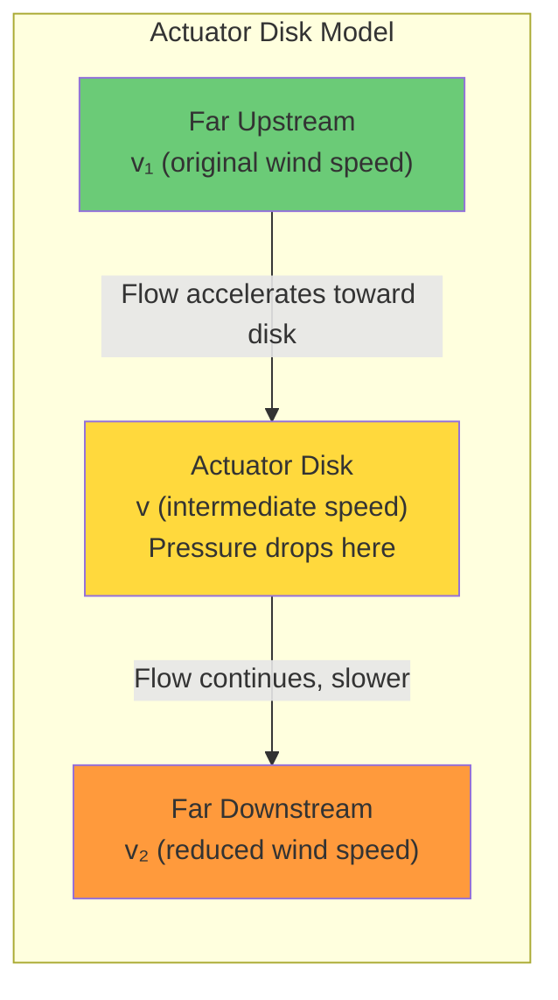
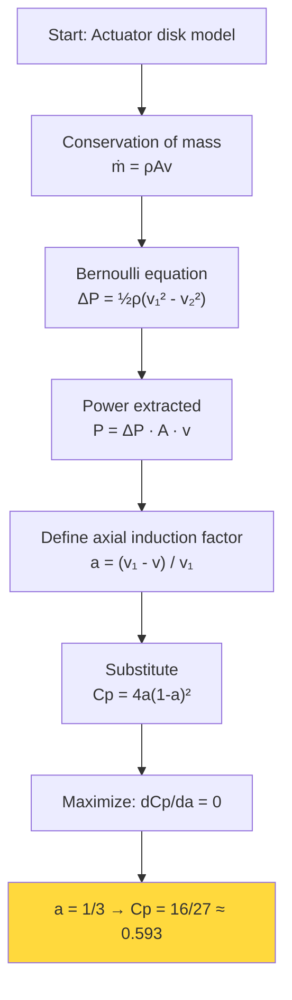
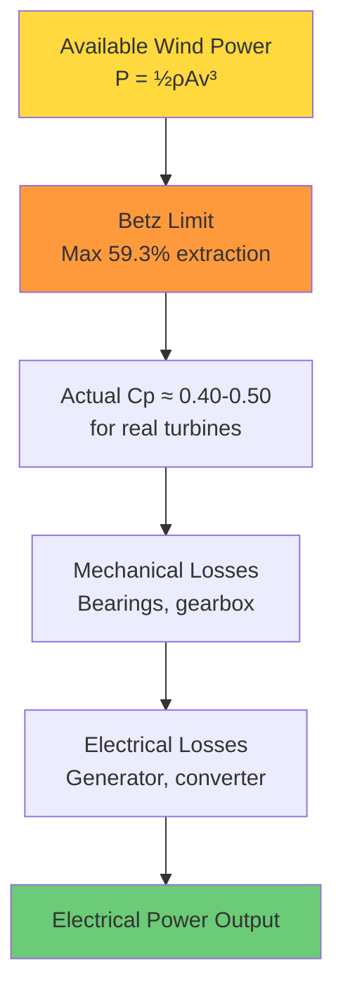

# 4.6 The Cubic Power Law and Betz Limit

## The Physics of Wind Energy Extraction

When wind passes through a wind turbine, the turbine extracts some of the wind's kinetic energy and converts it to electrical power. But how much energy can a turbine extract? And what are the fundamental physical limits? These questions are answered by the cubic power law and the Betz limit — two of the most important concepts in wind energy physics.

## The Complete Power Equation

The electrical power output of a wind turbine is:

$$P = \frac{1}{2} \rho A v^3 C_p$$

where:
- $P$ is the power output (Watts)
- $\rho$ is the air density (kg/m³), typically ≈ 1.225 at sea level
- $A$ is the swept area of the rotor (m²), $A = \pi R^2$ where $R$ is the rotor radius
- $v$ is the wind speed (m/s)
- $C_p$ is the power coefficient (dimensionless), the fraction of available wind power extracted

Let us examine each term in detail.

### Air Density ($\rho$)

Air density varies with temperature, pressure, and humidity according to the ideal gas law:

$$\rho = \frac{P_{\text{atm}}}{R_{\text{specific}} \cdot T}$$

where $P_{\text{atm}}$ is atmospheric pressure (Pa), $R_{\text{specific}} = 287.05$ J/(kg·K) is the specific gas constant for dry air, and $T$ is temperature (K). At standard conditions (101325 Pa, 288.15 K), $\rho = 1.225$ kg/m³.

The effect of density on power is linear: a 10% decrease in air density (e.g., due to high altitude or high temperature) reduces power output by 10%. While this is significant, it is much less dramatic than the effect of wind speed, which is cubic.

### Swept Area ($A$)

The swept area is the circular area covered by the rotating blades: $A = \pi R^2$. For a typical large wind turbine with $R = 60$ m, $A = 11{,}310$ m². Doubling the rotor radius quadruples the swept area and therefore quadruples the power output. This is why modern wind turbines have increasingly large rotors.

### Wind Speed ($v$) and the Cubic Law

As derived in Section 4.3, the wind power is proportional to $v^3$. This is the most important factor in the equation because it is both the most variable and the most nonlinear. A summary:

| Wind Speed (m/s) | $v^3$ | Relative Power |
|-------------------|-------|----------------|
| 5                 | 125   | 1×             |
| 10                | 1000  | 8×             |
| 15                | 3375  | 27×            |
| 20                | 8000  | 64×            |
| 25                | 15625 | 125×           |

The extreme sensitivity to wind speed is why accurate wind speed forecasting is so critical for wind power forecasting. A 10% error in wind speed translates to approximately a 30% error in power output.

### Power Coefficient ($C_p$)

The power coefficient $C_p$ is the fraction of the available wind power that the turbine successfully extracts. It is not a constant — it depends on the **tip speed ratio** (TSR), defined as:

$$\lambda = \frac{\omega R}{v}$$

where $\omega$ is the angular velocity of the rotor (rad/s) and $R$ is the rotor radius. The TSR is the ratio of the blade tip speed to the wind speed. For modern turbines, the optimal TSR is typically 6-8, meaning the blade tips move 6-8 times faster than the wind.

The power coefficient as a function of TSR follows a characteristic curve that rises from zero at $\lambda = 0$, peaks at the optimal TSR, and then declines. The maximum theoretical value of $C_p$ is given by the **Betz limit**.

## The Betz Limit: Derivation

The Betz limit, derived by Albert Betz in 1919, states that no wind turbine can extract more than 59.3% of the kinetic energy from the wind. This is a fundamental physical limit, not an engineering limitation. Here is the derivation.

### Assumptions

1. The turbine is an ideal "actuator disk" — a thin, frictionless disk that extracts energy uniformly.
2. The flow is incompressible, steady, and one-dimensional.
3. There is no rotational wake behind the disk.

### The Actuator Disk Model

Consider an actuator disk of area $A$ in a wind flow. The wind speed far upstream is $v_1$, the speed at the disk is $v$, and the speed far downstream is $v_2$.



The disk extracts energy by slowing the wind from $v_1$ to $v_2$. By the conservation of mass (incompressible flow), the mass flow rate through the disk is:

$$\dot{m} = \rho A v$$

By the Bernoulli equation (applied separately upstream and downstream of the disk, since energy is extracted at the disk), the pressure drop across the disk is:

$$\Delta P = \frac{1}{2} \rho (v_1^2 - v_2^2)$$

The power extracted by the disk is the pressure drop times the volume flow rate:

$$P = \Delta P \cdot A \cdot v = \frac{1}{2} \rho A v (v_1^2 - v_2^2)$$

### The Interference Factor

Define the **axial induction factor** $a$ as:

$$a = \frac{v_1 - v}{v_1}$$

This gives $v = v_1(1 - a)$ and $v_2 = v_1(1 - 2a)$.

Substituting into the power equation:

$$P = \frac{1}{2} \rho A v_1^3 \cdot 4a(1-a)^2$$

The power coefficient is then:

$$C_p = \frac{P}{\frac{1}{2} \rho A v_1^3} = 4a(1-a)^2$$

### Maximizing $C_p$

To find the maximum $C_p$, we take the derivative with respect to $a$ and set it to zero:

$$\frac{dC_p}{da} = 4(1-a)^2 - 8a(1-a) = 4(1-a)(1-3a) = 0$$

This gives $a = 1/3$ (the physically meaningful solution). Substituting back:

$$C_{p,\text{max}} = 4 \cdot \frac{1}{3} \cdot \left(\frac{2}{3}\right)^2 = \frac{16}{27} \approx 0.593$$

**The Betz limit: $C_{p,\text{max}} = 16/27 \approx 59.3\%$**



### Physical Interpretation

The Betz limit arises because the turbine must leave enough kinetic energy in the wind for the air to flow away downstream. If the turbine extracted all the kinetic energy, the air would stop and pile up behind the turbine, preventing further flow. The optimum extraction of 59.3% represents the balance between extracting as much energy as possible and allowing the wake to clear.

In practice, real turbines achieve $C_p$ values of 0.40-0.50, well below the Betz limit, due to:
- Blade friction and tip losses
- Wake rotation (the turbine imparts angular momentum to the wake)
- Non-ideal flow conditions (turbulence, shear)
- Mechanical and electrical losses

## Relationship to the Project's Code

### Clipping `wind_cubed` to 100,000

In the project code, the `wind_speed_cubed` feature is clipped to 100,000:

```python
df['wind_speed_cubed'] = (df['wind_speed'] ** 3).clip(upper=100000)
```

This relates to the Betz limit and the power curve in the following way:

For a typical large wind turbine with $R = 60$ m, $A = 11{,}310$ m², $\rho = 1.225$ kg/m³, and $C_p = 0.45$:

$$P = 0.5 \times 1.225 \times 11310 \times v^3 \times 0.45 = 3114 \times v^3$$

At the rated speed of about 12 m/s: $P = 3114 \times 1728 \approx 5.38$ MW.

Above the rated speed, the turbine limits power to the rated value (5 MW in this example). The `wind_speed_cubed` feature would continue to increase (e.g., at 20 m/s, $v^3 = 8000$, giving a theoretical power of 24.9 MW), but the actual output is capped at 5 MW. The clip at 100,000 ensures that the `wind_speed_cubed` feature does not take values that are physically impossible for the actual power output.

The threshold of 100,000 corresponds to $v = \sqrt[3]{100000} \approx 46.4$ m/s, which is well above the cut-out speed of any wind turbine. This effectively means the feature is clipped only at extreme wind speeds that would never produce power anyway.

### Why Not Use $C_p$ Directly?

You might wonder why the project does not compute $C_p$ as a feature. The answer is that $C_p$ depends on the turbine's control system (pitch angle, rotational speed), which is typically not available in the meteorological datasets (SDWPF, NREL). Moreover, $C_p$ is a property of the turbine, not the weather, so it does not vary with the input features in a way that helps prediction. The cubic power law captures the dominant physical relationship, and the model learns the deviations (including the $C_p$ effects) from the data.

## The Complete Picture: From Wind to Electricity



The cascade of losses from available wind power to electrical output explains why the `wind_speed_cubed` feature is useful but not sufficient. It captures the dominant physics (the cubic dependence on wind speed), but the actual power output is modified by the power coefficient, mechanical losses, and electrical losses. The ML model must learn these corrections from the data, which is why additional features (wind direction, temperature, air density, turbulence intensity) and lag features (which capture the temporal dynamics of the power curve) are also important.

## Advanced Topic: The Cp-Lambda Curve

The power coefficient varies with the tip speed ratio $\lambda$ according to a characteristic curve that can be approximated analytically. A common approximation is:

$$C_p(\lambda, \beta) = c_1 \left(\frac{c_2}{\lambda_i} - c_3 \beta - c_4\right) e^{-\frac{c_5}{\lambda_i}} + c_6 \lambda$$

where $\beta$ is the blade pitch angle and $\lambda_i$ is a modified tip speed ratio. The coefficients $c_1$ through $c_6$ are turbine-specific parameters. This equation shows that $C_p$ depends on both the aerodynamic conditions (through $\lambda$) and the control system (through $\beta$), making it a complex, nonlinear function that is difficult to model analytically.

For forecasting purposes, this complexity is precisely why we rely on data-driven methods: the relationship between wind conditions and power output is too complex for simple analytical models but can be learned from historical data by ML models equipped with physics-informed features.

## Key Takeaways

- **The complete wind power equation** is $P = \frac{1}{2} \rho A v^3 C_p$, incorporating air density, rotor area, wind speed, and the power coefficient.
- **The cubic power law** ($P \propto v^3$) means that wind speed errors are amplified cubically in power predictions, making accurate wind speed forecasting critical.
- **The Betz limit** ($C_p \leq 16/27 \approx 59.3\%$) is a fundamental physical limit on wind energy extraction, derived from the actuator disk model and the conservation of mass, momentum, and energy.
- **Real turbines achieve $C_p \approx 0.40-0.50$**, below the Betz limit, due to friction, tip losses, and wake rotation.
- **The project clips `wind_speed_cubed` to 100,000** to prevent extreme values at wind speeds above the cut-out speed, where the turbine produces no power.
- **The Cp-lambda curve** is a complex, nonlinear function that depends on the tip speed ratio and blade pitch angle, making analytical modeling difficult and motivating the use of data-driven methods.
- **Physics-informed features** like `wind_speed_cubed` provide the model with the dominant physical relationship, allowing it to focus on learning the corrections and deviations from idealized physics.


## The Betz Limit: Assumptions and Limitations

The Betz limit derivation makes several simplifying assumptions that are worth examining in detail, as real turbines deviate from these assumptions in important ways.

### Assumption 1: Incompressible Flow

The Betz derivation assumes that air is incompressible, which is valid for wind speeds much less than the speed of sound (Mach number << 1). For wind turbines, this is always satisfied (wind speeds are typically < 30 m/s, while the speed of sound is ~343 m/s).

### Assumption 2: Steady, Uniform Flow

The derivation assumes that the wind is steady (no turbulence) and uniform across the rotor disk. In reality, wind is turbulent and varies with height (wind shear). Turbulence reduces the effective $C_p$ because the turbine cannot maintain optimal tip speed ratio under rapidly changing conditions.

### Assumption 3: No Rotational Wake

The derivation assumes that the wake behind the turbine has no rotation. In reality, the turbine imparts angular momentum to the wake, creating a rotating wake. This rotational kinetic energy is "wasted" — it does not contribute to electrical power output but is extracted from the wind. The result is that the actual maximum $C_p$ is lower than the Betz limit.

### Assumption 4: Infinite Number of Blades

The derivation assumes an actuator disk with uniform thrust, which implies an infinite number of infinitely thin blades. Real turbines have 3 blades, and the gaps between blades allow some air to pass through without interacting with the blades, reducing the effective thrust and $C_p$.

### The Glauert Correction for Wake Rotation

The Glauert correction accounts for the rotational wake by modifying the maximum $C_p$:

$$C_{p,\text{max}} = \frac{16}{27} \cdot \left(1 - \frac{a^2}{(1-a)^2} \cdot \frac{1}{\lambda^2}\right)$$

where $\lambda$ is the tip speed ratio. For high tip speed ratios (typical of modern turbines), the correction is small, and the Betz limit is a good approximation. For low tip speed ratios, the correction is more significant.

## Practical Power Coefficient Values

For real wind turbines, the power coefficient varies with the operating conditions:

| Turbine Type           | Peak $C_p$ | Typical Operating $C_p$ | Notes                          |
|------------------------|------------|-------------------------|--------------------------------|
| Modern 3-blade HAWT    | 0.48-0.50  | 0.40-0.45               | State of the art               |
| Older 3-blade HAWT     | 0.42-0.45  | 0.35-0.40               | Less aerodynamic optimization  |
| 2-blade HAWT           | 0.45-0.48  | 0.38-0.42               | Slightly lower due to fewer blades |
| Vertical-axis (Darrieus)| 0.30-0.35 | 0.25-0.30               | Lower due to cross-wind operation |

The gap between the Betz limit (0.593) and real turbines (0.48-0.50 peak) is due to the factors listed above: tip losses, wake rotation, blade friction, and structural constraints.

## The Power Curve and the Cubic Law: Why the Deviation Matters

The cubic power law $P \propto v^3$ is an idealization. The actual power curve deviates from this ideal for several reasons:

1. **Variable $C_p$**: As discussed, $C_p$ varies with the tip speed ratio, which changes with wind speed. Near cut-in, $C_p$ is below its maximum; near rated speed, the pitch control system reduces $C_p$ to limit power.

2. **Generator efficiency**: The electrical generator has its own efficiency curve, typically 85-95%, which varies with the load. At low power output, the generator efficiency is lower because the fixed losses (bearing friction, cooling fans) represent a larger fraction of the total.

3. **Drivetrain losses**: The gearbox (if present) has efficiency losses of 1-3%, and the bearings have friction losses. These are roughly constant in absolute terms, so they represent a larger fraction at low power output.

4. **Yaw misalignment**: If the turbine is not perfectly aligned with the wind (yaw error), the effective wind speed is $v \cdot \cos(\theta_{\text{yaw}})$, reducing the available power by a factor of $\cos^3(\theta_{\text{yaw}})$. Even a small yaw error of 10° reduces power by about 5%.

5. **Dirty blades**: Ice, insects, or erosion on the blade surface reduce aerodynamic efficiency, lowering $C_p$ by 5-20% depending on the severity.

These deviations explain why the `wind_speed_cubed` feature, while capturing the dominant physics, is not sufficient by itself. The ML model must learn the corrections from the data, using additional features (temperature, wind direction, turbulence intensity, time of day) to account for the various factors that cause deviations from the ideal cubic law.

## Wind Speed Measurement and the Cubic Sensitivity

The cubic relationship between wind speed and power has a critical implication for measurement accuracy: a small error in wind speed measurement produces a much larger error in power estimation.

Consider a wind speed of 10 m/s with a measurement error of ±0.5 m/s (5% error):

- Measured: 10 m/s → $v^3 = 1000$
- True (low): 9.5 m/s → $v^3 = 857.4$ (14.3% error)
- True (high): 10.5 m/s → $v^3 = 1157.6$ (15.8% error)

A 5% error in wind speed produces a 14-16% error in power. This cubic amplification of measurement errors is one of the fundamental challenges in wind power forecasting. It means that improving wind speed measurement accuracy (through better anemometers, lidar, or meteorological models) has an outsized impact on power forecasting accuracy.

## Advanced: Thrust Coefficient and Structural Loading

The thrust coefficient $C_T$ is related to but distinct from the power coefficient $C_p$. It measures the fraction of the wind's momentum extracted by the turbine:

$$C_T = \frac{\text{Thrust force}}{\frac{1}{2} \rho A v^2}$$

The thrust coefficient is important for structural design because it determines the loads on the tower and foundation. It is also relevant for forecasting because the thrust coefficient affects the wake properties: a high $C_T$ produces a stronger wake with a larger velocity deficit.

The relationship between $C_p$ and $C_T$ is constrained by the Betz limit. For the optimal induction factor $a = 1/3$:

$$C_T = 4a(1-a) = 4 \times \frac{1}{3} \times \frac{2}{3} = \frac{8}{9} \approx 0.889$$

This means that at the Betz-optimal operating point, the turbine extracts 59.3% of the power but 88.9% of the momentum from the wind. The disparity between power extraction and momentum extraction explains why wind turbines create such strong wakes — they extract momentum very efficiently even when not operating at peak power efficiency.


## The Economic Implications of the Cubic Law

The cubic relationship between wind speed and power output has profound economic implications for wind energy projects:

### Sensitivity of Revenue to Wind Speed

If a wind farm generates $P = k \cdot v^3$ watts at wind speed $v$, and the electricity price is $c$ dollars per watt-hour, then the revenue is proportional to $v^3$. A 5% error in the wind speed forecast translates to approximately a 15% error in the revenue forecast. For a 100 MW wind farm generating $20 million per year, a 5% wind speed forecast error could mean a $3 million revenue uncertainty.

### Impact on Grid Operations

Grid operators use wind power forecasts to schedule reserve power and manage the balance between supply and demand. The cubic law means that even small forecast errors can lead to large power imbalances, requiring more reserve power and increasing grid operating costs. Accurate wind speed forecasting is therefore not just a technical challenge but an economic imperative.

### The Value of Forecasting Improvement

The economic value of improving the wind speed forecast can be quantified. If the current forecast has a mean absolute error (MAE) of 2 m/s, and an improved model reduces the MAE to 1.5 m/s, the reduction in power forecast error is approximately:

$$\Delta P \approx 3 \cdot v^2 \cdot \Delta v$$

At a typical wind speed of 10 m/s, this is $3 \times 100 \times 0.5 = 150$ W/m² of swept area. For a 100 MW wind farm with a swept area of 30,000 m², this is an improvement of 4.5 MW in forecast accuracy, which translates to significant savings in reserve power costs.

## The Betz Limit and Turbine Design

The Betz limit has influenced the design of wind turbines since its derivation in 1919:

1. **Blade count**: Three blades are the most common configuration because they provide a good balance between $C_p$ (approaching the Betz limit) and structural cost. Two blades have slightly lower $C_p$ but are cheaper. One blade (with a counterweight) has even lower $C_p$.

2. **Blade shape**: Modern blades are designed using computational fluid dynamics (CFD) to maximize $C_p$ across a range of wind speeds, approaching the Betz limit as closely as possible.

3. **Rotor diameter**: Since power is proportional to the swept area ($A = \pi R^2$), larger rotors capture more power. The trend toward larger rotors (up to 120m diameter for modern offshore turbines) is driven by this relationship.

4. **Hub height**: Since wind speed increases with height (due to wind shear), taller towers capture faster winds. The cubic law amplifies the benefit: a 10% increase in wind speed from a taller tower produces a 33% increase in power.
