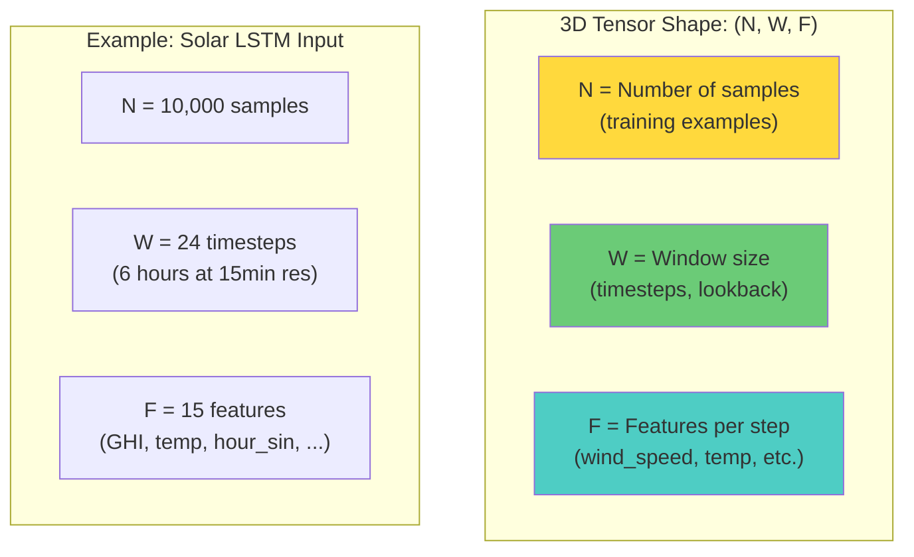

# 5.1 The Sliding Window Strategy and 3D Tensors

## The Fundamental Problem: Time Series to Supervised Learning

Machine learning models, at their core, learn a mapping from inputs $X$ to outputs $y$. In cross-sectional problems (like predicting house prices from features), each row in the dataset is an independent observation, and the mapping is straightforward: each row's features predict that row's target.

Time series forecasting is fundamentally different. The target at time $t$ depends not just on the current features but on the **sequence of features over a recent time window**. A solar panel's output at 2:00 PM depends on the cloud cover, temperature, and irradiance over the past several hours, not just the instantaneous values at 2:00 PM. A wind turbine's output depends on the wind speed trajectory, not just a single measurement.

The **sliding window strategy** (also called the rolling window or lookback window method) is the standard technique for converting time series data into the supervised learning format required by ML models.

## How the Sliding Window Works

The sliding window creates training examples by moving a fixed-size window across the time series. At each position of the window, the features within the window become the input $X$, and the value at the next time step (or several steps ahead) becomes the target $y$.

```mermaid
graph TD
    subgraph "Time Series Data"
        T1["t=1"] --> T2["t=2"] --> T3["t=3"] --> T4["t=4"] --> T5["t=5"] --> T6["t=6"] --> T7["t=7"] --> T8["t=8"]
    end
    
    subgraph "Window 1 (t=1 to t=4 → predict t=5)"
        W1A["t=1"] --- W1B["t=2"] --- W1C["t=3"] --- W1D["t=4"]
    end
    
    subgraph "Window 2 (t=2 to t=5 → predict t=6)"
        W2A["t=2"] --- W2B["t=3"] --- W2C["t=4"] --- W2D["t=5"]
    end
    
    subgraph "Window 3 (t=3 to t=6 → predict t=7)"
        W3A["t=3"] --- W3B["t=4"] --- W3C["t=5"] --- W3D["t=6"]
    end
    
    style W1D fill:#6bcb77
    style W2D fill:#6bcb77
    style W3D fill:#6bcb77
```



For a time series with values $[x_1, x_2, x_3, \ldots, x_T]$ and a window size $W$:

| Sample | Input $X$ (Window)            | Target $y$  |
|--------|-------------------------------|-------------|
| 1      | $[x_1, x_2, \ldots, x_W]$    | $x_{W+1}$   |
| 2      | $[x_2, x_3, \ldots, x_{W+1}]$| $x_{W+2}$   |
| 3      | $[x_3, x_4, \ldots, x_{W+2}]$| $x_{W+3}$   |
| ...    | ...                           | ...         |
| $N$    | $[x_N, \ldots, x_{T-1}]$     | $x_T$       |

where $N = T - W$ is the total number of samples.

### Multivariate Time Series

In our project, the time series is multivariate — at each time step, we have multiple features (wind speed, wind direction, temperature, power output, lag features, etc.). If we have $F$ features, each window becomes a $W \times F$ matrix rather than a length-$W$ vector.

The sliding window over a multivariate time series creates:

- **Input $X$**: shape `(samples, timesteps, features)` = `(N, W, F)`
- **Target $y$**: shape `(samples,)` = `(N,)`

## The 3D Tensor: Why Recurrent Networks Need This Shape

Recurrent neural networks (LSTMs, GRUs) process data sequentially — they read one time step at a time and maintain a hidden state that accumulates information across the sequence. This architecture requires the input to be organized as a **3D tensor**:

$$X \in \mathbb{R}^{N \times W \times F}$$

where:
- $N$ = number of samples (training examples)
- $W$ = window size (number of time steps, also called `lookback_window` or `seq_length`)
- $F$ = number of features per time step



### Why Not 2D?

A 2D tensor (samples × features) is the standard format for non-sequential models like XGBoost. Each row is a single observation with all its features. There is no temporal structure — the model treats each feature independently.

A 3D tensor explicitly encodes the temporal structure: each sample is a **sequence** of observations, and the model processes them in order. This is essential for recurrent networks, which use the sequential order to accumulate information in their hidden state.

For the XGBoost model in the solar forecasting project, the windowed data is flattened to 2D: each sample's $W \times F$ matrix is flattened to a vector of length $W \times F$. This gives XGBoost access to the same temporal information but without the explicit sequential structure that recurrent networks exploit.

## The Project's Lookback Window: lookback_window = 24

The project uses a lookback window of 24 time steps. For 15-minute resolution data, this corresponds to **6 hours** of lookback. This means the model uses the past 6 hours of data to predict the next time step.

### Why 6 Hours?

The choice of lookback window is a trade-off:

- **Too short** (e.g., 4 steps = 1 hour): The model may not have enough context to capture meaningful patterns. It cannot detect trends that develop over several hours.
- **Too long** (e.g., 192 steps = 2 days): The model receives excessive input, much of which is irrelevant. Training becomes slower, memory requirements increase, and the model may overfit to noise in the distant past.
- **6 hours** is a reasonable compromise: long enough to capture diurnal transitions (morning ramp-up, evening ramp-down) and weather changes, but short enough to remain computationally efficient.

### The Impact on Tensor Dimensions

For the wind Bi-GRU model with:
- 10,000 samples
- Lookback window = 24
- 20 features per time step

The input tensor shape is: `(10000, 24, 20)`

Memory required (float32): $10000 \times 24 \times 20 \times 4$ bytes = 19.2 MB

This is manageable. But with a larger dataset (e.g., 1 million samples), the memory requirement grows to 1.92 GB, and with larger windows or more features, it can easily exceed available RAM.

## Creating the Sliding Window in Code

The typical implementation uses a loop or a vectorized operation to create the 3D tensor:

```python
def create_sequences(data, target, lookback_window):
    # Convert time series data to supervised learning format.
    # data: 2D array of shape (T, F) - the feature time series
    # target: 1D array of shape (T,) - the target values
    # lookback_window: int - the number of time steps to look back
    # Returns X: 3D array of shape (N, W, F) - input sequences
    # Returns y: 1D array of shape (N,) - target values
    X, y = [], []
    for i in range(lookback_window, len(data)):
        X.append(data[i-lookback_window:i])
        y.append(target[i])
    return np.array(X), np.array(y)
```

> **Important Reminder**: The first `lookback_window` time steps do not have sufficient history to create a complete window. These time steps must be excluded from the training data. Do NOT pad them with zeros or repeat the first value — this introduces artifacts that can confuse the model.

## Vectorized Implementation

The loop-based implementation is clear but slow for large datasets. A vectorized alternative uses `np.lib.stride_tricks.sliding_window_view` (NumPy ≥ 1.20):

```python
from numpy.lib.stride_tricks import sliding_window_view

# Create all windows at once
windows = sliding_window_view(data, window_shape=lookback_window, axis=0)
# windows shape: (T - W + 1, F, W) — needs transposition
X = windows.transpose(0, 2, 1)  # shape: (N, W, F)
y = target[lookback_window:]     # shape: (N,)
```

The vectorized approach is significantly faster because it avoids the Python loop and leverages NumPy's optimized C backend. However, it creates a view (not a copy) of the original array, which can be confusing. Modifying the view modifies the original array.

## Multi-Step Forecasting

The sliding window can be extended for multi-step forecasting (predicting $h$ steps ahead instead of 1 step):

```python
# Single-step: predict next value
y = target[lookback_window:]

# Multi-step: predict next h values
y = np.array([target[i:i+h] for i in range(lookback_window, len(target) - h + 1)])
# y shape: (N, h)
```

In the project, the forecasting horizon depends on the use case. For real-time dispatch, 15-minute ahead predictions (single-step) may be sufficient. For day-ahead market participation, 24-hour ahead predictions are needed, which can be achieved either through iterative single-step predictions or direct multi-step prediction.

## The Relationship to Convolutional Networks

The sliding window strategy creates a natural connection to convolutional neural networks (CNNs). A Conv1D layer applies a filter across the time dimension of the 3D tensor, detecting local patterns regardless of their position in the window. This is analogous to how the sliding window itself moves across the time series to create training samples.

## Key Takeaways

- **The sliding window strategy** converts time series data into the supervised learning format by creating fixed-length input sequences and corresponding targets.
- **The input is a 3D tensor** of shape `(samples, timesteps, features)`, which is required by recurrent neural networks.
- **The lookback window of 24** (6 hours for 15-minute data) provides sufficient context for capturing diurnal transitions and weather changes.
- **The first `lookback_window` time steps** must be excluded from training because they lack sufficient history.
- **Vectorized implementations** using `sliding_window_view` are faster than loop-based implementations for large datasets.
- **Multi-step forecasting** extends the target from a single value to a sequence of future values.
- **The 3D tensor format** explicitly encodes temporal structure, which is essential for recurrent networks but must be flattened for non-sequential models like XGBoost.


## Detailed Tensor Shape Analysis

Understanding the exact tensor shapes at each stage of the pipeline is crucial for debugging and implementation. Let us trace the shapes through the complete pipeline for both the XGBoost and LSTM models.

### For the LSTM (Solar Forecasting)

Assume:
- Dataset: 2 years of 15-minute data = 2 × 365 × 96 = 70,080 time steps
- Features: 15 per time step
- Lookback window: 24 time steps
- Stride: 1 (no skip)

| Stage                  | Shape                      | Memory (float32) |
|------------------------|----------------------------|-------------------|
| Raw data frame         | (70080, 15)                | 4.2 MB            |
| After sequence creation| X: (70056, 24, 15), y: (70056,) | 100.9 MB    |
| After train/test split | Train: (56044, 24, 15)     | 80.7 MB           |
|                        | Test: (14012, 24, 15)      | 20.2 MB           |
| After scaling (2D)     | Train_2d: (1345056, 15)    | 80.7 MB           |
| After reshaping back   | Train: (56044, 24, 15)     | 80.7 MB           |

Total memory for the dataset: approximately 200 MB, which is manageable on most systems.

### For the Bi-GRU (Wind Forecasting)

Assume:
- Dataset: 3 years of 15-minute data = 105,120 time steps
- Features: 20 per time step
- Lookback window: 24 time steps
- Stride: 4

| Stage                  | Shape                      | Memory (float32) |
|------------------------|----------------------------|-------------------|
| Raw data frame         | (105120, 20)               | 8.4 MB            |
| After sequence creation| X: (26274, 24, 20), y: (26274,) | 50.6 MB     |
| After scaling and split| Train: (21019, 24, 20)     | 40.5 MB           |
|                        | Test: (5255, 24, 20)       | 10.1 MB           |

With stride=4, the memory is reduced by approximately 75% compared to stride=1.

## Theoretical Analysis: Window Size and Information Content

The choice of lookback window size involves a fundamental trade-off between information content and model complexity. Let us analyze this quantitatively.

### Mutual Information Perspective

The mutual information between the window and the target is:

$$I(X_{t-W:t}; y_t) = H(y_t) - H(y_t | X_{t-W:t})$$

where $H$ is the entropy. As the window size $W$ increases, the conditional entropy $H(y_t | X_{t-W:t})$ generally decreases (more past information reduces uncertainty about the future), but the rate of decrease diminishes. There is a point of diminishing returns where increasing $W$ adds little information but significantly increases model complexity.

### The Autocorrelation Criterion

A practical rule for choosing the window size is based on the autocorrelation function: the window should be large enough to capture all lags with significant autocorrelation. For solar power with 15-minute resolution:

- Lag 1-6 (0-1.5 hours): Very high autocorrelation (>0.9)
- Lag 7-48 (1.75-12 hours): Moderate autocorrelation, capturing intra-day transitions
- Lag 49-96 (12-24 hours): Autocorrelation rises again due to the diurnal cycle

A window of 24 (6 hours) captures the first two regimes. A window of 96 (24 hours) would capture all three, but at 4× the computational cost.

### The Bias-Variance Trade-off

- **Small window**: High bias (the model does not have enough context), low variance (fewer parameters to learn).
- **Large window**: Low bias (the model has rich context), high variance (many parameters, risk of overfitting).

The optimal window balances this trade-off. For the project, a window of 24 is a reasonable starting point, and the optimal value should be determined through cross-validation.

## Handling Variable-Length Sequences

In some applications, the available history may vary across samples (e.g., the first few days of data have less history than later days). Options for handling this include:

1. **Fixed-length windows with truncation**: Use only the most recent $W$ time steps, discarding earlier data. This is the standard approach and is what the project uses.

2. **Padding with zeros**: Pad shorter sequences with zeros at the beginning. This requires masking in the recurrent network to ignore the padded values.

3. **Padding with the first available value**: Repeat the first observation backward. This introduces a bias toward the initial conditions.

4. **Variable-length processing**: Some RNN implementations can handle variable-length sequences natively (e.g., PyTorch's `PackedSequence`). This avoids the need for padding but adds implementation complexity.

The project uses approach 1 (fixed-length with truncation), which is the simplest and most common. The first `lookback_window` time steps are excluded from training, and all subsequent windows have the same length.

## The Relationship to Autoregressive Models

The sliding window strategy is closely related to **autoregressive (AR) models** from classical time series analysis. An AR(p) model predicts the current value as a linear combination of the past p values:

$$y_t = \phi_1 y_{t-1} + \phi_2 y_{t-2} + \cdots + \phi_p y_{t-p} + \epsilon_t$$

The sliding window with a window size of $p$ is equivalent to an AR(p) model, but with two key differences:
1. The AR model is linear, while the neural network is nonlinear.
2. The AR model uses only the target variable's past values, while the sliding window can include multiple features.

The sliding window with a neural network is essentially a **nonlinear, multivariate autoregressive model**, which is much more expressive than the classical AR model.

## Batch Processing and Tensor Batching

During training, the 3D tensor is divided into mini-batches for stochastic gradient descent. The batch dimension adds a fourth dimension:

$$X_{\text{batch}} \in \mathbb{R}^{B \times W \times F}$$

where $B$ is the batch size (typically 32, 64, or 128). The batch size affects:
- **Training speed**: Larger batches allow better GPU utilization and faster gradient computation.
- **Generalization**: Smaller batches introduce more noise into the gradient, which can act as implicit regularization and improve generalization.
- **Memory**: Larger batches require more GPU memory.

The typical batch size for the project's models is 64, which provides a good balance between speed, generalization, and memory usage.


## The Sliding Window as a Convolution

There is a deep connection between the sliding window strategy and convolutional operations. A Conv1D layer with kernel size $W$ that produces a single output channel is essentially applying a linear sliding window across the time series. The key difference is that the Conv1D weights are learned, while the sliding window simply collects the raw values.

This connection suggests that a Conv1D layer could replace the manual sliding window, learning the optimal "window function" from the data. In practice, however, the sliding window + LSTM approach is preferred because:
1. The LSTM's recurrent processing is more expressive than a single convolution.
2. The sliding window provides the LSTM with explicit temporal context at each step.
3. The manual window allows us to engineer features within the window (lag features, rolling statistics) before feeding them to the model.

## Edge Cases in Sequence Creation

Several edge cases can arise when creating sequences from time series data:

### Gap Handling

If the time series has gaps (e.g., due to sensor failures or maintenance), sequences that span a gap contain discontinuous data. Options include:
1. **Drop sequences with gaps**: This is the safest approach but reduces the dataset size.
2. **Interpolate across small gaps**: For gaps of 1-2 time steps, linear interpolation may be acceptable.
3. **Add a gap indicator feature**: Create a binary feature that indicates whether the sequence contains a gap, allowing the model to learn to discount gap-affected time steps.

### Day Boundary Handling

When creating sequences for solar forecasting, sequences that cross midnight are problematic because the relationship between features and target changes dramatically (day to night). Options include:
1. **Allow cross-midnight sequences**: The model must learn the day-night transition, which increases the learning burden.
2. **Restrict sequences to daytime only**: Only create sequences during daylight hours. This simplifies the modeling task but reduces the dataset size.
3. **Add a daylight indicator**: Include a binary feature that indicates whether each time step is during daytime, helping the model distinguish between day and night conditions within the same sequence.

### Multi-Step Targets

For multi-step forecasting, the target can be structured in several ways:

1. **Single-step targets with iterative prediction**: Predict one step at a time, feeding each prediction back as input for the next. Simple but error accumulates.
2. **Multi-output head**: The model directly predicts multiple future values. Requires a more complex architecture but avoids error accumulation.
3. **Sequence-to-sequence**: The model outputs a sequence of predictions, one for each future time step. The most flexible approach but requires the most data and computation.


## Summary: The Complete Sequence Creation Pipeline

The complete pipeline for creating 3D tensors from time series data involves the following steps:

1. **Feature engineering**: Create all features (lag, rolling, cyclical, physics-informed)
2. **Handle NaN values**: Drop rows with NaN from lag/rolling features
3. **Chronological split**: Divide into train/test sets based on time order
4. **Scale features**: Fit scaler on training data, transform both sets
5. **Create sequences**: Apply sliding window to create 3D input tensors
6. **Validate shapes**: Ensure X has shape (N, W, F) and y has shape (N,)
7. **Batch for training**: Divide into mini-batches for gradient descent

This pipeline transforms raw time series data into the supervised learning format required by recurrent neural networks, preserving the temporal structure that is essential for accurate forecasting. The 3D tensor format explicitly encodes the sequential nature of the data, enabling LSTM and GRU models to process it efficiently and capture the temporal dependencies that drive power output.
