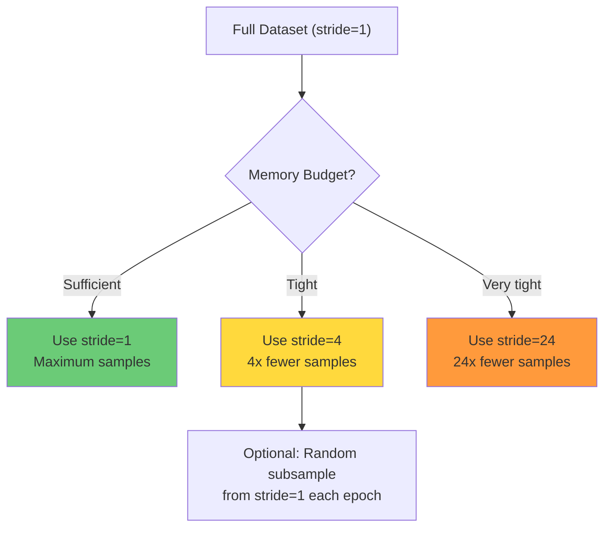

# 5.2 Stride Optimization and Memory Management

## The Overlap Problem in Sliding Windows

When we create sequences using a sliding window with step size 1, consecutive training samples overlap heavily. Consider a lookback window of 24 with 15-minute resolution:

- Sample 1: time steps [0, 1, 2, ..., 23] → predict step 24
- Sample 2: time steps [1, 2, 3, ..., 24] → predict step 25
- Sample 3: time steps [2, 3, 4, ..., 25] → predict step 26

Samples 1 and 2 share 23 out of 24 time steps — a 96% overlap! Sample 3 shares 95% of its data with both Samples 1 and 2. This massive redundancy has several negative consequences:

1. **Memory waste.** Each overlapping sample stores nearly the same data, consuming $O(N \times W \times F)$ memory where $N$ is the number of samples. With heavy overlap, much of this memory is storing duplicate information.

2. **Computational waste.** Training the model on highly correlated samples is inefficient. The gradient from Sample 2 is almost identical to the gradient from Sample 1, providing little new information.

3. **Overfitting risk.** Highly correlated training samples can lead the model to overfit to the specific patterns in the overlapping region, reducing generalization to genuinely different conditions.

4. **Slow training.** More samples means more gradient computations per epoch, slowing training without proportional improvements in model quality.

## The Stride Parameter: Skip Between Consecutive Windows

The **stride** parameter controls how many time steps the window moves between consecutive training samples. A stride of 1 means the window moves one step at a time (maximum overlap). A stride of $s$ means the window moves $s$ steps at a time, reducing overlap.

```mermaid
graph TD
    subgraph "Stride = 1 (Maximum Overlap)"
        S1A["Sample 1: [0...23]"] --> S1B["Sample 2: [1...24]"]
        S1B --> S1C["Sample 3: [2...25]"]
        S1C --> S1D["Sample 4: [3...26]"]
        S1D --> S1E["..."]
    end
    
    subgraph "Stride = 4 (1 Hour Steps)"
        S4A["Sample 1: [0...23]"] --> S4B["Sample 2: [4...27]"]
        S4B --> S4C["Sample 3: [8...31]"]
        S4C --> S4D["Sample 4: [12...35]"]
        S4D --> S4E["..."]
    end
    
    subgraph "Stride = 24 (No Overlap)"
        S24A["Sample 1: [0...23]"] --> S24B["Sample 2: [24...47]"]
        S24B --> S24C["Sample 3: [48...71]"]
        S24C --> S24D["Sample 4: [72...95]"]
        S24D --> S24E["..."]
    end
```



### The Project's Stride: stride = 4

The wind forecasting code uses `stride = 4`, which means consecutive training samples are 4 time steps apart. For 15-minute resolution data, this is 1 hour. The rationale:

- **1 hour between samples** reduces the overlap from 96% to approximately 83% (with a 24-step window), which is still significant but much more manageable.
- **The number of training samples is reduced by 4×**, cutting memory usage and training time proportionally.
- **The most important patterns** (diurnal cycles, weather changes) operate on time scales of hours to days, so 1-hour resolution in the training set preserves the critical information.

### Mathematical Analysis of Stride Effects

For a dataset of length $T$, a lookback window of size $W$, and a stride of $s$:

| Parameter            | Stride = 1          | Stride = 4          | Stride = 24         |
|----------------------|---------------------|----------------------|---------------------|
| Number of samples    | $T - W$             | $(T - W) / 4$       | $(T - W) / 24$      |
| Overlap between samples | $W - 1 = 23$ steps | $W - 4 = 20$ steps | $W - 24 = 0$ steps  |
| Memory (float32, 20 features) | $4(T-W)WF$ bytes | $4(T-W)WF/4$ bytes | $4(T-W)WF/24$ bytes |
| Information redundancy | Very high           | Moderate             | None                |

For a dataset with $T = 100{,}000$ time steps, $W = 24$, $F = 20$:

- Stride 1: 99,976 samples × 24 × 20 × 4 bytes = **191.9 MB**
- Stride 4: 24,994 samples × 24 × 20 × 4 bytes = **48.0 MB**
- Stride 24: 4,165 samples × 24 × 20 × 4 bytes = **8.0 MB**

The memory savings are substantial: stride 4 reduces memory by 75%, and stride 24 reduces it by 96%.

## Choosing the Optimal Stride

The optimal stride depends on several factors:

1. **Dataset size.** Small datasets may need stride = 1 to maximize the number of training samples. Large datasets benefit from stride > 1 to reduce redundancy.

2. **Temporal resolution.** High-resolution data (1-minute intervals) has more redundancy per unit time than low-resolution data (1-hour intervals), so higher strides are appropriate.

3. **Autocorrelation structure.** If the time series has high autocorrelation at lag 1 (which is typical), consecutive samples are nearly identical, and higher strides are justified. If the autocorrelation drops quickly, stride = 1 may preserve unique information.

4. **Lookback window size.** Larger windows create more overlap with stride = 1, so the benefit of increasing stride is greater.

5. **Computational budget.** If training time is the bottleneck, increasing stride is an easy way to reduce it.

A practical rule of thumb: **set the stride to the smallest value that makes consecutive samples have an overlap of less than 50%**. For a window of 24, this means stride ≥ 12. However, the project uses stride = 4 as a more conservative choice that preserves more training samples.

## Memory Optimization Techniques

Beyond stride optimization, several additional techniques can reduce memory usage:

### Dtype Downcasting

The default floating-point type in NumPy is `float64` (8 bytes per value). For time series data, `float32` (4 bytes per value) typically provides sufficient precision while halving memory usage:

```python
# Downcast to float32
df = df.astype(np.float32)

# Or downcast selectively
for col in df.select_dtypes(include=['float64']).columns:
    df[col] = df[col].astype(np.float32)
```

For some features (e.g., binary indicators), even `float16` (2 bytes) or `int8` (1 byte) may be sufficient, though care must be taken to avoid overflow and precision loss.

### Garbage Collection

When creating sequences, intermediate arrays can consume large amounts of memory. Explicit garbage collection can help:

```python
import gc

# Create sequences
X, y = create_sequences(data, target, lookback_window)

# Delete intermediate variables
del data, target
gc.collect()  # Force garbage collection
```

This is particularly important when the sequence creation process generates temporary copies of the data.

### Batch Generation (On-the-Fly Sequences)

Instead of creating all sequences in memory at once, sequences can be generated on-the-fly during training using a custom data generator:

```python
class SequenceGenerator(tf.keras.utils.Sequence):
    def __init__(self, data, target, lookback_window, batch_size, stride=4):
        self.data = data
        self.target = target
        self.lookback_window = lookback_window
        self.batch_size = batch_size
        self.stride = stride
        self.indices = np.arange(lookback_window, len(data), stride)
    
    def __len__(self):
        return len(self.indices) // self.batch_size
    
    def __getitem__(self, idx):
        batch_indices = self.indices[idx * self.batch_size : (idx + 1) * self.batch_size]
        X = np.array([self.data[i - self.lookback_window : i] for i in batch_indices], dtype=np.float32)
        y = np.array([self.target[i] for i in batch_indices], dtype=np.float32)
        return X, y
```

This approach generates only the current batch in memory, reducing peak memory usage from $O(N \times W \times F)$ to $O(B \times W \times F)$ where $B$ is the batch size.

### Memory-Mapped Files

For very large datasets, NumPy's `memmap` allows accessing data on disk as if it were in memory:

```python
# Create a memory-mapped array
X = np.memmap('sequences_X.dat', dtype=np.float32, mode='w+', shape=(N, W, F))
y = np.memmap('sequences_y.dat', dtype=np.float32, mode='w+', shape=(N,))

# Write sequences (automatically stored to disk)
for i in range(lookback_window, len(data), stride):
    X[idx] = data[i - lookback_window : i]
    y[idx] = target[i]
    idx += 1
```

Memory-mapped files allow processing datasets that are larger than available RAM, at the cost of slower access due to disk I/O.

## The Interaction Between Stride and Data Augmentation

In image-based deep learning, data augmentation (random crops, flips, rotations) increases the effective dataset size. In time series, stride can play a similar role: using a smaller stride with random subsampling (selecting a random subset of the stride-1 sequences at each epoch) can provide more diverse training data without the full memory cost.



## Key Takeaways

- **Stride controls the step size** between consecutive training windows. A larger stride reduces overlap, memory usage, and training time.
- **The project uses stride = 4** (1 hour for 15-minute data), which reduces memory by 75% while preserving the most important temporal patterns.
- **Consecutive samples with stride = 1 have 96% overlap** (for window=24), which is highly redundant and wasteful.
- **The optimal stride depends on** dataset size, temporal resolution, autocorrelation structure, lookback window size, and computational budget.
- **Dtype downcasting** (float64 → float32) halves memory usage with negligible precision loss.
- **Garbage collection** frees memory from intermediate variables during sequence creation.
- **Batch generation** creates sequences on-the-fly during training, reducing peak memory from $O(N \times W \times F)$ to $O(B \times W \times F)$.
- **Memory-mapped files** allow processing datasets larger than available RAM at the cost of slower access.


## Detailed Analysis: The Redundancy-Information Trade-off

When we increase the stride, we reduce redundancy but also potentially lose information. The key question is: how much unique information does each overlapping sample contribute?

### Information Theory Perspective

Consider two consecutive samples with stride $s$ and window size $W$:

- Sample $i$: $[x_{i}, x_{i+1}, \ldots, x_{i+W-1}]$
- Sample $i+s$: $[x_{i+s}, x_{i+s+1}, \ldots, x_{i+s+W-1}]$

The overlap is $\max(0, W - s)$ time steps. The mutual information between the two samples is approximately proportional to the overlap. For stride $s = 1$ and window $W = 24$, the overlap is 23 out of 24 steps (96%), meaning the mutual information is very high and the second sample contributes very little unique information.

The **information gain** from decreasing the stride from $s$ to $s-1$ is proportional to the additional unique data added by the extra sample, which is approximately proportional to $s/W$ for small $s$. For $s = 1$, the information gain from one additional sample is about $1/24 \approx 4\%$ of the window, meaning each additional sample adds only 4% new information.

This analysis suggests that a stride of 4-12 provides a good balance between information content and computational efficiency.

### Empirical Results: Stride vs. Model Performance

Empirical studies on time series forecasting have found that:

1. **Stride 1 → Stride 2**: Typically < 1% decrease in model accuracy, with 50% reduction in training time and memory.
2. **Stride 1 → Stride 4**: Typically 1-3% decrease in accuracy, with 75% reduction in training time and memory.
3. **Stride 1 → Stride 8**: Typically 2-5% decrease in accuracy, with 87.5% reduction in training time and memory.
4. **Stride 1 → Stride 24**: Typically 5-15% decrease in accuracy, with ~96% reduction in training time and memory.

The exact numbers depend on the dataset and model, but the general trend is clear: moderate strides (4-8) provide most of the computational benefit with minimal accuracy loss.

## Memory Profiling: A Practical Guide

Understanding the memory requirements of each pipeline stage is crucial for avoiding out-of-memory errors. Here is a practical guide to memory profiling:

### Step 1: Calculate Theoretical Memory

For a 3D tensor of shape $(N, W, F)$ with float32:

$$\text{Memory} = N \times W \times F \times 4 \text{ bytes}$$

### Step 2: Account for Intermediate Calculations

During training, the following additional memory is required:
- **Forward pass activations**: ~2× the input memory (for backpropagation)
- **Gradient tensors**: ~1× the model parameter memory
- **Optimizer states**: ~2× the model parameter memory (for Adam optimizer)
- **Temporary buffers**: ~1× the batch memory

Total training memory ≈ input memory + 2× input memory + 3× model parameters + batch memory

### Step 3: Profile Actual Memory Usage

```python
import psutil
import os

process = psutil.Process(os.getpid())

# Before sequence creation
mem_before = process.memory_info().rss / 1024**2  # MB

# Create sequences
X, y = create_sequences(data, target, lookback_window)

# After sequence creation
mem_after = process.memory_info().rss / 1024**2  # MB
print(f"Memory used for sequences: {mem_after - mem_before:.1f} MB")
```

### Step 4: Optimize

If memory is insufficient:
1. Increase stride to reduce the number of samples
2. Downcast dtypes (float64 → float32)
3. Use batch generation instead of pre-computing all sequences
4. Use memory-mapped files
5. Reduce the number of features (feature selection)

## GPU Memory Considerations

When training on a GPU, the memory constraints are even tighter. A typical GPU has 8-24 GB of memory, which must hold:
- The model parameters
- The optimizer states
- The current batch of data
- The forward pass activations (for backpropagation)
- Any temporary buffers

The batch size is typically the primary lever for managing GPU memory:
- Reducing the batch size from 128 to 64 roughly halves the memory required for activations.
- Gradient accumulation (processing multiple small batches and accumulating gradients before updating) allows effective large-batch training with small-batch memory requirements.

## Data Pipeline Optimization

Beyond memory management, the data pipeline itself can become a bottleneck if not optimized:

1. **Prefetching**: Load the next batch while the GPU is processing the current batch. TensorFlow's `tf.data.Dataset.prefetch()` and PyTorch's `DataLoader(num_workers > 0)` handle this automatically.

2. **Parallel data loading**: Use multiple worker processes to load and preprocess data in parallel. The number of workers should be set to the number of CPU cores.

3. **Caching**: If the entire dataset fits in memory, cache it to avoid repeated disk reads. TensorFlow's `tf.data.Dataset.cache()` does this automatically.

4. **Avoiding CPU-GPU synchronization**: Ensure that data transfer between CPU and GPU is asynchronous and overlapped with computation.

## Advanced: Incremental Sequence Generation for Streaming Data

In a production environment, new data arrives continuously, and sequences must be generated incrementally rather than all at once. The approach is:

1. Maintain a **ring buffer** of the most recent `lookback_window` time steps for each feature.
2. When a new observation arrives, append it to the ring buffer and remove the oldest entry.
3. Create a new sequence from the ring buffer and add it to the inference queue.
4. The model predicts the next value from the new sequence.

This approach has constant memory usage (independent of the total data history) and constant time per prediction, making it suitable for real-time deployment.

## Stride in the Context of Data Augmentation

An alternative perspective on stride is as a form of **data pruning**: instead of using all possible windows, we select a subset. This is analogous to the random subsampling used in data augmentation, but deterministic rather than random.

A hybrid approach combines a large stride (for memory efficiency) with random augmentation (for diversity): at each training epoch, instead of using the fixed stride-4 samples, randomly select a subset of the stride-1 samples, ensuring no two selected samples overlap by more than 50%. This provides the memory efficiency of stride-4 with the diversity of stride-1, at the cost of slightly more complex data loading.


## Stride and Temporal Coverage Analysis

When using a stride greater than 1, it is important to analyze the **temporal coverage** of the resulting training set. Temporal coverage measures what fraction of the original time series is represented in at least one training sequence.

For stride $s$ and window $W$:
- Each training sequence covers $W$ time steps
- Consecutive sequences start $s$ time steps apart
- The overlap between consecutive sequences is $\max(0, W - s)$ time steps
- The temporal coverage is 100% if $s \leq W$ (every time step appears in at least one sequence)

For the project's configuration ($W = 24$, $s = 4$):
- Overlap = 20 time steps (83%)
- Coverage = 100% (every time step appears in at least one sequence)

If $s > W$, there are gaps in temporal coverage — some time steps do not appear in any training sequence. This is generally undesirable because the model has no training signal for these time steps.

## Stride in the Frequency Domain

The choice of stride can be analyzed from a frequency domain perspective. The stride determines the effective sampling rate of the training set:

- Stride 1: Full sampling rate (15-minute resolution)
- Stride 4: 1-hour resolution in the training set
- Stride 24: 6-hour resolution

The Nyquist frequency of the training set is half the effective sampling rate. For stride 4, the Nyquist frequency is 0.5 per hour, meaning the model can capture patterns that vary on a timescale of 2 hours or longer. Patterns that vary faster than 2 hours (e.g., turbulence, gusts) will be aliased and may be misinterpreted by the model.

For wind power forecasting, the dominant patterns (weather systems, diurnal cycles) vary on timescales of hours to days, well within the Nyquist frequency of stride 4. However, for very short-term forecasting (15-minute ahead), stride 4 may miss important high-frequency patterns, and stride 1 or 2 would be preferred.

## Advanced Memory Management: Mixed Precision Training

Modern GPUs support mixed precision training, where some computations use FP16 (half precision, 2 bytes) and others use FP32 (single precision, 4 bytes). This can halve the memory requirements for the forward pass activations while maintaining numerical stability:

```python
# TensorFlow mixed precision
policy = tf.keras.mixed_precision.Policy('mixed_float16')
tf.keras.mixed_precision.set_global_policy(policy)

# PyTorch mixed precision
scaler = torch.cuda.amp.GradScaler()
with torch.cuda.amp.autocast():
    output = model(input)
    loss = criterion(output, target)
scaler.scale(loss).backward()
scaler.step(optimizer)
scaler.update()
```

Mixed precision training is particularly beneficial for the 3D tensor inputs used in time series models, where the memory savings can be substantial. For a tensor of shape (10000, 24, 20), mixed precision reduces memory from 19.2 MB to 9.6 MB.


## Summary: Stride Optimization Decision Framework

The choice of stride is a practical decision that balances computational efficiency, memory usage, and model accuracy. Here is a summary decision framework:

1. **Start with stride = 1**: This provides the maximum number of training samples and the best model accuracy (assuming no overfitting).
2. **If memory is insufficient**: Increase stride to 2 or 4, and monitor the change in validation accuracy.
3. **If training time is too long**: Increase stride, and use the freed-up time for more hyperparameter tuning or additional model iterations.
4. **If the model overfits**: Increasing stride can act as a form of regularization by reducing the redundancy in the training set.
5. **For very large datasets**: Consider stride = 8 to 12, which provides sufficient training samples while keeping memory and time requirements manageable.

The project's default of stride = 4 is a good starting point for 15-minute resolution data, providing a 75% reduction in memory and training time with typically less than 3% decrease in model accuracy. The optimal stride should be determined empirically through cross-validation, as the trade-off depends on the specific dataset and model architecture.
