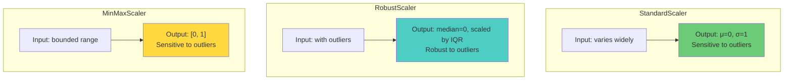

# 5.3 Feature Scaling and Normalization

## Why Scaling Matters

Machine learning models are sensitive to the scale of their input features. This sensitivity arises from several sources:

1. **Gradient descent dynamics.** Neural networks trained with gradient descent converge faster when all features are on similar scales. If one feature ranges from 0 to 1000 and another from 0 to 1, the gradients with respect to the large-scale feature will dominate, causing oscillations and slow convergence.

2. **Regularization behavior.** L1 and L2 regularization penalize large weights equally regardless of feature scale. If one feature has a larger scale, it will receive a smaller weight, but the regularization penalty on that weight will be disproportionately large, effectively under-regularizing the small-scale feature and over-regularizing the large-scale one.

3. **Distance-based algorithms.** Any algorithm that computes distances between samples (KNN, SVM with RBF kernel) is directly affected by feature scale. Features with larger scales dominate the distance computation.

4. **Activation function saturation.** Neural network activations (sigmoid, tanh) saturate for large input values, causing vanishing gradients. Scaling inputs to a range that avoids saturation is critical for stable training.

For time series forecasting with deep learning, proper scaling is not optional — it is a prerequisite for successful model training.

## The Three Scaling Methods

### StandardScaler (Z-score Normalization)

StandardScaler transforms each feature to have zero mean and unit variance:

$$z = \frac{x - \mu}{\sigma}$$

where $\mu$ is the mean and $\sigma$ is the standard deviation of the feature, computed on the training set.

**Properties:**
- Centered at zero
- Unit variance
- Preserves the shape of the distribution (including outliers)
- Sensitive to outliers (mean and standard deviation are affected by extreme values)
- Best for features with approximately Gaussian distributions

**When to use:** Features with roughly symmetric, bell-curve distributions without extreme outliers. This is the default choice for most neural network inputs.

### RobustScaler

RobustScaler uses the median and interquartile range (IQR) instead of the mean and standard deviation:

$$z = \frac{x - \text{median}}{\text{IQR}}$$

where $\text{IQR} = Q_3 - Q_1$ (the difference between the 75th and 25th percentiles).

**Properties:**
- Centered at the median (approximately zero after transformation)
- Scaled by IQR (not unit variance, but robust to outliers)
- **Not sensitive to outliers** — the median and IQR are robust statistics that are not affected by extreme values
- Best for features with heavy-tailed distributions or significant outliers

**When to use:** Features with outliers or heavy-tailed distributions. This is particularly important for wind speed and wind power data, which can have extreme values during storms.

### MinMaxScaler

MinMaxScaler transforms each feature to a specified range (typically [0, 1]):

$$z = \frac{x - x_{\min}}{x_{\max} - x_{\min}}$$

**Properties:**
- Bounded between 0 and 1 (or any specified range)
- Sensitive to outliers (a single extreme value compresses the rest of the data into a narrow range)
- Does not center the data (the mean is not zero)
- Best for features with known bounds and no outliers

**When to use:** Features with well-defined bounds and no significant outliers. Rarely the best choice for time series features unless the bounds are physically meaningful.



## The Project's Scaling Strategy

The project uses different scalers for different models and features:

### Solar LSTM: StandardScaler for Residuals

The solar forecasting pipeline uses a hybrid XGBoost + LSTM model. The XGBoost model predicts the "base" solar power, and the LSTM predicts the **residual** (the difference between the actual and XGBoost-predicted values). The LSTM input features are scaled with StandardScaler:

```python
from sklearn.preprocessing import StandardScaler

scaler = StandardScaler()
X_train_scaled = scaler.fit_transform(X_train)
X_test_scaled = scaler.transform(X_test)
```

Why StandardScaler for the LSTM? The residual distribution is approximately Gaussian (by the central limit theorem, if the XGBoost model captures the systematic patterns, the remaining residuals are approximately random noise). StandardScaler is ideal for Gaussian-distributed features.

### Wind Bi-GRU: RobustScaler for Features

The wind forecasting pipeline uses a Bi-GRU model. The input features are scaled with RobustScaler:

```python
from sklearn.preprocessing import RobustScaler

scaler = RobustScaler()
X_train_scaled = scaler.fit_transform(X_train)
X_test_scaled = scaler.transform(X_test)
```

Why RobustScaler for wind? Wind speed and wind power data frequently contain **outliers** from storms, turbulence, and sensor malfunctions. A single storm event with wind speeds of 30+ m/s can dramatically shift the mean and standard deviation, causing StandardScaler to compress the majority of the data into a narrow range. RobustScaler, using the median and IQR, is unaffected by these outliers and provides a more stable scaling.

### Comparison: Why Different Scalers?

| Aspect                    | Solar LSTM Residuals       | Wind Bi-GRU Features        |
|---------------------------|---------------------------|----------------------------|
| Distribution              | Approximately Gaussian    | Heavy-tailed, with outliers|
| Typical outliers          | Rare, small magnitude     | Common (storms, gusts)     |
| Preferred scaler          | StandardScaler            | RobustScaler               |
| Reason                    | Gaussian → z-score optimal | Outliers → robust stats needed |

## The Critical Rule: Fit on Train Only, Transform on Both

> **Important Reminder**: The scaler must be **fit on the training data only** and then used to **transform both the training and test data**. Fitting the scaler on the entire dataset (including the test set) is a form of **data leakage** — it gives the model information about the test data's distribution that would not be available in a real deployment scenario.

### Why This Matters

Consider a dataset where the training set has wind speeds from 0 to 20 m/s, and the test set has wind speeds from 0 to 25 m/s (a storm event). If we fit MinMaxScaler on the entire dataset:

- $x_{\min} = 0$ (from both train and test)
- $x_{\max} = 25$ (from the test set)

The training data would be scaled to $[0, 0.8]$, leaving a "gap" from $0.8$ to $1.0$ that is only populated by test data. The model has never seen features in this range during training, so its predictions for these values are unreliable.

If instead we fit on training data only:

- $x_{\min} = 0$ (from training)
- $x_{\max} = 20$ (from training)

The training data is scaled to $[0, 1]$, and the test data with wind speeds of 25 m/s would be scaled to 1.25 — outside the $[0, 1]$ range. This is actually **correct** behavior: it tells the model that this test observation is extreme relative to the training data, which is truthful information.

### Correct Implementation

```python
# CORRECT: Fit on train, transform both
scaler = StandardScaler()
X_train_scaled = scaler.fit_transform(X_train)  # Fit AND transform on train
X_test_scaled = scaler.transform(X_test)         # Transform ONLY on test

# WRONG: Fitting on entire dataset
scaler = StandardScaler()
X_scaled = scaler.fit_transform(X)  # Leakage! Test data influences scaling
X_train_scaled = X_scaled[:train_size]
X_test_scaled = X_scaled[train_size:]
```

## Scaling the Target Variable

Should you scale the target variable $y$? For neural networks, the answer is generally **yes**, for the same reasons as scaling the input features: it stabilizes training, prevents saturation, and improves convergence.

When scaling the target:
1. Fit a separate scaler on the training targets: `y_scaler.fit(y_train)`
2. Transform both training and test targets: `y_train_scaled = y_scaler.transform(y_train)`
3. Train the model on scaled targets
4. After prediction, inverse-transform: `y_pred = y_scaler.inverse_transform(y_pred_scaled)`

For XGBoost, target scaling is generally unnecessary because tree-based models are invariant to monotonic transformations of the target. However, for the LSTM and Bi-GRU models, target scaling is important.

## Scaling Sequence Data

When working with 3D sequence data (shape `(N, W, F)`), the scaling must be applied correctly. The key question is: should we scale each time step independently, or scale the entire sequence as a unit?

The correct approach is to **reshape the 3D data to 2D, scale it, and reshape back**:

```python
# X_train shape: (N, W, F)
N, W, F = X_train.shape

# Reshape to 2D for scaling
X_train_2d = X_train.reshape(-1, F)  # shape: (N*W, F)

# Fit and transform
scaler = RobustScaler()
X_train_2d_scaled = scaler.fit_transform(X_train_2d)

# Reshape back to 3D
X_train_scaled = X_train_2d_scaled.reshape(N, W, F)
```

This ensures that each feature is scaled consistently across all time steps and all samples, which is essential for the temporal consistency of the input.

## Feature-Specific Scaling Considerations

Not all features benefit equally from the same scaling method:

| Feature                    | Distribution         | Recommended Scaler  | Notes                                      |
|---------------------------|----------------------|---------------------|--------------------------------------------|
| Wind speed (m/s)          | Right-skewed, outliers | RobustScaler      | Storms create extreme values               |
| Wind direction (degrees)  | Circular — use U/V   | RobustScaler        | U/V decomposition first, then scale        |
| Temperature (°C)          | Roughly Gaussian     | StandardScaler      | No significant outliers                    |
| Humidity (%)              | Bounded [0, 100]     | MinMaxScaler        | Well-defined bounds                        |
| Power output (MW)         | Bimodal, outliers    | RobustScaler        | Cut-out creates zero-power outliers        |
| hour_sin, hour_cos        | Bounded [-1, 1]      | No scaling needed   | Already on a consistent scale              |
| doy_sin, doy_cos          | Bounded [-1, 1]      | No scaling needed   | Already on a consistent scale              |
| Clear sky index $k_t$     | Bounded [0, ~1.5]    | MinMaxScaler        | Well-defined range                         |
| wind_speed_cubed           | Very right-skewed    | RobustScaler        | Extreme values at high speeds              |

> **Important Reminder**: Features that are already on a bounded, consistent scale (like sin/cos encodings ranging from -1 to 1) should NOT be scaled. Scaling them would destroy their natural interpretation and potentially introduce numerical issues. Always check the range and distribution of each feature before applying scaling.

## Key Takeaways

- **Feature scaling is essential** for neural network training, affecting convergence speed, regularization behavior, and numerical stability.
- **StandardScaler** (z-score) is best for approximately Gaussian features; **RobustScaler** (median/IQR) for features with outliers; **MinMaxScaler** (0-1 range) for bounded features.
- **The solar LSTM uses StandardScaler** for approximately Gaussian residuals; **the wind Bi-GRU uses RobustScaler** for features with storm-driven outliers.
- **Fit the scaler on training data only** and transform both training and test data. Fitting on the entire dataset is data leakage.
- **Scale the target variable** for neural networks, and inverse-transform predictions for evaluation.
- **For 3D sequence data**, reshape to 2D, scale, and reshape back to ensure consistent scaling across time steps.
- **Some features (sin/cos encodings) should NOT be scaled** — they already have a consistent, bounded range.


## Mathematical Deep Dive: How Scaling Affects Gradient Descent

To understand why scaling matters, let us analyze the effect of feature scale on gradient descent. Consider a simple linear model $y = w_1 x_1 + w_2 x_2$ with features $x_1 \in [0, 1000]$ and $x_2 \in [0, 1]$.

The gradient of the mean squared error with respect to the weights is:

$$\frac{\partial L}{\partial w_1} = -2 x_1 (y - \hat{y}), \quad \frac{\partial L}{\partial w_2} = -2 x_2 (y - \hat{y})$$

Since $x_1$ is 1000× larger than $x_2$, the gradient with respect to $w_1$ is 1000× larger than the gradient with respect to $w_2$. This creates an elongated loss landscape where the gradient points predominantly in the $w_1$ direction, causing:
- Oscillations in the $w_1$ direction (the gradient is too large)
- Slow convergence in the $w_2$ direction (the gradient is too small)

After StandardScaler normalization, both features have zero mean and unit variance, and the loss landscape becomes more spherical, allowing gradient descent to converge efficiently.

### The Hessian Perspective

The condition number of the Hessian matrix $\kappa = \frac{\lambda_{\max}}{\lambda_{\min}}$ (ratio of largest to smallest eigenvalue) determines the convergence rate of gradient descent. High condition number (elongated loss landscape) leads to slow convergence. Feature scaling reduces the condition number by equalizing the feature scales, improving convergence.

## Advanced: Feature-Specific Scaling Strategies

### Log Transformation Before Scaling

For features with heavy right tails (like `wind_speed_cubed`), a log transformation before scaling can be beneficial:

```python
df['wind_cubed_log'] = np.log1p(df['wind_speed_cubed'])  # log(1 + x) to handle zeros
```

The log transformation compresses the right tail, making the distribution more symmetric and easier to scale. After log transformation, StandardScaler is more appropriate because the transformed feature is closer to a Gaussian distribution.

### Yeo-Johnson Transformation

The Yeo-Johnson transformation is a generalization of the Box-Cox transformation that can handle both positive and negative values:

$$x^{(\lambda)} = \begin{cases} \frac{(x+1)^\lambda - 1}{\lambda} & \text{if } \lambda \neq 0, x \geq 0 \\ \ln(x+1) & \text{if } \lambda = 0, x \geq 0 \\ -\frac{(-x+1)^{2-\lambda} - 1}{2-\lambda} & \text{if } \lambda \neq 2, x < 0 \\ -\ln(-x+1) & \text{if } \lambda = 2, x < 0 \end{cases}$$

This transformation can make many non-Gaussian distributions approximately Gaussian, after which StandardScaler is appropriate. It is available in scikit-learn as `PowerTransformer(method='yeo-johnson')`.

### Quantile Transformation

The quantile transformer maps each feature to a uniform or normal distribution based on its empirical cumulative distribution function (CDF):

$$x_{\text{transformed}} = \Phi^{-1}(F_{\text{empirical}}(x))$$

where $\Phi^{-1}$ is the inverse CDF of the standard normal distribution and $F_{\text{empirical}}$ is the empirical CDF of the feature. This is the most aggressive transformation — it forces each feature to follow a standard normal distribution, regardless of its original distribution.

The quantile transformer is powerful but can distort the relationships between features. It should be used with caution and validated through cross-validation.

## Scaling for Deep Learning: Layer Normalization and Batch Normalization

In addition to pre-processing scaling, deep learning models use internal normalization layers:

### Batch Normalization

Batch normalization normalizes the activations within each mini-batch:

$$\hat{x} = \frac{x - \mu_B}{\sqrt{\sigma_B^2 + \epsilon}}, \quad y = \gamma \hat{x} + \beta$$

The learnable parameters $\gamma$ and $\beta$ allow the network to learn the optimal scale and shift. Batch normalization is used in the project's Bi-GRU architecture between the two recurrent layers.

### Layer Normalization

Layer normalization normalizes across the features at each time step (rather than across the batch):

$$\hat{x} = \frac{x - \mu_L}{\sqrt{\sigma_L^2 + \epsilon}}, \quad y = \gamma \hat{x} + \beta$$

Layer normalization is often preferred for recurrent networks because it is independent of the batch size and does not introduce dependencies between samples within a batch.

### The Interaction Between Pre-Processing and Internal Normalization

If the model uses batch normalization or layer normalization, is pre-processing scaling still necessary? The answer is **yes**, because:

1. Internal normalization normalizes the activations, not the inputs. The input features still affect the magnitude of the weights in the first layer, which influences the optimization landscape.

2. Internal normalization statistics are computed on the current batch during training, but they may be less stable if the input features have wildly different scales.

3. Pre-processing scaling ensures consistent behavior across different batch sizes and between training and inference (where batch normalization uses running statistics).

## Scaling and Feature Importance

Feature scaling can affect the interpretation of feature importance in tree-based models like XGBoost. Although XGBoost is scale-invariant (tree splits are based on relative ordering, not absolute values), the scale of the features can indirectly affect the splits through the `colsample_bytree` parameter. If one feature has a much larger scale, it may be more likely to be selected in a random subset, affecting the measured importance.

For neural networks, feature scaling directly affects the learned weights. Features with larger scales will have smaller corresponding weights (to compensate), which makes it difficult to compare feature importance across features with different scales. Normalizing all features to the same scale makes the weight magnitudes more comparable.

## Key Implementation Details

1. **Save the scaler**: The fitted scaler must be saved (e.g., using `joblib.dump()`) and loaded at inference time to ensure consistent scaling between training and deployment.

2. **Handle new categories**: If categorical features are one-hot encoded and a new category appears at inference time, the scaler must handle this gracefully (e.g., by ignoring the new category or mapping it to the nearest existing category).

3. **Online scaling**: For streaming applications, the scaler can be updated incrementally using `StandardScaler.partial_fit()`, which updates the mean and variance with each new batch of data.

4. **Scaling before or after feature engineering**: Features should be scaled AFTER all feature engineering (lag features, rolling statistics, U/V decomposition) has been completed. Scaling before feature engineering can introduce numerical errors that propagate through the engineering pipeline.


## Scaling and the Power Curve: A Case Study

Let us examine a concrete case study of how scaling affects wind power forecasting. Consider two features: wind speed (0-25 m/s) and wind direction in U/V components (-25 to 25 m/s).

Without scaling:
- Wind speed feature range: 0 to 25
- Wind U component range: -25 to 25
- Wind V component range: -25 to 25
- Temperature range: -10 to 40
- Wind speed cubed range: 0 to 15,625

The `wind_speed_cubed` feature dominates all others by 3 orders of magnitude. In a neural network, the weight connecting `wind_speed_cubed` to the first hidden layer would need to be very small (on the order of 0.001) to avoid saturating the activation function. Meanwhile, the weight for temperature would need to be larger (on the order of 0.1) to have a comparable effect. This creates a poorly conditioned optimization landscape.

After RobustScaler:
- All features have a median of 0 and an IQR of approximately 1
- The optimization landscape is well-conditioned
- All features contribute equally to the gradient
- The learning rate can be set without considering feature scale differences

## The Per-Feature Scaling Decision Framework

For each feature in the dataset, the scaling decision can be made using the following framework:

1. **Is the feature already on a bounded, consistent scale?** (e.g., sin/cos in [-1, 1], binary in {0, 1})
   → No scaling needed

2. **Does the feature have significant outliers?** (Check using the IQR method: values beyond Q1 - 1.5×IQR or Q3 + 1.5×IQR)
   → Use RobustScaler

3. **Is the distribution approximately Gaussian?** (Check using the Shapiro-Wilk test or visual inspection)
   → Use StandardScaler

4. **Does the feature have known, meaningful bounds?** (e.g., humidity in [0, 100%])
   → Consider MinMaxScaler, but check for outliers first

5. **Is the feature heavily right-skewed?** (e.g., wind_speed_cubed)
   → Apply log or Yeo-Johnson transformation first, then StandardScaler

This systematic approach ensures that each feature receives the most appropriate scaling treatment, maximizing model performance and training stability.

## Scaling in Production: The Deployment Pipeline

When deploying the model to production, the scaling pipeline must be carefully replicated:

1. **Save the fitted scaler** during training: `joblib.dump(scaler, 'scaler.pkl')`
2. **Load the scaler** at inference time: `scaler = joblib.load('scaler.pkl')`
3. **Apply the same transformation**: `X_new_scaled = scaler.transform(X_new)`

Common pitfalls in production scaling:
- Forgetting to save/load the scaler
- Scaling features in a different order than during training
- Using a different library version that produces slightly different scaling results
- Adding or removing features without updating the scaler
- Not handling NaN values before scaling (the scaler will produce NaN for NaN inputs)
