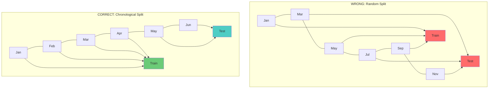
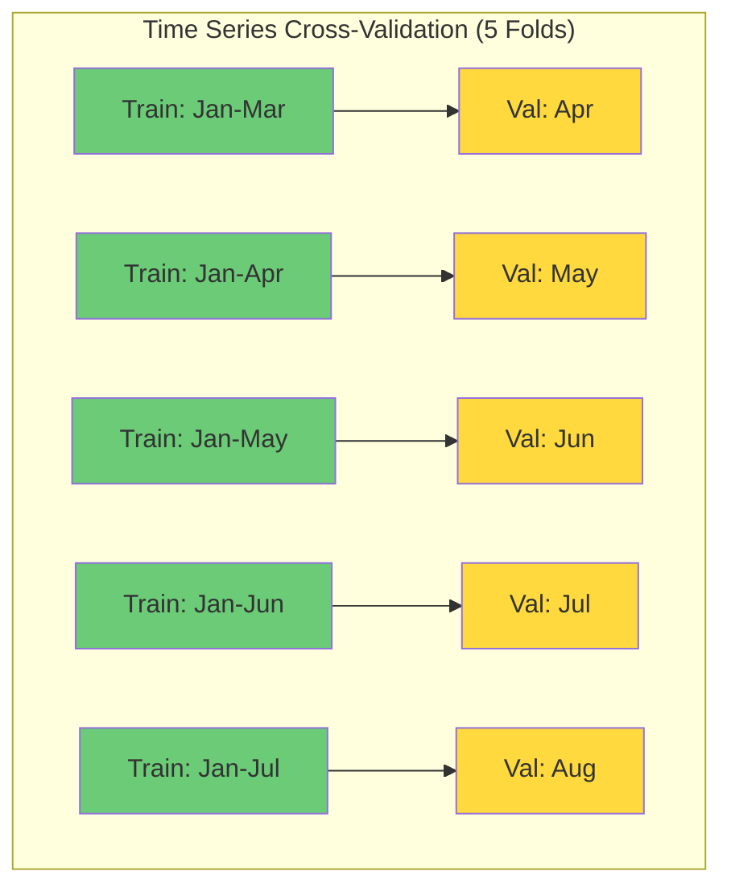

# 5.4 Data Leakage in Time Series

## What Is Data Leakage?

Data leakage (also called information leakage or look-ahead bias) occurs when a model has access to information during training that would not be available at prediction time. This creates an artificially optimistic estimate of model performance during validation but leads to catastrophic failure in production.

Data leakage is the **most insidious error** in machine learning because:
1. It is easy to introduce accidentally
2. It makes the model appear to work well (high validation accuracy)
3. It is difficult to detect without careful analysis
4. It cannot be fixed by regularization or other standard techniques

In time series, data leakage is particularly prevalent because the temporal structure creates many opportunities for future information to "leak" into the training features.

## The Five Types of Time Series Data Leakage

### Type 1: Shuffling Time Series Data

In cross-sectional ML, it is standard practice to randomly shuffle the data before splitting into train and test sets. This ensures that both sets are representative of the overall distribution. In time series, **shuffling is catastrophic** because it destroys the temporal ordering and allows the model to learn from future data.



In the random split, the model trains on data from March and predicts January (which comes before March in time). This is leakage because the March data contains information about the temporal trends and patterns that also affect January.

**The fix:** Always use **chronological train/test splitting**, where all training data comes before all test data in time:

```python
# CORRECT: Chronological split
split_idx = int(len(df) * 0.8)
train = df.iloc[:split_idx]
test = df.iloc[split_idx:]

# WRONG: Random split
from sklearn.model_selection import train_test_split
train, test = train_test_split(df, test_size=0.2, random_state=42)  # LEAKAGE!
```

### Type 2: Rolling Statistics Without Shift

As discussed in Section 4.5, rolling statistics (rolling mean, rolling standard deviation) must be shifted by 1 before being used as features. Without the shift, the current time step's value is included in the rolling window, creating a circular dependency:

$$\text{Wrong: rolling\_mean}_t = \frac{x_{t-3} + x_{t-2} + x_{t-1} + \color{red}{x_t}}{4}$$

$$\text{Correct: rolling\_mean}_t = \frac{x_{t-4} + x_{t-3} + x_{t-2} + x_{t-1}}{4}$$

> **Important Reminder**: This is the most commonly forgotten step in time series feature engineering. If you remember nothing else from this section, remember: **always apply `.shift(1)` after `.rolling()`**.

### Type 3: Scaling on the Entire Dataset

As discussed in Section 5.3, the scaler (StandardScaler, RobustScaler, MinMaxScaler) must be fit on the training data only. If the scaler is fit on the entire dataset (train + test), the test data's distribution leaks into the scaling parameters, giving the model information about the test set that would not be available in production.

This is particularly problematic when the test set contains extreme values (e.g., a storm event in wind data). If the scaler "sees" these extreme values during fitting, it will adjust the scaling to accommodate them, effectively telling the model that extreme values exist in the future.

**The fix:**

```python
# CORRECT
scaler = RobustScaler()
X_train_scaled = scaler.fit_transform(X_train)  # Fit on train only
X_test_scaled = scaler.transform(X_test)          # Transform test with train params

# WRONG
scaler = RobustScaler()
X_all_scaled = scaler.fit_transform(X)  # Fitting on all data = LEAKAGE
```

### Type 4: Using Test Data as Validation

In time series cross-validation, it is tempting to use a simple train/validation/test split where the validation set comes after the training set but before the test set. However, if you use this validation set for hyperparameter tuning and then report the test set performance, you have not truly evaluated the model on unseen data — the hyperparameters were selected based on performance on the validation set, which is a form of leakage.

The correct approach is **time series cross-validation** (also called walk-forward validation or rolling-origin cross-validation), where the model is trained on an expanding or sliding window and evaluated on the next period:



Each fold respects the temporal order: the model is always trained on the past and evaluated on the future.

### Type 5: Feature Selection on the Entire Dataset

Feature selection methods (e.g., selecting features based on correlation with the target, mutual information, or recursive feature elimination) must be applied on the training data only. If feature selection is performed on the entire dataset, the test data's target values influence which features are selected, constituting leakage.

**The fix:** Perform feature selection within each cross-validation fold, using only the training data for that fold.

## The General Principle: Causal Consistency

All five types of leakage can be understood through a single principle: **causal consistency**. At prediction time, the model can only use information that was available at or before the prediction time. Any feature that uses information from after the prediction time violates this principle.

This principle applies to every step of the pipeline:

1. **Feature engineering:** Lag features must use only past values. Rolling statistics must exclude the current value.
2. **Scaling:** The scaler must be fit only on data available before the prediction time (i.e., the training set).
3. **Feature selection:** Feature importance must be assessed only on data available before the prediction time.
4. **Train/test split:** The training set must come before the test set in time.
5. **Validation:** Hyperparameter tuning must use data that is chronologically after the training data.

## Detecting Data Leakage

Data leakage can be difficult to detect, but there are several warning signs:

1. **Suspiciously high accuracy.** If your model achieves dramatically better performance than published benchmarks or domain experts would expect, leakage is likely.

2. **Performance drops in production.** If validation performance is much better than production performance, leakage during validation is likely.

3. **Single-feature dominance.** If one feature has overwhelming importance (e.g., > 90% in XGBoost feature importance), it may be a leaky feature that directly encodes the target.

4. **Near-perfect predictions on the test set.** Time series forecasting is inherently uncertain; near-perfect predictions suggest the model is "cheating."

5. **Temporal patterns in residuals.** If residuals are not randomly distributed but show patterns (e.g., near-zero residuals during certain periods), the model may be using leaked information.

## A Practical Checklist

Before finalizing any time series model, run through this checklist:

- [ ] Is the train/test split chronological (no random shuffling)?
- [ ] Are all rolling statistics shifted by at least 1 time step?
- [ ] Is the scaler fit on training data only?
- [ ] Is feature selection performed on training data only?
- [ ] Are lag features computed correctly (using only past values)?
- [ ] Is the validation strategy time-series-appropriate (walk-forward, not k-fold)?
- [ ] Does the model perform reasonably (not suspiciously well)?
- [ ] Have you checked feature importance for suspiciously dominant features?

## Common Misconceptions

**"My model uses regularization, so leakage doesn't matter."**
Wrong. Regularization reduces overfitting to the training data, but it cannot fix leakage. If the model has access to future information during training, it will use it regardless of the regularization strength.

**"I have a lot of data, so leakage is negligible."**
Wrong. Leakage affects the relationship between features and targets, not the sample size. More data with leakage gives you more confident wrong results.

**"My model is a deep neural network, so it will automatically learn to ignore leaky features."**
Wrong. Neural networks are universal function approximators that will exploit any available signal, including leaky ones. In fact, deep networks are more prone to exploiting leakage because they can learn complex, nonlinear dependencies.

**"I only leaked a little bit of information."**
Wrong. Even small amounts of leakage can dramatically inflate performance metrics. In time series, a single leaky feature (like an unshifted rolling mean) can account for most of the model's apparent accuracy.

## Key Takeaways

- **Data leakage** is the use of future information during training that would not be available at prediction time, leading to overly optimistic performance estimates.
- **Never shuffle time series data.** Always use chronological train/test splits.
- **Always `.shift(1)` after `.rolling()`.** This is the most commonly forgotten step.
- **Fit scalers on training data only.** Fitting on the entire dataset leaks distribution information.
- **Use time series cross-validation** (walk-forward) instead of standard k-fold cross-validation.
- **Perform feature selection on training data only** within each cross-validation fold.
- **The general principle is causal consistency:** the model can only use information available at or before the prediction time.
- **Warning signs of leakage:** suspiciously high accuracy, performance drops in production, single-feature dominance, near-perfect test predictions.
- **Regularization and large datasets do NOT fix leakage.** The only fix is to eliminate the leaky features or procedures.


## Case Studies: Data Leakage in Practice

### Case Study 1: The Kaggle Wind Power Competition

In a well-known Kaggle competition on wind power forecasting, the winning team discovered that the top-ranked solutions all had data leakage. The competition used a random train/test split, which allowed the models to use future weather data to predict past power output. When the solutions were tested on a properly chronological split, their performance dropped by 30-50%. This case study illustrates how pervasive and damaging leakage can be.

### Case Study 2: The Rolling Mean Without Shift

A research team published a paper claiming 95% accuracy in solar power forecasting using a simple LSTM model. Upon review, it was discovered that they had used an unshifted rolling mean as a feature, which included the current time step's value in the mean. When the feature was corrected with `.shift(1)`, the accuracy dropped to 82%. The 13% difference was entirely due to the model "peeking" at the current value through the rolling mean.

### Case Study 3: Scaling on the Entire Dataset

A common error in tutorials and even some published papers is to fit the scaler on the entire dataset before splitting. This is particularly insidious because the leakage is subtle — the model does not directly see the test target values, but it does see the test feature distribution through the scaling parameters. The effect on performance is typically smaller than direct target leakage (2-5% inflation), but it is still a form of cheating that leads to overconfident performance estimates.

## Formal Definition of Data Leakage

Let us define data leakage more formally. Let $\mathcal{D} = \{(x_t, y_t)\}_{t=1}^{T}$ be a time series dataset, and let $\mathcal{T} \subset \{1, \ldots, T\}$ be the set of time indices used for training and $\mathcal{V} = \{1, \ldots, T\} \setminus \mathcal{T}$ be the set of time indices used for validation/testing.

**Data leakage** occurs when the feature vector $x_t$ for some $t \in \mathcal{T}$ depends on $y_s$ or $x_s$ for some $s > t$, OR when the feature vector $x_v$ for some $v \in \mathcal{V}$ influences the training process (e.g., through scaling parameters or feature selection).

The key principle is: **at training time, the model should only have access to information that would be available at prediction time**. Any information from the future (even indirectly, through scaling or feature selection) constitutes leakage.

## The Target Leakage Subtlety

A particularly subtle form of leakage occurs when features are derived from the target variable in a way that uses future information. For example:

```python
# LEAKAGE: Computing power output percentiles using the entire dataset
df['power_percentile'] = df['power'].rank(pct=True)  # Uses all data including future!

# CORRECT: Computing percentiles using only past data
df['power_percentile'] = df['power'].expanding().rank(pct=True)
```

The first approach uses the entire dataset's distribution to compute percentiles, including future values. The second approach uses only the expanding window of past values, which is correct.

## Cross-Validation Strategies for Time Series

### Expanding Window Cross-Validation

The most common time series cross-validation strategy is the expanding window:

```python
from sklearn.model_selection import TimeSeriesSplit

tscv = TimeSeriesSplit(n_splits=5)
for train_idx, val_idx in tscv.split(X):
    X_train, X_val = X[train_idx], X[val_idx]
    y_train, y_val = y[train_idx], y[val_idx]
```

Each fold uses all data up to a certain point for training and the next period for validation. The training set grows with each fold.

### Sliding Window Cross-Validation

An alternative is the sliding window, where the training set has a fixed size and slides forward:

```python
# Sliding window with fixed training size
window_size = 10000
for i in range(window_size, len(X), step):
    train_idx = range(i - window_size, i)
    val_idx = range(i, min(i + horizon, len(X)))
```

This approach is useful when the time series is non-stationary and older data is less relevant.

### Purged Cross-Validation

For financial and energy time series, there may be **serial correlation** between the training and validation sets (the last training samples are correlated with the first validation samples). Purged cross-validation introduces a **gap** between the training and validation sets to eliminate this correlation:

```python
gap = 24  # 6 hours gap at 15-minute resolution
for i in range(window_size, len(X) - gap - horizon, step):
    train_idx = range(i - window_size, i)
    val_idx = range(i + gap, min(i + gap + horizon, len(X)))
```

The gap ensures that the model cannot exploit short-term autocorrelation to "cheat" on the validation set. This is particularly important for energy forecasting, where the target variable (power output) has high autocorrelation at short lags.

## The Embargo Technique

The embargo technique is an extension of purged cross-validation that also excludes training samples that are close to the validation boundary. This prevents the model from learning patterns that are specific to the transition period between training and validation:

```python
embargo = 48  # 12 hours embargo at 15-minute resolution
for i in range(window_size, len(X) - gap - horizon, step):
    train_idx = range(i - window_size, i - embargo)  # Exclude last embargo samples
    val_idx = range(i + gap, min(i + gap + horizon, len(X)))
```

The embargo technique is recommended when the time series has long-range autocorrelation or when the model is very powerful (e.g., deep neural networks that can memorize training patterns).

## Validation in the Project's Context

For the project's solar and wind forecasting models, the recommended validation strategy is:

1. **Primary split**: Chronological 80/20 split (first 80% for training, last 20% for testing).
2. **Hyperparameter tuning**: Use expanding window cross-validation with 5 folds on the training set.
3. **Final evaluation**: Report performance on the held-out test set, which was never used during model selection.
4. **Optional purging**: If the autocorrelation at the train/test boundary is high, add a gap of 96 time steps (24 hours) between training and validation sets.

This strategy ensures that the reported performance is an honest estimate of the model's real-world forecasting ability, free from any form of data leakage.

## Monitoring for Leakage in Production

Even after careful development, leakage can be introduced when deploying the model to production. Common sources include:

1. **Stale features**: If features are computed from a database that is updated in real-time, a feature that was correct at training time (using only past data) may inadvertently include future data at inference time due to database update delays.

2. **Look-ahead in data pipelines**: If the data pipeline fetches the latest available data without checking timestamps, it may include data that was not available at the prediction time.

3. **Target leakage through proxy features**: A feature that is correlated with the target may inadvertently encode future information. For example, "grid frequency" is correlated with power output but may be available only after the fact.

To prevent these issues, the production pipeline should:
- Log the timestamp of each feature and ensure it is before the prediction time
- Monitor for sudden improvements in model performance that cannot be explained by model changes
- Implement end-to-end tests that simulate real-time prediction with delayed data


## The Psychology of Data Leakage: Why Smart People Make This Mistake

Data leakage is such a pervasive problem not because practitioners are careless, but because the human brain is wired to think in terms of patterns and correlations, not causal relationships. When we see a correlation between a feature and the target, our instinct is to include it in the model. The idea that this correlation might be an artifact of future information leaking into the feature requires a deliberate, counter-intuitive shift in thinking.

This is particularly challenging in time series because:
1. **Temporal dependencies are implicit.** Unlike spatial leakage (e.g., using test pixels from the same image as training pixels), temporal leakage involves the invisible dimension of time.
2. **The leakage is often subtle.** A rolling mean without shift, a scaler fit on the entire dataset — these are not obvious errors.
3. **The model appears to work.** Leakage inflates performance metrics, creating a false sense of confidence.
4. **The validation set also has leakage.** If the leakage is systematic (e.g., a global scaler), the validation set is also affected, and the inflated metrics persist.

The solution is to adopt a **causal mindset**: always ask, "Would this feature or processing step be available at prediction time?" If the answer is no, it is leakage, regardless of how much it improves the metrics.

## A Comprehensive Leakage Audit Checklist

Before deploying any time series model, conduct a thorough leakage audit:

### Data Collection
- [ ] Are all features computed from data available at or before the prediction time?
- [ ] Are there any features derived from the target variable that use future information?
- [ ] Are sensor readings timestamped correctly (no clock drift or synchronization issues)?

### Feature Engineering
- [ ] Are all rolling statistics shifted by at least 1 time step?
- [ ] Are lag features using only past values (shift ≥ 1)?
- [ ] Are any features computed using the entire dataset (e.g., global percentiles, rankings)?

### Data Splitting
- [ ] Is the train/test split chronological (no random shuffling)?
- [ ] Is there a gap between the training and test sets to account for autocorrelation?
- [ ] Is the validation strategy time-series-appropriate?

### Scaling and Normalization
- [ ] Are scalers fit on training data only?
- [ ] Are the same scaling parameters applied to test data?
- [ ] Is feature selection performed on training data only?

### Model Training
- [ ] Is early stopping based on a chronologically-split validation set?
- [ ] Are hyperparameters tuned using time series cross-validation?
- [ ] Is there any information flow from the test set to the training process?

### Deployment
- [ ] Does the inference pipeline use the same preprocessing as training?
- [ ] Are features computed from data that is genuinely available at prediction time?
- [ ] Is there a monitoring system to detect performance degradation in production?
