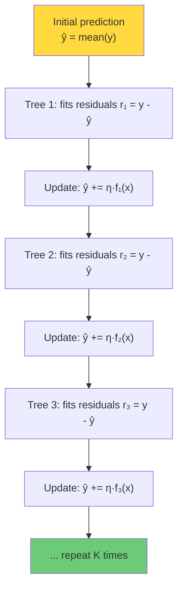

# 6.1 Decision Trees and XGBoost Mathematics

## Decision Tree Fundamentals

A decision tree is a predictive model that maps observations to target values through a series of hierarchical if-then-else rules. Each internal node represents a test on a feature, each branch represents the outcome of the test, and each leaf node represents a predicted value.

For regression tasks (like power forecasting), the tree partitions the feature space into rectangular regions and assigns a constant prediction to each region. The prediction for a region is typically the mean of the training target values in that region.

### How a Tree Is Built: Recursive Binary Splitting

The tree is built top-down by recursively splitting the feature space:

1. Start with the entire feature space (all training data in one region).
2. Find the feature $j$ and threshold $t$ that minimizes the impurity of the resulting two regions.
3. Split the data into two regions: $R_1 = \{x : x_j \leq t\}$ and $R_2 = \{x : x_j > t\}$.
4. Repeat steps 2-3 for each region until a stopping criterion is met.

### Impurity Measures for Regression

For regression, the impurity measure is the **sum of squared residuals** (also called the within-region variance):

$$\text{impurity}(R) = \sum_{x_i \in R} (y_i - \bar{y}_R)^2$$

where $\bar{y}_R$ is the mean target value in region $R$. The goal is to find the split that minimizes the total impurity:

$$\text{impurity}(R_1) + \text{impurity}(R_2) < \text{impurity}(R_{\text{parent}})$$

### Stopping Criteria

Common stopping criteria include:
- Maximum depth (the project uses `max_depth=6`)
- Minimum samples per leaf
- Minimum impurity decrease

## From Decision Trees to Gradient Boosting

A single decision tree is limited in expressiveness and prone to overfitting (if deep) or underfitting (if shallow). **Gradient boosting** overcomes these limitations by combining many weak learners (shallow trees) into a strong ensemble.

### The Boosting Principle: Sequential Error Correction

Gradient boosting builds trees sequentially, where each new tree is trained to correct the errors of the previous ensemble. The key insight is:

**If the current ensemble's predictions have residuals $r_i = y_i - \hat{y}_i$, the next tree should predict these residuals. By adding the new tree's predictions to the ensemble, we reduce the residuals.**

This is why it is called "gradient" boosting — the residuals are the negative gradients of the squared error loss function:

$$r_i = -\frac{\partial L}{\partial \hat{y}_i} = y_i - \hat{y}_i \quad \text{(for squared error loss)}$$

Each tree takes a "step" in the direction that reduces the loss, analogous to gradient descent in parameter space.

### The Additive Model

The gradient boosting model is an additive model:

$$\hat{y}_i = \sum_{k=1}^{K} f_k(x_i) = f_1(x_i) + f_2(x_i) + \cdots + f_K(x_i)$$

where each $f_k$ is a decision tree. The model is built greedily:

$$\hat{y}_i^{(k)} = \hat{y}_i^{(k-1)} + f_k(x_i)$$

where $\hat{y}_i^{(k)}$ is the prediction after adding the $k$-th tree.



## XGBoost: Extreme Gradient Boosting

XGBoost (eXtreme Gradient Boosting) is an optimized implementation of gradient boosting that introduces several key innovations. Let us examine the mathematics.

### The Objective Function

XGBoost's objective function at iteration $t$ is:

$$\text{Obj}^{(t)} = \sum_{i=1}^{n} L(y_i, \hat{y}_i^{(t-1)} + f_t(x_i)) + \Omega(f_t)$$

where:
- $L$ is the training loss (e.g., squared error)
- $\hat{y}_i^{(t-1)}$ is the prediction from the previous iteration
- $f_t(x_i)$ is the new tree's prediction
- $\Omega(f_t)$ is the regularization term for the new tree

### Second-Order Taylor Expansion

Instead of using just the first-order gradient (as in standard gradient boosting), XGBoost uses a **second-order Taylor expansion** of the loss function:

$$L(y_i, \hat{y}_i^{(t-1)} + f_t(x_i)) \approx L(y_i, \hat{y}_i^{(t-1)}) + g_i f_t(x_i) + \frac{1}{2} h_i f_t^2(x_i)$$

where:
- $g_i = \frac{\partial L}{\partial \hat{y}_i^{(t-1)}}$ is the first-order gradient (the residual for squared error)
- $h_i = \frac{\partial^2 L}{\partial \hat{y}_i^{(t-1)2}}$ is the second-order gradient (the Hessian, which is 1 for squared error)

Using the second-order expansion provides a more accurate approximation of the loss, leading to better splits and faster convergence. The Hessian tells us about the curvature of the loss landscape — in regions of high curvature, the model should take smaller steps.

### The Regularization Term

The regularization term penalizes complex trees:

$$\Omega(f) = \gamma T + \frac{1}{2} \lambda \sum_{j=1}^{T} w_j^2$$

where:
- $T$ is the number of leaves in the tree
- $w_j$ is the prediction value (weight) of the $j$-th leaf
- $\gamma$ is the penalty for adding a new leaf (controls tree complexity)
- $\lambda$ is the L2 regularization on leaf weights (controls prediction magnitude)

### The Optimal Split

With the Taylor expansion and regularization, the objective for a candidate split that divides the data into left ($L$) and right ($R$) subsets is:

$$\text{Gain} = \frac{1}{2} \left[\frac{(\sum_{i \in L} g_i)^2}{\sum_{i \in L} h_i + \lambda} + \frac{(\sum_{i \in R} g_i)^2}{\sum_{i \in R} h_i + \lambda} - \frac{(\sum_{i \in L \cup R} g_i)^2}{\sum_{i \in L \cup R} h_i + \lambda}\right] - \gamma$$

A split is made only if the gain exceeds $\gamma$. This provides a natural pruning mechanism: splits that do not improve the objective by at least $\gamma$ are not made.

### Optimal Leaf Weights

The optimal weight for leaf $j$ is:

$$w_j^* = -\frac{\sum_{i \in R_j} g_i}{\sum_{i \in R_j} h_i + \lambda}$$

For squared error loss ($g_i = y_i - \hat{y}_i$, $h_i = 1$):

$$w_j^* = \frac{\sum_{i \in R_j} (y_i - \hat{y}_i)}{n_j + \lambda}$$

This is a **shrinkage** of the mean residual by the factor $\frac{n_j}{n_j + \lambda}$. For leaves with few samples ($n_j$ small), the shrinkage is strong, preventing overfitting. For leaves with many samples, the shrinkage is weak, allowing the tree to capture the true pattern.

## Hyperparameters in Config.XGB_PARAMS Explained

The project's XGBoost configuration contains several important hyperparameters:

### n_estimators

```python
'n_estimators': 500
```

The number of boosting rounds (trees). More trees generally improve performance but increase training time and risk overfitting. With early stopping (monitoring validation loss), 500 trees provides plenty of capacity — the model will stop training when validation loss stops improving.

### max_depth

```python
'max_depth': 6
```

The maximum depth of each tree. Deeper trees can capture more complex interactions but are more prone to overfitting. A depth of 6 allows each tree to capture up to $2^6 = 64$ distinct regions of the feature space. In gradient boosting, individual trees should be "weak learners" — shallow trees that capture only the most prominent patterns. The ensemble's strength comes from combining many weak learners, not from individual deep trees.

### learning_rate (eta)

```python
'learning_rate': 0.05
```

The learning rate $\eta$ scales each tree's contribution:

$$\hat{y}_i^{(t)} = \hat{y}_i^{(t-1)} + \eta \cdot f_t(x_i)$$

A smaller learning rate requires more trees but provides more granular error correction. $\eta = 0.05$ is a common choice that balances convergence speed and model quality. The rule of thumb: use a small learning rate (0.01-0.1) with many trees (100-1000), and rely on early stopping to determine the optimal number of trees.

### subsample

```python
'subsample': 0.8
```

The fraction of training samples used to build each tree. `subsample=0.8` means each tree is trained on a random 80% of the training data. This introduces randomness that:
1. Reduces overfitting (each tree sees a different subset)
2. Speeds up training (fewer samples per tree)
3. Improves generalization (the ensemble is more diverse)

This is analogous to bagging in random forests, but applied to the boosting framework.

### colsample_bytree

```python
'colsample_bytree': 0.8
```

The fraction of features (columns) used to build each tree. `colsample_bytree=0.8` means each tree considers a random 80% of the features when making splits. This:
1. Prevents dominant features from appearing in every tree
2. Increases diversity among the trees
3. Reduces overfitting
4. Speeds up training (fewer features to consider at each split)

For the solar forecasting model with ~15 features, each tree uses ~12 features.

### reg_alpha (L1 Regularization)

```python
'reg_alpha': 0.1
```

L1 regularization on leaf weights. This adds a penalty $\alpha \sum_j |w_j|$ to the objective. L1 regularization encourages **sparsity** — many leaf weights become exactly zero, effectively performing feature selection within the tree. This is useful when some features are irrelevant or noisy.

### reg_lambda (L2 Regularization)

```python
'reg_lambda': 1.0
```

L2 regularization on leaf weights. This adds a penalty $\frac{1}{2} \lambda \sum_j w_j^2$ to the objective (this is the $\lambda$ in the formulas above). L2 regularization encourages **small weights**, preventing any single tree from dominating the ensemble. This is the primary regularization mechanism in XGBoost.

### objective

```python
'objective': 'reg:squarederror'
```

The loss function. `reg:squarederror` uses the mean squared error $L = \frac{1}{2}(y - \hat{y})^2$, giving:
- First-order gradient: $g_i = \hat{y}_i - y_i$ (negative residual)
- Second-order gradient: $h_i = 1$

This is the standard choice for regression tasks where outliers are not a major concern.

## Why XGBoost Works Well for Solar Power Forecasting

XGBoost is the first stage of the project's hybrid solar forecasting model. It works well because:

1. **Handles mixed feature types.** The solar dataset contains continuous features (GHI, temperature), cyclical features (hour_sin, hour_cos), and lag features. XGBoost handles all of these naturally through its split-based approach.

2. **Captures nonlinear interactions.** The relationship between solar features and power output is highly nonlinear (e.g., the interaction between cloud cover and solar angle). XGBoost captures these through hierarchical splits.

3. **Robust to feature scale.** Tree-based models are invariant to monotonic transformations, so feature scaling is not required (though it does not hurt).

4. **Feature importance.** XGBoost provides built-in feature importance metrics, allowing interpretation of which features drive solar power predictions.

5. **Fast training.** XGBoost's optimized implementation with histogram-based splits and parallel processing trains quickly even on large datasets.

## Key Takeaways

- **Decision trees** partition the feature space into rectangular regions through recursive binary splitting, minimizing impurity at each split.
- **Gradient boosting** builds trees sequentially, with each new tree correcting the residuals (errors) of the previous ensemble.
- **XGBoost** uses a second-order Taylor expansion of the loss function, providing more accurate split decisions and faster convergence than first-order gradient boosting.
- **The regularization term** $\Omega(f) = \gamma T + \frac{1}{2}\lambda \sum w_j^2$ penalizes tree complexity and large leaf weights, preventing overfitting.
- **Key hyperparameters**: `n_estimators` (number of trees), `max_depth` (tree depth), `learning_rate` (shrinkage), `subsample` (row sampling), `colsample_bytree` (column sampling), `reg_alpha` (L1), `reg_lambda` (L2), and `objective` (loss function).
- **The learning rate and number of trees** should be tuned together: small learning rate + many trees + early stopping.
- **XGBoost is used as the first stage** of the hybrid solar model, capturing the primary patterns that the LSTM then refines by predicting the residuals.


## Detailed Derivation: The Optimal Split Gain Formula

Let us derive the XGBoost split gain formula step by step. Starting from the objective:

$$\text{Obj}^{(t)} = \sum_{i=1}^{n} L(y_i, \hat{y}_i^{(t-1)} + f_t(x_i)) + \Omega(f_t)$$

Applying the second-order Taylor expansion:

$$\text{Obj}^{(t)} \approx \sum_{i=1}^{n} \left[ L(y_i, \hat{y}_i^{(t-1)}) + g_i f_t(x_i) + \frac{1}{2} h_i f_t^2(x_i) \right] + \Omega(f_t)$$

Since $L(y_i, \hat{y}_i^{(t-1)})$ is constant with respect to $f_t$, we can remove it:

$$\tilde{\text{Obj}}^{(t)} = \sum_{i=1}^{n} \left[ g_i f_t(x_i) + \frac{1}{2} h_i f_t^2(x_i) \right] + \Omega(f_t)$$

For a tree with $T$ leaves, each sample $i$ is assigned to a leaf $q(x_i)$ with weight $w_{q(x_i)}$. Substituting and expanding the regularization:

$$\tilde{\text{Obj}}^{(t)} = \sum_{j=1}^{T} \left[ \left(\sum_{i \in R_j} g_i\right) w_j + \frac{1}{2} \left(\sum_{i \in R_j} h_i + \lambda\right) w_j^2 \right] + \gamma T$$

Define $G_j = \sum_{i \in R_j} g_i$ and $H_j = \sum_{i \in R_j} h_i$. Then:

$$\tilde{\text{Obj}}^{(t)} = \sum_{j=1}^{T} \left[ G_j w_j + \frac{1}{2} (H_j + \lambda) w_j^2 \right] + \gamma T$$

Minimizing with respect to $w_j$:

$$\frac{\partial \tilde{\text{Obj}}}{\partial w_j} = G_j + (H_j + \lambda) w_j = 0$$

$$w_j^* = -\frac{G_j}{H_j + \lambda}$$

Substituting back:

$$\tilde{\text{Obj}}^* = -\frac{1}{2} \sum_{j=1}^{T} \frac{G_j^2}{H_j + \lambda} + \gamma T$$

Now, for a candidate split that divides leaf $j$ into left ($L$) and right ($R$) children, the gain is:

$$\text{Gain} = \frac{G_L^2}{H_L + \lambda} + \frac{G_R^2}{H_R + \lambda} - \frac{(G_L + G_R)^2}{H_L + H_R + \lambda} - \gamma$$

This is the exact formula used by XGBoost to evaluate splits. The gain measures how much the objective improves by making the split. A positive gain means the split is beneficial; a negative gain (after subtracting $\gamma$) means the split is not worth making.

## Early Stopping in XGBoost

Early stopping is a critical technique for preventing overfitting in gradient boosting. The idea is to monitor the model's performance on a validation set after each boosting round and stop training when the validation performance stops improving.

```python
model = xgb.XGBRegressor(
    n_estimators=500,
    learning_rate=0.05,
    max_depth=6,
    # ... other parameters
)

model.fit(
    X_train, y_train,
    eval_set=[(X_val, y_val)],
    early_stopping_rounds=50,
    verbose=False
)
```

With `early_stopping_rounds=50`, training stops if the validation loss has not improved for 50 consecutive rounds. This means the actual number of trees used may be much less than 500.

The early stopping mechanism is particularly important in the project because:
1. It automatically determines the optimal number of trees, eliminating the need for manual tuning.
2. It prevents overfitting by stopping before the model starts memorizing the training data.
3. It saves training time by not building unnecessary trees.

## Feature Importance in XGBoost

XGBoost provides several methods for computing feature importance:

### Weight (Number of Splits)

The number of times a feature is used to split the data across all trees. Simple and intuitive, but biased toward features with many possible split points (continuous features).

### Gain (Average Improvement)

The average improvement in the objective function when a feature is used for splitting. This is the most informative importance metric because it directly measures how much each feature contributes to reducing the loss.

### Cover (Average Coverage)

The average number of samples affected by splits using the feature. This gives weight to features that affect many samples, even if the per-split improvement is small.

### Total Gain

The total improvement across all splits using the feature (sum, not average). This combines the frequency of use (weight) with the per-split improvement (gain).

For the solar forecasting model, the expected feature importance ranking is:

1. **GHI or clear sky index** — the dominant feature for solar power
2. **hour_cos** — captures the diurnal cycle
3. **doy_cos** — captures the seasonal cycle
4. **temperature** — affects panel efficiency
5. **Lag features** — capture short-term persistence

If the feature importance ranking differs significantly from this expectation, it may indicate a problem with the feature engineering or data pipeline.

## XGBoost vs. Other Gradient Boosting Implementations

| Feature              | XGBoost           | LightGBM             | CatBoost              |
|----------------------|-------------------|----------------------|-----------------------|
| Split finding        | Histogram-based   | Histogram-based      | Ordered boosting      |
| Tree growth          | Level-wise        | Leaf-wise            | Symmetric trees       |
| Categorical handling | One-hot encoding  | Native support       | Native support        |
| Missing values       | Native handling   | Native handling      | Native handling       |
| Speed                | Fast              | Very fast            | Moderate              |
| Memory usage         | Moderate          | Low                  | High                  |
| Accuracy             | High              | High (may overfit)   | High                  |

XGBoost is a solid, well-tested choice for the project. LightGBM would be faster for very large datasets, and CatBoost would be better if the dataset has many categorical features. For the UNISOLAR and SDWPF datasets, XGBoost provides the best balance of accuracy, speed, and interpretability.

## The Bias-Variance Decomposition in Gradient Boosting

Gradient boosting has an interesting bias-variance profile:

- **Low bias**: The sequential error correction mechanism ensures that the ensemble has low bias, as each new tree addresses the remaining errors.
- **Increasing variance**: As more trees are added, the model becomes more complex and the variance increases. This is controlled by the learning rate and regularization.

The learning rate controls the bias-variance trade-off:
- **Small learning rate**: Each tree contributes a small correction, resulting in slow bias reduction but also slow variance increase. The model is more stable but requires more trees.
- **Large learning rate**: Each tree contributes a large correction, resulting in fast bias reduction but also fast variance increase. The model is less stable and may oscillate.

The optimal learning rate is the one that minimizes the total error (bias² + variance), which is typically found through cross-validation. The project uses a learning rate of 0.05, which is in the common range of 0.01-0.1.


## The Impact of Regularization on the Split Gain

The regularization parameters $\gamma$ and $\lambda$ have a direct impact on the split gain formula:

$$\text{Gain} = \frac{G_L^2}{H_L + \lambda} + \frac{G_R^2}{H_R + \lambda} - \frac{(G_L + G_R)^2}{H_L + H_R + \lambda} - \gamma$$

### Effect of $\gamma$ (Minimum Split Gain)

When $\gamma$ is large, many splits that would improve the objective by a small amount are pruned. This results in:
- Fewer, simpler trees
- Less overfitting
- Potentially underfitting if $\gamma$ is too large

A common approach is to start with $\gamma = 0$ (no minimum) and increase it until the validation performance starts to degrade. For the project, $\gamma$ is typically left at 0 or set to a small value (0.01-0.1), relying on other regularization parameters (subsample, colsample, $\lambda$) to control overfitting.

### Effect of $\lambda$ (L2 Regularization on Leaf Weights)

The $\lambda$ parameter appears in the denominator of the gain formula and the leaf weight formula:

$$w_j^* = -\frac{G_j}{H_j + \lambda}$$

When $\lambda$ is large:
- The leaf weights are shrunk toward zero (stronger regularization)
- The gain is reduced (splits must provide more improvement to be worth making)
- The model is more conservative, with smaller predictions

The project uses $\lambda = 1.0$, which is the default value. This provides moderate regularization without being too aggressive.

### Effect of $\alpha$ (L1 Regularization on Leaf Weights)

The $\alpha$ parameter adds an L1 penalty to the leaf weights, encouraging sparsity. The optimal leaf weight with L1 regularization is:

$$w_j^* = -\frac{G_j}{H_j + \lambda} \text{ if } |G_j| > \alpha, \text{ else } 0$$

When $\alpha$ is large, many leaf weights become exactly zero, effectively pruning branches of the tree. The project uses $\alpha = 0.1$, which provides mild sparsity encouragement.

## XGBoost for Time Series: Special Considerations

While XGBoost is not inherently designed for time series, it can be very effective when used with appropriate feature engineering. Key considerations include:

### Temporal Consistency

XGBoost treats each sample independently, with no awareness of temporal ordering. This means the model can learn inconsistent patterns across time steps (e.g., predicting a sudden jump in power output between consecutive time steps). To mitigate this:
- Include lag features that provide temporal context
- Include difference features that capture the rate of change
- Use the hybrid approach (XGBoost for the base + LSTM for the residual) to add temporal consistency

### Feature Interactions

XGBoost naturally captures feature interactions through its tree structure. For solar forecasting, important interactions include:
- GHI × hour_cos: The effect of irradiance depends on the time of day
- Temperature × doy_cos: The effect of temperature depends on the season
- Wind speed × wind direction: The effect of wind speed depends on the direction

The `max_depth` parameter controls the maximum number of interactions that can be captured. With `max_depth=6`, the model can capture interactions of up to 6 features, which is sufficient for most practical purposes.
