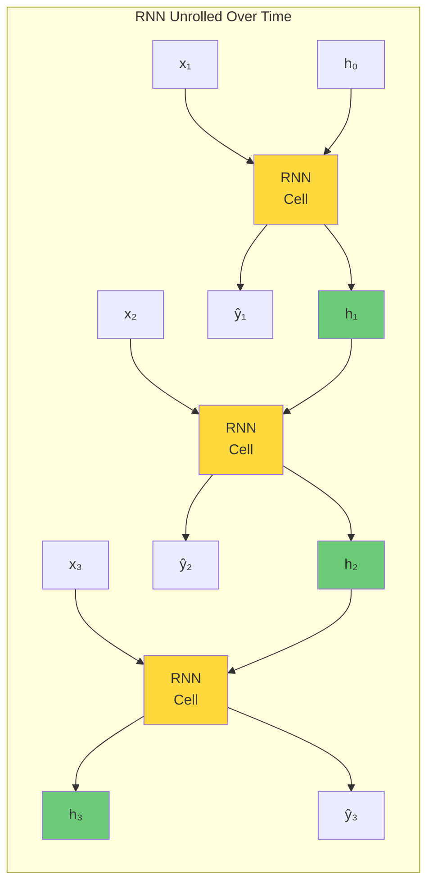
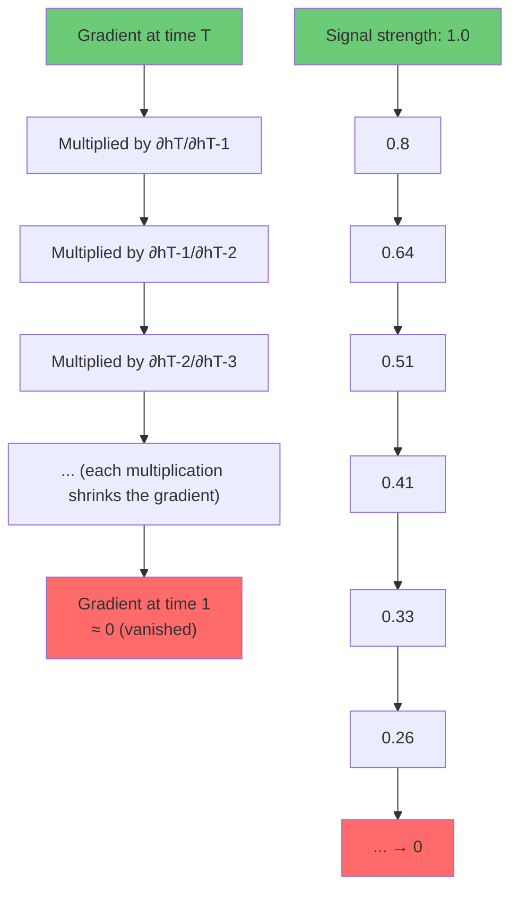

# 6.2 Recurrent Neural Networks and Vanishing Gradients

## The Sequential Processing Problem

Standard feedforward neural networks process each input independently — there is no concept of "memory" or "sequence." For time series data, this is a fundamental limitation because the output at time $t$ depends not just on the current input $x_t$ but on the entire history of inputs $x_1, x_2, \ldots, x_t$.

Recurrent Neural Networks (RNNs) address this by introducing a **hidden state** that propagates information across time steps.

## The RNN Cell

At each time step $t$, the RNN computes:

$$h_t = \tanh(W_h h_{t-1} + W_x x_t + b)$$

where:
- $h_t$ is the hidden state at time $t$
- $h_{t-1}$ is the hidden state from the previous time step
- $x_t$ is the input at time $t$
- $W_h$ is the weight matrix for the hidden-to-hidden connection
- $W_x$ is the weight matrix for the input-to-hidden connection
- $b$ is the bias vector
- $\tanh$ is the activation function (squashes the output to $[-1, 1]$)

The hidden state $h_t$ serves as the network's "memory" — it encodes information from all previous inputs, compressed into a fixed-size vector. At each time step, the new input $x_t$ and the previous hidden state $h_{t-1}$ are combined to update the memory.



### The Output

The output at each time step is computed from the hidden state:

$$\hat{y}_t = W_y h_t + b_y$$

For sequence-to-sequence tasks, an output is produced at each time step. For sequence-to-one tasks (like our power forecasting, where we want a single prediction after processing the entire sequence), only the final output $\hat{y}_T$ is used.

## Training RNNs: Backpropagation Through Time (BPTT)

RNNs are trained using **backpropagation through time** (BPTT), which is the standard backpropagation algorithm applied to the "unrolled" network. The key challenge is computing the gradient of the loss with respect to the recurrent weights $W_h$.

Consider a loss that depends on the final hidden state: $L = L(h_T)$. The gradient with respect to $W_h$ is:

$$\frac{\partial L}{\partial W_h} = \sum_{t=1}^{T} \frac{\partial L}{\partial h_T} \cdot \frac{\partial h_T}{\partial h_t} \cdot \frac{\partial h_t}{\partial W_h}$$

The critical term is $\frac{\partial h_T}{\partial h_t}$, which involves a chain of partial derivatives:

$$\frac{\partial h_T}{\partial h_t} = \prod_{k=t+1}^{T} \frac{\partial h_k}{\partial h_{k-1}} = \prod_{k=t+1}^{T} W_h^T \cdot \text{diag}(\tanh'(a_k))$$

where $a_k = W_h h_{k-1} + W_x x_k + b$ is the pre-activation and $\tanh'(a_k) = 1 - \tanh^2(a_k)$.

## The Vanishing Gradient Problem

The gradient involves a product of $T - t$ Jacobian matrices. The norm of each Jacobian is bounded by $\|W_h\| \cdot \|\tanh'(a_k)\|$. Since $\tanh'(a_k) \leq 1$, the overall gradient norm is bounded by $\|W_h\|^{T-t}$.

**If $\|W_h\| < 1$**, the gradient **vanishes** exponentially as the time distance $T - t$ increases:

$$\left\|\frac{\partial h_T}{\partial h_t}\right\| \leq \|W_h\|^{T-t} \rightarrow 0 \text{ as } T - t \rightarrow \infty$$

This means that the gradient signal from early time steps becomes exponentially small, and the network cannot learn long-range dependencies. For a wind power forecasting model with a 24-step lookback window, gradients from time steps more than ~10 steps in the past may be too small to contribute to learning.



### Why the Gradient Vanishes

The root cause is the repeated multiplication of values less than 1. Consider a simple scalar example: if each Jacobian has a norm of 0.8, after 10 time steps the gradient is $0.8^{10} \approx 0.107$, after 20 steps it is $0.8^{20} \approx 0.012$, and after 50 steps it is $0.8^{50} \approx 0.000014$. The gradient from 50 steps ago is essentially zero — the network has no memory of what happened that long ago.

The $\tanh$ activation function exacerbates the problem because its derivative is bounded by 1 and is significantly less than 1 for most of its input range (it is only close to 1 near $x = 0$). When the pre-activation $a_k$ is far from zero (which is common in practice), $\tanh'(a_k)$ is close to zero, accelerating the vanishing gradient.

## The Exploding Gradient Problem

If $\|W_h\| > 1$, the gradient **explodes** exponentially:

$$\left\|\frac{\partial h_T}{\partial h_t}\right\| \leq \|W_h\|^{T-t} \rightarrow \infty \text{ as } T - t \rightarrow \infty$$

Exploding gradients cause training instability: the gradient updates become so large that the weights diverge, and the loss becomes NaN. While less common than vanishing gradients (because initialization schemes typically set $\|W_h\| < 1$), exploding gradients can occur during training, especially with large learning rates.

### Gradient Clipping

The standard solution for exploding gradients is **gradient clipping**: if the gradient norm exceeds a threshold, it is scaled down:

$$g \leftarrow \begin{cases} g & \text{if } \|g\| \leq c \\ \frac{c}{\|g\|} g & \text{if } \|g\| > c \end{cases}$$

where $c$ is the clipping threshold (typically 1.0 or 5.0). Gradient clipping preserves the gradient direction but limits its magnitude, preventing the weights from taking steps that are too large.

In PyTorch:

```python
torch.nn.utils.clip_grad_norm_(model.parameters(), max_norm=1.0)
```

In TensorFlow/Keras:

```python
optimizer = tf.keras.optimizers.Adam(clipnorm=1.0)
```

> **Important Reminder**: Gradient clipping treats the symptom (exploding gradients) but not the cause (the fundamental difficulty of learning long-range dependencies). For truly long sequences, LSTMs and GRUs (covered in Sections 6.3 and 6.4) are needed to address the vanishing gradient problem at its source.

## Why RNNs Struggle with Long Sequences

The vanishing gradient problem has practical consequences for power forecasting:

1. **Inability to capture daily cycles.** With 15-minute resolution, a daily cycle spans 96 time steps. The gradient from 96 steps ago has been multiplied by $\|W_h\|^{96} \approx 0$, so the RNN cannot learn that "what happened 24 hours ago is relevant now."

2. **Sensitivity to recent history only.** The RNN effectively behaves as if it only has a short memory (~10-20 time steps for typical architectures). It can capture short-term trends but not seasonal patterns or daily cycles.

3. **Difficulty with slow-changing features.** Features that change slowly over time (like seasonal temperature trends) have weak gradient signals that vanish before they can influence the weights.

4. **Training instability.** Even when the gradient does not vanish completely, its magnitude varies enormously across time steps, making optimization difficult.

## The Information Flow Perspective

An alternative way to understand the vanishing gradient is through information flow. At each time step, the RNN must compress all previous information into the hidden state $h_t$, which has a fixed dimension (e.g., 64). This is a severe bottleneck:

- The hidden state must simultaneously encode short-term information (the wind speed 15 minutes ago) and long-term information (the time of day, the season, the weather pattern).
- With each new time step, some information from earlier steps is overwritten by newer information.
- The amount of information that can be preserved across $T$ time steps decreases exponentially with $T$.

## Historical Context

The vanishing gradient problem in RNNs was first rigorously analyzed by Bengio et al. (1994) in their seminal paper "Learning long-term dependencies with gradient descent is difficult." They proved that the gradient in an RNN with saturating activation functions (like $\tanh$ or $\sigmoid$) decays exponentially with the sequence length, making it fundamentally impossible to learn dependencies beyond ~10-20 time steps using standard RNNs.

This analysis motivated the development of Long Short-Term Memory (LSTM) networks (Hochreiter & Schmidhuber, 1997) and Gated Recurrent Units (GRU) (Cho et al., 2014), which we cover in Sections 6.3 and 6.4. These architectures solve the vanishing gradient problem by introducing gated pathways that allow gradients to flow unchanged across many time steps.

## Key Takeaways

- **RNNs process sequences** by maintaining a hidden state that propagates information across time steps: $h_t = \tanh(W_h h_{t-1} + W_x x_t + b)$.
- **Backpropagation Through Time (BPTT)** is the training algorithm for RNNs, but it requires computing the gradient through many time steps.
- **The vanishing gradient problem** occurs because the gradient involves a product of Jacobian matrices. If $\|W_h\| < 1$, the gradient decays exponentially with the sequence length.
- **The exploding gradient problem** occurs if $\|W_h\| > 1$, causing the gradient to grow exponentially. Gradient clipping is the standard solution.
- **RNNs cannot learn long-range dependencies** (beyond ~10-20 steps) due to vanishing gradients, making them unsuitable for time series with daily cycles (96 steps at 15-minute resolution).
- **The information flow perspective** shows that the fixed-size hidden state is a bottleneck that cannot preserve information over long sequences.
- **LSTMs and GRUs** solve the vanishing gradient problem through gated architectures that allow gradients to flow unchanged across many time steps.


## Formal Proof: Why Gradients Vanish in RNNs

Let us prove that the gradient in a standard RNN vanishes exponentially with sequence length. Consider a simple RNN with a single hidden unit (scalar case for clarity):

$$h_t = \tanh(w_h h_{t-1} + w_x x_t + b)$$

The gradient of the loss $L$ at time $T$ with respect to the recurrent weight $w_h$ is:

$$\frac{\partial L}{\partial w_h} = \frac{\partial L}{\partial h_T} \sum_{k=1}^{T} \frac{\partial h_T}{\partial h_k} \frac{\partial h_k}{\partial w_h}$$

The critical term is $\frac{\partial h_T}{\partial h_k}$. By the chain rule:

$$\frac{\partial h_T}{\partial h_k} = \prod_{t=k+1}^{T} \frac{\partial h_t}{\partial h_{t-1}} = \prod_{t=k+1}^{T} w_h \cdot \tanh'(w_h h_{t-1} + w_x x_t + b)$$

Let $\beta_t = |w_h| \cdot |\tanh'(\cdot)|$. Since $|\tanh'(x)| \leq 1$ for all $x$, we have $\beta_t \leq |w_h|$.

If $|w_h| < 1$ (which is typically the case after initialization), then:

$$\left|\frac{\partial h_T}{\partial h_k}\right| \leq |w_h|^{T-k} \rightarrow 0 \text{ as } T - k \rightarrow \infty$$

This is the vanishing gradient. The gradient from time step $k$ decays exponentially with the distance $T - k$.

For the multi-dimensional case, the argument is similar but involves the spectral norm of the weight matrix $\|W_h\|$ and the Jacobian of the activation function. The result is the same: if the spectral norm of the recurrent Jacobian is less than 1, the gradient vanishes exponentially.

## The Effect of Activation Function Choice

The choice of activation function in the RNN cell significantly affects the vanishing gradient problem:

| Activation | Derivative Range | Impact on Vanishing Gradients        |
|------------|------------------|---------------------------------------|
| Sigmoid    | [0, 0.25]        | Severe — derivative always ≤ 0.25    |
| Tanh       | [0, 1]           | Moderate — derivative can be 1 near 0 |
| ReLU       | {0, 1}           | No vanishing for active units         |

The sigmoid function is particularly bad for RNNs because its maximum derivative is 0.25, meaning the gradient is multiplied by at most 0.25 at each time step. After just 10 time steps, the gradient has shrunk by a factor of $0.25^{10} \approx 10^{-6}$.

ReLU is theoretically attractive because its derivative is either 0 or 1, so the gradient does not shrink (for active units). However, ReLU in RNNs can lead to exploding outputs and is rarely used without careful initialization and clipping.

## Gradient Clipping: A Detailed Analysis

Gradient clipping is the primary technique for handling exploding gradients. There are two variants:

### Clip by Value

Clip each gradient element to a range $[-c, c]$:

$$g_i \leftarrow \begin{cases} -c & \text{if } g_i < -c \\ g_i & \text{if } -c \leq g_i \leq c \\ c & \text{if } g_i > c \end{cases}$$

This prevents any single gradient element from becoming too large but changes the gradient direction.

### Clip by Norm

Scale the entire gradient vector if its norm exceeds a threshold:

$$g \leftarrow \begin{cases} g & \text{if } \|g\| \leq c \\ \frac{c}{\|g\|} g & \text{if } \|g\| > c \end{cases}$$

This preserves the gradient direction but limits its magnitude. This is the preferred method for RNN training because it prevents large gradient steps without distorting the gradient direction.

### Choosing the Clipping Threshold

The clipping threshold should be set based on the typical gradient norm during stable training. A common approach is:
1. Train the model for a few epochs without clipping.
2. Monitor the gradient norm.
3. Set the threshold to a value slightly above the median gradient norm (e.g., the 90th percentile).

Typical values for the clipping threshold are in the range 1.0 to 5.0, but this depends on the model architecture and loss function.

## The Role of Initialization

Weight initialization plays a crucial role in the vanishing/exploding gradient problem. The goal is to initialize the recurrent weights such that the spectral norm of the recurrent Jacobian is approximately 1, ensuring that gradients neither vanish nor explode in the initial phase of training.

### Orthogonal Initialization

Initializing $W_h$ as an orthogonal matrix ensures that $\|W_h\| = 1$, which preserves the norm of the hidden state across time steps. This is the recommended initialization for RNNs:

```python
import torch
import tensorflow as tf

# PyTorch
nn.init.orthogonal_(lstm.weight_hh)

# TensorFlow/Keras
kernel_initializer='orthogonal'
```

### Xavier/Glorot Initialization

The Xavier initialization sets the weights such that the variance of the activations is preserved across layers. For the recurrent weights:

$$W_h \sim \mathcal{N}\left(0, \frac{1}{d_h}\right)$$

where $d_h$ is the hidden dimension. This ensures that the expected norm of the recurrent Jacobian is approximately 1 at initialization.

## Residual Connections in Recurrent Networks

Residual connections (skip connections) can help mitigate the vanishing gradient problem in deep recurrent networks. The idea is to add the input of a layer to its output:

$$h_t^{(l+1)} = \text{RNN}^{(l+1)}(h_t^{(l)}) + h_t^{(l)}$$

The residual connection provides a "shortcut" for the gradient to flow through, bypassing the potentially vanishing gradient of the RNN layer. This is the principle behind the project's "ResidualLSTM" name, although in the project it refers to predicting the residual (error) of the XGBoost model, not to residual connections in the network architecture.

## Echo State Networks: An Alternative Approach

An alternative to training RNNs with backpropagation through time is the **echo state network** (ESN) approach, where the recurrent weights are fixed (randomly initialized and not trained), and only the output weights are trained. This avoids the vanishing gradient problem entirely because there are no recurrent gradients to compute.

ESNs work by using a large "reservoir" of randomly connected neurons that create a rich set of temporal features. The output is a linear combination of these features, trained with simple linear regression. While less expressive than trained RNNs, ESNs are much simpler to train and can be surprisingly effective for time series forecasting.

The connection to the project's approach is interesting: the XGBoost model can be seen as analogous to the fixed reservoir (it provides a rich set of features), and the LSTM is analogous to the trained output layer (it learns to combine these features for the final prediction). The hybrid approach shares the ESN's philosophy of separating feature generation from feature combination.


## The Long-Term Dependency Problem: A Concrete Example

To make the vanishing gradient problem concrete, consider a simple task: predicting whether the solar power output at 2:00 PM will be high or low, given the weather conditions from the past 6 hours (24 time steps at 15-minute resolution).

The key information for this prediction is:
1. The current cloud cover (available from the most recent time steps)
2. The cloud trend over the past few hours (available from the past 8-12 time steps)
3. The weather pattern from earlier in the day (available from time steps 12-24)

For a standard RNN, the gradient from time step 1 (6 hours ago) to the output at time step 24 must pass through 23 Jacobian multiplications. Even with a generous per-step Jacobian norm of 0.9:

$$\|gradient\| \leq 0.9^{23} \approx 0.089$$

The gradient from the earliest time steps has been reduced by 91%, meaning the model can barely learn from the long-range patterns. In contrast, for an LSTM where the forget gate outputs ~1.0, the gradient from time step 1 passes through with minimal attenuation, allowing the model to learn long-range dependencies.

## Truncated Backpropagation Through Time

A practical technique for training RNNs on very long sequences is **truncated BPTT**, where the gradient is computed only for a fixed number of time steps (the truncation window) rather than the entire sequence. For example, with a truncation window of 20:
- The gradient at time $t$ is computed with respect to time steps $\max(1, t-20)$ through $t$
- Gradients from earlier time steps are set to zero

This reduces the computational cost of each gradient computation and prevents the gradient from vanishing over very long distances. However, it also limits the model's ability to learn dependencies longer than the truncation window.

The trade-off is:
- **Longer truncation window**: Better long-range learning, higher computational cost
- **Shorter truncation window**: Faster training, limited long-range learning

For the project's models with a 24-step lookback window, the truncation window is naturally limited to 24, so truncated BPTT is not needed. However, for models that process much longer sequences (e.g., a full year of data), truncated BPTT with a window of 50-100 is common.

## The Role of the Optimizer

The choice of optimizer significantly affects the training dynamics of RNNs:

### SGD with Momentum

$$v_t = \beta v_{t-1} + (1-\beta) \nabla L, \quad \theta \leftarrow \theta - \eta v_t$$

Simple and well-understood, but requires careful tuning of the learning rate and momentum. Can be effective for RNNs but is sensitive to the scale of the gradients.

### Adam

$$m_t = \beta_1 m_{t-1} + (1-\beta_1) g_t$$
$$v_t = \beta_2 v_{t-1} + (1-\beta_2) g_t^2$$
$$\theta \leftarrow \theta - \eta \frac{\hat{m}_t}{\sqrt{\hat{v}_t} + \epsilon}$$

Adam adapts the learning rate for each parameter based on the first and second moments of the gradients. This is particularly beneficial for RNNs because the gradient scale varies dramatically across time steps and parameters. Adam is the default choice for training LSTMs and GRUs.

### RMSProp

$$v_t = \beta v_{t-1} + (1-\beta) g_t^2$$
$$\theta \leftarrow \theta - \eta \frac{g_t}{\sqrt{v_t} + \epsilon}$$

RMSProp is similar to Adam but uses only the second moment. It was originally developed for training RNNs and is still a popular choice.

For the project's models, Adam is the recommended optimizer with default parameters ($\beta_1 = 0.9$, $\beta_2 = 0.999$, $\epsilon = 10^{-8}$) and a learning rate of 0.001, typically with a cosine decay schedule.
