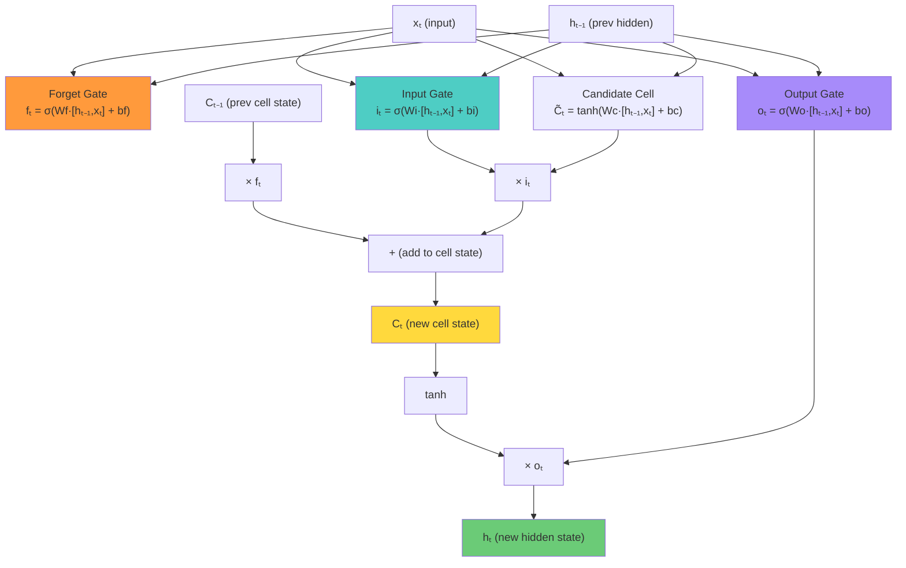
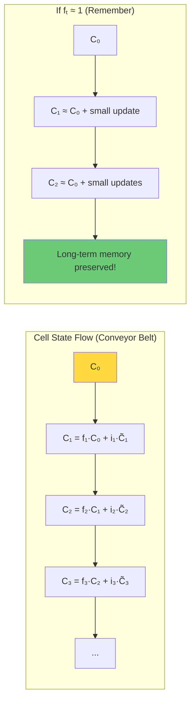
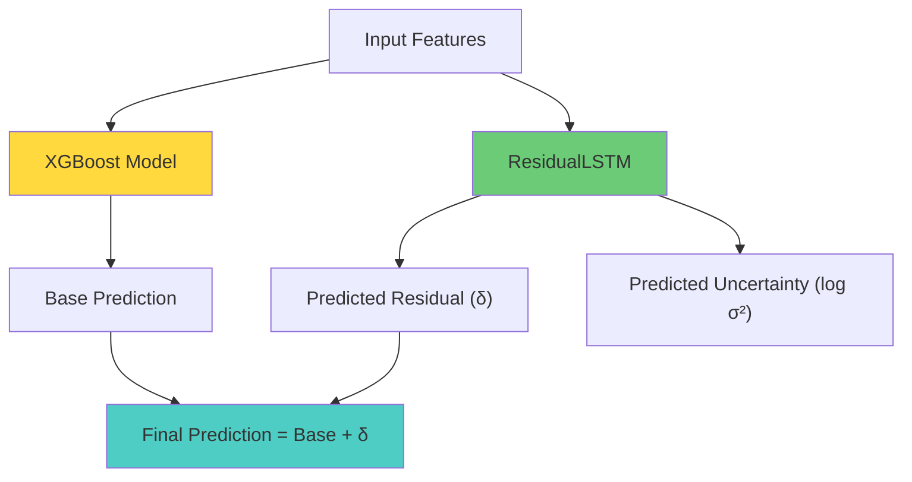

# 6.3 Long Short-Term Memory Networks

## The LSTM: A Solution to Vanishing Gradients

Long Short-Term Memory (LSTM) networks were introduced by Hochreiter and Schmidhuber in 1997 as a direct solution to the vanishing gradient problem. The key innovation is the **cell state** — a pathway that allows information to flow across many time steps with minimal modification, providing an "information highway" that gradients can traverse without vanishing.

## The LSTM Cell Architecture

The LSTM cell has three gates that control the flow of information:

1. **Forget gate** — decides what information to discard from the cell state
2. **Input gate** — decides what new information to store in the cell state
3. **Output gate** — decides what information from the cell state to output as the hidden state



## The Equations

### Forget Gate

The forget gate decides what fraction of the previous cell state to retain:

$$f_t = \sigma(W_f \cdot [h_{t-1}, x_t] + b_f)$$

where $\sigma$ is the sigmoid function ($\sigma(x) = \frac{1}{1 + e^{-x}}$, output range [0, 1]). The output $f_t$ is a vector of values between 0 and 1:
- $f_t = 0$: completely forget the corresponding cell state value
- $f_t = 1$: completely retain the corresponding cell state value

### Input Gate

The input gate decides what fraction of the new candidate values to write to the cell state:

$$i_t = \sigma(W_i \cdot [h_{t-1}, x_t] + b_i)$$

The candidate cell state contains the potential new information:

$$\tilde{C}_t = \tanh(W_C \cdot [h_{t-1}, x_t] + b_C)$$

### Cell State Update

The cell state is updated by combining the retained previous state and the new candidate:

$$C_t = f_t \odot C_{t-1} + i_t \odot \tilde{C}_t$$

where $\odot$ is the element-wise (Hadamard) product. This is the crucial equation:
- $f_t \odot C_{t-1}$: selectively forget parts of the old cell state
- $i_t \odot \tilde{C}_t$: selectively write new information to the cell state

### Output Gate

The output gate decides what information from the cell state to expose as the hidden state:

$$o_t = \sigma(W_o \cdot [h_{t-1}, x_t] + b_o)$$

$$h_t = o_t \odot \tanh(C_t)$$

The $\tanh$ squashes the cell state to $[-1, 1]$, and the output gate selectively filters this information to produce the hidden state.

## The Cell State as a "Conveyor Belt"

The cell state $C_t$ is the key to understanding LSTMs. It acts as a "conveyor belt" that runs through the entire sequence with only minor linear interactions:

$$C_t = f_t \odot C_{t-1} + i_t \odot \tilde{C}_t$$

The forget gate multiplies the previous cell state by values in $[0, 1]$, and the input gate adds new information. Importantly, the operations are **additive** (for the new information) and **multiplicative** (for the forget gate), not compositional like the $\tanh$ transformation in a standard RNN. This means:

1. **Gradients can flow easily.** The gradient of $C_t$ with respect to $C_{t-1}$ is $f_t$ (the forget gate output). If $f_t \approx 1$, the gradient passes through unchanged — no vanishing!

2. **Information can be preserved indefinitely.** If the forget gate consistently outputs 1, the cell state from time step 0 is preserved unchanged at time step $T$, regardless of how large $T$ is.

3. **The cell state is a separate memory.** Unlike the RNN's hidden state, which is overwritten at each time step, the LSTM's cell state is incrementally updated, preserving long-term information alongside short-term updates.



## Why LSTMs Solve Vanishing Gradients

To see why LSTMs solve the vanishing gradient problem, consider the gradient of the cell state at time $T$ with respect to the cell state at time $t$:

$$\frac{\partial C_T}{\partial C_t} = \prod_{k=t+1}^{T} \frac{\partial C_k}{\partial C_{k-1}} = \prod_{k=t+1}^{T} f_k + \cdots$$

where the omitted terms involve the input gate and candidate cell state. The key term is the product of forget gates $f_k$. If the forget gates are near 1 (meaning the network has learned to "remember"), this product is close to 1, and the gradient does not vanish.

In contrast, for a standard RNN:

$$\frac{\partial h_T}{\partial h_t} = \prod_{k=t+1}^{T} W_h^T \cdot \tanh'(a_k)$$

The product of weight matrices and tanh derivatives inevitably shrinks (since $\tanh' < 1$), causing the gradient to vanish. The LSTM replaces this with a product of forget gate values, which can be close to 1 because the sigmoid activation allows the forget gate to output values near 1.

> **Important Reminder**: The LSTM does not completely eliminate vanishing gradients — if the forget gate outputs values significantly less than 1, the gradient can still vanish. However, the LSTM gives the network the **ability** to preserve gradients by learning to set $f_t \approx 1$ for relevant information, which the standard RNN cannot do.

## The Project's ResidualLSTM Class

The solar forecasting project uses a custom `ResidualLSTM` class that builds on the basic LSTM:

### Architecture

```
ResidualLSTM:
  - LSTM Layer 1: 64 hidden units, return_sequences=True
  - LSTM Layer 2: 64 hidden units, return_sequences=False
  - Dense output: 2 units (delta and log_var)
```

### Stacked LSTM (2 Layers)

The two LSTM layers are stacked: the first LSTM processes the input sequence and produces a sequence of hidden states (one per time step), which the second LSTM processes further. Stacking LSTMs increases the network's representational capacity:

- **First LSTM layer**: Captures low-level temporal patterns (short-term trends, local fluctuations)
- **Second LSTM layer**: Captures high-level temporal patterns (long-term dependencies, global structure)

The `return_sequences=True` flag in the first LSTM means it outputs the hidden state at every time step, not just the final one. This is necessary because the second LSTM needs a sequence as input, not just a single vector.

### The 64 Hidden Units

The number of hidden units (64) controls the dimensionality of the cell state and hidden state. With 64 units:
- The cell state $C_t$ is a 64-dimensional vector
- The hidden state $h_t$ is a 64-dimensional vector
- Each gate has 64 × (64 + input_dim) + 64 parameters

For the solar forecasting task with ~15 input features, each LSTM layer has approximately $4 \times (64 \times (64 + 15) + 64) = 20,480$ parameters. With two layers, the total LSTM parameter count is about 41,000.

### The Output: [delta, log_var]

The ResidualLSTM outputs two values:

1. **delta** ($\delta$): The predicted residual — the correction to the XGBoost model's prediction
2. **log_var** ($\log \sigma^2$): The log variance — a measure of prediction uncertainty

The use of two outputs (mean and variance) enables **heteroscedastic loss** (also called Gaussian NLL loss):

$$L = \frac{1}{2} \left(\log \sigma^2 + \frac{(y - \hat{y})^2}{\sigma^2}\right)$$

This loss function allows the model to express uncertainty: when the model is confident, $\sigma^2$ is small, and the squared error term dominates. When the model is uncertain (e.g., during rapidly changing weather), $\sigma^2$ is large, and the loss is dominated by the log term, allowing the model to "admit" it does not know the answer rather than making a confident wrong prediction.

### Why "Residual" LSTM?

The name "ResidualLSTM" reflects its role in the hybrid architecture: it predicts the **residual** (the error) of the XGBoost model, not the absolute power output. This decomposition has several advantages:

1. **Simpler learning task.** The XGBoost model captures the primary patterns (solar geometry, clear sky effects), so the residual is smaller and more stationary than the raw power output. The LSTM has an easier target to learn.

2. **Complementary strengths.** XGBoost excels at capturing feature interactions and nonlinear mappings, while LSTM excels at capturing temporal dynamics. By assigning each to its strength, the hybrid model outperforms either component alone.

3. **Error correction.** The LSTM learns to correct the systematic errors of the XGBoost model, such as under-predicting during cloud enhancement events or over-predicting during morning ramp-up.



## Key Takeaways

- **LSTMs solve the vanishing gradient problem** by introducing a cell state — a "conveyor belt" that allows information and gradients to flow across many time steps with minimal modification.
- **The three gates** (forget, input, output) control what information is retained, added, and exposed at each time step.
- **The cell state update** $C_t = f_t \odot C_{t-1} + i_t \odot \tilde{C}_t$ is the key equation: additive updates prevent gradient vanishing when $f_t \approx 1$.
- **The project's ResidualLSTM** uses a 2-layer stacked LSTM with 64 hidden units, outputting both a predicted residual (delta) and a predicted uncertainty (log_var).
- **Stacked LSTMs** increase representational capacity by having the first layer capture low-level patterns and the second layer capture high-level patterns.
- **The heteroscedastic loss** $(\log \sigma^2 + (y - \hat{y})^2 / \sigma^2)$ enables the model to express uncertainty, providing richer information than a simple point prediction.
- **The "residual" in ResidualLSTM** refers to predicting the error of the XGBoost model, leveraging the complementary strengths of tree-based and recurrent models.


## Detailed Gating Mechanism Analysis

Let us analyze each LSTM gate in detail, examining how it learns to control information flow.

### The Forget Gate: Selective Memory Erasure

The forget gate learns to erase information that is no longer relevant. For example, in solar power forecasting:

- At sunrise, the forget gate erases the "nighttime" information from the cell state and allows "daytime" information to be written.
- When a cloud passes, the forget gate may partially erase the "clear sky" information and allow "cloudy" information to be written.

The forget gate's bias is typically initialized to a positive value (e.g., 1.0) to encourage the gate to "remember" by default. This is important because if the forget gate outputs zeros early in training, the cell state is completely erased, and the gradient signal is lost, making it difficult for the network to learn to remember.

### The Input Gate: Selective Memory Writing

The input gate learns to write new information to the cell state only when it is relevant. For example:

- When the wind speed increases sharply, the input gate opens to write this information to the cell state.
- When the wind speed is stable, the input gate remains closed, preserving the existing cell state.

The interaction between the input gate and the candidate cell state is interesting: the candidate can compute any value, but the input gate controls whether it is actually written. This allows the network to compute potentially useful information without committing to storing it.

### The Output Gate: Selective Memory Reading

The output gate learns to expose only the relevant portions of the cell state as the hidden state. For example:

- The cell state may contain information about both the current wind speed and the time of day, but the output gate may choose to expose only the wind speed information for the current prediction.
- At different time steps, the output gate may expose different portions of the cell state, depending on what is relevant for the current task.

This selective reading mechanism allows the LSTM to maintain a rich internal representation (the cell state) while producing task-relevant outputs (the hidden state).

## The Peephole LSTM

A variant of the LSTM is the **peephole LSTM**, where the gates have access to the cell state (not just the hidden state) through "peephole" connections:

$$f_t = \sigma(W_f \cdot [h_{t-1}, x_t] + V_f \odot C_{t-1} + b_f)$$

$$i_t = \sigma(W_i \cdot [h_{t-1}, x_t] + V_i \odot C_{t-1} + b_i)$$

$$o_t = \sigma(W_o \cdot [h_{t-1}, x_t] + V_o \odot C_t + b_o)$$

The peephole connections allow the gates to make more informed decisions because they can "see" the current cell state, not just the hidden state. This can improve performance on tasks that require precise timing, such as learning to count or to measure precise time intervals.

## The LSTM as a Learned State-Space Model

The LSTM can be interpreted as a learned state-space model, where:
- The cell state $C_t$ is the state vector
- The input $x_t$ is the control input
- The gates are the control law (they determine how the state is updated based on the input)
- The hidden state $h_t$ is the observation (the visible output)

In classical state-space models (like the Kalman filter), the state transition and observation equations are linear and known. In the LSTM, these equations are nonlinear and learned from data. This makes the LSTM more flexible but also less interpretable.

The connection to the Kalman filter is relevant for energy forecasting because the Kalman filter is a classical approach for time series forecasting with state estimation. The LSTM can be seen as a nonlinear, data-driven generalization of the Kalman filter.

## Training Deep Stacked LSTMs

When stacking multiple LSTM layers, several practical issues arise:

### Gradient Flow Between Layers

The gradient must flow through multiple LSTM layers, each of which has its own gating mechanism. While the LSTM's cell state helps prevent vanishing gradients within a layer, the gradient between layers can still vanish if the output gate consistently produces small values. Residual connections between LSTM layers can help:

$$h_t^{(l+1)} = \text{LSTM}^{(l+1)}(h_t^{(l)}) + h_t^{(l)}$$

### Hidden State Initialization

The hidden state and cell state must be initialized for each layer. Common choices are:
- Zero initialization: $h_0 = 0, C_0 = 0$
- Learned initialization: Treat $h_0$ and $C_0$ as trainable parameters
- Random initialization: $h_0 \sim \mathcal{N}(0, \sigma^2)$

Zero initialization is the most common and works well in practice. Learned initialization can provide a small performance improvement by giving the network a better starting point for the cell state.

### DropConnect and Recurrent Dropout

Standard dropout (randomly setting hidden units to zero) can be applied between LSTM layers but should NOT be applied to the recurrent connections within a layer, as it disrupts the temporal structure. Instead, **recurrent dropout** (Gal & Ghahramani, 2016) applies the same dropout mask at every time step within a layer, preserving the temporal structure while providing regularization:

```python
# In Keras
LSTM(64, dropout=0.2, recurrent_dropout=0.2)
```

The `dropout` parameter applies dropout to the input and output connections, while `recurrent_dropout` applies the same mask to the recurrent connections at every time step.

## The Variational LSTM: Modeling Uncertainty

The project's ResidualLSTM outputs both a predicted value (delta) and a predicted uncertainty (log_var), enabling heteroscedastic loss. This is a form of **variational inference** where the model learns to predict not just the expected value but the full distribution.

The Gaussian negative log-likelihood loss is:

$$L = \frac{1}{2} \left(\log \sigma^2 + \frac{(y - \hat{y})^2}{\sigma^2}\right)$$

This loss has an elegant property: the model can reduce the loss either by improving its prediction $\hat{y}$ (reducing the second term) or by increasing its uncertainty $\sigma^2$ (reducing the relative weight of the second term). The model learns to be uncertain about predictions that are inherently difficult (e.g., during rapidly changing weather) and confident about predictions that are easy (e.g., during clear, stable conditions).

The predicted uncertainty can be used for:
1. **Decision-making**: If the uncertainty is too high, the forecast can be flagged as unreliable, and alternative strategies (e.g., using a backup power source) can be activated.
2. **Risk management**: The uncertainty bounds define the range of possible power output, which is essential for grid operators who must ensure sufficient reserves.
3. **Model improvement**: High-uncertainty predictions identify the conditions where the model performs poorly, guiding the collection of additional data or the engineering of new features.

## Sequence-to-Sequence vs. Sequence-to-One

The project's LSTM is a sequence-to-one model: it processes a sequence of inputs and produces a single prediction at the end. An alternative is the sequence-to-sequence model, which produces a prediction at each time step.

For multi-step forecasting, the sequence-to-sequence approach has advantages:
- The model can learn to predict at different time horizons simultaneously
- The decoder can attend to different parts of the input sequence for different prediction horizons
- The model can produce a complete forecast trajectory, not just a single point

The sequence-to-sequence approach is used in more advanced forecasting models, such as the Temporal Fusion Transformer (TFT), which combines LSTM encoders with attention-based decoders.


## The LSTM's Memory Capacity

How much information can an LSTM remember? This depends on the hidden dimension $d_h$:

- Each cell state element can independently decide to remember or forget
- With $d_h = 64$, the LSTM has 64 independent "memory slots"
- Each slot can store a continuous value, not just a binary flag

In principle, the LSTM can store approximately $64 \times 32 = 2048$ bits of information (assuming each float32 value encodes ~32 bits of useful information). This is sufficient to encode:
- The current time of day (1 slot)
- The current weather regime (1-2 slots)
- The recent trend direction (1-2 slots)
- The current cloud condition (1-2 slots)
- The power output at key past time points (3-4 slots for lag-equivalent information)
- Various intermediate computations (remaining slots)

However, the actual memory utilization is typically much lower than the theoretical capacity, because:
1. The forget gate may not perfectly preserve information over long sequences
2. The cell state is shared across all input features, creating interference
3. The optimization may not find the global optimum for the gate parameters

## Training the LSTM: Practical Tips

### Learning Rate Scheduling

A cosine annealing schedule with warm restarts can improve LSTM training:

$$\eta_t = \eta_{\min} + \frac{1}{2}(\eta_{\max} - \eta_{\min})(1 + \cos(\pi T_{cur}/T_i))$$

where $T_{cur}$ is the current epoch within the cycle and $T_i$ is the cycle length. This schedule periodically increases the learning rate, helping the model escape local minima.

### Gradient Accumulation

For large models or when GPU memory is limited, gradient accumulation allows effective larger batch sizes:

```python
accumulation_steps = 4
optimizer.zero_grad()
for i, (x_batch, y_batch) in enumerate(dataloader):
    loss = model(x_batch, y_batch) / accumulation_steps
    loss.backward()
    if (i + 1) % accumulation_steps == 0:
        optimizer.step()
        optimizer.zero_grad()
```

This divides each batch by the accumulation steps and accumulates gradients over multiple forward passes before updating the weights.

### Weight Regularization

In addition to dropout, weight regularization (L2 regularization, also called weight decay) can prevent overfitting in LSTM models:

```python
optimizer = torch.optim.Adam(model.parameters(), lr=0.001, weight_decay=1e-5)
```

A small weight decay (1e-5 to 1e-4) is typically sufficient for LSTM models. Larger values can constrain the model too much and prevent it from learning the complex temporal patterns needed for forecasting.
