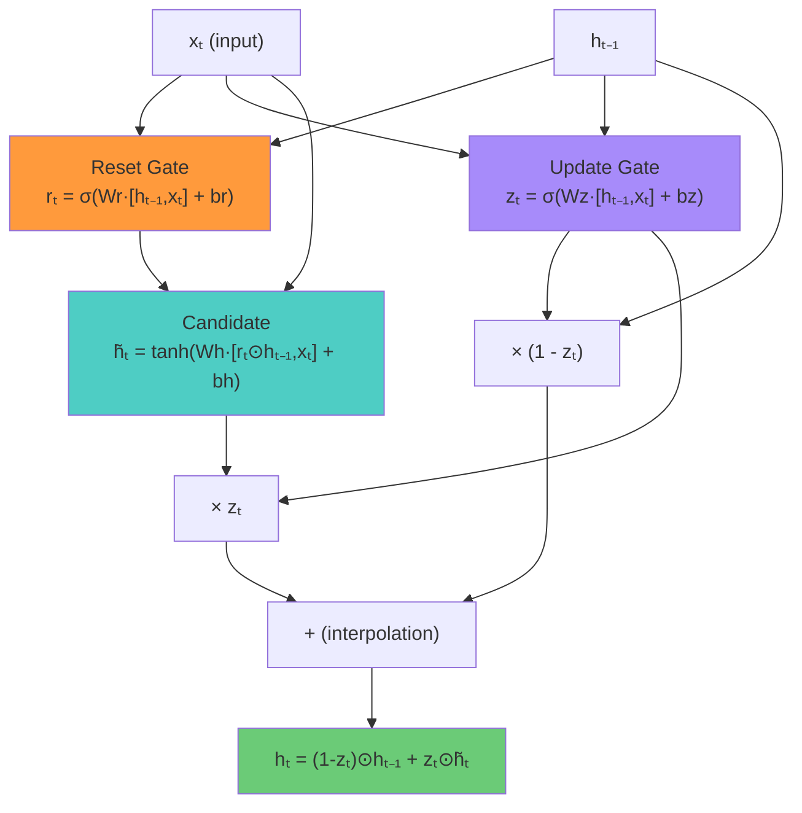
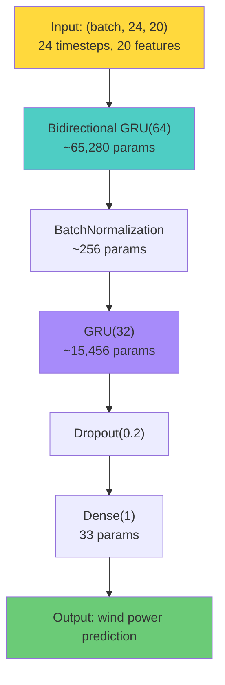

# 6.4 Gated Recurrent Units and Bidirectional Logic

## GRU: A Streamlined Alternative to LSTM

The Gated Recurrent Unit (GRU) was introduced by Cho et al. in 2014 as a simplified alternative to the LSTM. It achieves similar performance with fewer parameters by merging the cell state and hidden state, and reducing the number of gates from three to two.

## The Two Gates of the GRU

### Reset Gate

The reset gate determines how much of the previous hidden state to forget when computing the candidate hidden state:

$$r_t = \sigma(W_r \cdot [h_{t-1}, x_t] + b_r)$$

When $r_t \approx 0$, the previous hidden state is ignored, allowing the GRU to "reset" and focus only on the current input. When $r_t \approx 1$, the previous hidden state is fully used, preserving long-term information.

### Update Gate

The update gate controls the balance between keeping the previous hidden state and updating it with the new candidate:

$$z_t = \sigma(W_z \cdot [h_{t-1}, x_t] + b_z)$$

The update gate combines the functions of the LSTM's forget and input gates into a single gate. When $z_t \approx 1$, the hidden state is updated with the new candidate. When $z_t \approx 0$, the previous hidden state is retained unchanged.

### Candidate Hidden State

The candidate hidden state is computed using the reset gate:

$$\tilde{h}_t = \tanh(W_h \cdot [r_t \odot h_{t-1}, x_t] + b_h)$$

Note how the reset gate $r_t$ modulates the previous hidden state: if $r_t = 0$, the candidate depends only on the current input $x_t$, effectively "resetting" the memory.

### Hidden State Update

The hidden state is updated as a linear interpolation between the previous state and the candidate:

$$h_t = (1 - z_t) \odot h_{t-1} + z_t \odot \tilde{h}_t$$

This is the GRU's equivalent of the LSTM's cell state update. The key difference is that the GRU uses a single interpolation (controlled by $z_t$), while the LSTM uses two independent gates (forget gate $f_t$ and input gate $i_t$). The constraint $(1 - z_t) + z_t = 1$ means the GRU must "decide" between keeping the old state and writing the new one — it cannot both keep the old state AND add new information independently, as the LSTM can.



## GRU vs. LSTM: Comparison

| Feature                | LSTM                | GRU                     |
|------------------------|---------------------|-------------------------|
| Number of gates        | 3 (forget, input, output) | 2 (reset, update) |
| Memory mechanism       | Separate cell state + hidden state | Merged (hidden state only) |
| Parameters per unit    | $4 \times (h \cdot (h + x) + h)$ | $3 \times (h \cdot (h + x) + h)$ |
| Parameter count (h=64, x=20) | ~21,504 | ~16,128 |
| Training speed         | Slower (more parameters) | Faster (fewer parameters) |
| Expressiveness         | Higher (independent forget/input) | Lower (coupled update) |
| Typical performance    | Similar to GRU on most tasks | Similar to LSTM on most tasks |

### Key Differences

1. **No separate cell state.** The GRU does not maintain a separate cell state — the hidden state $h_t$ serves both as the output and the memory. This simplifies the architecture but reduces the model's ability to independently control what is remembered and what is output.

2. **Coupled forget/input.** In the LSTM, the forget gate and input gate are independent: the model can both forget old information AND add new information simultaneously (or neither). In the GRU, the update gate controls both: the fraction $(1 - z_t)$ of the old state that is retained plus the fraction $z_t$ of the new candidate always sums to 1. This is a constraint that the LSTM does not have.

3. **Fewer parameters.** With one fewer gate and no separate cell state, the GRU has approximately 25% fewer parameters than the LSTM. This translates to faster training, lower memory usage, and potentially better generalization on smaller datasets.

### When to Use GRU vs. LSTM

There is no universally superior choice. The decision depends on:

- **Dataset size.** GRU's lower parameter count is advantageous for smaller datasets where overfitting is a concern.
- **Sequence length.** For very long sequences, the LSTM's independent forget/input gates may provide more precise control over information flow.
- **Computational budget.** GRU's faster training makes it preferable when computational resources are limited.
- **Empirical performance.** For a given task, the only way to know which is better is to try both.

In the project, the **GRU is used for wind power forecasting** and the **LSTM is used for solar power forecasting**. This is a pragmatic choice: the wind model benefits from GRU's efficiency (the SDWPF dataset can be very large), while the solar model benefits from LSTM's expressiveness (the residual prediction task requires precise error correction).

## Bidirectional Recurrent Networks

A standard (unidirectional) RNN processes the sequence from left to right (past to future), seeing each time step in order. A **bidirectional** RNN processes the sequence in both directions simultaneously:

1. **Forward pass**: $h_t^{(f)} = \text{RNN}(x_t, h_{t-1}^{(f)})$ — processes from $t=1$ to $t=T$
2. **Backward pass**: $h_t^{(b)} = \text{RNN}(x_t, h_{t+1}^{(b)})$ — processes from $t=T$ to $t=1$

The output at each time step combines both directions:

$$h_t = [h_t^{(f)}; h_t^{(b)}]$$

where $[;]$ denotes concatenation. The combined hidden state $h_t$ contains information from both the past (via the forward pass) and the future (via the backward pass).

```mermaid
graph LR
    subgraph "Forward GRU"
        X1["x₁"] --> FG1["→GRU"] --> FG2["→GRU"] --> FG3["→GRU"] --> FG4["→GRU"]
    end
    
    subgraph "Backward GRU"
        BG1["←GRU"] <-- BG2["←GRU"] <-- BG3["←GRU"] <-- BG4["←GRU"] <-- X4["x₄"]
    end
    
    X1["x₁"] --> BG1
    X4["x₄"] --> FG4
    
    FG2 --> COMBINE["Combine"]
    BG2 --> COMBINE
    COMBINE --> OUTPUT["h₂ = [h₂ᶠ; h₂ᵇ]"]
    
    style FG1 fill:#6bcb77
    style FG2 fill:#6bcb77
    style FG3 fill:#6bcb77
    style FG4 fill:#6bcb77
    style BG1 fill:#a78bfa
    style BG2 fill:#a78bfa
    style BG3 fill:#a78bfa
    style BG4 fill:#a78bfa
    style OUTPUT fill:#ffd93d
```

### Why Bidirectional?

For **offline forecasting** (predicting past or current values from a complete sequence), bidirectional networks provide strictly more information than unidirectional ones. The backward pass gives the model access to "future" context, which can be very helpful:

- In **wind power forecasting**, knowing what happens after time $t$ (even just a few steps later) can help disambiguate whether a drop in wind speed at time $t$ is the beginning of a lull or just a brief dip before a gust.
- In **solar power forecasting**, future context helps distinguish between a passing cloud (temporary dip) and an incoming weather front (sustained reduction).

### The Caveat: Online vs. Offline Prediction

> **Important Reminder**: Bidirectional networks can only be used when you have access to the entire input sequence at prediction time. For **real-time (online) forecasting**, where you must predict the future without knowing it, the backward pass is not available, and a unidirectional network must be used.

In the project, if the wind Bi-GRU is used for **day-ahead forecasting** (where the meteorological forecast for the entire day is available), bidirectional processing is valid. If it is used for **real-time dispatch** (where only past data is available), bidirectional processing constitutes data leakage.

## The Project's Bi-GRU Architecture for Wind

The wind power forecasting model uses the following architecture:

```
Bidirectional(GRU(64)) → BatchNorm → GRU(32) → Dropout(0.2) → Dense(1)
```

Let us examine each layer:

### Layer 1: Bidirectional(GRU(64))

The first layer is a bidirectional GRU with 64 hidden units. Since it is bidirectional, the effective output is 128-dimensional (64 forward + 64 backward). This layer processes the input sequence and captures temporal patterns from both directions.

Parameter count: $2 \times 3 \times (64 \times (64 + F) + 64)$ where $F$ is the input feature dimension. For $F = 20$: approximately $2 \times 32{,}640 = 65{,}280$ parameters.

### Layer 2: BatchNorm

Batch normalization normalizes the activations of the previous layer:

$$\hat{x} = \frac{x - \mu_B}{\sqrt{\sigma_B^2 + \epsilon}}$$

$$y = \gamma \hat{x} + \beta$$

where $\mu_B$ and $\sigma_B^2$ are the batch mean and variance, $\gamma$ and $\beta$ are learnable parameters, and $\epsilon$ is a small constant for numerical stability.

Batch normalization stabilizes training by reducing internal covariate shift — the phenomenon where the distribution of layer inputs changes during training as the parameters of previous layers are updated. It allows higher learning rates and faster convergence.

### Layer 3: GRU(32)

The second GRU layer has 32 hidden units and is unidirectional. It takes the 128-dimensional output of the bidirectional layer and further processes it, capturing higher-level temporal patterns. The reduced dimensionality (64 → 32) creates a bottleneck that forces the network to learn a compressed representation.

Parameter count: $3 \times (32 \times (32 + 128) + 32) = 15{,}456$ parameters.

### Layer 4: Dropout(0.2)

Dropout randomly sets 20% of the neurons to zero during training, preventing co-adaptation of features and reducing overfitting. The dropout rate of 0.2 is relatively low (compared to the common 0.5), which is appropriate because:
- The model is not very large (total parameters < 100K)
- The wind dataset is large enough to support the model's capacity
- Too much dropout can hurt the model's ability to capture temporal dependencies

### Layer 5: Dense(1)

The final dense layer maps the 32-dimensional GRU output to a single scalar prediction (the wind power output). No activation function is used, allowing the output to take any real value.

Parameter count: $32 \times 1 + 1 = 33$ parameters.

### Total Architecture Summary



## Why This Architecture for Wind?

1. **Bidirectional first layer.** Wind patterns have both antecedent and subsequent context — a gust is preceded by increasing speed and followed by decreasing speed. The bidirectional layer captures this temporal context from both directions.

2. **Unidirectional second layer.** The second GRU layer refines the representation using only forward information, preparing the final compressed features for prediction.

3. **BatchNorm between recurrent layers.** Stabilizes the distribution of activations between the two GRU layers, preventing gradient issues and enabling faster training.

4. **Gradual dimensionality reduction.** 20 → 128 → 32 → 1. The architecture progressively compresses the temporal information into a single prediction, with each layer capturing increasingly abstract features.

5. **Moderate dropout.** Prevents overfitting without destroying the temporal structure learned by the GRU layers.

## Key Takeaways

- **GRU simplifies the LSTM** by merging the cell state and hidden state and reducing from 3 gates to 2 (reset and update), resulting in ~25% fewer parameters.
- **The update gate** $z_t$ controls the interpolation between the previous hidden state and the new candidate: $h_t = (1-z_t) \odot h_{t-1} + z_t \odot \tilde{h}_t$.
- **The reset gate** $r_t$ controls how much of the previous hidden state is used when computing the candidate, allowing the model to "reset" its memory.
- **GRU vs. LSTM**: GRU is faster and has fewer parameters; LSTM has independent forget/input gates for more precise control. Performance is typically similar.
- **Bidirectional networks** process the sequence in both forward and backward directions, providing "future context" that improves predictions for offline tasks.
- **Bidirectional networks CANNOT be used for real-time forecasting** — they require the entire sequence to be known, constituting data leakage for online prediction.
- **The project's Bi-GRU architecture**: Bidirectional(GRU(64)) → BatchNorm → GRU(32) → Dropout(0.2) → Dense(1), designed for wind power forecasting with a balance of expressiveness and efficiency.


## Detailed Comparison: GRU Gate Dynamics

Let us analyze the GRU's gating dynamics in more detail and compare them to the LSTM.

### The Reset Gate: Context-Dependent Forgetting

The reset gate in the GRU serves a dual function that combines aspects of the LSTM's forget gate and output gate:

$$r_t = \sigma(W_r \cdot [h_{t-1}, x_t] + b_r)$$

When $r_t \approx 0$:
- The previous hidden state is ignored when computing the candidate: $\tilde{h}_t = \tanh(W_h \cdot [0, x_t] + b_h)$
- This means the candidate depends only on the current input, effectively "resetting" the memory
- This is useful when the input contains a signal that the current state is irrelevant (e.g., a sudden change in weather that invalidates the previous trend)

When $r_t \approx 1$:
- The previous hidden state is fully used in computing the candidate
- The candidate incorporates both the current input and the previous memory, allowing smooth updates

The reset gate's behavior is context-dependent: it can selectively reset parts of the hidden state (different dimensions can have different reset values), allowing the network to forget specific aspects of the past while retaining others.

### The Update Gate: Interpolation Control

The update gate controls the interpolation between the previous hidden state and the new candidate:

$$z_t = \sigma(W_z \cdot [h_{t-1}, x_t] + b_z)$$

$$h_t = (1 - z_t) \odot h_{t-1} + z_t \odot \tilde{h}_t$$

When $z_t \approx 0$:
- The hidden state is unchanged: $h_t \approx h_{t-1}$
- This preserves the existing memory, which is useful when the current input is uninformative or noisy
- This is the regime where the GRU mimics the LSTM's cell state preservation (when $f_t \approx 1$)

When $z_t \approx 1$:
- The hidden state is replaced with the new candidate: $h_t \approx \tilde{h}_t$
- This writes new information, which is useful when the current input contains important new information
- This is the regime where the GRU mimics the LSTM's input gate writing

### The Coupling Constraint

The key difference between the GRU and LSTM is that the GRU's update gate controls both forgetting and writing simultaneously. The constraint $(1 - z_t) + z_t = 1$ means that the network cannot both preserve the old state AND write new information independently — it must choose how much of each to do.

In the LSTM, the forget gate and input gate are independent:
- The LSTM can both keep the old cell state ($f_t \approx 1$) AND add new information ($i_t \approx 1$), accumulating information over time.
- The LSTM can also both erase the old state ($f_t \approx 0$) AND not write new information ($i_t \approx 0$), effectively clearing the memory.

The GRU cannot accumulate information in the same way — writing new information always requires partially overwriting the old state. This makes the GRU slightly less expressive but also more parameter-efficient.

## Empirical Performance: GRU vs. LSTM

Extensive empirical comparisons have been conducted between GRU and LSTM. The general findings are:

1. **On most tasks, GRU and LSTM perform similarly.** The difference in accuracy is typically within the noise range of hyperparameter tuning.

2. **GRU is faster to train.** With ~25% fewer parameters, each forward and backward pass is faster. This advantage is significant for large datasets or complex architectures.

3. **GRU may generalize better on smaller datasets.** The fewer parameters reduce the risk of overfitting when the training data is limited.

4. **LSTM may have a slight edge on very long sequences.** The independent forget/input gates provide more precise control over long-range information flow, which can be advantageous for sequences with very long dependencies (>100 time steps).

5. **The choice matters less than the hyperparameters.** The performance difference between GRU and LSTM is typically smaller than the difference caused by hyperparameter choices (learning rate, hidden size, number of layers).

For the project's wind forecasting task with a 24-step lookback window, both GRU and LSTM would be expected to perform well. The GRU is chosen primarily for its computational efficiency and lower parameter count.

## Bidirectional Processing: Mathematical Details

The bidirectional wrapper processes the input sequence in both directions simultaneously. For each direction, a separate set of parameters is maintained.

### Forward Pass

$$\overrightarrow{h}_t = \text{GRU}(x_t, \overrightarrow{h}_{t-1}; \theta_{\rightarrow})$$

### Backward Pass

$$\overleftarrow{h}_t = \text{GRU}(x_t, \overleftarrow{h}_{t+1}; \theta_{\leftarrow})$$

### Combination

$$h_t = [\overrightarrow{h}_t; \overleftarrow{h}_t]$$

The hidden state $h_t$ contains information from both the past (via $\overrightarrow{h}_t$) and the future (via $\overleftarrow{h}_t$). The total number of parameters is doubled (two sets of GRU parameters), and the output dimensionality is doubled (concatenation of forward and backward hidden states).

### When Is Bidirectional Appropriate?

Bidirectional processing is appropriate when:

1. **The entire input sequence is available at prediction time.** This is the case for day-ahead forecasting, where the meteorological forecast for the entire day is available before any predictions are made.

2. **Future context improves prediction accuracy.** In wind power forecasting, knowing what happens after the current time step can help disambiguate the current situation (e.g., distinguishing a brief dip from a sustained decrease).

3. **The model is used for analysis or post-processing.** When analyzing historical data (e.g., anomaly detection, event classification), the entire sequence is available, and bidirectional processing is always appropriate.

Bidirectional processing is NOT appropriate when:

1. **Real-time forecasting is required.** In real-time dispatch, the model must predict the next time step without knowing the future, and the backward pass constitutes data leakage.

2. **The prediction must be made incrementally.** If the model must produce a prediction after each new observation (streaming mode), the backward pass is not available.

## The Project's Bi-GRU: Why This Specific Architecture?

The architecture `Bidirectional(GRU(64)) → BatchNorm → GRU(32) → Dropout(0.2) → Dense(1)` was designed with the following considerations:

### Why Bidirectional in the First Layer Only?

The first layer processes the raw input sequence, where the temporal patterns are most important. The bidirectional wrapper in this layer allows the model to capture both forward and backward temporal patterns. The second layer is unidirectional because:
1. Its input is already enriched with bidirectional information (from the first layer).
2. A unidirectional second layer is sufficient for refining the representation.
3. Using bidirectional in both layers would double the parameter count with diminishing returns.

### Why BatchNorm Between Layers?

Batch normalization between the two GRU layers:
1. Stabilizes the distribution of the first layer's output, preventing the second layer from receiving inputs with shifting statistics.
2. Allows higher learning rates, speeding up training.
3. Acts as a mild regularizer, reducing overfitting.

BatchNorm is placed after the bidirectional layer (which produces a 128-dimensional output) and before the second GRU layer (which expects this 128-dimensional input as its feature dimension).

### Why GRU(32) in the Second Layer?

The second layer has 32 hidden units, half of the first layer's per-direction capacity (64). This progressive reduction in dimensionality:
1. Forces the network to learn a compressed representation, discarding irrelevant information.
2. Reduces the parameter count of the final layers, preventing overfitting.
3. Creates an information bottleneck that encourages the network to learn the most salient features.

The Dense(1) layer at the end is a simple linear projection from the 32-dimensional hidden state to the scalar prediction, adding minimal overhead.
