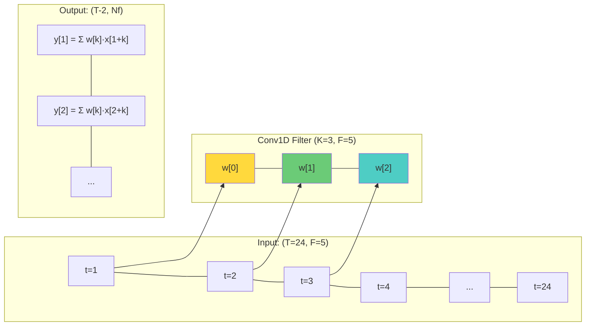
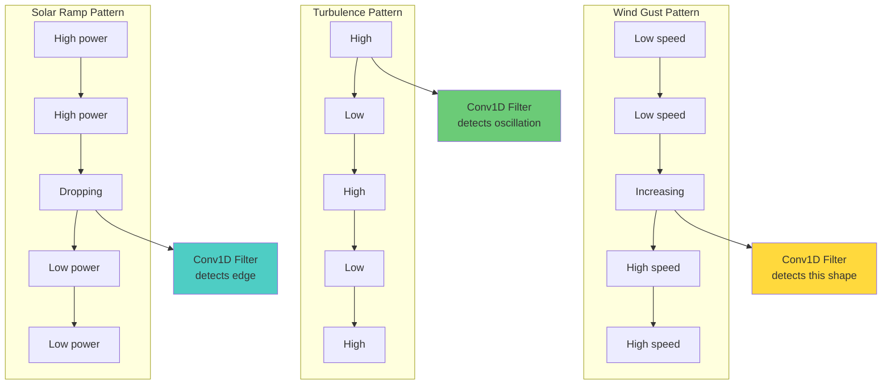
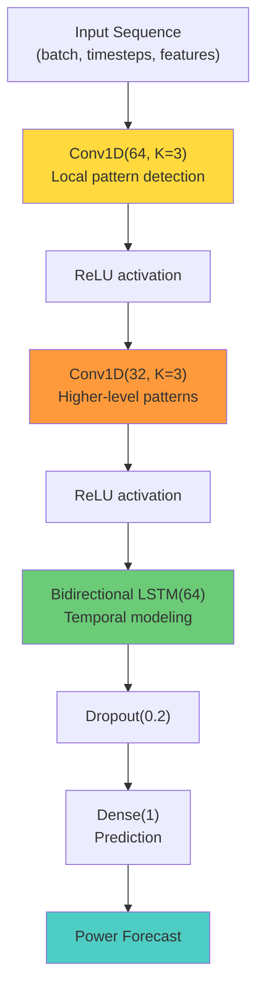

# 6.5 Convolutional Neural Networks for Time Series

## From Images to Time Series: The Conv1D Paradigm

Convolutional Neural Networks (CNNs) were originally developed for image processing, where Conv2D filters slide across the 2D spatial dimensions of an image to detect features like edges, textures, and shapes. The same principle applies to time series: a **Conv1D** filter slides across the temporal dimension to detect local patterns in the sequence.

The key insight is that time series, like images, contain **local patterns** that are meaningful regardless of their position in the sequence. A wind gust has a characteristic shape (rapid increase followed by gradual decrease) that is the same whether it occurs at time step 10 or time step 50. A solar ramp event has a characteristic signature that is similar regardless of when it happens. Conv1D filters are designed to detect exactly these kinds of position-invariant local patterns.

## The Conv1D Operation

A Conv1D layer applies a sliding filter (also called a kernel) across the time dimension:

$$y[t] = \sum_{k=0}^{K-1} w[k] \cdot x[t + k] + b$$

where:
- $x$ is the input sequence (length $T$, with $F$ features per step)
- $w$ is the filter (length $K$, with $F$ input channels)
- $b$ is the bias
- $y$ is the output sequence
- $K$ is the kernel size (filter length)

For a multivariate time series with $F$ features, each filter is a $K \times F$ weight matrix. The filter slides across the time dimension, computing a dot product at each position. If we use $N_f$ filters, the output has $N_f$ "channels" — each one detecting a different local pattern.



### What Does a Conv1D Filter Detect?

Each filter learns to detect a specific local temporal pattern. Depending on the learned weights, a filter might detect:

- **Rapid increases** (wind gust onset): weights are increasing (e.g., [-1, 0, +1])
- **Rapid decreases** (wind lull onset): weights are decreasing (e.g., [+1, 0, -1])
- **Local averages** (smoothing): weights are all positive and similar (e.g., [0.33, 0.33, 0.33])
- **Oscillations** (turbulent fluctuations): weights alternate in sign (e.g., [+1, -2, +1])
- **Step changes** (sudden shifts in mean level): weights detect a before/after difference

In essence, Conv1D filters are **pattern detectors** that scan the time series for specific local features, much like how image CNN filters detect edges and corners.

## Key Conv1D Parameters

### Kernel Size ($K$)

The kernel size determines the temporal extent of the pattern detector:
- $K = 3$: Detects very local patterns spanning 3 time steps (45 minutes for 15-min data)
- $K = 5$: Detects patterns spanning 5 time steps (75 minutes)
- $K = 7$: Detects patterns spanning 7 time steps (105 minutes)

Larger kernels capture longer-range patterns but require more parameters and are more prone to overfitting. A common practice is to use small kernels (3-5) in early layers (to detect low-level features) and larger kernels in deeper layers (to detect higher-level patterns).

### Stride

The stride determines how many time steps the filter moves between applications:
- Stride = 1: The filter is applied at every time step (maximum resolution)
- Stride = 2: The filter is applied at every other time step (reduces output length by 2×)

Larger strides reduce the output length and computational cost, at the expense of temporal resolution.

### Padding

- **Valid padding**: No padding; the output is shorter than the input by $K - 1$.
- **Same padding**: Zero-padding is added so the output has the same length as the input.

### Dilation

Dilated convolutions increase the receptive field without increasing the number of parameters. A dilation rate of $d$ means the filter samples every $d$-th time step:

$$y[t] = \sum_{k=0}^{K-1} w[k] \cdot x[t + d \cdot k] + b$$

With dilation $d = 2$ and kernel size $K = 3$, the filter covers time steps $[t, t+2, t+4]$ — a receptive field of 5 time steps using only 3 parameters. Dilation allows the network to detect patterns at multiple time scales without stacking many layers.

## CNNs as "Edge Detectors" for Wind and Solar

In image processing, the first convolutional layers detect edges — sharp transitions in pixel intensity. In time series, the analogous patterns are **sharp transitions in the signal**:

### Wind Gust Detection

A wind gust is characterized by a rapid increase in wind speed over a short period. A Conv1D filter with weights that emphasize the difference between recent and older values (e.g., $w = [-1, -0.5, 0, 0.5, 1]$) would produce a large positive output when a gust is present.

### Turbulence Detection

Turbulent wind is characterized by rapid oscillations in wind speed. A Conv1D filter with alternating positive and negative weights (e.g., $w = [1, -2, 1]$) acts as a second-derivative detector, producing large outputs when the signal has high curvature — a hallmark of turbulence.

### Solar Ramp Detection

A solar ramp event (sudden change in irradiance due to passing clouds) creates a sharp edge in the power output time series. Conv1D filters can detect these edges regardless of their position in the sequence, providing the model with information about cloud dynamics.



## The CNN-BiLSTM Architecture

The project summary mentions a **CNN-BiLSTM** architecture that combines convolutional feature extraction with bidirectional LSTM temporal processing. This is a powerful hybrid architecture that leverages the strengths of both approaches:

### Architecture Overview

```
Input → Conv1D layers (feature extraction) → BiLSTM layers (temporal modeling) → Dense output
```



### Why CNN Before BiLSTM?

1. **Feature extraction.** The Conv1D layers extract local features (gusts, edges, oscillations) from the raw input, creating a richer representation for the BiLSTM to process.

2. **Dimensionality reduction.** The Conv1D layers can reduce the temporal dimension (through stride > 1 or pooling), shortening the sequence that the BiLSTM must process. This reduces the BiLSTM's computational cost and memory usage.

3. **Noise filtering.** The Conv1D filters act as learned noise suppressors, smoothing out irrelevant high-frequency fluctuations before the BiLSTM processes the sequence.

4. **Multi-scale features.** By using Conv1D layers with different kernel sizes or dilation rates, the network can extract features at multiple time scales (short-term patterns from small kernels, long-term patterns from large or dilated kernels).

### The Information Flow

1. **Raw input** enters the Conv1D layer, which slides filters across the time dimension.
2. **Each filter** produces an output channel that highlights specific temporal patterns.
3. **Multiple Conv1D layers** stack to create increasingly abstract feature representations — the first layer detects edges, the second layer detects patterns of edges, and so on.
4. **The BiLSTM** processes these abstract features in both temporal directions, capturing long-range dependencies.
5. **The Dense layer** maps the BiLSTM's final hidden state to a prediction.

## Pooling and Global Pooling

Between Conv1D layers, **pooling** operations reduce the temporal dimension:

- **Max pooling**: Takes the maximum value over a window. Preserves the strongest activation (most prominent pattern) in each window.
- **Average pooling**: Takes the average value over a window. Preserves the overall activation level.

**Global pooling** (GlobalMaxPooling1D or GlobalAveragePooling1D) reduces the entire temporal dimension to a single value per channel, producing a fixed-length vector regardless of the input sequence length. This is useful when the output needs to be a fixed-size vector (e.g., for classification or single-step prediction).

For the forecasting task, global pooling is typically NOT used because it destroys the temporal ordering — the BiLSTM needs the sequence structure to do its job. Instead, the Conv1D layers use stride or valid padding to modestly reduce the sequence length while preserving the temporal structure.

## Practical Considerations for Time Series CNNs

### 1. Causal Convolutions

For real-time forecasting, we must ensure that the Conv1D filter does not use future information. A **causal convolution** only uses past and current values:

$$y[t] = \sum_{k=0}^{K-1} w[k] \cdot x[t - k] + b$$

This is achieved by padding the input on the left (past side) only. In Keras, this is not the default behavior — the standard Conv1D uses both past and future context. For real-time forecasting, use `causal=True` in the Conv1D layer or manually shift the output.

> **Important Reminder**: If you are using Conv1D for real-time forecasting (predicting the next value from past values), make sure to use causal convolutions. The default Conv1D uses both past and future context, which constitutes data leakage in an online setting.

### 2. Feature Normalization Before Conv1D

Conv1D layers are sensitive to the scale of their inputs, just like other neural network layers. The input features should be normalized (using StandardScaler or RobustScaler, as discussed in Section 5.3) before being fed into the Conv1D layer.

### 3. ReLU Activation

The Rectified Linear Unit (ReLU) activation function $f(x) = \max(0, x)$ is commonly used after Conv1D layers. ReLU introduces nonlinearity while maintaining sparse activations (many outputs are exactly zero), which improves computational efficiency and reduces overfitting.

### 4. Residual Connections

For deep CNN architectures, **residual connections** (skip connections) help mitigate the vanishing gradient problem by providing a direct path for the gradient to flow through:

$$y = \text{ReLU}(\text{Conv1D}(x)) + x$$

This is the same principle used in ResNets for image processing and in the project's "ResidualLSTM" for the solar model.

## The Wavenet Architecture

An advanced CNN architecture for time series is **WaveNet** (van den Oord et al., 2016), which uses stacked dilated causal convolutions with exponentially increasing dilation rates:

- Layer 1: dilation = 1, receptive field = 3
- Layer 2: dilation = 2, receptive field = 7
- Layer 3: dilation = 4, receptive field = 15
- Layer 4: dilation = 8, receptive field = 31

With $L$ layers and kernel size $K$, the receptive field is $(K - 1) \cdot (2^L - 1) + 1$. For $K = 3$ and $L = 6$, this gives a receptive field of 127 time steps — over 31 hours at 15-minute resolution — using only 6 layers.

WaveNet's key advantages are:
- **Exponentially growing receptive field** — captures patterns at many time scales
- **Causal by design** — suitable for real-time forecasting
- **No recurrent connections** — can be parallelized during training (unlike RNNs)

## Comparison: CNN vs. RNN for Time Series

| Aspect                    | CNN (Conv1D)                    | RNN (LSTM/GRU)                    |
|---------------------------|----------------------------------|-------------------------------------|
| Temporal processing       | Parallel (all positions at once) | Sequential (one step at a time)    |
| Training speed            | Fast (parallelizable)            | Slow (sequential dependency)       |
| Receptive field           | Fixed by kernel size and depth   | Unlimited (in theory)              |
| Long-range dependencies   | Limited (unless very deep)       | Strong (with gating mechanisms)    |
| Local pattern detection   | Excellent                        | Moderate                            |
| Position invariance       | Yes (by design)                  | No (position-dependent)             |
| Causality                 | Must be enforced explicitly      | Inherent (forward-only processing)  |
| Memory requirements       | Moderate                         | High (hidden state per time step)   |

The **hybrid CNN-RNN architecture** (like CNN-BiLSTM) combines the best of both worlds: CNN layers efficiently extract local features, and RNN layers model long-range temporal dependencies. This is why the project considers this architecture for its more advanced models.

## Key Takeaways

- **Conv1D applies sliding filters** across the time dimension of a time series, detecting local patterns regardless of their position.
- **Conv1D filters act as "edge detectors"** for time series, detecting wind gusts, turbulence, solar ramps, and other sharp transitions.
- **Key parameters** include kernel size (pattern length), stride (step size), padding (boundary handling), and dilation (receptive field control).
- **The CNN-BiLSTM architecture** uses Conv1D layers for local feature extraction followed by BiLSTM layers for long-range temporal modeling.
- **Causal convolutions** are required for real-time forecasting to prevent data leakage from future time steps.
- **WaveNet** uses stacked dilated causal convolutions to achieve exponentially growing receptive fields without recurrence.
- **CNNs are faster to train** than RNNs (due to parallelization) but have limited receptive fields. **RNNs capture long-range dependencies** better but are slower. **Hybrid architectures** combine the strengths of both.
- **The project uses CNN-BiLSTM** as one of its model architectures, leveraging CNN for feature extraction and BiLSTM for temporal modeling.


## Advanced Conv1D Architectures for Time Series

### Multi-Scale Convolution

A powerful technique for time series is to use multiple Conv1D filters with different kernel sizes in parallel, capturing patterns at different time scales:

```python
# Multi-scale convolution
conv_short = Conv1D(32, kernel_size=3, activation='relu')(input)
conv_medium = Conv1D(32, kernel_size=7, activation='relu')(input)
conv_long = Conv1D(32, kernel_size=15, activation='relu')(input)

# Concatenate the outputs
merged = Concatenate()([conv_short, conv_medium, conv_long])
```

This architecture, inspired by the Inception module from image CNNs, allows the network to simultaneously detect short-term patterns (wind gusts), medium-term patterns (weather transitions), and long-term patterns (diurnal cycles) in a single forward pass.

For the wind forecasting task, multi-scale convolution would allow the model to detect:
- **3-step kernel (45 min)**: Wind gusts, turbulence
- **7-step kernel (105 min)**: Weather front passages, pressure changes
- **15-step kernel (3.75 hours)**: Diurnal transitions, large-scale weather patterns

### Depthwise Separable Convolution

Depthwise separable convolutions reduce the parameter count and computational cost by splitting the convolution into two steps:
1. **Depthwise convolution**: Apply a separate filter to each input channel
2. **Pointwise convolution**: Use 1×1 convolutions to combine the channels

This reduces the parameter count from $K \times F \times N_f$ to $K \times F + F \times N_f$, which is significant when both $F$ and $N_f$ are large. For time series with many features, depthwise separable convolutions can be more efficient than standard convolutions.

### Temporal Convolutional Networks (TCN)

A Temporal Convolutional Network (TCN) is a specialized CNN architecture for sequence modeling that uses:
1. **Causal convolutions**: No future information leakage
2. **Dilated convolutions**: Exponentially growing receptive field
3. **Residual connections**: Enable training of very deep networks

The TCN architecture has been shown to match or exceed the performance of LSTMs on many sequence modeling benchmarks, with the advantage of parallel training (no sequential dependency between time steps).

For energy forecasting, TCNs offer:
- Faster training than RNNs (due to parallelization)
- No vanishing gradient problem (due to residual connections and dilations)
- Flexible receptive field (controlled by the number of layers and dilation rates)
- Causal by design (suitable for real-time forecasting)

## The Receptive Field: A Critical Concept

The receptive field of a convolutional network is the range of input time steps that contribute to a single output value. It depends on the kernel size, dilation rate, and number of layers:

$$R = 1 + 2 \sum_{l=1}^{L} (K_l - 1) \cdot D_l$$

where $K_l$ is the kernel size and $D_l$ is the dilation rate at layer $l$.

For a TCN with $L$ layers, kernel size $K = 3$, and exponentially increasing dilation $D_l = 2^{l-1}$:

$$R = 1 + 2 \sum_{l=0}^{L-1} 2^l = 1 + 2(2^L - 1) = 2^{L+1} - 1$$

| Layers ($L$) | Receptive Field ($R$) | Time Coverage (15-min data) |
|--------------|----------------------|------------------------------|
| 3            | 15 steps             | 3.75 hours                   |
| 5            | 63 steps             | 15.75 hours                  |
| 7            | 255 steps            | 63.75 hours (2.7 days)       |
| 10           | 2047 steps           | 8.5 days                     |

With just 7 layers, the TCN has a receptive field covering over 2.5 days of data, which is sufficient to capture diurnal and multi-day weather patterns.

## CNN-RNN Hybrid: The Best of Both Worlds

The CNN-BiLSTM architecture mentioned in the project summary is a powerful hybrid that leverages the strengths of both approaches:

### Why Combine CNN and RNN?

1. **CNN extracts local features efficiently.** The convolutional filters detect local patterns (edges, ramps, gusts) in parallel across the entire sequence, producing a rich feature representation.

2. **RNN models long-range dependencies.** The BiLSTM processes the CNN's feature representation sequentially, capturing long-range temporal patterns that exceed the CNN's receptive field.

3. **CNN reduces sequence length.** By using stride > 1 in the Conv1D layers, the temporal dimension is reduced before the RNN, lowering the RNN's computational cost and memory requirements.

4. **Complementary inductive biases.** CNN's inductive bias is toward local, translation-invariant patterns. RNN's inductive bias is toward sequential, order-dependent patterns. Together, they cover both types of patterns.

### Architecture Variants

Several variants of the CNN-RNN hybrid exist:

1. **CNN → RNN**: Conv1D layers extract features, followed by RNN layers for temporal modeling. This is the project's approach.

2. **RNN → CNN**: RNN layers model the sequence, followed by Conv1D layers for feature extraction. This is less common because it loses the CNN's efficiency advantage.

3. **Parallel CNN-RNN**: Conv1D and RNN process the same input in parallel, and their outputs are concatenated. This allows each branch to specialize in different aspects of the data.

4. **Multi-scale CNN → RNN**: Multiple Conv1D branches with different kernel sizes extract features at different scales, which are then processed by the RNN.

## Practical Implementation Tips

### 1. Input Shape Management

The input shape must be carefully managed when combining Conv1D and RNN layers:

```python
# Input: (batch, timesteps, features)
x = Conv1D(64, kernel_size=3, padding='same', activation='relu')(input)
# Output: (batch, timesteps, 64) — same length due to padding='same'

x = Bidirectional(LSTM(64, return_sequences=False))(x)
# Output: (batch, 128) — sequence compressed to final hidden state

x = Dense(1)(x)
# Output: (batch, 1) — scalar prediction
```

### 2. Handling Variable-Length Sequences

If the input sequences have variable lengths, Conv1D with `padding='same'` preserves the length, while `padding='valid'` shortens it by $K-1$ time steps. This must be accounted for when passing the output to the RNN.

### 3. Regularization Strategy

When combining CNN and RNN layers, the regularization strategy should be:
- **Dropout after Conv1D**: Apply spatial dropout (randomly dropping entire channels) rather than standard dropout (which drops individual values and can disrupt the temporal structure).
- **Recurrent dropout in RNN**: Use the same dropout mask at every time step (as discussed in Section 6.3).
- **BatchNorm between layers**: Normalize the activations between Conv1D and RNN layers.

### 4. Training Considerations

- **Learning rate scheduling**: Use a warmup phase followed by cosine decay or step decay. The CNN layers may require different learning rates than the RNN layers.
- **Gradient clipping**: Essential for the RNN layers, especially in the early stages of training.
- **Mixed precision training**: Conv1D layers benefit significantly from FP16 computation on modern GPUs, while RNN layers may require FP32 for numerical stability.

## The Future: Attention Mechanisms and Transformers

While CNN-RNN hybrids are powerful, the latest trend in sequence modeling is toward **attention mechanisms** and **Transformer** architectures, which replace the recurrent processing entirely with self-attention. The Temporal Fusion Transformer (TFT) is a state-of-the-art model for time series forecasting that combines:
1. Variable selection networks (learn which variables are important)
2. Multi-head attention (learn which time steps are important)
3. Gated residual networks (combine information from different sources)

Transformers have several advantages over CNN-RNN hybrids:
- **Global receptive field**: Every output can attend to every input, regardless of distance.
- **Parallelizable**: No sequential dependency, enabling faster training.
- **Interpretable**: Attention weights show which time steps the model focuses on.

However, Transformers require more data and more computational resources than CNN-RNN hybrids, and their performance on small-to-medium datasets may not justify the additional complexity. For the project's datasets (which are moderately sized), the CNN-RNN hybrid is a practical and effective choice.
