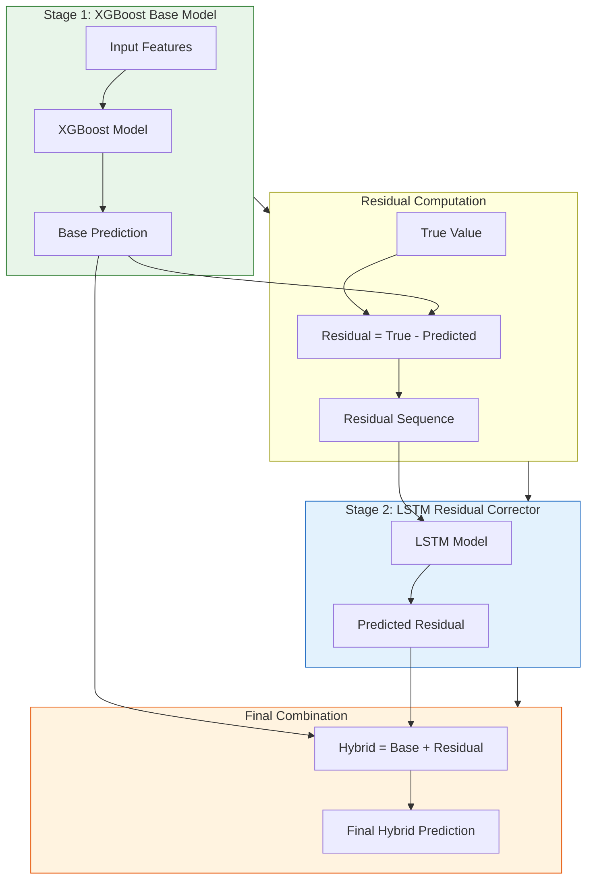
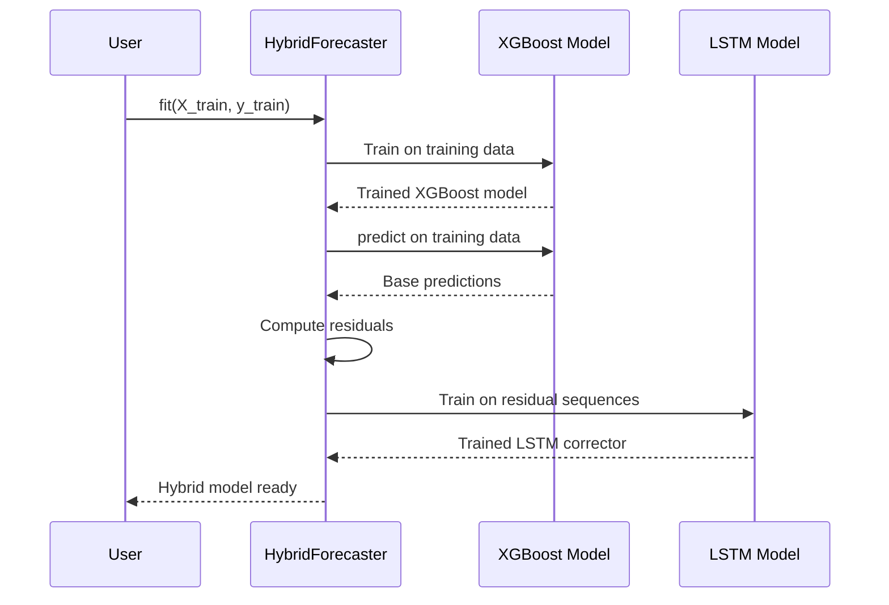
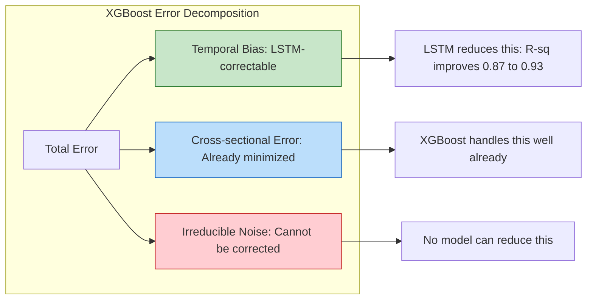

# 7.1 The Residual Correction Paradigm

## What Are Residuals?

At the heart of every forecasting model lies a simple but profound concept: the **residual**. A residual is the difference between the true observed value and the model's prediction. Formally, for a model that produces prediction $\hat{y}_i$ for observation $y_i$, the residual is defined as:

$$r_i = y_i - \hat{y}_i$$

If your model were perfect, every residual would be exactly zero. In practice, residuals carry the story of what your model failed to capture — the signal that remains in the noise after your first pass at prediction. Understanding residuals is not merely a diagnostic exercise; it is the foundation upon which the entire hybrid forecasting architecture in this project is built.

Residuals are not merely errors to be minimized; they are **information**. When a solar power forecasting model trained on the UNISOLAR dataset at Site 25 produces residuals that exhibit temporal patterns — for instance, consistently underestimating power during the morning ramp-up or overestimating during afternoon cloud transitions — those patterns contain learnable structure. The residual correction paradigm is built on the insight that a second model can be trained to predict these structured residuals, effectively learning what the first model missed.

Consider the physical intuition behind solar power residuals. During the morning hours, as the sun rises, power output increases rapidly from zero to its peak. The XGBoost model, relying on lag features and meteorological inputs, may predict this ramp-up but with a slight delay — it consistently underestimates power during the first two hours after sunrise. This systematic underestimation creates a sequence of positive residuals (actual power exceeds predicted power) that are temporally correlated. The LSTM, trained on these residual sequences, can learn that when the previous residuals are positive and increasing, the next residual is also likely to be positive, and thus add a correction to the XGBoost prediction.

Similarly, during afternoon cloud transitions, XGBoost may overestimate power because its lag features still reflect the pre-cloud conditions. The residual becomes negative, and a sequence of negative residuals develops as the cloud persists. The LSTM learns this temporal pattern and applies a downward correction to the XGBoost prediction. This ability to detect and correct systematic temporal patterns in residuals is the core value proposition of the hybrid architecture.

In classical statistics, residual analysis is a standard diagnostic tool. The Durbin-Watson test checks for autocorrelation in residuals, the Breusch-Pagan test checks for heteroscedasticity, and Q-Q plots check for normality. In machine learning, we go beyond diagnosis — we use the residual structure as the target for a second model. This transforms residual analysis from a passive diagnostic into an active model improvement strategy.

> **Important Reminder**: Residuals are not the same as errors in the colloquial sense. An error implies a mistake; a residual implies remaining signal. The entire hybrid architecture in this project exists because residuals from the XGBoost model contain temporal patterns that a sequential model like LSTM can exploit. If residuals were truly random white noise, there would be nothing for the LSTM to learn and the hybrid approach would offer no improvement over the base model alone.

## Why XGBoost Alone Is Not Enough

XGBoost is a phenomenally powerful algorithm for tabular prediction. It builds an ensemble of decision trees using gradient boosting, minimizing a regularized objective function that combines a differentiable loss function with a complexity penalty on each tree. The objective function is:

$$\mathcal{L}(\phi) = \sum_{i=1}^{n} l(y_i, \hat{y}_i) + \sum_{k=1}^{K} \Omega(f_k)$$

where $l$ is a differentiable loss function and $\Omega(f_k) = \gamma T + \frac{1}{2}\lambda \|\mathbf{w}\|^2$ penalizes tree complexity. XGBoost excels at capturing **non-linear feature interactions** and **cross-sectional patterns** — for instance, the interaction between temperature, humidity, and hour-of-day that determines solar irradiance. On the UNISOLAR Site 25 data, a well-tuned XGBoost model achieves an R-squared of approximately 0.87, meaning it explains 87% of the variance in solar power output. This is already a strong result, but the remaining 13% of unexplained variance is where the opportunity for improvement lies.

However, XGBoost has a fundamental architectural limitation: **it has no native concept of temporal sequence**. Each training sample is treated as an independent row of features. Even when lag features are engineered (e.g., power at the previous 15-minute step, power at the previous hour), the model learns these as static feature values, not as elements of an ordered sequence. This distinction is crucial and has several important consequences:

1. **No state persistence**: XGBoost cannot maintain a hidden state that evolves over time. It cannot remember that the last three time steps showed a gradual cloud cover increase and therefore adjust its internal representation accordingly. Each prediction is made from scratch, based solely on the current feature vector. If the feature vector at time $t$ and the feature vector at time $t+1$ happen to be similar (which is common at 15-minute resolution), the predictions will be similar — but this is a side effect of feature similarity, not of genuine temporal reasoning.

2. **No sequential dependency modeling**: The temporal autocorrelation in residuals — where the residual at time $t$ is correlated with the residual at time $t-1$, $t-2$, and so on — is invisible to XGBoost. It sees the residual at the previous time step as just another feature column, not as part of a sequence with temporal structure. While the model can learn a correlation like "when the lag-1 residual is positive, the current residual tends to also be positive," it cannot model the full sequential dependency that an LSTM captures through its hidden state evolution. The LSTM can learn that a sequence of increasing positive residuals followed by a decrease suggests a different correction than a sequence of steady positive residuals.

3. **No temporal smoothing**: XGBoost predictions can jump erratically between consecutive time steps because each prediction is independent. A solar power curve should be smooth at the 15-minute resolution of the UNISOLAR dataset, but XGBoost has no mechanism to enforce this smoothness. Two consecutive predictions might differ by 20% of capacity even though the true power output changed by only 2%. This jaggedness is not just aesthetically unpleasant — it can trigger unnecessary ramping of backup generators in grid operations.

The residual analysis of the XGBoost model trained on the UNISOLAR Site 25 data confirmed all of these limitations. Autocorrelation function (ACF) plots of residuals showed significant lag-1 through lag-4 correlations (up to 45 minutes), meaning there was genuine temporal structure left in the residuals. The Ljung-Box test rejected the null hypothesis of independent residuals at the 0.01 level for lags 1 through 8. The Durbin-Watson statistic was approximately 1.2, well below the ideal value of 2.0 for independent residuals, further confirming positive autocorrelation. These statistical tests collectively demonstrate that XGBoost's residuals are not random — they contain temporal structure that a sequential model can exploit.

## The Two-Stage Hybrid: XGBoost Predicts Base, LSTM Corrects Residuals

The hybrid architecture follows a sequential two-stage paradigm that decomposes the forecasting problem into two complementary sub-problems. This decomposition is not arbitrary — it reflects the fundamental distinction between cross-sectional and temporal patterns in the data.

### Stage 1: Base Prediction with XGBoost

XGBoost is trained on the full feature set to predict solar power output directly. The model captures the bulk of the variance — the diurnal pattern (power follows the sun), the seasonal variation (summer days are longer), the response to temperature and clear-sky index. With R-squared values of 0.87 on the UNISOLAR Site 25 data, XGBoost alone already explains the vast majority of the power output variability.

### Stage 2: Residual Correction with LSTM

The residuals from Stage 1 are computed as $r_i = y_i - \hat{y}_i^{\text{XGB}}$. These residuals form a **time series** — an ordered sequence of values with temporal dependencies that XGBoost could not capture. An LSTM is then trained to predict the next residual value given a window of past residuals:

$$\hat{r}_i = f_{\text{LSTM}}(r_{i-T}, r_{i-T+1}, \ldots, r_{i-1})$$

where $T$ is the sequence length (the lookback window, typically 24 time steps representing 6 hours of residual history at 15-minute intervals).

### Final Prediction

The final hybrid prediction combines both stages through simple addition:

$$\hat{y}_i^{\text{hybrid}} = \hat{y}_i^{\text{XGB}} + \hat{r}_i$$

This is an additive correction: the LSTM does not re-predict the entire power output but only the **delta** — the structured error that XGBoost missed. This decomposition is powerful because the XGBoost model handles the **cross-sectional, feature-driven** component of the prediction, while the LSTM handles the **temporal, sequential** component that depends on the pattern of recent errors.

## The Code Flow: HybridForecaster.fit() and HybridForecaster.predict()

In the project codebase, the hybrid architecture is implemented in the `HybridForecaster` class. Understanding the code flow is essential for grasping why this design is sequential rather than parallel.

### fit() Method

The training procedure follows a strict sequential order that cannot be parallelized because the second stage depends on the output of the first:

1. **Train XGBoost**: The `fit()` method first trains the XGBoost model on the training data. During this phase, the model learns the mapping from features to power output using the gradient-boosted tree ensemble. The `eval_set` parameter is used for early stopping based on validation RMSE. This step typically produces a model with 200-300 trees.

2. **Compute residuals**: After XGBoost training is complete, predictions are generated on the training set. Residuals are computed as the difference between actual and predicted values. These residuals become the **target variable** for the LSTM. The residual computation is a critical step that must happen after XGBoost training — you cannot compute residuals before the base model exists.

3. **Train LSTM on residual sequences**: The residual time series is transformed into sliding-window sequences. The LSTM is trained to predict the next residual value given a window of past residuals. This is a standard time-series forecasting setup, but the target is residuals rather than raw power values. The LSTM uses heteroscedastic loss to also predict uncertainty in the residual correction.

### predict() Method

At inference time, the flow mirrors training in a sequential pipeline. First, XGBoost produces a base prediction for the input features. Second, the LSTM takes the sequence of recent residuals and predicts the residual correction. Third, the final prediction is the sum of the base prediction and the residual correction. This three-step pipeline is efficient at inference time because both models are already trained and the computation is straightforward.

> **Important Reminder**: The predict flow requires that residual history be available. For the very first prediction window, there are no prior residuals. This is the "dummy_resid" issue — the code must handle the cold-start case where the LSTM has no residual history to condition on, typically by using zeros or the mean residual as a placeholder. After 4-6 time steps (1-1.5 hours), the LSTM has accumulated enough real residual history to make meaningful corrections.

## Why Sequential, Not Parallel

A natural question arises: why not train XGBoost and LSTM in parallel and average their predictions? The answer lies in the fundamental difference between **ensemble averaging** and **residual correction**.

In a parallel ensemble, both models independently try to predict the full power output. The ensemble reduces variance (this is the statistical basis of bagging), but both models are solving the same problem. If XGBoost captures 90% of the signal and LSTM captures 88%, their overlap is massive — the marginal benefit of adding the LSTM is small.

In sequential residual correction, the LSTM solves a **different problem** — predicting the structured temporal error of XGBoost. This is inherently complementary because every parameter in the LSTM is dedicated to modeling the temporal structure of XGBoost's errors, which is precisely the information that XGBoost cannot capture due to its lack of sequential modeling.

| Aspect | Parallel Ensemble | Sequential Residual Correction |
|--------|-------------------|-------------------------------|
| Models solve | Same problem | Different problems |
| Overlap | High | Minimal by design |
| LSTM input | Raw features | Residual sequences |
| LSTM target | Power output | XGBoost residuals |
| Theoretical basis | Variance reduction | Bias correction |
| Information flow | None between models | XGBoost output feeds LSTM |

## Mathematical Justification

Consider the bias-variance decomposition of the XGBoost model's expected squared error. The residual $r = y - \hat{y}^{\text{XGB}}$ contains both the bias component and the variance component plus irreducible noise. If the LSTM can predict a portion $\hat{r}$ of the residual, the remaining error becomes $\mathbb{E}[(r - \hat{r})^2]$. The LSTM effectively reduces the residual variance by modeling the temporally structured component of the bias. Since the LSTM operates on residual sequences, it can exploit autocorrelation in the bias — something that no amount of additional tree boosting can achieve. This is because additional boosting rounds reduce the overall residual magnitude but do not change the temporal autocorrelation structure; the LSTM specifically targets that autocorrelation.

## Practical Considerations for the Solar Forecasting Project

In the UNISOLAR Site 25 context with 15-minute intervals, the residual correction paradigm is particularly effective because cloud-induced errors are temporally correlated (when a cloud passes over a solar array, it affects multiple consecutive 15-minute intervals), morning and evening ramp errors are serial (the transition from zero power to positive power follows a smooth curve that XGBoost may approximate poorly), and the R-squared improvement from 0.87 to 0.93 reflects the LSTM's ability to correct these temporally structured errors. The 6-percentage-point improvement in explained variance translates to a 27% reduction in RMSE, which is a substantial practical improvement that grid operators would notice in their daily dispatch decisions.

## Key Takeaways

1. **Residuals are information, not just noise**: The difference between the true value and the prediction contains structured, learnable signal — especially temporal patterns that tree-based models cannot capture.

2. **XGBoost lacks temporal awareness**: Despite its power for tabular prediction, XGBoost treats each sample independently and cannot model sequential dependencies in residuals.

3. **The hybrid is sequential by design**: XGBoost is trained first, residuals are computed, then LSTM is trained on residual sequences. This ensures the LSTM focuses exclusively on the temporal error structure.

4. **Final prediction is additive**: The hybrid prediction equals the XGBoost base prediction plus the LSTM residual correction. The LSTM predicts the delta, not the absolute value.

5. **Sequential is fundamentally different from parallel**: The residual correction paradigm ensures minimal overlap between what the two models learn, maximizing the marginal benefit of the LSTM.

6. **The cold-start problem matters**: At inference time, the LSTM needs a history of residuals. The first few predictions may be less accurate due to the dummy_resid initialization.

7. **R-squared improvement from 0.87 to 0.93 validates the approach**: The 6-percentage-point gain in explained variance on the UNISOLAR Site 25 data confirms that temporal residual structure is real and exploitable.
