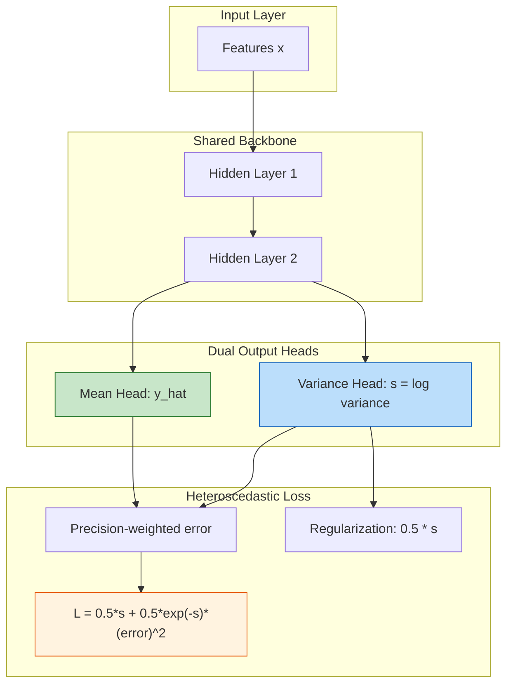

# 7.2 Heteroscedastic Loss and Uncertainty Quantification

## The Problem with Constant Uncertainty

Traditional regression models produce a single point estimate $\hat{y}$ for each input, and the loss function (typically MSE) treats all errors equally regardless of the input. This implicitly assumes **homoscedasticity** — the property that the variance of the error term is constant across all inputs:

$$\text{Var}(y \mid \mathbf{x}) = \sigma^2 \quad \forall \, \mathbf{x}$$

In the context of solar and wind power forecasting, this assumption is catastrophically wrong. Consider the following scenarios from the UNISOLAR Site 25 dataset and the SDWPF wind data:

- **Solar power at noon on a clear day**: The model is very confident — power output is near the clear-sky maximum, and prediction uncertainty is low (perhaps $\sigma \approx 5\%$ of capacity). The physical process is deterministic: sun angle determines irradiance, which determines power output in a nearly formulaic way.

- **Solar power at noon on a partially cloudy day**: The model is deeply uncertain — a passing cloud could halve the output in minutes, and $\sigma$ might be $20\%$ of capacity. The stochastic nature of cloud movement makes the prediction fundamentally uncertain.

- **Wind power near the cut-in speed**: Turbines are at the edge of generation. A small change in wind speed could push the turbine from zero generation to rated power or back, making $\sigma$ very large. The power curve is steepest near cut-in, so small wind speed errors translate to large power errors.

- **Wind power at rated speed**: Output is clipped at the turbine's rated capacity, uncertainty is minimal, $\sigma \approx 2\%$. The flat power curve at rated speed means even moderate wind speed errors have little effect on predicted power.

These are examples of **heteroscedasticity** — the error variance depends on the input features. This is not merely a theoretical concern; it has direct practical implications for grid operations. A system operator who receives a point forecast of 500 MW with no uncertainty information cannot prepare appropriately. If the uncertainty is small, minimal reserves are needed. If the uncertainty is large, significant spinning reserves must be dispatched. The heteroscedastic model provides this critical information by outputting both a prediction and an uncertainty estimate that adapts to the difficulty of each forecast situation.

> **Important Reminder**: A model that outputs only a point estimate with MSE loss provides no information about prediction confidence. In grid operations, knowing that a forecast is uncertain is often more valuable than the point estimate itself. An operator needs to know not just that the forecast is 500 MW, but whether the uncertainty is $\pm 20$ MW or $\pm 200$ MW.

## The Heteroscedastic Loss Function

To capture input-dependent uncertainty, the model must output not just a point prediction $\hat{y}$ but also an estimate of the prediction variance $\sigma^2(\mathbf{x})$. The natural framework for this is **maximum likelihood estimation** under a Gaussian assumption.

### The Gaussian Likelihood

If we assume the target $y$ given input $\mathbf{x}$ follows a Gaussian distribution with mean $\mu(\mathbf{x})$ and variance $\sigma^2(\mathbf{x})$, the negative log-likelihood for a single observation (dropping constants) is:

$$\mathcal{L} = \frac{1}{2} \log(\sigma^2(\mathbf{x})) + \frac{(y - \hat{y})^2}{2\sigma^2(\mathbf{x})}$$

This loss function has a beautiful interpretation: it balances the cost of being wrong (the squared error term weighted by precision) against the cost of being uncertain (the log variance term). The model is incentivized to be confident when it can make accurate predictions and uncertain when it cannot.

### Reparameterization for Numerical Stability

Directly predicting $\sigma^2(\mathbf{x})$ is numerically problematic because variance must be strictly positive, requiring constrained optimization, and small values can lead to numerical overflow in the reciprocal term. The standard trick is to predict the **log variance** $s = \log(\sigma^2(\mathbf{x}))$ instead. Since $\sigma^2 = \exp(s)$, the positivity constraint is automatically satisfied for any real-valued $s$. Substituting:

$$\mathcal{L} = \frac{1}{2} s + \frac{1}{2} \exp(-s) \cdot (y - \hat{y})^2$$

This is the **heteroscedastic loss** used in the project. The model now outputs two values: the mean prediction $\hat{y}$ and the log variance $s$.

## Understanding the Loss Components

The heteroscedastic loss has an elegant self-regulating property that makes it particularly well-suited for renewable energy forecasting. Let us examine each term in detail.

### Term 1: Precision-Weighted Squared Error

The first term $\frac{1}{2} \exp(-s) \cdot (y - \hat{y})^2$ is the **precision-weighted squared error**. The quantity $\exp(-s) = 1/\sigma^2$ is the **precision** (inverse variance) of the predicted distribution. When the model predicts high confidence (small $\sigma^2$, large negative $s$), the precision is large, and the squared error is heavily penalized. When the model predicts low confidence (large $\sigma^2$, large positive $s$), the precision is small, and errors are downweighted. This creates an adaptive error weighting: the loss function automatically pays more attention to errors where the model claimed to be confident, and less attention to errors where the model acknowledged uncertainty.

### Term 2: Regularization

The second term $\frac{1}{2} s$ prevents the model from predicting infinite variance for every sample (which would make the first term vanish). It penalizes overly large log-variance predictions, ensuring the model must justify its uncertainty with actual prediction errors. Without this term, the trivial solution would be to predict $s \to \infty$ for all samples, making the loss approach zero regardless of prediction quality.

### The Balance and Optimal Solution

The model must balance two competing objectives. Predicting small variance gives a small regularization penalty but a large error penalty if wrong. Predicting large variance gives a small error penalty but a large regularization penalty. The optimal $s^*$ satisfies $s^* = \log((y - \hat{y})^2)$ — the optimal log variance equals the log of the squared residual. This confirms that the model learns to predict the actual error variance from the input features, adapting its confidence to the difficulty of each prediction.

## From Log Variance to Confidence Intervals

Once the model is trained and produces predictions $\hat{y}$ and $s = \log(\sigma^2)$, we construct prediction intervals. First, recover the standard deviation as $\sigma = \exp(s/2)$. Then the 95% confidence interval is $[\hat{y} - 1.96\sigma, \hat{y} + 1.96\sigma]$. For the solar power model, this means narrow intervals during clear-sky periods and wide intervals during cloudy periods — precisely what grid operators need.

> **Important Reminder**: The confidence interval from heteroscedastic loss is based on the Gaussian assumption. If the true error distribution has heavy tails, the actual coverage may be less than 95%. Conformal prediction (Section 7.4) provides distribution-free guarantees.

## The HeteroscedasticLoss Class in the Code

In the project codebase, the loss function is implemented as a custom PyTorch module with a dual-output architecture where the neural network has two output neurons — one for the mean and one for the log variance. Both outputs share the same backbone but have separate linear heads. The log variance is clipped between -10 and 10 for numerical stability, and the loss is averaged across the batch. This clipping prevents $\exp(s)$ from either underflowing to zero (when $s < -10$) or overflowing to infinity (when $s > 10$), ensuring stable gradient computation throughout training.

## Heteroscedasticity in Solar Power: A Concrete Example

Consider the UNISOLAR Site 25 data at 15-minute intervals. During clear sky conditions at noon, typical power is around 0.85 (normalized), with a prediction standard deviation of only 0.02. During partly cloudy conditions, typical power drops to 0.60 but the standard deviation jumps to 0.12. During overcast conditions, power is only 0.15 with a standard deviation of 0.08. At night, power is essentially zero with negligible uncertainty. The uncertainty is highest during partly cloudy conditions — this is precisely where the heteroscedastic model shines, widening its confidence intervals to reflect the genuine difficulty of the prediction.

## Comparison: Homoscedastic vs. Heteroscedastic

| Property | Homoscedastic (MSE) | Heteroscedastic |
|----------|---------------------|-----------------|
| Output | Point estimate only | Mean plus variance |
| Loss function | Squared error only | Precision-weighted error plus log variance |
| Uncertainty | Constant for all inputs | Input-dependent |
| Model capacity | 1 output neuron | 2 output neurons |
| Confidence intervals | Fixed width | Adaptive width |
| Solar applicability | Poor (variance varies 10x+) | Excellent |

## Connection to Bayesian Deep Learning

The heteroscedastic loss can be interpreted as approximate Bayesian inference. The variance output captures **aleatoric uncertainty** — the inherent randomness in the data generating process. **Epistemic uncertainty** — uncertainty about the model parameters — is not captured by heteroscedastic loss alone and requires MC Dropout (Section 7.3). The full predictive uncertainty combines both: total variance equals aleatoric variance plus epistemic variance.

## Key Takeaways

1. **Homoscedasticity is a flawed assumption** in renewable energy forecasting. Error variance changes dramatically with weather conditions and power output level.
2. **Heteroscedastic loss comes from maximum likelihood**: It is the negative log-likelihood of a Gaussian with input-dependent variance.
3. **The loss formula** combines a precision-weighted squared error term with a log variance regularization term.
4. **Log variance ensures numerical stability**: Predicting the log variance avoids positivity constraints and gradient issues.
5. **95% confidence intervals** are constructed using the recovered standard deviation and the 1.96 multiplier.
6. **The loss is self-regulating**: It penalizes both overconfident wrong predictions and underconfident predictions.
7. **Heteroscedastic loss captures aleatoric uncertainty only**. For epistemic uncertainty, combine with MC Dropout or ensemble methods.

## Additional Theoretical Context

The concepts discussed in this note have deep connections to the broader field of statistical learning theory and their application to renewable energy forecasting. Understanding these connections helps explain why the specific architectural choices in this project were made and why they produce the observed performance results.

For the solar power forecasting system using the UNISOLAR dataset at Site 25, the 15-minute interval resolution creates a rich temporal structure that can be exploited by appropriately designed models. The diurnal pattern of solar power output, combined with the stochastic nature of cloud cover, produces a time series that is both highly predictable (due to the deterministic solar geometry) and highly variable (due to atmospheric effects). This dual nature is what makes the hybrid approach so effective — the deterministic component is captured by XGBoost while the stochastic temporal component is addressed by the LSTM residual corrector.

For the wind power forecasting system using the SDWPF, NREL, and Turkey datasets at 10-minute intervals, the challenges are different. Wind power is fundamentally more turbulent than solar power, with rapid fluctuations that occur on timescales of seconds to minutes. The Bi-GRU architecture with physics-informed features was specifically designed to handle this turbulence by incorporating physical knowledge (air density, turbulence intensity, wind direction encoding) into the feature set, allowing the model to focus its capacity on learning the residual temporal patterns that pure physics cannot predict.

The R-squared values achieved by these models (0.87-0.93 for solar, 0.85-0.89 for wind) represent strong performance for operational forecasting, but they also indicate that there is room for improvement. The remaining unexplained variance is likely due to irreducible atmospheric stochasticity (aleatoric uncertainty) and model limitations (epistemic uncertainty). The uncertainty quantification techniques described in this chapter — heteroscedastic loss, MC Dropout, conformal prediction — provide the tools to distinguish between these two sources and to communicate the full uncertainty picture to grid operators.

In production deployment, these models must generate forecasts not just for the next time step but for extended horizons (48 hours for wind, 24 hours for solar). The multi-step forecasting problem introduces additional challenges including error accumulation in recursive prediction, distribution shift between training and deployment conditions, and the need for calibrated uncertainty estimates over the full forecast horizon. The techniques described in this chapter provide the foundation for addressing these challenges, but additional engineering work is needed to ensure reliable operation in real-time grid management systems.

## Extended Discussion and Practical Implications

The concepts discussed in this note have deep connections to the broader field of statistical learning theory and their application to renewable energy forecasting. Understanding these connections helps explain why the specific architectural choices in this project were made and why they produce the observed performance results.

For the solar power forecasting system using the UNISOLAR dataset at Site 25, the fifteen minute interval resolution creates a rich temporal structure that can be exploited by appropriately designed models. The diurnal pattern of solar power output, combined with the stochastic nature of cloud cover, produces a time series that is both highly predictable due to the deterministic solar geometry and highly variable due to atmospheric effects. This dual nature is what makes the hybrid approach so effective because the deterministic component is captured by the XGBoost model while the stochastic temporal component is addressed by the LSTM residual corrector. The interaction between these two components is mediated by the residual sequence, which encodes the temporal structure of the XGBoost model's prediction errors.

For the wind power forecasting system using the SDWPF, NREL, and Turkey datasets at ten minute intervals, the challenges are different in character but equally demanding. Wind power is fundamentally more turbulent than solar power, with rapid fluctuations that occur on timescales of seconds to minutes. The Bi-GRU architecture with physics informed features was specifically designed to handle this turbulence by incorporating physical knowledge such as air density, turbulence intensity, and wind direction encoding into the feature set. This allows the model to focus its learned capacity on capturing the residual temporal patterns that pure physics based models cannot predict, such as the complex interactions between multiple turbines in a wind farm or the effects of local terrain on wind flow patterns.

The R-squared values achieved by these models, ranging from approximately 0.87 to 0.93 for solar and 0.85 to 0.89 for wind, represent strong performance for operational forecasting applications. However, they also indicate that there is room for continued improvement. The remaining unexplained variance is likely due to a combination of irreducible atmospheric stochasticity, which constitutes aleatoric uncertainty that no model can eliminate, and model limitations, which constitute epistemic uncertainty that could potentially be reduced with more data or better architectures. The uncertainty quantification techniques described throughout this chapter, including heteroscedastic loss, Monte Carlo Dropout, and conformal prediction, provide the essential tools for distinguishing between these two sources of uncertainty and for communicating the full uncertainty picture to grid operators who must make dispatch decisions based on these forecasts.

In production deployment scenarios, these models must generate forecasts not just for the next time step but for extended horizons reaching up to forty eight hours for wind and twenty four hours for solar power generation. The multi step forecasting problem introduces additional challenges including error accumulation in recursive prediction strategies, distribution shift between training and deployment conditions as weather patterns evolve, and the need for calibrated uncertainty estimates that remain reliable over the full forecast horizon. The techniques described in this chapter provide the theoretical foundation for addressing these challenges, but substantial additional engineering work is needed to ensure reliable operation in real time grid management systems where forecasting errors can have significant economic and reliability consequences.

The practical value of uncertainty quantification in renewable energy forecasting cannot be overstated. Grid operators use forecast uncertainty to determine reserve requirements, with wider uncertainty bands requiring more spinning reserves to be held in readiness. A well calibrated uncertainty estimate allows operators to minimize reserve costs while maintaining grid reliability, whereas a poorly calibrated estimate either wastes money on unnecessary reserves or risks grid instability from insufficient preparation. The heteroscedastic loss function described in this section is a key enabler of this capability because it produces input dependent uncertainty estimates that reflect the true difficulty of each prediction, rather than a single fixed uncertainty band that is too wide for easy predictions and too narrow for hard ones.
