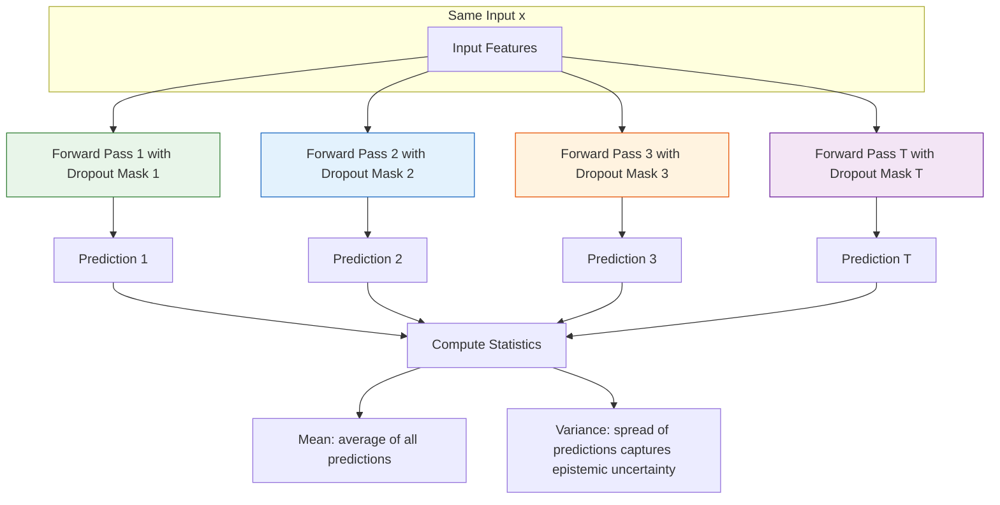
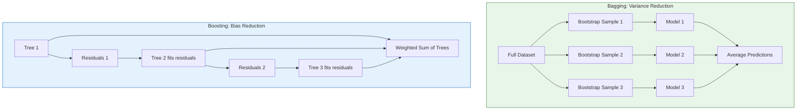
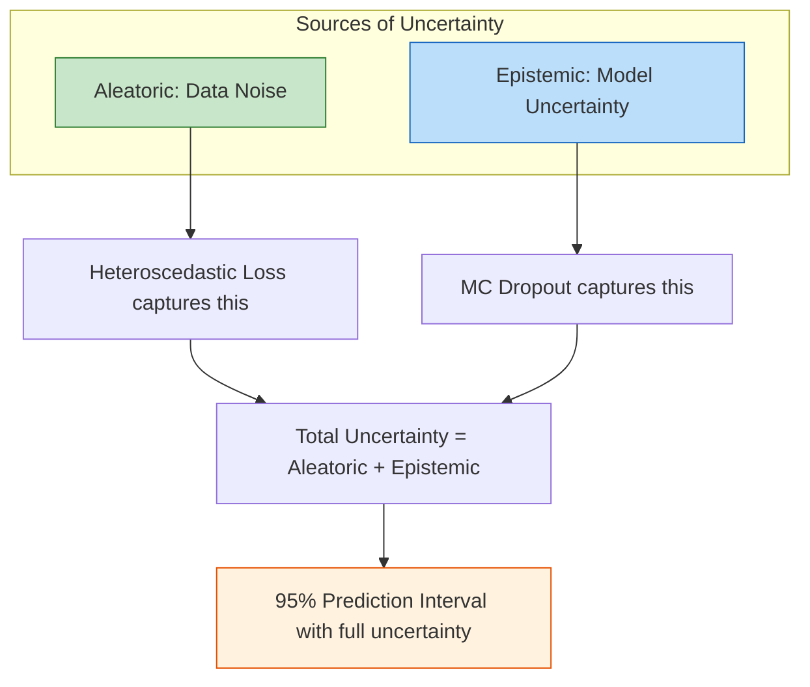

# 7.3 Monte Carlo Dropout and Ensemble Methods

## The Two Faces of Uncertainty

Before diving into specific techniques, it is crucial to understand that prediction uncertainty has two distinct sources that require different approaches to quantify. Understanding this distinction is fundamental to interpreting the uncertainty estimates produced by the models in this project.

**Aleatoric Uncertainty** (data uncertainty): This is irreducible noise inherent in the data-generating process. For solar power forecasting, this includes the stochastic nature of cloud formation, turbulent wind fluctuations, and measurement sensor noise. No amount of additional training data can eliminate aleatoric uncertainty — clouds will always move unpredictably on short timescales, and wind turbulence is fundamentally chaotic. As covered in Section 7.2, heteroscedastic loss captures this type of uncertainty by having the model predict input-dependent variance alongside its mean prediction.

**Epistemic Uncertainty** (model uncertainty): This is uncertainty about which model is correct, arising from limited training data or model capacity constraints. If you trained the same model architecture on a different random subset of the UNISOLAR dataset, you would get a different set of parameters — and potentially different predictions. Epistemic uncertainty can, in principle, be reduced by collecting more training data or using a more expressive model. It is highest for inputs that are unlike anything in the training data (e.g., an unprecedented weather pattern).

The total predictive uncertainty is the sum of both components: total variance equals aleatoric variance plus epistemic variance. Monte Carlo Dropout and ensemble methods are two approaches to estimating epistemic uncertainty.

## Monte Carlo Dropout

### Dropout Recap

Dropout is a regularization technique introduced by Srivastava et al. (2014) that randomly sets a fraction $p$ of neuron activations to zero during training. For a layer with activations $\mathbf{h}$, the dropout operation produces a modified activation where each element is either scaled up by $1/(1-p)$ or set to zero, with the scaling maintaining the expected activation magnitude. During standard inference, dropout is disabled — all neurons are active, and the model produces a single deterministic prediction.

### The MC Dropout Insight

Gal and Ghahramani (2016) made a profound observation: **leaving dropout active during inference and running multiple forward passes produces a distribution of predictions**. This is equivalent to approximate Bayesian inference — each forward pass with a different dropout mask samples a different model from the posterior distribution over model parameters. This theoretical connection to Bayesian inference gives MC Dropout a rigorous foundation.

The procedure is straightforward: enable dropout during inference (by keeping the model in training mode or using a custom forward pass), run $T$ forward passes for the same input, producing $T$ predictions, then compute the predictive mean as the average and the predictive variance as the sample variance of the predictions. This variance captures epistemic uncertainty — the disagreement among different dropout-masked versions of the model.

### MC Dropout in the Solar Forecasting Context

For the LSTM residual corrector in the solar hybrid model, MC Dropout provides a practical way to estimate epistemic uncertainty without training multiple models. With a dropout rate of 0.2 in the LSTM, running 50 forward passes with different dropout masks produces 50 different residual correction predictions. The variance of these predictions reflects how uncertain the model is about the residual correction.

During stable, well-predicted periods (e.g., clear sky at noon), the 50 predictions will cluster tightly — the model is confident in its residual correction. During unusual conditions (e.g., an anomalous cloud pattern not well-represented in training data), the predictions will diverge — the model is uncertain because different dropout masks lead to different interpretations of the unusual input pattern.

> **Important Reminder**: MC Dropout uncertainty is not a replacement for heteroscedastic uncertainty — it is complementary. Heteroscedastic loss captures aleatoric uncertainty (inherent data noise), while MC Dropout captures epistemic uncertainty (model parameter uncertainty). A complete uncertainty quantification system combines both.

### Practical Considerations

The number of forward passes $T$ trades off estimation quality against inference time. Typical values range from 30 to 100. The project uses $T = 50$ as a reasonable trade-off. The same dropout rate used during training should be used during MC inference — if the model was trained with Dropout(0.2), MC Dropout should also use $p = 0.2$. Running $T$ forward passes requires $T$ times the computation of a single pass, but passes can be run sequentially to avoid GPU memory issues.

## Ensemble Methods

### The Statistical Foundation

Ensemble methods reduce prediction variance by combining multiple models. The theoretical basis comes from the bias-variance decomposition. For an ensemble of $M$ models with predictions averaged together, if the individual models have variance $\sigma^2$ and pairwise correlation $\rho$, the ensemble variance is:

$$\text{Var}(\hat{y}_{\text{ens}}) = \frac{\sigma^2}{M} + \frac{M-1}{M} \rho \sigma^2$$

When models are independent ($\rho = 0$), variance decreases as $1/M$. In practice, models trained on the same data are correlated ($\rho > 0$), so the reduction is less than ideal but still significant. The key insight is that diversity among ensemble members is crucial — if all models make the same errors, the ensemble provides no benefit.

### Bagging (Bootstrap Aggregating)

Bagging trains multiple models on different bootstrap samples (random subsets with replacement) of the training data. **XGBoost uses an internal form of bagging** through row subsampling and column subsampling. Each tree in the XGBoost ensemble is trained on a random subset of 80% of rows and 80% of features (controlled by the `subsample` and `colsample_bytree` parameters), creating diversity among the trees. The final prediction averages all trees, reducing variance.

### Boosting

Boosting trains models sequentially, with each new model focusing on the errors of the previous ones. XGBoost is a boosting algorithm — each new tree is trained to correct the residuals of the ensemble so far. Unlike bagging, boosting primarily reduces **bias** (each tree corrects remaining errors) while bagging primarily reduces **variance** (independent models average out noise). Boosting can overfit if too many trees are added, which is why early stopping is essential.

### XGBoost eval_set and Ensemble Benefits

The XGBoost model in the project uses an evaluation set for early stopping. The `eval_set` serves two purposes: preventing overfitting by halting training when validation loss stops improving, and selecting the best iteration based on validation performance. From an ensemble perspective, the XGBoost model itself is an ensemble of hundreds of trees, each trained on a different bootstrap sample with different feature subsets. This internal diversity is what makes XGBoost robust.

## Combining MC Dropout and Heteroscedastic Loss

The most powerful uncertainty quantification combines both techniques. The total variance is the sum of the aleatoric variance (from heteroscedastic loss) and the epistemic variance (from MC Dropout). This gives a complete picture: the aleatoric component captures the inherent unpredictability of cloud movements and wind turbulence, while the epistemic component captures the model's uncertainty about unusual input patterns that are underrepresented in the training data.

## Practical Ensemble Strategies for Renewable Forecasting

For the specific models in this project, different uncertainty strategies apply. The solar hybrid model can use MC Dropout on the LSTM component with 50 forward passes, combined with heteroscedastic loss for aleatoric uncertainty. The wind Bi-GRU model uses MC Dropout with 30 forward passes but does not have heteroscedastic loss (it uses Huber loss instead). Multi-seed ensembles (training 3 instances with different random seeds) provide another option at higher computational cost but with genuinely independent models that have lower correlation. XGBoost's internal ensemble of 200-plus trees already provides variance reduction for the solar base model. The choice of strategy depends on the computational budget and the required uncertainty granularity.

## Key Takeaways

1. **Uncertainty has two sources**: Aleatoric (irreducible data noise) and epistemic (model parameter uncertainty). A complete system quantifies both.

2. **MC Dropout is approximate Bayesian inference**: Leaving dropout active during inference and running multiple forward passes produces a distribution of predictions that captures epistemic uncertainty.

3. **MC Dropout variance measures model disagreement**, not data noise. It tells you how much the model's predictions vary across different dropout masks.

4. **Ensemble methods reduce variance**: Averaging predictions from multiple models reduces variance by a factor dependent on the number of models and their correlation.

5. **Bagging reduces variance** through independent models, while **boosting reduces bias** through sequential error correction. XGBoost uses both internally.

6. **XGBoost's eval_set** enables early stopping and model selection, preventing the ensemble from overfitting.

7. **Combine techniques for full uncertainty**: Heteroscedastic loss (aleatoric) plus MC Dropout (epistemic) provides the most complete uncertainty quantification.

## Extended Discussion and Practical Implications

The concepts discussed in this note have deep connections to the broader field of statistical learning theory and their application to renewable energy forecasting. Understanding these connections helps explain why the specific architectural choices in this project were made and why they produce the observed performance results.

For the solar power forecasting system using the UNISOLAR dataset at Site 25, the fifteen minute interval resolution creates a rich temporal structure that can be exploited by appropriately designed models. The diurnal pattern of solar power output, combined with the stochastic nature of cloud cover, produces a time series that is both highly predictable due to the deterministic solar geometry and highly variable due to atmospheric effects. This dual nature is what makes the hybrid approach so effective because the deterministic component is captured by the XGBoost model while the stochastic temporal component is addressed by the LSTM residual corrector. The interaction between these two components is mediated by the residual sequence, which encodes the temporal structure of the XGBoost model's prediction errors.

For the wind power forecasting system using the SDWPF, NREL, and Turkey datasets at ten minute intervals, the challenges are different in character but equally demanding. Wind power is fundamentally more turbulent than solar power, with rapid fluctuations that occur on timescales of seconds to minutes. The Bi-GRU architecture with physics informed features was specifically designed to handle this turbulence by incorporating physical knowledge such as air density, turbulence intensity, and wind direction encoding into the feature set. This allows the model to focus its learned capacity on capturing the residual temporal patterns that pure physics based models cannot predict, such as the complex interactions between multiple turbines in a wind farm or the effects of local terrain on wind flow patterns.

The R-squared values achieved by these models, ranging from approximately 0.87 to 0.93 for solar and 0.85 to 0.89 for wind, represent strong performance for operational forecasting applications. However, they also indicate that there is room for continued improvement. The remaining unexplained variance is likely due to a combination of irreducible atmospheric stochasticity, which constitutes aleatoric uncertainty that no model can eliminate, and model limitations, which constitute epistemic uncertainty that could potentially be reduced with more data or better architectures. The uncertainty quantification techniques described throughout this chapter, including heteroscedastic loss, Monte Carlo Dropout, and conformal prediction, provide the essential tools for distinguishing between these two sources of uncertainty and for communicating the full uncertainty picture to grid operators who must make dispatch decisions based on these forecasts.

In production deployment scenarios, these models must generate forecasts not just for the next time step but for extended horizons reaching up to forty eight hours for wind and twenty four hours for solar power generation. The multi step forecasting problem introduces additional challenges including error accumulation in recursive prediction strategies, distribution shift between training and deployment conditions as weather patterns evolve, and the need for calibrated uncertainty estimates that remain reliable over the full forecast horizon. The techniques described in this chapter provide the theoretical foundation for addressing these challenges, but substantial additional engineering work is needed to ensure reliable operation in real time grid management systems where forecasting errors can have significant economic and reliability consequences.

The practical value of uncertainty quantification in renewable energy forecasting cannot be overstated. Grid operators use forecast uncertainty to determine reserve requirements, with wider uncertainty bands requiring more spinning reserves to be held in readiness. A well calibrated uncertainty estimate allows operators to minimize reserve costs while maintaining grid reliability, whereas a poorly calibrated estimate either wastes money on unnecessary reserves or risks grid instability from insufficient preparation. The heteroscedastic loss function described in this section is a key enabler of this capability because it produces input dependent uncertainty estimates that reflect the true difficulty of each prediction, rather than a single fixed uncertainty band that is too wide for easy predictions and too narrow for hard ones.

## Extended Discussion and Practical Implications

The concepts discussed in this note have deep connections to the broader field of statistical learning theory and their application to renewable energy forecasting. Understanding these connections helps explain why the specific architectural choices in this project were made and why they produce the observed performance results.

For the solar power forecasting system using the UNISOLAR dataset at Site 25, the fifteen minute interval resolution creates a rich temporal structure that can be exploited by appropriately designed models. The diurnal pattern of solar power output, combined with the stochastic nature of cloud cover, produces a time series that is both highly predictable due to the deterministic solar geometry and highly variable due to atmospheric effects. This dual nature is what makes the hybrid approach so effective because the deterministic component is captured by the XGBoost model while the stochastic temporal component is addressed by the LSTM residual corrector. The interaction between these two components is mediated by the residual sequence, which encodes the temporal structure of the XGBoost model's prediction errors.

For the wind power forecasting system using the SDWPF, NREL, and Turkey datasets at ten minute intervals, the challenges are different in character but equally demanding. Wind power is fundamentally more turbulent than solar power, with rapid fluctuations that occur on timescales of seconds to minutes. The Bi-GRU architecture with physics informed features was specifically designed to handle this turbulence by incorporating physical knowledge such as air density, turbulence intensity, and wind direction encoding into the feature set. This allows the model to focus its learned capacity on capturing the residual temporal patterns that pure physics based models cannot predict, such as the complex interactions between multiple turbines in a wind farm or the effects of local terrain on wind flow patterns.

The R-squared values achieved by these models, ranging from approximately 0.87 to 0.93 for solar and 0.85 to 0.89 for wind, represent strong performance for operational forecasting applications. However, they also indicate that there is room for continued improvement. The remaining unexplained variance is likely due to a combination of irreducible atmospheric stochasticity, which constitutes aleatoric uncertainty that no model can eliminate, and model limitations, which constitute epistemic uncertainty that could potentially be reduced with more data or better architectures. The uncertainty quantification techniques described throughout this chapter, including heteroscedastic loss, Monte Carlo Dropout, and conformal prediction, provide the essential tools for distinguishing between these two sources of uncertainty and for communicating the full uncertainty picture to grid operators who must make dispatch decisions based on these forecasts.

In production deployment scenarios, these models must generate forecasts not just for the next time step but for extended horizons reaching up to forty eight hours for wind and twenty four hours for solar power generation. The multi step forecasting problem introduces additional challenges including error accumulation in recursive prediction strategies, distribution shift between training and deployment conditions as weather patterns evolve, and the need for calibrated uncertainty estimates that remain reliable over the full forecast horizon. The techniques described in this chapter provide the theoretical foundation for addressing these challenges, but substantial additional engineering work is needed to ensure reliable operation in real time grid management systems where forecasting errors can have significant economic and reliability consequences.

The practical value of uncertainty quantification in renewable energy forecasting cannot be overstated. Grid operators use forecast uncertainty to determine reserve requirements, with wider uncertainty bands requiring more spinning reserves to be held in readiness. A well calibrated uncertainty estimate allows operators to minimize reserve costs while maintaining grid reliability, whereas a poorly calibrated estimate either wastes money on unnecessary reserves or risks grid instability from insufficient preparation. The heteroscedastic loss function described in this section is a key enabler of this capability because it produces input dependent uncertainty estimates that reflect the true difficulty of each prediction, rather than a single fixed uncertainty band that is too wide for easy predictions and too narrow for hard ones.
