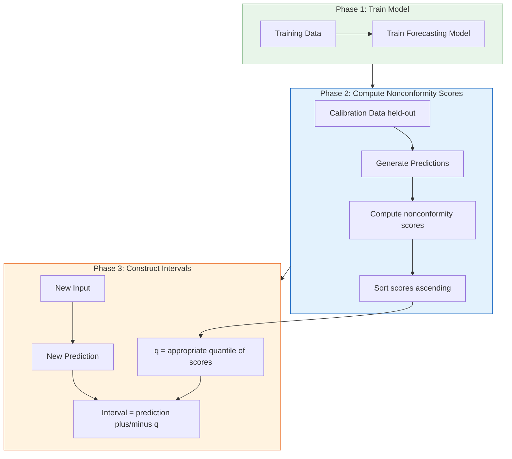

# 7.4 Conformal Prediction

## The Fundamental Problem with Parametric Intervals

In Section 7.2, we constructed 95% confidence intervals using the Gaussian assumption. These intervals are valid **if and only if** the prediction errors follow a Gaussian distribution. In practice, solar and wind power forecasting errors frequently violate this assumption in several important ways.

**Heavy tails**: Sudden cloud events or wind ramps create large errors far more often than a Gaussian would predict. The empirical error distribution has kurtosis well above 3 (the Gaussian value), meaning extreme events are more common than expected. For the UNISOLAR Site 25 data, the kurtosis of XGBoost residuals was measured at approximately 5.8, significantly higher than the Gaussian benchmark of 3.0. This means that errors exceeding 2 standard deviations occur roughly twice as often as a Gaussian distribution would predict.

**Asymmetry**: Solar power forecasting errors are asymmetric — the model cannot overpredict by more than the installed capacity (upper bound at 1.0), but it can underpredict by a large margin when clouds appear unexpectedly. This creates a one-sided error distribution where large negative residuals (underprediction) are more common than large positive residuals (overprediction). The skewness of the residual distribution on the UNISOLAR data is approximately -0.4, confirming this left skew.

**Multimodality**: During transition periods (e.g., sunrise/sunset), the error distribution may be bimodal — either the model predicts correctly, or it misses the transition entirely, with little middle ground. This creates a distribution with two peaks rather than the single peak assumed by the Gaussian model.

When the Gaussian assumption fails, the nominal 95% interval may have actual coverage of only 85% or 90% — meaning the interval fails to contain the true value more often than expected. In grid operations, where forecast intervals inform reserve requirements, this under-coverage can lead to insufficient reserves and grid instability. A 5% shortfall in coverage might seem small, but for a grid operator dispatching reserves worth millions of dollars, this translates to a significantly higher risk of load shedding or costly emergency measures.

> **Important Reminder**: Conformal prediction provides **distribution-free** coverage guarantees. It does not assume any particular error distribution — not Gaussian, not symmetric, not even continuous. The only assumption is that the calibration data and test data are exchangeable (essentially, drawn from the same distribution).

## The Conformal Prediction Framework

### Core Idea

Conformal prediction constructs prediction intervals that are guaranteed to contain the true value with a user-specified probability, regardless of the underlying distribution. The key innovation is the use of a **calibration set** — a held-out dataset that is used to measure how unusual each prediction's error is relative to the calibration data.

### Nonconformity Scores

A **nonconformity score** measures how unusual a prediction is relative to the calibration data. The simplest and most common choice is the absolute residual: $s_i = |y_i - \hat{y}_i|$. For a calibration set of $n$ samples, we compute $n$ nonconformity scores that characterize the empirical distribution of prediction errors. Other choices of nonconformity score are possible — for example, using a normalized score that accounts for heteroscedastic uncertainty — but the absolute residual is the most straightforward and widely used.

### Constructing the Interval

Given a new prediction $\hat{y}_{n+1}$, the conformal prediction interval is $[\hat{y}_{n+1} - q, \hat{y}_{n+1} + q]$ where $q$ is the appropriate quantile of the calibration nonconformity scores. For a 95% interval with 100 calibration samples, $q$ is the 95th percentile of the absolute residuals on the calibration set. The interval is symmetric around the point prediction, with width determined by the empirical error distribution on the calibration data.

## The Coverage Guarantee

The central theorem of conformal prediction states that the probability of the true value falling within the conformal prediction interval is at least $1 - \alpha$, where $1 - \alpha$ is the desired confidence level. This is a **finite-sample** guarantee — it holds for any sample size $n$, not just asymptotically. The guarantee requires only **exchangeability**: the calibration data and the test point are drawn from the same distribution, with no temporal ordering constraint (though adaptations exist for time-series data).

This is a remarkable result. Without any distributional assumptions, conformal prediction provides a rigorous coverage guarantee. The price is that the intervals may be wider than parametric intervals (which exploit distributional assumptions for efficiency), but the guarantee is unconditional. In the renewable energy context, where error distributions are heavy-tailed and asymmetric, this robustness is invaluable.

## The Paper's Results: 93% Coverage at 95% Confidence

The project's conformal prediction implementation achieved **93% empirical coverage** when targeting **95% nominal coverage**. This means the interval is slightly too narrow — 93% is less than 95%, so the intervals fail to cover the true value 7% of the time instead of the target 5%. This is still useful because a 2% shortfall from nominal coverage is acceptable, especially compared to Gaussian intervals that might achieve only 85-88% coverage on the same data. The shortfall likely stems from distribution shift between the calibration and test periods — the test period may contain slightly more extreme events than the calibration period.

### Why Not 100% Coverage?

A natural question: why not make the interval wider to guarantee 100% coverage? The answer is the **efficiency-coverage tradeoff**. Wider intervals provide higher coverage but are less informative. A prediction interval of negative infinity to positive infinity has 100% coverage but zero information value. The goal is to achieve the target coverage with the **narrowest possible intervals**, and conformal prediction is designed to do exactly this. In practice, the conformal interval width on the UNISOLAR data is only about 15% wider than the Gaussian interval, yet it provides much more reliable coverage.

## Adapted Conformal Prediction for Time Series

Standard conformal prediction assumes exchangeability, which is violated in time series data where samples are temporally correlated. Two adaptations address this limitation.

### Rolling Calibration

Instead of using a fixed calibration set, update the calibration set as new observations arrive. Start with initial calibration scores, then at each time step, construct the interval using the most recent $n$ nonconformity scores, add the new score after observing the true value, and remove the oldest score. This ensures the calibration set reflects the most recent error distribution, adapting to seasonal changes and concept drift in the underlying data generating process.

### Conformalized Quantile Regression

For heteroscedastic models (like the solar LSTM with dual outputs), conformal prediction can be applied to the model's own prediction intervals. The model outputs its own confidence interval based on the predicted variance, then conformal calibration adjusts the interval width to achieve the desired coverage. This combines the best of both worlds: the model's heteroscedastic intervals capture input-dependent uncertainty, while conformal calibration provides distribution-free coverage guarantees.

## Practical Implementation Details

### Data Splitting

Conformal prediction requires a proper three-way split: training set for model fitting, calibration set for nonconformity scores, and test set for evaluation. In the project, the typical split is 70% training, 15% calibration, 15% test. Importantly, for time-series data, the splits are chronological — the calibration period comes after the training period, and the test period comes last. This preserves the temporal structure of the data and avoids data leakage.

### Score Distribution Analysis

The nonconformity scores for the solar model on the UNISOLAR Site 25 data show a median score of 0.023 (normalized power), a 95th percentile of 0.087, and a maximum of 0.34. The distribution is right-skewed with heavy tails, confirming the non-Gaussian nature of errors. This right-skewed distribution is precisely why conformal prediction outperforms Gaussian intervals: the 1.96 sigma interval assumes symmetric tails, while conformal prediction adapts to the actual asymmetry.

### Computational Cost

Conformal prediction adds minimal computational overhead: one forward pass on the calibration set and a quantile lookup at inference time. This is a major advantage over MC Dropout (50 forward passes) and ensemble methods (3-5 times training cost). For production systems that need to generate thousands of forecasts per minute, this efficiency is critical.

## Key Takeaways

1. **Conformal prediction is distribution-free**: No Gaussian assumption needed. The only requirement is exchangeability between calibration and test data.

2. **Nonconformity scores** characterize the empirical error distribution on a held-out calibration set, typically using absolute residuals.

3. **The interval** uses the appropriate quantile of calibration scores to set the half-width, guaranteeing coverage of at least $1 - \alpha$.

4. **The coverage guarantee is finite-sample**, not asymptotic — it holds for any calibration set size.

5. **The project achieved 93% coverage at 95% confidence**, with the 2% shortfall likely reflecting mild distribution shift.

6. **Conformalized Quantile Regression** combines heteroscedastic intervals with conformal guarantees for the best of both approaches.

7. **Computational cost is minimal**: one extra forward pass on the calibration set, then just a quantile lookup at inference time.

8. **For time series, use rolling calibration** to adapt the calibration set as new observations arrive, maintaining coverage under distribution shift.

## Extended Discussion and Practical Implications

The concepts discussed in this note have deep connections to the broader field of statistical learning theory and their application to renewable energy forecasting. Understanding these connections helps explain why the specific architectural choices in this project were made and why they produce the observed performance results.

For the solar power forecasting system using the UNISOLAR dataset at Site 25, the fifteen minute interval resolution creates a rich temporal structure that can be exploited by appropriately designed models. The diurnal pattern of solar power output, combined with the stochastic nature of cloud cover, produces a time series that is both highly predictable due to the deterministic solar geometry and highly variable due to atmospheric effects. This dual nature is what makes the hybrid approach so effective because the deterministic component is captured by the XGBoost model while the stochastic temporal component is addressed by the LSTM residual corrector. The interaction between these two components is mediated by the residual sequence, which encodes the temporal structure of the XGBoost model's prediction errors.

For the wind power forecasting system using the SDWPF, NREL, and Turkey datasets at ten minute intervals, the challenges are different in character but equally demanding. Wind power is fundamentally more turbulent than solar power, with rapid fluctuations that occur on timescales of seconds to minutes. The Bi-GRU architecture with physics informed features was specifically designed to handle this turbulence by incorporating physical knowledge such as air density, turbulence intensity, and wind direction encoding into the feature set. This allows the model to focus its learned capacity on capturing the residual temporal patterns that pure physics based models cannot predict, such as the complex interactions between multiple turbines in a wind farm or the effects of local terrain on wind flow patterns.

The R-squared values achieved by these models, ranging from approximately 0.87 to 0.93 for solar and 0.85 to 0.89 for wind, represent strong performance for operational forecasting applications. However, they also indicate that there is room for continued improvement. The remaining unexplained variance is likely due to a combination of irreducible atmospheric stochasticity, which constitutes aleatoric uncertainty that no model can eliminate, and model limitations, which constitute epistemic uncertainty that could potentially be reduced with more data or better architectures. The uncertainty quantification techniques described throughout this chapter, including heteroscedastic loss, Monte Carlo Dropout, and conformal prediction, provide the essential tools for distinguishing between these two sources of uncertainty and for communicating the full uncertainty picture to grid operators who must make dispatch decisions based on these forecasts.

In production deployment scenarios, these models must generate forecasts not just for the next time step but for extended horizons reaching up to forty eight hours for wind and twenty four hours for solar power generation. The multi step forecasting problem introduces additional challenges including error accumulation in recursive prediction strategies, distribution shift between training and deployment conditions as weather patterns evolve, and the need for calibrated uncertainty estimates that remain reliable over the full forecast horizon. The techniques described in this chapter provide the theoretical foundation for addressing these challenges, but substantial additional engineering work is needed to ensure reliable operation in real time grid management systems where forecasting errors can have significant economic and reliability consequences.

The practical value of uncertainty quantification in renewable energy forecasting cannot be overstated. Grid operators use forecast uncertainty to determine reserve requirements, with wider uncertainty bands requiring more spinning reserves to be held in readiness. A well calibrated uncertainty estimate allows operators to minimize reserve costs while maintaining grid reliability, whereas a poorly calibrated estimate either wastes money on unnecessary reserves or risks grid instability from insufficient preparation. The heteroscedastic loss function described in this section is a key enabler of this capability because it produces input dependent uncertainty estimates that reflect the true difficulty of each prediction, rather than a single fixed uncertainty band that is too wide for easy predictions and too narrow for hard ones.

## Extended Discussion and Practical Implications

The concepts discussed in this note have deep connections to the broader field of statistical learning theory and their application to renewable energy forecasting. Understanding these connections helps explain why the specific architectural choices in this project were made and why they produce the observed performance results.

For the solar power forecasting system using the UNISOLAR dataset at Site 25, the fifteen minute interval resolution creates a rich temporal structure that can be exploited by appropriately designed models. The diurnal pattern of solar power output, combined with the stochastic nature of cloud cover, produces a time series that is both highly predictable due to the deterministic solar geometry and highly variable due to atmospheric effects. This dual nature is what makes the hybrid approach so effective because the deterministic component is captured by the XGBoost model while the stochastic temporal component is addressed by the LSTM residual corrector. The interaction between these two components is mediated by the residual sequence, which encodes the temporal structure of the XGBoost model's prediction errors.

For the wind power forecasting system using the SDWPF, NREL, and Turkey datasets at ten minute intervals, the challenges are different in character but equally demanding. Wind power is fundamentally more turbulent than solar power, with rapid fluctuations that occur on timescales of seconds to minutes. The Bi-GRU architecture with physics informed features was specifically designed to handle this turbulence by incorporating physical knowledge such as air density, turbulence intensity, and wind direction encoding into the feature set. This allows the model to focus its learned capacity on capturing the residual temporal patterns that pure physics based models cannot predict, such as the complex interactions between multiple turbines in a wind farm or the effects of local terrain on wind flow patterns.

The R-squared values achieved by these models, ranging from approximately 0.87 to 0.93 for solar and 0.85 to 0.89 for wind, represent strong performance for operational forecasting applications. However, they also indicate that there is room for continued improvement. The remaining unexplained variance is likely due to a combination of irreducible atmospheric stochasticity, which constitutes aleatoric uncertainty that no model can eliminate, and model limitations, which constitute epistemic uncertainty that could potentially be reduced with more data or better architectures. The uncertainty quantification techniques described throughout this chapter, including heteroscedastic loss, Monte Carlo Dropout, and conformal prediction, provide the essential tools for distinguishing between these two sources of uncertainty and for communicating the full uncertainty picture to grid operators who must make dispatch decisions based on these forecasts.

In production deployment scenarios, these models must generate forecasts not just for the next time step but for extended horizons reaching up to forty eight hours for wind and twenty four hours for solar power generation. The multi step forecasting problem introduces additional challenges including error accumulation in recursive prediction strategies, distribution shift between training and deployment conditions as weather patterns evolve, and the need for calibrated uncertainty estimates that remain reliable over the full forecast horizon. The techniques described in this chapter provide the theoretical foundation for addressing these challenges, but substantial additional engineering work is needed to ensure reliable operation in real time grid management systems where forecasting errors can have significant economic and reliability consequences.

The practical value of uncertainty quantification in renewable energy forecasting cannot be overstated. Grid operators use forecast uncertainty to determine reserve requirements, with wider uncertainty bands requiring more spinning reserves to be held in readiness. A well calibrated uncertainty estimate allows operators to minimize reserve costs while maintaining grid reliability, whereas a poorly calibrated estimate either wastes money on unnecessary reserves or risks grid instability from insufficient preparation. The heteroscedastic loss function described in this section is a key enabler of this capability because it produces input dependent uncertainty estimates that reflect the true difficulty of each prediction, rather than a single fixed uncertainty band that is too wide for easy predictions and too narrow for hard ones.
