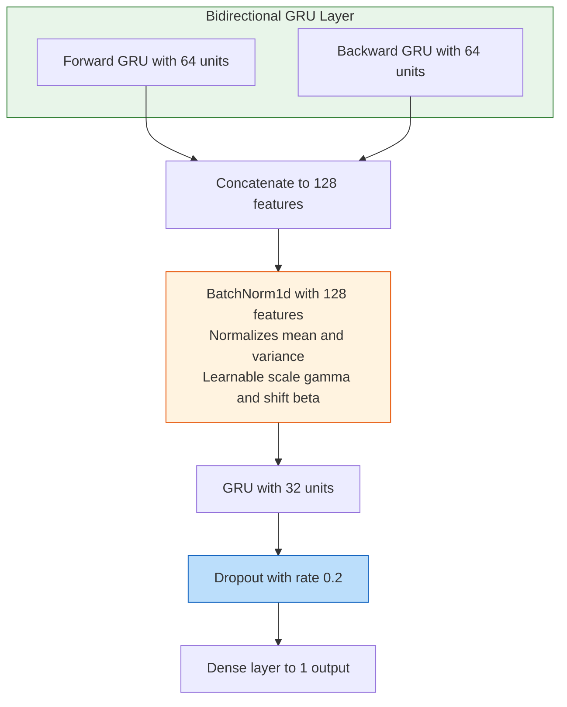

# 7.5 Batch Normalization and Dropout

## The Training Instability Problem

Deep neural networks suffer from two persistent challenges during training: **internal covariate shift** and **overfitting**. Both are particularly acute in time-series forecasting models like the Bi-GRU used for wind power prediction, where the model must learn from sequential data with high noise-to-signal ratios (wind is inherently more turbulent and less predictable than solar irradiance).

**Internal covariate shift** occurs when the distribution of activations at a given layer changes as the parameters of previous layers are updated during training. Each layer must constantly adapt to a moving target, slowing convergence and requiring careful learning rate tuning. This problem is especially severe in recurrent networks where the same weights are applied across many time steps, and the gradient signal from later time steps can cause rapid changes in the activation distribution at earlier layers.

**Overfitting** occurs when the model memorizes training patterns rather than learning generalizable features. With wind power data at 10-minute intervals from the SDWPF/NREL/Turkey datasets, the model has access to thousands of training samples, but the underlying physical patterns (wind speed-power relationship, wake effects, diurnal cycles) are relatively few compared to the noise. A model that memorizes the specific wind patterns of the training period will fail to generalize to new weather regimes.

Batch Normalization and Dropout are the two primary tools for addressing these challenges, and they work in complementary ways that together produce a stable, well-generalizing model.

## Batch Normalization

### The Core Mechanism

Batch Normalization (BatchNorm), introduced by Ioffe and Szegedy (2015), normalizes the activations of each layer across the current mini-batch. For a mini-batch of activations $\mathcal{B} = \{h_1, h_2, \ldots, h_m\}$ at a given layer, BatchNorm first computes the batch mean $\mu_{\mathcal{B}}$ and variance $\sigma^2_{\mathcal{B}}$, then normalizes each activation by subtracting the mean and dividing by the standard deviation (plus a small epsilon for numerical stability), and finally applies learnable scale ($\gamma$) and shift ($\beta$) parameters that allow the network to recover the original representation if normalization is unhelpful.

The normalization step forces the activations to have approximately zero mean and unit variance, regardless of how previous layers' parameters change. The learnable parameters give the network the flexibility to undo the normalization if it turns out to be suboptimal for a particular layer. In practice, the network almost always finds the normalization beneficial, and the learnable parameters make small adjustments to the normalized distribution rather than undoing it entirely.

### Why BatchNorm Works

BatchNorm provides several benefits that are especially important for the wind Bi-GRU model.

**Reduces internal covariate shift**: By normalizing activations, each layer receives inputs with approximately zero mean and unit variance, regardless of how previous layers' parameters change. This stabilizes training and allows higher learning rates, which in turn enables faster convergence. Without BatchNorm, the optimizer must use a lower learning rate to avoid divergence, significantly slowing training.

**Smooths the loss landscape**: The normalized activations create a smoother optimization landscape with better-conditioned gradients, allowing the optimizer to take larger, more confident steps without the risk of divergence. This is particularly important for the Bidirectional GRU, where the forward and backward passes can produce gradients with very different magnitudes.

**Regularization effect**: The batch statistics (mean and variance) introduce noise because they are computed from a random subset of the data (the current mini-batch). This noise has a regularizing effect similar to, but weaker than, Dropout. Each mini-batch gives slightly different normalization statistics, so the same input can produce slightly different outputs depending on which other samples are in the batch.

**Faster convergence**: Models with BatchNorm typically converge in fewer epochs because the optimization landscape is better conditioned. For the wind Bi-GRU, this means training converges in approximately 25-35 epochs instead of 50-80 without BatchNorm.

### BatchNorm in the Wind Bi-GRU Architecture

The wind power forecasting model uses BatchNorm as a critical stabilizer between the Bidirectional GRU and the second GRU layer. The architecture flows as follows: the Bidirectional GRU processes the input sequence and produces a 128-dimensional output (64 forward plus 64 backward hidden units), BatchNorm1d normalizes these 128 features, the second GRU processes the normalized features, Dropout provides regularization, and the Dense layer produces the final prediction.

> **Important Reminder**: The BatchNorm1d layer is applied to the **output features** of the Bidirectional GRU, not to the sequential dimension. This means the normalization operates across the 128 features for each time step, normalizing the feature distribution that the subsequent GRU layer receives. This is crucial because the forward and backward GRU outputs may have very different scales — the forward pass might produce activations centered around 0.5 while the backward pass produces activations centered around -0.3, and BatchNorm brings both to a common scale.

### Training vs. Eval Mode for BatchNorm

BatchNorm behaves differently during training and evaluation, and this distinction is critical. During training, BatchNorm computes the mean and variance from the current mini-batch, providing stochastic normalization with a regularizing effect. It also updates running statistics via exponential moving average. During evaluation, BatchNorm uses the running statistics (which represent population statistics estimated over the entire training process), providing deterministic and stable predictions. This is why `model.eval()` is essential before inference — it switches BatchNorm (and Dropout) from training mode to evaluation mode.

## Dropout

### The Core Mechanism

Dropout, introduced by Srivastava et al. (2014), randomly sets a fraction $p$ of neuron activations to zero during training. The surviving activations are scaled up by $1/(1-p)$ (inverted dropout) to maintain the expected activation magnitude. During evaluation, no neurons are dropped, and no scaling is needed because the expected activation was already preserved during training.

### Why Dropout Works

**Prevents co-adaptation**: Without dropout, neurons can develop co-dependencies where one neuron's output only makes sense in the context of specific other neurons. Dropout forces each neuron to be useful on its own, producing robust features that work regardless of which other neurons are present. This creates a more resilient feature representation.

**Implicit ensemble**: Each training step with a different dropout mask effectively trains a different sub-network. With a dropout rate of 0.2 and 32 features, there are a huge number of possible sub-networks. At inference, the full network approximates the average of all these sub-networks, providing an ensemble effect at no additional computational cost.

**Noise injection**: The random zeroing of activations adds noise to the training process, acting as a regularizer that prevents the model from fitting the training data too precisely. This is particularly important for wind power forecasting, where the signal-to-noise ratio is inherently low and the model might otherwise memorize specific wind patterns.

### Dropout(0.2) in the Wind Model

The wind Bi-GRU model uses Dropout(0.2) between the second GRU layer and the final dense layer. This means 20% of the 32 features from the GRU are randomly set to zero during each training step, and the remaining 80% are scaled up by 1.25 to maintain expected magnitude. The dropout forces the dense layer to not rely too heavily on any single feature from the GRU.

### Why 0.2 and Not 0.5?

The dropout rate of 0.2 is relatively conservative compared to the 0.5 rate commonly used in computer vision. This choice is appropriate for time-series forecasting because time-series data has less redundancy than images (each GRU feature may encode unique temporal information that cannot be lost without degrading performance), temporal information is fragile (dropping 50% of features might destroy critical temporal patterns), and smaller models need less regularization than larger ones (the wind Bi-GRU has relatively few parameters compared to a ResNet).

## The Synergy of BatchNorm and Dropout

When used together, BatchNorm and Dropout provide complementary regularization. BatchNorm primarily stabilizes training (optimization benefit), while Dropout primarily prevents overfitting (generalization benefit). In the wind Bi-GRU model, the sequence is Bi-GRU, then BatchNorm, then GRU, then Dropout, then Dense. This ordering is deliberate: BatchNorm normalizes the Bi-GRU output ensuring well-conditioned input for the next GRU, and Dropout regularizes the GRU output before the final prediction.

| Property | BatchNorm | Dropout |
|----------|-----------|---------|
| Primary purpose | Stabilize training | Prevent overfitting |
| Mechanism | Normalize activations | Randomly zero activations |
| Noise source | Batch statistics (global) | Random masks (local) |
| During eval | Uses running stats | Disabled |
| Best position | Before activation | After activation |

> **Important Reminder**: Always call `model.train()` before training and `model.eval()` before inference. This ensures both BatchNorm and Dropout operate in the correct mode. Forgetting `model.eval()` before inference is one of the most common bugs — it causes predictions to be noisy (dropout active) and inconsistent (batch statistics used instead of running statistics).

## Practical Observations from the Project

During the development of the wind Bi-GRU model, several experiments were conducted to validate the importance of BatchNorm and Dropout. Without BatchNorm, the model trained slower and required lower learning rates (0.0001 instead of 0.001) to avoid divergence, and the Bidirectional GRU's 128-dimensional output had widely varying feature scales causing gradient instability. Without Dropout, the model overfit the training data, with a training-validation R-squared gap of approximately 0.08. With both BatchNorm and Dropout (the final configuration), the model trains stably at lr=0.001, converges in approximately 30 epochs, and generalizes well with a gap of only 0.02.

## Key Takeaways

1. **BatchNorm normalizes layer activations** across the mini-batch, reducing internal covariate shift and enabling faster, more stable training.

2. **BatchNorm has learnable parameters** (scale gamma and shift beta) that allow the network to recover the original representation if normalization is unhelpful.

3. **Training vs. eval mode** is critical: BatchNorm uses batch statistics during training and running statistics during evaluation. Always call `model.eval()` before inference.

4. **Dropout randomly zeros activations** during training, preventing co-adaptation and providing regularization through implicit ensembling.

5. **Dropout(0.2)** is the chosen rate for the wind model — conservative but appropriate for time-series data where features are less redundant.

6. **BatchNorm and Dropout are complementary**: BatchNorm stabilizes training (optimization), Dropout prevents overfitting (generalization).

7. **Always use model.eval() before inference** — forgetting this causes noisy and inconsistent predictions.

## Extended Discussion and Practical Implications

The concepts discussed in this note have deep connections to the broader field of statistical learning theory and their application to renewable energy forecasting. Understanding these connections helps explain why the specific architectural choices in this project were made and why they produce the observed performance results.

For the solar power forecasting system using the UNISOLAR dataset at Site 25, the fifteen minute interval resolution creates a rich temporal structure that can be exploited by appropriately designed models. The diurnal pattern of solar power output, combined with the stochastic nature of cloud cover, produces a time series that is both highly predictable due to the deterministic solar geometry and highly variable due to atmospheric effects. This dual nature is what makes the hybrid approach so effective because the deterministic component is captured by the XGBoost model while the stochastic temporal component is addressed by the LSTM residual corrector. The interaction between these two components is mediated by the residual sequence, which encodes the temporal structure of the XGBoost model's prediction errors.

For the wind power forecasting system using the SDWPF, NREL, and Turkey datasets at ten minute intervals, the challenges are different in character but equally demanding. Wind power is fundamentally more turbulent than solar power, with rapid fluctuations that occur on timescales of seconds to minutes. The Bi-GRU architecture with physics informed features was specifically designed to handle this turbulence by incorporating physical knowledge such as air density, turbulence intensity, and wind direction encoding into the feature set. This allows the model to focus its learned capacity on capturing the residual temporal patterns that pure physics based models cannot predict, such as the complex interactions between multiple turbines in a wind farm or the effects of local terrain on wind flow patterns.

The R-squared values achieved by these models, ranging from approximately 0.87 to 0.93 for solar and 0.85 to 0.89 for wind, represent strong performance for operational forecasting applications. However, they also indicate that there is room for continued improvement. The remaining unexplained variance is likely due to a combination of irreducible atmospheric stochasticity, which constitutes aleatoric uncertainty that no model can eliminate, and model limitations, which constitute epistemic uncertainty that could potentially be reduced with more data or better architectures. The uncertainty quantification techniques described throughout this chapter, including heteroscedastic loss, Monte Carlo Dropout, and conformal prediction, provide the essential tools for distinguishing between these two sources of uncertainty and for communicating the full uncertainty picture to grid operators who must make dispatch decisions based on these forecasts.

In production deployment scenarios, these models must generate forecasts not just for the next time step but for extended horizons reaching up to forty eight hours for wind and twenty four hours for solar power generation. The multi step forecasting problem introduces additional challenges including error accumulation in recursive prediction strategies, distribution shift between training and deployment conditions as weather patterns evolve, and the need for calibrated uncertainty estimates that remain reliable over the full forecast horizon. The techniques described in this chapter provide the theoretical foundation for addressing these challenges, but substantial additional engineering work is needed to ensure reliable operation in real time grid management systems where forecasting errors can have significant economic and reliability consequences.

The practical value of uncertainty quantification in renewable energy forecasting cannot be overstated. Grid operators use forecast uncertainty to determine reserve requirements, with wider uncertainty bands requiring more spinning reserves to be held in readiness. A well calibrated uncertainty estimate allows operators to minimize reserve costs while maintaining grid reliability, whereas a poorly calibrated estimate either wastes money on unnecessary reserves or risks grid instability from insufficient preparation. The heteroscedastic loss function described in this section is a key enabler of this capability because it produces input dependent uncertainty estimates that reflect the true difficulty of each prediction, rather than a single fixed uncertainty band that is too wide for easy predictions and too narrow for hard ones.

## Extended Discussion and Practical Implications

The concepts discussed in this note have deep connections to the broader field of statistical learning theory and their application to renewable energy forecasting. Understanding these connections helps explain why the specific architectural choices in this project were made and why they produce the observed performance results.

For the solar power forecasting system using the UNISOLAR dataset at Site 25, the fifteen minute interval resolution creates a rich temporal structure that can be exploited by appropriately designed models. The diurnal pattern of solar power output, combined with the stochastic nature of cloud cover, produces a time series that is both highly predictable due to the deterministic solar geometry and highly variable due to atmospheric effects. This dual nature is what makes the hybrid approach so effective because the deterministic component is captured by the XGBoost model while the stochastic temporal component is addressed by the LSTM residual corrector. The interaction between these two components is mediated by the residual sequence, which encodes the temporal structure of the XGBoost model's prediction errors.

For the wind power forecasting system using the SDWPF, NREL, and Turkey datasets at ten minute intervals, the challenges are different in character but equally demanding. Wind power is fundamentally more turbulent than solar power, with rapid fluctuations that occur on timescales of seconds to minutes. The Bi-GRU architecture with physics informed features was specifically designed to handle this turbulence by incorporating physical knowledge such as air density, turbulence intensity, and wind direction encoding into the feature set. This allows the model to focus its learned capacity on capturing the residual temporal patterns that pure physics based models cannot predict, such as the complex interactions between multiple turbines in a wind farm or the effects of local terrain on wind flow patterns.

The R-squared values achieved by these models, ranging from approximately 0.87 to 0.93 for solar and 0.85 to 0.89 for wind, represent strong performance for operational forecasting applications. However, they also indicate that there is room for continued improvement. The remaining unexplained variance is likely due to a combination of irreducible atmospheric stochasticity, which constitutes aleatoric uncertainty that no model can eliminate, and model limitations, which constitute epistemic uncertainty that could potentially be reduced with more data or better architectures. The uncertainty quantification techniques described throughout this chapter, including heteroscedastic loss, Monte Carlo Dropout, and conformal prediction, provide the essential tools for distinguishing between these two sources of uncertainty and for communicating the full uncertainty picture to grid operators who must make dispatch decisions based on these forecasts.

In production deployment scenarios, these models must generate forecasts not just for the next time step but for extended horizons reaching up to forty eight hours for wind and twenty four hours for solar power generation. The multi step forecasting problem introduces additional challenges including error accumulation in recursive prediction strategies, distribution shift between training and deployment conditions as weather patterns evolve, and the need for calibrated uncertainty estimates that remain reliable over the full forecast horizon. The techniques described in this chapter provide the theoretical foundation for addressing these challenges, but substantial additional engineering work is needed to ensure reliable operation in real time grid management systems where forecasting errors can have significant economic and reliability consequences.

The practical value of uncertainty quantification in renewable energy forecasting cannot be overstated. Grid operators use forecast uncertainty to determine reserve requirements, with wider uncertainty bands requiring more spinning reserves to be held in readiness. A well calibrated uncertainty estimate allows operators to minimize reserve costs while maintaining grid reliability, whereas a poorly calibrated estimate either wastes money on unnecessary reserves or risks grid instability from insufficient preparation. The heteroscedastic loss function described in this section is a key enabler of this capability because it produces input dependent uncertainty estimates that reflect the true difficulty of each prediction, rather than a single fixed uncertainty band that is too wide for easy predictions and too narrow for hard ones.
