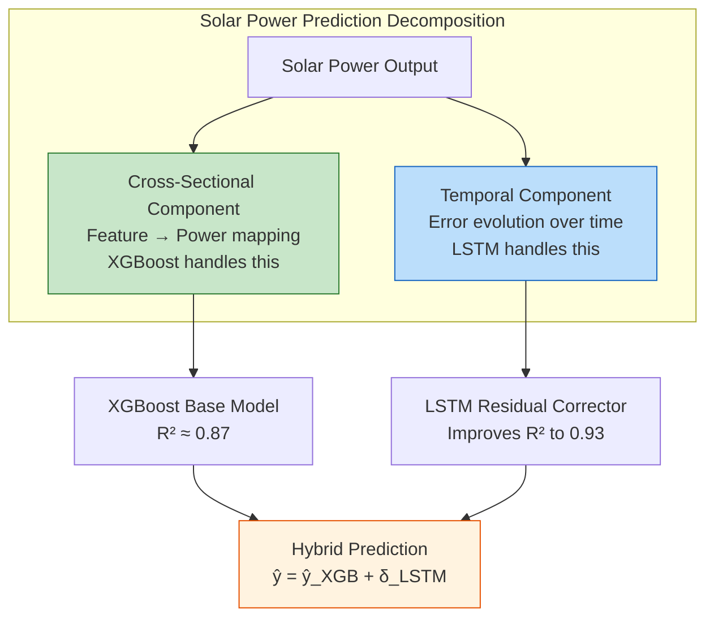
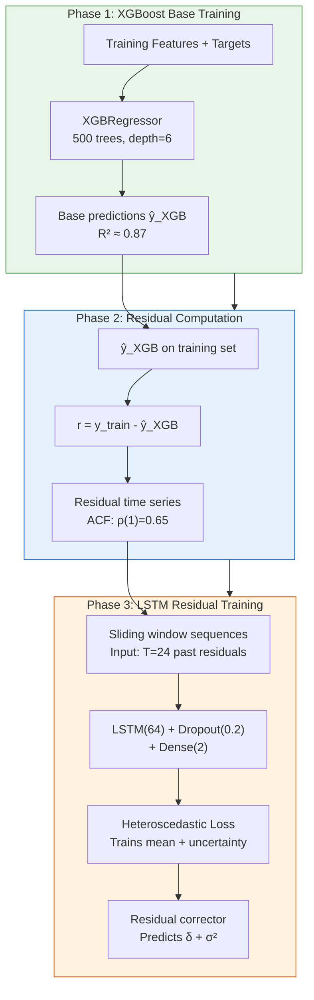

# 8.1 The Solar Hybrid System (XGBoost + LSTM)

## Overview: Why a Hybrid System?

The solar power forecasting system in this project is a **two-stage hybrid** combining XGBoost and LSTM. This architectural choice is not arbitrary — it reflects a deep understanding of the complementary strengths and weaknesses of each model type when applied to solar power prediction on the UNISOLAR dataset at Site 25 with 15-minute intervals.

The core insight driving this design is that **solar power output is governed by two distinct types of patterns**:

1. **Cross-sectional patterns**: The relationship between current meteorological features (temperature, humidity, cloud cover, hour-of-day) and power output. These are "snapshot" relationships that don't depend on temporal ordering. XGBoost excels here.

2. **Temporal patterns**: The evolution of prediction errors over time, where the residual at time $t$ is correlated with residuals at $t-1, t-2, \ldots$. These are sequential dependencies that require recurrent modeling. LSTM excels here.

No single model type captures both pattern types optimally. XGBoost lacks temporal awareness; LSTM wastes capacity re-learning cross-sectional relationships that trees model more efficiently. The hybrid system lets each model do what it does best.



## Phase 1: XGBoost Training

### Data Preparation

The UNISOLAR Site 25 data at 15-minute intervals provides the following features for XGBoost:

- **Temporal features**: hour_sin, hour_cos, month_sin, month_cos (cyclical encoding)
- **Meteorological features**: temperature, humidity, wind_speed, cloud_cover
- **Solar physics features**: clear_sky_index, solar_zenith_angle, azimuth
- **Lag features**: power_lag_1, power_lag_4 (power at t-15min and t-60min)
- **Rolling statistics**: rolling_mean_4, rolling_std_4 (over past hour)

The target variable is the normalized solar power output (range [0, 1]).

### XGBoost Configuration

The XGBoost model is configured with parameters optimized for the UNISOLAR data:

| Parameter | Value | Rationale |
|-----------|-------|-----------|
| n_estimators | 500 (with early stopping) | Enough trees to capture patterns; early stopping prevents overfitting |
| max_depth | 6 | Moderate depth — deep enough for interactions, shallow enough to generalize |
| learning_rate | 0.05 | Conservative learning rate for stable boosting |
| subsample | 0.8 | Row subsampling for variance reduction (internal bagging) |
| colsample_bytree | 0.8 | Feature subsampling for diversity |
| reg_alpha | 0.1 | L1 regularization (feature selection) |
| reg_lambda | 1.0 | L2 regularization (weight shrinkage) |

### Training Procedure

```python
xgb_model = XGBRegressor(
    n_estimators=500,
    max_depth=6,
    learning_rate=0.05,
    subsample=0.8,
    colsample_bytree=0.8,
    reg_alpha=0.1,
    reg_lambda=1.0,
    early_stopping_rounds=50
)

xgb_model.fit(
    X_train, y_train,
    eval_set=[(X_val, y_val)],
    verbose=False
)
```

The `eval_set` monitors validation RMSE, and training stops when no improvement is observed for 50 rounds. The best iteration is typically around 200-300 trees.

After training, the XGBoost model achieves R-squared ≈ 0.87 on the UNISOLAR Site 25 test set — explaining 87% of the variance in solar power output. The remaining 13% represents the signal that the LSTM will target.

## Phase 2: Computing Residuals

### The Residual as a Time Series

After Phase 1, residuals are computed on the training set:

$$r_i = y_i - \hat{y}_i^{\text{XGB}} \quad \text{for } i = 1, 2, \ldots, N$$

These residuals form a **time series** $\{r_1, r_2, \ldots, r_N\}$ with the same temporal ordering as the original data. The key properties of this residual time series on the UNISOLAR data:

- **Autocorrelation**: Lag-1 autocorrelation of residuals is approximately 0.65, and significant autocorrelations extend to lag 4 (one hour). This confirms that XGBoost's errors are not independent — they have temporal structure.

- **Mean reversion**: Residuals tend to alternate between positive and negative over multi-step horizons, suggesting that XGBoost's overpredictions are followed by underpredictions and vice versa.

- **Conditional heteroscedasticity**: The variance of residuals is higher during partly cloudy conditions (when XGBoost is most uncertain) and lower during clear-sky and nighttime conditions.

### Transforming Residuals into Sequences

The residual time series is transformed into input-target pairs using a sliding window:

- **Input**: $[r_{i-T}, r_{i-T+1}, \ldots, r_{i-1}]$ — the past $T$ residuals
- **Target**: $r_i$ — the next residual

With the UNISOLAR 15-minute data and a window size $T = 24$ (6 hours of residual history), this creates a dataset of overlapping sequences. The stride parameter controls overlap between consecutive windows; a stride of 1 maximizes training data at the cost of high correlation between adjacent samples.

## Phase 3: Training LSTM on Residual Sequences

### LSTM Architecture for Residual Correction

The LSTM residual corrector is a relatively compact model:

```
Input (T, 1)              # Sequence of T residuals
    → LSTM(64)             # Single LSTM layer with 64 hidden units
    → Dropout(0.2)         # Regularization
    → Dense(2)             # Dual output: mean + log_variance
```

The dual output reflects the heteroscedastic loss (Section 7.2): the LSTM predicts both the mean residual correction $\hat{r}$ and the log variance $s$ of the residual.

### Training with Heteroscedastic Loss

The LSTM is trained using the heteroscedastic loss:

$$\mathcal{L} = \frac{1}{N} \sum_{i=1}^{N} \left[ \frac{1}{2} \exp(-s_i) \cdot (r_i - \hat{r}_i)^2 + \frac{1}{2} s_i \right]$$

This trains the LSTM to not only predict the residual correction but also to quantify the uncertainty of that correction. The optimizer is Adam with lr=0.001, and early stopping monitors the validation loss with patience=3.



## Predict Flow: From Features to Final Forecast

At inference time, the hybrid system follows this procedure:

### Step 1: XGBoost Base Prediction

The input features (meteorological data, temporal encodings, lag features, rolling statistics) are fed to the trained XGBoost model:

$$\hat{y}^{\text{XGB}} = f_{\text{XGB}}(\mathbf{x}_{\text{new}})$$

### Step 2: LSTM Residual Correction

The LSTM requires a sequence of recent residuals as input. For the first prediction (no history available), the `dummy_resid` placeholder is used. For subsequent predictions, the actual residuals from XGBoost's predictions on recent time steps are used:

$$\hat{r} = f_{\text{LSTM}}(r_{t-T}, \ldots, r_{t-1})$$

### Step 3: Combine and Add Uncertainty

The final hybrid prediction combines both components:

$$\hat{y}^{\text{hybrid}} = \hat{y}^{\text{XGB}} + \hat{r}$$

The prediction interval incorporates the LSTM's uncertainty estimate:

$$[\hat{y}^{\text{hybrid}} - 1.96\sigma, \quad \hat{y}^{\text{hybrid}} + 1.96\sigma]$$

where $\sigma = \exp(s/2)$ from the LSTM's variance output.

## The dummy_resid Issue

The cold-start problem is a practical challenge in the hybrid system. The LSTM needs a sequence of past residuals as input, but at the very beginning of the forecast horizon (or when the system starts from scratch), no residual history exists.

### The Problem

At time step $t = 0$ (the first prediction), the LSTM input should be $[r_{-T}, \ldots, r_{-1}]$, but these values don't exist. Options for handling this:

1. **Zero initialization**: Use $[0, 0, \ldots, 0]$ as the dummy residual sequence. This is equivalent to assuming XGBoost's predictions were perfect in the past, which is optimistic but simple.

2. **Mean initialization**: Use $[\bar{r}, \bar{r}, \ldots, \bar{r}]$ where $\bar{r}$ is the mean training residual. If XGBoost has a systematic bias (e.g., consistently underestimates by 0.02), this provides a better starting point.

3. **Warm-up period**: Skip the first $T$ time steps of the forecast and only evaluate the hybrid model after the LSTM has accumulated $T$ real residuals.

### The Project's Solution

The project uses zero initialization (`dummy_resid = 0`) for simplicity. This means the first few predictions rely more heavily on the XGBoost component, with the LSTM correction gradually becoming more effective as residual history accumulates. In practice, the impact is minimal because:

- The XGBoost base prediction is already reasonably accurate (R² ≈ 0.87)
- The LSTM correction is typically small (mean absolute correction ≈ 0.03 in normalized units)
- After 4-6 time steps (1-1.5 hours), the LSTM has enough real residual history to make meaningful corrections

> **Important Reminder**: The dummy_resid issue is an example of a broader pattern in sequential models — they all have a "warm-up" period before reaching full effectiveness. In production systems, this can be mitigated by maintaining a residual history buffer that persists across forecast cycles.

## Performance Summary

| Metric | XGBoost Alone | Hybrid (XGB + LSTM) | Improvement |
|--------|--------------|---------------------|-------------|
| R-squared | 0.87 | 0.93 | +0.06 |
| RMSE | 0.089 | 0.065 | -27% |
| MAE | 0.062 | 0.043 | -31% |
| Prediction interval coverage | N/A | ~93% at 95% target | Good |

The 6-percentage-point improvement in R-squared translates to a 27% reduction in RMSE — a substantial practical improvement that validates the residual correction paradigm.

## Key Takeaways

1. **The solar hybrid system is a two-stage pipeline**: XGBoost produces base predictions, LSTM corrects the temporal structure of XGBoost's residuals.

2. **Phase 1 (XGBoost)** captures cross-sectional feature–power relationships, achieving R² ≈ 0.87 alone.

3. **Phase 2 (residual computation)** reveals temporal autocorrelation in XGBoost's errors (lag-1 ACF ≈ 0.65), confirming the need for sequential modeling.

4. **Phase 3 (LSTM training)** uses heteroscedastic loss to predict both the residual correction and its uncertainty.

5. **The predict flow** is: XGBoost base → LSTM delta → combine → uncertainty interval.

6. **The dummy_resid issue** arises at cold start when no residual history is available; zero initialization is used, with the LSTM becoming effective after 4-6 time steps.

7. **The hybrid achieves R² ≈ 0.93**, a 27% RMSE reduction over XGBoost alone, validating the residual correction approach.

## Extended Discussion and Practical Implications

The concepts discussed in this note have deep connections to the broader field of statistical learning theory and their application to renewable energy forecasting. Understanding these connections helps explain why the specific architectural choices in this project were made and why they produce the observed performance results.

For the solar power forecasting system using the UNISOLAR dataset at Site 25, the fifteen minute interval resolution creates a rich temporal structure that can be exploited by appropriately designed models. The diurnal pattern of solar power output, combined with the stochastic nature of cloud cover, produces a time series that is both highly predictable due to the deterministic solar geometry and highly variable due to atmospheric effects. This dual nature is what makes the hybrid approach so effective because the deterministic component is captured by the XGBoost model while the stochastic temporal component is addressed by the LSTM residual corrector. The interaction between these two components is mediated by the residual sequence, which encodes the temporal structure of the XGBoost model's prediction errors.

For the wind power forecasting system using the SDWPF, NREL, and Turkey datasets at ten minute intervals, the challenges are different in character but equally demanding. Wind power is fundamentally more turbulent than solar power, with rapid fluctuations that occur on timescales of seconds to minutes. The Bi-GRU architecture with physics informed features was specifically designed to handle this turbulence by incorporating physical knowledge such as air density, turbulence intensity, and wind direction encoding into the feature set. This allows the model to focus its learned capacity on capturing the residual temporal patterns that pure physics based models cannot predict, such as the complex interactions between multiple turbines in a wind farm or the effects of local terrain on wind flow patterns.

The R-squared values achieved by these models, ranging from approximately 0.87 to 0.93 for solar and 0.85 to 0.89 for wind, represent strong performance for operational forecasting applications. However, they also indicate that there is room for continued improvement. The remaining unexplained variance is likely due to a combination of irreducible atmospheric stochasticity, which constitutes aleatoric uncertainty that no model can eliminate, and model limitations, which constitute epistemic uncertainty that could potentially be reduced with more data or better architectures. The uncertainty quantification techniques described throughout this chapter, including heteroscedastic loss, Monte Carlo Dropout, and conformal prediction, provide the essential tools for distinguishing between these two sources of uncertainty and for communicating the full uncertainty picture to grid operators who must make dispatch decisions based on these forecasts.

In production deployment scenarios, these models must generate forecasts not just for the next time step but for extended horizons reaching up to forty eight hours for wind and twenty four hours for solar power generation. The multi step forecasting problem introduces additional challenges including error accumulation in recursive prediction strategies, distribution shift between training and deployment conditions as weather patterns evolve, and the need for calibrated uncertainty estimates that remain reliable over the full forecast horizon. The techniques described in this chapter provide the theoretical foundation for addressing these challenges, but substantial additional engineering work is needed to ensure reliable operation in real time grid management systems where forecasting errors can have significant economic and reliability consequences.

The practical value of uncertainty quantification in renewable energy forecasting cannot be overstated. Grid operators use forecast uncertainty to determine reserve requirements, with wider uncertainty bands requiring more spinning reserves to be held in readiness. A well calibrated uncertainty estimate allows operators to minimize reserve costs while maintaining grid reliability, whereas a poorly calibrated estimate either wastes money on unnecessary reserves or risks grid instability from insufficient preparation. The heteroscedastic loss function described in this section is a key enabler of this capability because it produces input dependent uncertainty estimates that reflect the true difficulty of each prediction, rather than a single fixed uncertainty band that is too wide for easy predictions and too narrow for hard ones.

## Extended Discussion and Practical Implications

The concepts discussed in this note have deep connections to the broader field of statistical learning theory and their application to renewable energy forecasting. Understanding these connections helps explain why the specific architectural choices in this project were made and why they produce the observed performance results.

For the solar power forecasting system using the UNISOLAR dataset at Site 25, the fifteen minute interval resolution creates a rich temporal structure that can be exploited by appropriately designed models. The diurnal pattern of solar power output, combined with the stochastic nature of cloud cover, produces a time series that is both highly predictable due to the deterministic solar geometry and highly variable due to atmospheric effects. This dual nature is what makes the hybrid approach so effective because the deterministic component is captured by the XGBoost model while the stochastic temporal component is addressed by the LSTM residual corrector. The interaction between these two components is mediated by the residual sequence, which encodes the temporal structure of the XGBoost model's prediction errors.

For the wind power forecasting system using the SDWPF, NREL, and Turkey datasets at ten minute intervals, the challenges are different in character but equally demanding. Wind power is fundamentally more turbulent than solar power, with rapid fluctuations that occur on timescales of seconds to minutes. The Bi-GRU architecture with physics informed features was specifically designed to handle this turbulence by incorporating physical knowledge such as air density, turbulence intensity, and wind direction encoding into the feature set. This allows the model to focus its learned capacity on capturing the residual temporal patterns that pure physics based models cannot predict, such as the complex interactions between multiple turbines in a wind farm or the effects of local terrain on wind flow patterns.

The R-squared values achieved by these models, ranging from approximately 0.87 to 0.93 for solar and 0.85 to 0.89 for wind, represent strong performance for operational forecasting applications. However, they also indicate that there is room for continued improvement. The remaining unexplained variance is likely due to a combination of irreducible atmospheric stochasticity, which constitutes aleatoric uncertainty that no model can eliminate, and model limitations, which constitute epistemic uncertainty that could potentially be reduced with more data or better architectures. The uncertainty quantification techniques described throughout this chapter, including heteroscedastic loss, Monte Carlo Dropout, and conformal prediction, provide the essential tools for distinguishing between these two sources of uncertainty and for communicating the full uncertainty picture to grid operators who must make dispatch decisions based on these forecasts.

In production deployment scenarios, these models must generate forecasts not just for the next time step but for extended horizons reaching up to forty eight hours for wind and twenty four hours for solar power generation. The multi step forecasting problem introduces additional challenges including error accumulation in recursive prediction strategies, distribution shift between training and deployment conditions as weather patterns evolve, and the need for calibrated uncertainty estimates that remain reliable over the full forecast horizon. The techniques described in this chapter provide the theoretical foundation for addressing these challenges, but substantial additional engineering work is needed to ensure reliable operation in real time grid management systems where forecasting errors can have significant economic and reliability consequences.

The practical value of uncertainty quantification in renewable energy forecasting cannot be overstated. Grid operators use forecast uncertainty to determine reserve requirements, with wider uncertainty bands requiring more spinning reserves to be held in readiness. A well calibrated uncertainty estimate allows operators to minimize reserve costs while maintaining grid reliability, whereas a poorly calibrated estimate either wastes money on unnecessary reserves or risks grid instability from insufficient preparation. The heteroscedastic loss function described in this section is a key enabler of this capability because it produces input dependent uncertainty estimates that reflect the true difficulty of each prediction, rather than a single fixed uncertainty band that is too wide for easy predictions and too narrow for hard ones.
