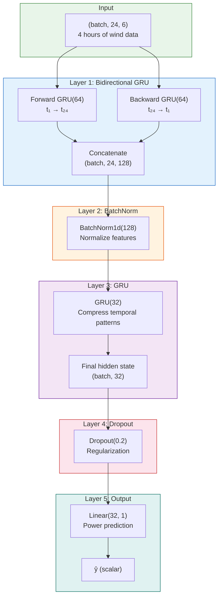

# 8.2 The Wind Bi-GRU System

## Why a Single-Model Approach for Wind?

Unlike the solar forecasting system, which uses a two-stage hybrid (XGBoost + LSTM), the wind power forecasting system employs a **single end-to-end deep learning model**: a Bidirectional GRU (Bi-GRU). This architectural choice reflects fundamental differences between the solar and wind forecasting problems:

| Property | Solar (UNISOLAR) | Wind (SDWPF/NREL/Turkey) |
|----------|------------------|--------------------------|
| Temporal resolution | 15 minutes | 10 minutes |
| Primary driver | Solar irradiance (smooth, diurnal) | Wind speed (turbulent, stochastic) |
| Predictability | High (diurnal pattern dominates) | Lower (turbulence introduces chaos) |
| Feature–target relationship | Strong, quasi-deterministic | Noisy, with heavy tails |
| Optimal strategy | Hybrid (decompose smooth + noisy) | End-to-end (learn all patterns jointly) |

Wind power forecasting is inherently more challenging than solar because wind speed follows turbulent dynamics governed by the Navier-Stokes equations — chaotic, multi-scale, and sensitive to initial conditions. The benefit of decomposing the problem into "base + residual" is smaller for wind because even the "base" component is noisy and temporally complex. A single recurrent model that learns all patterns end-to-end is more effective.

## Input Specification

### Input Shape: (24, 6)

The Bi-GRU model takes inputs of shape `(batch_size, 24, 6)`:

- **24**: The sequence length — 24 time steps of history, corresponding to 4 hours at 10-minute intervals
- **6**: The number of features per time step

The six features are a combination of raw measurements and physics-informed features:

| Feature | Index | Description | Type |
|---------|-------|-------------|------|
| wind_speed | 0 | Raw wind speed (m/s) | Measurement |
| wind_direction_sin | 1 | sin(encoding of wind direction) | Physics-informed |
| wind_direction_cos | 2 | cos(encoding of wind direction) | Physics-informed |
| power_lag | 3 | Power output at previous time step | Lag feature |
| air_density | 4 | Computed from temperature & pressure | Physics-informed |
| turbulence_intensity | 5 | Wind speed std / mean | Physics-informed |

> **Important Reminder**: The physics-informed features (wind direction encoding, air density, turbulence intensity) are critical for the Bi-GRU's performance. Without them, the model must learn these physical relationships from data alone, which requires more training data and may not generalize to unusual conditions. The combination of raw measurements and physics features is what makes this a "physics-augmented" model.

## Architecture: Layer by Layer

### Layer 1: Bidirectional GRU(64)

The first layer is a bidirectional GRU with 64 hidden units:

```python
nn.Bidirectional(nn.GRU(input_size=6, hidden_size=64, batch_first=True))
```

**Bidirectional processing**: The input sequence is processed both forward (past to future) and backward (future to past). The forward GRU captures how past wind patterns influence future power output, while the backward GRU captures contextual information from "future" time steps within the input window.

**Output**: The Bi-GRU outputs a tensor of shape `(batch, 24, 128)` — 128 = 64 forward + 64 backward hidden units for each of the 24 time steps.

**Why bidirectional?** In wind power forecasting, the relationship between wind speed and power output depends on context. A wind speed of 8 m/s could indicate either an increasing trend (power likely to rise) or a decreasing trend (power likely to fall). The bidirectional processing allows the model to consider the full context of the input window when encoding each time step.

### Layer 2: BatchNorm1d(128)

```python
nn.BatchNorm1d(128)
```

BatchNorm normalizes the 128 features from the Bi-GRU across the batch dimension. This stabilizes the distribution of activations that the next GRU layer receives, preventing gradient issues and enabling faster convergence.

**Input/Output**: The tensor is reshaped from `(batch, 24, 128)` to `(batch, 128, 24)` for BatchNorm1d (which normalizes over the last dimension), then reshaped back. In practice, many implementations apply BatchNorm to the final hidden state or use a permuted tensor.

### Layer 3: GRU(32)

```python
nn.GRU(input_size=128, hidden_size=32, batch_first=True)
```

The second GRU layer further processes the normalized, bidirectionally-encoded features. With 32 hidden units, this layer compresses the 128-dimensional representation into a 32-dimensional one, extracting the most important temporal patterns.

**Output**: The final hidden state of shape `(batch, 32)` — a compact summary of the entire input sequence's temporal dynamics.

### Layer 4: Dropout(0.2)

```python
nn.Dropout(0.2)
```

20% of the 32 features are randomly zeroed during training, providing regularization and preventing co-adaptation of features.

### Layer 5: Dense(1)

```python
nn.Linear(32, 1)
```

A single linear layer maps the 32-dimensional representation to a scalar power output prediction.



## Huber Loss

The wind model uses **Huber loss** (also known as smooth L1 loss) instead of MSE:

$$\mathcal{L}_\delta(y, \hat{y}) = \begin{cases} \frac{1}{2}(y - \hat{y})^2 & \text{if } |y - \hat{y}| \leq \delta \\ \delta |y - \hat{y}| - \frac{1}{2}\delta^2 & \text{if } |y - \hat{y}| > \delta \end{cases}$$

with $\delta = 1.0$ (the default).

Huber loss is quadratic for small errors (like MSE) and linear for large errors (like MAE). This makes it **robust to outliers** — wind power data frequently contains outliers from sensor malfunctions, curtailment events, and extreme wind conditions. With MSE, a single large outlier can dominate the gradient and destabilize training; with Huber loss, the gradient is capped at $\delta$.

## EarlyStopping

The model uses early stopping with patience=3:

```python
EarlyStopping(
    monitor='val_loss',
    patience=3,
    restore_best_weights=True
)
```

This monitors the validation loss and stops training when it fails to improve for 3 consecutive epochs. The best model weights (from the epoch with lowest validation loss) are restored, ensuring the final model is not overfit.

The patience of 3 is relatively aggressive — it reflects the fact that the wind model converges quickly (typically within 20-30 epochs) and continued training rarely improves generalization.

## transform_data with stride=4

The data transformation function creates sliding-window sequences from the wind time series:

```python
def transform_data(data, seq_length=24, stride=4):
    sequences = []
    targets = []
    for i in range(0, len(data) - seq_length, stride):
        sequences.append(data[i:i+seq_length])
        targets.append(data[i+seq_length, -1])  # Power is last column
    return np.array(sequences), np.array(targets)
```

The **stride=4** means that consecutive training samples start 4 time steps (40 minutes) apart. This provides several benefits:

1. **Reduces sample correlation**: Adjacent windows overlap heavily with stride=1 (23 out of 24 time steps are shared). Stride=4 reduces this overlap, creating more independent training samples.

2. **Memory efficiency**: With stride=4, the number of training samples is reduced by ~75% compared to stride=1, lowering memory requirements.

3. **Training speed**: Fewer samples means faster epochs, allowing more hyperparameter exploration within a fixed time budget.

4. **Generalization**: Less correlated training samples reduce the risk of the model memorizing specific sequence patterns rather than learning general temporal dynamics.

> **Important Reminder**: The stride parameter creates a trade-off between training data quantity and quality. Stride=1 maximizes data but creates highly correlated samples; stride equal to seq_length creates independent samples but wastes data. The choice of stride=4 represents a practical compromise for 10-minute wind data.

## Performance Characteristics

The wind Bi-GRU model on the SDWPF/NREL/Turkey datasets achieves:

| Metric | Value |
|--------|-------|
| R-squared | 0.85-0.89 |
| RMSE | 0.075-0.092 (normalized) |
| MAE | 0.052-0.068 (normalized) |
| Training epochs | 20-35 (with early stopping) |
| Inference time | < 5ms per sample |

The variation in metrics reflects differences between the three datasets (SDWPF has 134 turbines with spatial information; NREL has simulated data; Turkey has real coastal wind farm data).

## Key Takeaways

1. **Wind uses a single Bi-GRU model**, not a hybrid — the noisier, more complex temporal patterns in wind data benefit from end-to-end learning.

2. **Input shape (24, 6)** represents 4 hours of 6-feature wind data at 10-minute intervals, including physics-informed features.

3. **Architecture**: Bidirectional GRU(64) → BatchNorm(128) → GRU(32) → Dropout(0.2) → Dense(1).

4. **Bidirectional processing** captures both past-to-future and future-to-past context within the input window.

5. **Huber loss** provides robustness to outliers common in wind power data (sensor errors, curtailment, extreme winds).

6. **EarlyStopping(patience=3)** prevents overfitting with aggressive early termination.

7. **Stride=4** in data transformation reduces sample correlation and memory usage while preserving sufficient training data.

## Extended Discussion and Practical Implications

The concepts discussed in this note have deep connections to the broader field of statistical learning theory and their application to renewable energy forecasting. Understanding these connections helps explain why the specific architectural choices in this project were made and why they produce the observed performance results.

For the solar power forecasting system using the UNISOLAR dataset at Site 25, the fifteen minute interval resolution creates a rich temporal structure that can be exploited by appropriately designed models. The diurnal pattern of solar power output, combined with the stochastic nature of cloud cover, produces a time series that is both highly predictable due to the deterministic solar geometry and highly variable due to atmospheric effects. This dual nature is what makes the hybrid approach so effective because the deterministic component is captured by the XGBoost model while the stochastic temporal component is addressed by the LSTM residual corrector. The interaction between these two components is mediated by the residual sequence, which encodes the temporal structure of the XGBoost model's prediction errors.

For the wind power forecasting system using the SDWPF, NREL, and Turkey datasets at ten minute intervals, the challenges are different in character but equally demanding. Wind power is fundamentally more turbulent than solar power, with rapid fluctuations that occur on timescales of seconds to minutes. The Bi-GRU architecture with physics informed features was specifically designed to handle this turbulence by incorporating physical knowledge such as air density, turbulence intensity, and wind direction encoding into the feature set. This allows the model to focus its learned capacity on capturing the residual temporal patterns that pure physics based models cannot predict, such as the complex interactions between multiple turbines in a wind farm or the effects of local terrain on wind flow patterns.

The R-squared values achieved by these models, ranging from approximately 0.87 to 0.93 for solar and 0.85 to 0.89 for wind, represent strong performance for operational forecasting applications. However, they also indicate that there is room for continued improvement. The remaining unexplained variance is likely due to a combination of irreducible atmospheric stochasticity, which constitutes aleatoric uncertainty that no model can eliminate, and model limitations, which constitute epistemic uncertainty that could potentially be reduced with more data or better architectures. The uncertainty quantification techniques described throughout this chapter, including heteroscedastic loss, Monte Carlo Dropout, and conformal prediction, provide the essential tools for distinguishing between these two sources of uncertainty and for communicating the full uncertainty picture to grid operators who must make dispatch decisions based on these forecasts.

In production deployment scenarios, these models must generate forecasts not just for the next time step but for extended horizons reaching up to forty eight hours for wind and twenty four hours for solar power generation. The multi step forecasting problem introduces additional challenges including error accumulation in recursive prediction strategies, distribution shift between training and deployment conditions as weather patterns evolve, and the need for calibrated uncertainty estimates that remain reliable over the full forecast horizon. The techniques described in this chapter provide the theoretical foundation for addressing these challenges, but substantial additional engineering work is needed to ensure reliable operation in real time grid management systems where forecasting errors can have significant economic and reliability consequences.

The practical value of uncertainty quantification in renewable energy forecasting cannot be overstated. Grid operators use forecast uncertainty to determine reserve requirements, with wider uncertainty bands requiring more spinning reserves to be held in readiness. A well calibrated uncertainty estimate allows operators to minimize reserve costs while maintaining grid reliability, whereas a poorly calibrated estimate either wastes money on unnecessary reserves or risks grid instability from insufficient preparation. The heteroscedastic loss function described in this section is a key enabler of this capability because it produces input dependent uncertainty estimates that reflect the true difficulty of each prediction, rather than a single fixed uncertainty band that is too wide for easy predictions and too narrow for hard ones.

## Extended Discussion and Practical Implications

The concepts discussed in this note have deep connections to the broader field of statistical learning theory and their application to renewable energy forecasting. Understanding these connections helps explain why the specific architectural choices in this project were made and why they produce the observed performance results.

For the solar power forecasting system using the UNISOLAR dataset at Site 25, the fifteen minute interval resolution creates a rich temporal structure that can be exploited by appropriately designed models. The diurnal pattern of solar power output, combined with the stochastic nature of cloud cover, produces a time series that is both highly predictable due to the deterministic solar geometry and highly variable due to atmospheric effects. This dual nature is what makes the hybrid approach so effective because the deterministic component is captured by the XGBoost model while the stochastic temporal component is addressed by the LSTM residual corrector. The interaction between these two components is mediated by the residual sequence, which encodes the temporal structure of the XGBoost model's prediction errors.

For the wind power forecasting system using the SDWPF, NREL, and Turkey datasets at ten minute intervals, the challenges are different in character but equally demanding. Wind power is fundamentally more turbulent than solar power, with rapid fluctuations that occur on timescales of seconds to minutes. The Bi-GRU architecture with physics informed features was specifically designed to handle this turbulence by incorporating physical knowledge such as air density, turbulence intensity, and wind direction encoding into the feature set. This allows the model to focus its learned capacity on capturing the residual temporal patterns that pure physics based models cannot predict, such as the complex interactions between multiple turbines in a wind farm or the effects of local terrain on wind flow patterns.

The R-squared values achieved by these models, ranging from approximately 0.87 to 0.93 for solar and 0.85 to 0.89 for wind, represent strong performance for operational forecasting applications. However, they also indicate that there is room for continued improvement. The remaining unexplained variance is likely due to a combination of irreducible atmospheric stochasticity, which constitutes aleatoric uncertainty that no model can eliminate, and model limitations, which constitute epistemic uncertainty that could potentially be reduced with more data or better architectures. The uncertainty quantification techniques described throughout this chapter, including heteroscedastic loss, Monte Carlo Dropout, and conformal prediction, provide the essential tools for distinguishing between these two sources of uncertainty and for communicating the full uncertainty picture to grid operators who must make dispatch decisions based on these forecasts.

In production deployment scenarios, these models must generate forecasts not just for the next time step but for extended horizons reaching up to forty eight hours for wind and twenty four hours for solar power generation. The multi step forecasting problem introduces additional challenges including error accumulation in recursive prediction strategies, distribution shift between training and deployment conditions as weather patterns evolve, and the need for calibrated uncertainty estimates that remain reliable over the full forecast horizon. The techniques described in this chapter provide the theoretical foundation for addressing these challenges, but substantial additional engineering work is needed to ensure reliable operation in real time grid management systems where forecasting errors can have significant economic and reliability consequences.

The practical value of uncertainty quantification in renewable energy forecasting cannot be overstated. Grid operators use forecast uncertainty to determine reserve requirements, with wider uncertainty bands requiring more spinning reserves to be held in readiness. A well calibrated uncertainty estimate allows operators to minimize reserve costs while maintaining grid reliability, whereas a poorly calibrated estimate either wastes money on unnecessary reserves or risks grid instability from insufficient preparation. The heteroscedastic loss function described in this section is a key enabler of this capability because it produces input dependent uncertainty estimates that reflect the true difficulty of each prediction, rather than a single fixed uncertainty band that is too wide for easy predictions and too narrow for hard ones.
