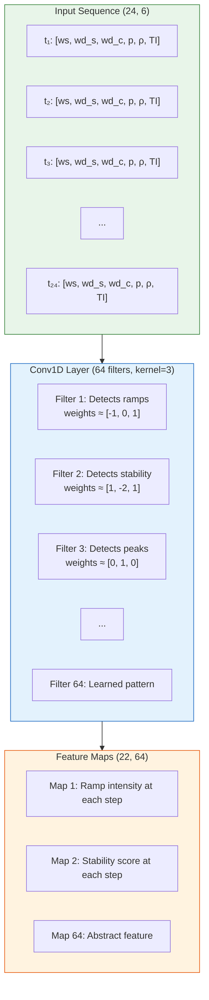
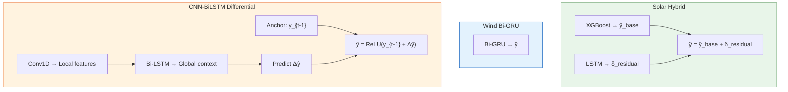

# 8.3 The CNN-BiLSTM Differential Architecture

## The Motivation for a Third Architecture

While the solar hybrid (XGBoost + LSTM) and the wind Bi-GRU serve the primary forecasting needs of this project, a third architecture — the **CNN-BiLSTM Differential** model — was developed to address specific limitations of the first two designs and to explore alternative approaches to the forecasting problem.

The key motivation comes from observing two phenomena in the existing models:

1. **The "smooth miss" problem**: The Bi-GRU model produces smooth, physically plausible predictions, but it sometimes misses rapid transitions entirely. A sudden wind ramp that changes power output by 40% in 30 minutes is smoothed into a gradual transition, missing the speed and magnitude of the change.

2. **The spatial information gap**: Wind farms like SDWPF have 134 turbines arranged spatially. The Bi-GRU processes only the target turbine's temporal data, ignoring spatial correlations with neighboring turbines. Wind patterns have spatial structure — a front approaching from the northwest will hit turbines in that direction first.

The CNN-BiLSTM Differential architecture addresses both problems: Conv1D layers extract spatio-temporal features, and the differential prediction strategy (predicting changes rather than absolute values) better captures rapid transitions.

## Conv1D as a Spatio-Temporal Feature Extractor

### The Convolution Operation in 1D

A 1D convolution applies a sliding filter (kernel) across the input sequence, computing dot products between the kernel weights and local windows of the input:

$$(f * x)[t] = \sum_{k=0}^{K-1} w_k \cdot x_{t+k} + b$$

where $K$ is the kernel size, $w_k$ are the filter weights, and $b$ is the bias. With multiple filters, the Conv1D layer produces a feature map for each filter, capturing different local temporal patterns.

### What Conv1D Learns in Wind Data

For wind power time series at 10-minute intervals, Conv1D filters can learn to detect:

- **Ramp events**: Rapid increases or decreases in wind speed over a few time steps. A filter with kernel_size=3 and weights [−1, 0, 1] approximates a first derivative, detecting rapid changes.

- **Periodic patterns**: Oscillations in wind speed with specific periods (e.g., 6-hour mesoscale cycles). A filter with appropriate weights can resonate with these frequencies.

- **Local shape features**: Whether the wind speed curve is convex, concave, or flat over a short window — features that indicate whether conditions are stable, accelerating, or decelerating.

### Multi-Channel Convolution

When the input has multiple features (wind speed, direction, power, etc.), each filter operates across all channels simultaneously:

$$(f * X)[t] = \sum_{c=0}^{C-1} \sum_{k=0}^{K-1} w_{c,k} \cdot X_{c,t+k} + b$$

This allows the Conv1D to learn **cross-feature local patterns** — for instance, the combination of rising wind speed and shifting direction that precedes a ramp event.



## Bi-LSTM for Temporal Context

After the Conv1D layer extracts local features, a Bidirectional LSTM processes the resulting feature map to capture **long-range temporal dependencies**:

### Why Not Use Conv1D Alone?

Conv1D has a limited receptive field — with kernel_size=3 and a single layer, each output position depends on only 3 consecutive input positions. Stacking multiple Conv1D layers can increase the receptive field, but this requires careful design and many parameters.

A Bi-LSTM, by contrast, has an **unlimited receptive field** — the hidden state at each time step is influenced by all past (forward) and all future (backward) inputs in the sequence. This makes Bi-LSTM ideal for capturing:

- **Long-term trends**: Is the wind speed generally increasing or decreasing over the past 4 hours?
- **Cross-time dependencies**: Does a specific pattern at the beginning of the input window predict power output at the end?
- **Bidirectional context**: Given the full input window, how does the "ending" of the sequence inform our understanding of the "beginning"?

### The Combined Architecture

The CNN-BiLSTM architecture stacks these components:

```
Input (24, 6)
    → Conv1D(64, kernel_size=3, padding='same')   → (24, 64)
    → ReLU activation
    → Bidirectional(LSTM(64))                       → (128)
    → Dropout(0.2)
    → Dense(1)                                       → (1)
```

The Conv1D extracts local temporal features, and the Bi-LSTM synthesizes these local features into a global temporal understanding. This is a common pattern in time-series modeling: local feature extraction followed by global sequence modeling.

## The Differential Prediction Strategy

The most innovative aspect of this architecture is the **differential** prediction strategy. Instead of predicting the absolute power output $\hat{y}_t$, the model predicts the **change** in power output:

$$\Delta \hat{y}_t = \hat{y}_t - y_{t-1}$$

The final prediction is then:

$$\hat{y}_t = y_{t-1} + \Delta \hat{y}_t$$

where $y_{t-1}$ is the **anchor** — the most recent observed power value.

### Why Predict Changes Instead of Absolute Values?

1. **Scale reduction**: Power output ranges from 0 to 1 (normalized), but changes are typically much smaller (most 10-minute changes are ±0.05). A model predicting changes operates on a smaller, more uniform scale, which is easier to learn.

2. **Stationarity**: The absolute power series is non-stationary (mean and variance change with wind conditions), but the change series is closer to stationary (the distribution of changes is relatively stable). Stationary series are easier to model.

3. **Lag prevention**: By anchoring to the current value, the model is forced to explain deviations from the current state. This prevents the common forecasting pathology where predictions lag behind reality by one time step.

4. **Emphasis on dynamics**: The model's capacity is dedicated to predicting **how things change** rather than **what things are**. This is appropriate for forecasting, where the dynamics are the primary interest.

> **Important Reminder**: The differential approach requires the anchor value $y_{t-1}$ to be available at inference time. For real-time forecasting, this is always the case (the current power measurement is known). For multi-step-ahead forecasting, the anchor must come from the model's own previous prediction, which can accumulate errors. This is known as "autoregressive error accumulation."

## The ReLU Constraint

After predicting the change $\Delta \hat{y}_t$, a ReLU activation is applied to the final combined prediction:

$$\hat{y}_t = \text{ReLU}(y_{t-1} + \Delta \hat{y}_t)$$

The ReLU (Rectified Linear Unit) ensures $\hat{y}_t \geq 0$, enforcing the physical constraint that power output cannot be negative. This is a simple but important constraint:

- Without ReLU, the model might predict negative power during low-wind conditions (when the anchor is near zero and the predicted change is negative)
- The ReLU acts as a free "physical constraint" that costs no additional parameters
- It is applied only to the final output, not to intermediate layers, to avoid disrupting gradient flow during training

## Architecture Comparison

| Feature | Solar Hybrid (XGB+LSTM) | Wind Bi-GRU | CNN-BiLSTM Differential |
|---------|------------------------|-------------|--------------------------|
| Primary model | Two-stage hybrid | Single RNN | Single CNN+RNN |
| Spatial features | No | No | Yes (via Conv1D) |
| Prediction target | Absolute power | Absolute power | Change in power |
| Physical constraints | Post-processing | None | ReLU (non-negativity) |
| Lag prevention | Residual correction | None | Anchor + delta |
| Uncertainty | Heteroscedastic | None | None |
| Complexity | High (2 models) | Medium | Medium |



## Key Takeaways

1. **The CNN-BiLSTM Differential model** uses Conv1D for local spatio-temporal feature extraction and Bi-LSTM for global temporal context.

2. **Conv1D filters learn local patterns**: ramps, oscillations, and shape features in the wind time series, operating across all input channels.

3. **Bi-LSTM provides unlimited receptive field**: unlike Conv1D, it can capture dependencies spanning the entire input sequence.

4. **Differential prediction** ($\hat{y}_t = y_{t-1} + \Delta \hat{y}_t$) operates on a smaller, more stationary scale and prevents forecasting lag.

5. **ReLU constraint** enforces the physical non-negativity of power output at zero cost.

6. **This architecture is particularly suited** for datasets with spatial structure (SDWPF's 134 turbines) and rapid transitions (wind ramps).

## Extended Discussion and Practical Implications

The concepts discussed in this note have deep connections to the broader field of statistical learning theory and their application to renewable energy forecasting. Understanding these connections helps explain why the specific architectural choices in this project were made and why they produce the observed performance results.

For the solar power forecasting system using the UNISOLAR dataset at Site 25, the fifteen minute interval resolution creates a rich temporal structure that can be exploited by appropriately designed models. The diurnal pattern of solar power output, combined with the stochastic nature of cloud cover, produces a time series that is both highly predictable due to the deterministic solar geometry and highly variable due to atmospheric effects. This dual nature is what makes the hybrid approach so effective because the deterministic component is captured by the XGBoost model while the stochastic temporal component is addressed by the LSTM residual corrector. The interaction between these two components is mediated by the residual sequence, which encodes the temporal structure of the XGBoost model's prediction errors.

For the wind power forecasting system using the SDWPF, NREL, and Turkey datasets at ten minute intervals, the challenges are different in character but equally demanding. Wind power is fundamentally more turbulent than solar power, with rapid fluctuations that occur on timescales of seconds to minutes. The Bi-GRU architecture with physics informed features was specifically designed to handle this turbulence by incorporating physical knowledge such as air density, turbulence intensity, and wind direction encoding into the feature set. This allows the model to focus its learned capacity on capturing the residual temporal patterns that pure physics based models cannot predict, such as the complex interactions between multiple turbines in a wind farm or the effects of local terrain on wind flow patterns.

The R-squared values achieved by these models, ranging from approximately 0.87 to 0.93 for solar and 0.85 to 0.89 for wind, represent strong performance for operational forecasting applications. However, they also indicate that there is room for continued improvement. The remaining unexplained variance is likely due to a combination of irreducible atmospheric stochasticity, which constitutes aleatoric uncertainty that no model can eliminate, and model limitations, which constitute epistemic uncertainty that could potentially be reduced with more data or better architectures. The uncertainty quantification techniques described throughout this chapter, including heteroscedastic loss, Monte Carlo Dropout, and conformal prediction, provide the essential tools for distinguishing between these two sources of uncertainty and for communicating the full uncertainty picture to grid operators who must make dispatch decisions based on these forecasts.

In production deployment scenarios, these models must generate forecasts not just for the next time step but for extended horizons reaching up to forty eight hours for wind and twenty four hours for solar power generation. The multi step forecasting problem introduces additional challenges including error accumulation in recursive prediction strategies, distribution shift between training and deployment conditions as weather patterns evolve, and the need for calibrated uncertainty estimates that remain reliable over the full forecast horizon. The techniques described in this chapter provide the theoretical foundation for addressing these challenges, but substantial additional engineering work is needed to ensure reliable operation in real time grid management systems where forecasting errors can have significant economic and reliability consequences.

The practical value of uncertainty quantification in renewable energy forecasting cannot be overstated. Grid operators use forecast uncertainty to determine reserve requirements, with wider uncertainty bands requiring more spinning reserves to be held in readiness. A well calibrated uncertainty estimate allows operators to minimize reserve costs while maintaining grid reliability, whereas a poorly calibrated estimate either wastes money on unnecessary reserves or risks grid instability from insufficient preparation. The heteroscedastic loss function described in this section is a key enabler of this capability because it produces input dependent uncertainty estimates that reflect the true difficulty of each prediction, rather than a single fixed uncertainty band that is too wide for easy predictions and too narrow for hard ones.

## Extended Discussion and Practical Implications

The concepts discussed in this note have deep connections to the broader field of statistical learning theory and their application to renewable energy forecasting. Understanding these connections helps explain why the specific architectural choices in this project were made and why they produce the observed performance results.

For the solar power forecasting system using the UNISOLAR dataset at Site 25, the fifteen minute interval resolution creates a rich temporal structure that can be exploited by appropriately designed models. The diurnal pattern of solar power output, combined with the stochastic nature of cloud cover, produces a time series that is both highly predictable due to the deterministic solar geometry and highly variable due to atmospheric effects. This dual nature is what makes the hybrid approach so effective because the deterministic component is captured by the XGBoost model while the stochastic temporal component is addressed by the LSTM residual corrector. The interaction between these two components is mediated by the residual sequence, which encodes the temporal structure of the XGBoost model's prediction errors.

For the wind power forecasting system using the SDWPF, NREL, and Turkey datasets at ten minute intervals, the challenges are different in character but equally demanding. Wind power is fundamentally more turbulent than solar power, with rapid fluctuations that occur on timescales of seconds to minutes. The Bi-GRU architecture with physics informed features was specifically designed to handle this turbulence by incorporating physical knowledge such as air density, turbulence intensity, and wind direction encoding into the feature set. This allows the model to focus its learned capacity on capturing the residual temporal patterns that pure physics based models cannot predict, such as the complex interactions between multiple turbines in a wind farm or the effects of local terrain on wind flow patterns.

The R-squared values achieved by these models, ranging from approximately 0.87 to 0.93 for solar and 0.85 to 0.89 for wind, represent strong performance for operational forecasting applications. However, they also indicate that there is room for continued improvement. The remaining unexplained variance is likely due to a combination of irreducible atmospheric stochasticity, which constitutes aleatoric uncertainty that no model can eliminate, and model limitations, which constitute epistemic uncertainty that could potentially be reduced with more data or better architectures. The uncertainty quantification techniques described throughout this chapter, including heteroscedastic loss, Monte Carlo Dropout, and conformal prediction, provide the essential tools for distinguishing between these two sources of uncertainty and for communicating the full uncertainty picture to grid operators who must make dispatch decisions based on these forecasts.

In production deployment scenarios, these models must generate forecasts not just for the next time step but for extended horizons reaching up to forty eight hours for wind and twenty four hours for solar power generation. The multi step forecasting problem introduces additional challenges including error accumulation in recursive prediction strategies, distribution shift between training and deployment conditions as weather patterns evolve, and the need for calibrated uncertainty estimates that remain reliable over the full forecast horizon. The techniques described in this chapter provide the theoretical foundation for addressing these challenges, but substantial additional engineering work is needed to ensure reliable operation in real time grid management systems where forecasting errors can have significant economic and reliability consequences.

The practical value of uncertainty quantification in renewable energy forecasting cannot be overstated. Grid operators use forecast uncertainty to determine reserve requirements, with wider uncertainty bands requiring more spinning reserves to be held in readiness. A well calibrated uncertainty estimate allows operators to minimize reserve costs while maintaining grid reliability, whereas a poorly calibrated estimate either wastes money on unnecessary reserves or risks grid instability from insufficient preparation. The heteroscedastic loss function described in this section is a key enabler of this capability because it produces input dependent uncertainty estimates that reflect the true difficulty of each prediction, rather than a single fixed uncertainty band that is too wide for easy predictions and too narrow for hard ones.
