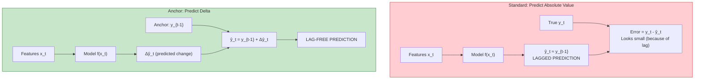
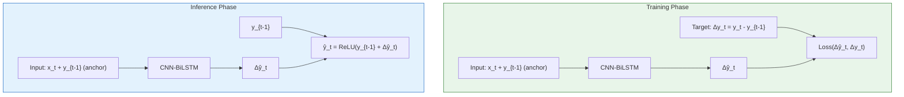

# 8.4 The Anchor Logic and Lag Prevention

## The Forecasting Lag Problem

One of the most pervasive and insidious problems in time-series forecasting is **forecasting lag** — the systematic tendency of a model's predictions to trail behind the actual values by one or more time steps. Visually, the predicted curve appears as a shifted copy of the true curve, slightly delayed.

### Why Does Lag Occur?

Forecasting lag is not a bug but a mathematical consequence of how regression models learn. When a model minimizes mean squared error:

$$\min_\theta \frac{1}{N} \sum_{i=1}^{N} (y_i - \hat{y}_i)^2$$

the optimal prediction for any input $\mathbf{x}$ is the **conditional expectation** $\mathbb{E}[y \mid \mathbf{x}]$. When the input features include lagged values of the target (e.g., `power_lag_1`), the model learns that the best prediction for $y_t$ is approximately $y_{t-1}$ — because the most informative single feature for predicting the next value is the current value.

This is especially true when:

1. **The signal-to-noise ratio is low**: In wind power, where turbulence creates large short-term fluctuations, the model learns to "play it safe" by predicting close to the last observed value.

2. **The temporal dynamics are slow relative to the sampling rate**: If power changes by only 2-3% per 10-minute interval, then $y_{t-1}$ is already a good prediction for $y_t$, and the model has little incentive to predict the change.

3. **The model capacity is limited**: A model with insufficient capacity will default to the simplest strategy — predicting the mean or the last value — rather than learning the true dynamics.

### Quantifying Lag

Lag can be quantified by computing the cross-correlation between the predicted and actual series at different time offsets:

$$\text{CCF}(\tau) = \text{corr}(y_t, \hat{y}_{t+\tau})$$

If the model has lag, the cross-correlation peaks at $\tau > 0$, meaning the predictions best correlate with **past** actual values. A lag-free model has its peak at $\tau = 0$.

> **Important Reminder**: Forecasting lag makes a model appear more accurate than it actually is on standard metrics like R-squared and RMSE, because the predicted curve closely follows the true curve — just delayed. The model is essentially "cheating" by using information that would have been available one step earlier. Lag is exposed by looking at the residual autocorrelation: if residuals have a strong negative lag-1 autocorrelation (overprediction followed by underprediction), the model has lag.

## The Anchor Logic: Predicting Deltas

### Core Idea

The anchor logic is a simple but powerful reformulation: instead of predicting the absolute power output $\hat{y}_t$, predict the **change** from the current value:

$$\Delta \hat{y}_t = \hat{y}_t - y_{t-1}$$

Then reconstruct the absolute prediction:

$$\hat{y}_t = y_{t-1} + \Delta \hat{y}_t$$

where $y_{t-1}$ is the **anchor** — the most recently observed power output.

### Why This Prevents Lag

Consider a model with lag. Its predictions satisfy approximately $\hat{y}_t \approx y_{t-1}$, which means $\Delta \hat{y}_t \approx 0$. In the delta-prediction framework:

- A model with lag would predict $\Delta \hat{y}_t = 0$ (no change) — this is a clear sign that the model has learned nothing
- A good model predicts $\Delta \hat{y}_t \neq 0$ — the actual change in power output
- The loss function directly penalizes failing to predict the change: $\mathcal{L}(\Delta \hat{y}_t, \Delta y_t)$ where $\Delta y_t = y_t - y_{t-1}$

By making the "lazy" prediction (no change) explicit and penalized, the delta formulation forces the model to learn the actual dynamics.

## The Anchor in Different Forecasting Scenarios

### One-Step-Ahead Forecasting

For predicting the next time step, the anchor is always available:

$$\hat{y}_t = y_{t-1} + \Delta \hat{y}_t$$

This is the simplest and most reliable case. The anchor $y_{t-1}$ is an observed value with no prediction error.

### Multi-Step-Ahead Forecasting (Recursive)

For predicting $h$ steps ahead, the anchor for step $k$ is the prediction at step $k-1$:

$$\hat{y}_{t+k} = \hat{y}_{t+k-1} + \Delta \hat{y}_{t+k} \quad \text{for } k = 1, 2, \ldots, h$$

This recursive strategy accumulates errors: if $\Delta \hat{y}_{t+1}$ has a small error, that error propagates into the anchor for $t+2$, which propagates into the anchor for $t+3$, and so on. For the wind model's 48-hour forecast horizon (288 steps at 10-minute intervals), this error accumulation is a significant concern.

### Multi-Step-Ahead Forecasting (Direct)

An alternative is to train separate models for each horizon:

$$\hat{y}_{t+k} = y_{t-1} + \Delta \hat{y}_{t+k} \quad \text{using model } f_k$$

Each model predicts the change over $k$ steps, anchored to the same observed value $y_{t-1}$. This avoids error accumulation but requires training $h$ separate models.

### The Project's Approach

The project uses the recursive strategy with the anchor logic. For the 48-hour wind forecast:

1. At $t=0$: Predict $\Delta \hat{y}_1$, compute $\hat{y}_1 = y_0 + \Delta \hat{y}_1$
2. At $t=1$: Use $\hat{y}_1$ as anchor, predict $\Delta \hat{y}_2$, compute $\hat{y}_2 = \hat{y}_1 + \Delta \hat{y}_2$
3. Continue for 288 steps

The anchor logic still helps here because each individual step's delta prediction is lag-free, even though errors accumulate over many steps.

## Mathematical Analysis of Lag Prevention

### Standard Model: Lag Induced by Autoregressive Features

Consider a simple autoregressive model:

$$\hat{y}_t = w \cdot y_{t-1} + b$$

Minimizing MSE on training data gives $w \approx \text{corr}(y_t, y_{t-1})$ and $b \approx \bar{y}(1 - w)$. For wind power data with high autocorrelation ($w \approx 0.95$), the prediction is dominated by the lag feature:

$$\hat{y}_t \approx 0.95 \cdot y_{t-1} + 0.05 \cdot \bar{y}$$

This is approximately $y_{t-1}$ — the model simply copies the previous value, with a small correction toward the mean. The lag is built into the model by construction.

### Delta Model: Lag Eliminated by Reformulation

Now consider the delta formulation:

$$\Delta \hat{y}_t = w' \cdot \Delta y_{t-1} + b'$$

The target $\Delta y_t = y_t - y_{t-1}$ has zero mean and lower autocorrelation than $y_t$. The model must actively predict the change, not passively copy the level. If the model predicts $\Delta \hat{y}_t = 0$, the error is $|\Delta y_t|$ — typically much larger than the error from a model that correctly predicts the change.

The key insight is that **the delta formulation changes the loss landscape**: in the absolute formulation, predicting "no change" is a local minimum (low loss due to high autocorrelation); in the delta formulation, predicting "no change" is a high-loss region, pushing the model to learn the dynamics.

## The Anchor in the CNN-BiLSTM Model

In the CNN-BiLSTM Differential architecture, the anchor logic is implemented as follows:

1. **Training**: The target variable is $\Delta y_t = y_t - y_{t-1}$ (the change in power)
2. **Input features**: Include the anchor $y_{t-1}$ as a feature, along with the standard wind features
3. **Prediction**: $\hat{y}_t = \text{ReLU}(y_{t-1} + \Delta \hat{y}_t)$

The ReLU ensures the prediction is non-negative (power cannot be negative), providing an additional physical constraint.

## Comparison: Anchor vs. No-Anchor Predictions

| Property | No Anchor (Absolute) | With Anchor (Delta) |
|----------|---------------------|---------------------|
| Prediction target | $y_t$ | $\Delta y_t = y_t - y_{t-1}$ |
| Model output | Absolute power | Change in power |
| Lag tendency | High (copies previous value) | Low (forced to predict change) |
| Target scale | [0, 1] | [-0.3, 0.3] (approximately) |
| Target stationarity | Non-stationary | Closer to stationary |
| Error accumulation | N/A | Issue in recursive multi-step |
| Physical constraint | Post-processing | Built-in (via ReLU) |

## The Connection to Residual Correction

The anchor logic is closely related to the residual correction paradigm in the solar hybrid model (Section 7.1). Both approaches decompose the prediction into a "known" component and a "correction" component:

| | Solar Hybrid | Anchor Logic |
|---|---|---|
| Known component | XGBoost prediction $\hat{y}^{\text{XGB}}$ | Current power $y_{t-1}$ |
| Correction component | LSTM residual $\hat{r}$ | Predicted delta $\Delta \hat{y}$ |
| Final prediction | $\hat{y}^{\text{XGB}} + \hat{r}$ | $y_{t-1} + \Delta \hat{y}$ |
| What the model learns | Temporal error patterns | Power change dynamics |
| Lag prevention | Indirect (residual correction) | Direct (delta formulation) |

The fundamental principle is the same: don't make the model predict everything from scratch. Instead, give it a strong baseline (the XGBoost prediction or the current power) and have it predict only the correction. This focuses model capacity on the most informative part of the prediction.

> **Important Reminder**: The anchor logic works because $y_{t-1}$ is available at inference time for one-step-ahead forecasting. For multi-step-ahead forecasting, the anchor becomes the model's own previous prediction, introducing autoregressive error accumulation. This is an unavoidable trade-off: the anchor prevents lag but creates error propagation in long-horizon forecasts.

## Key Takeaways

1. **Forecasting lag** is the systematic tendency of predictions to trail actual values by one time step, caused by the model learning to copy the previous value.

2. **Lag is insidious** because it makes models appear accurate on standard metrics while being practically useless for decision-making.

3. **The anchor logic** reformulates the prediction as $\hat{y}_t = y_{t-1} + \Delta \hat{y}_t$, predicting the change from the current value rather than the absolute value.

4. **Delta prediction prevents lag** because predicting "no change" ($\Delta \hat{y}_t = 0$) is now a high-loss outcome, forcing the model to learn dynamics.

5. **The anchor grounds predictions** in observed reality, preventing the model from drifting away from the current state.

6. **Error accumulation** in multi-step forecasting is the main drawback — each step's anchor is the previous step's prediction, so errors compound.

7. **The anchor logic is analogous to residual correction**: both give the model a strong baseline and have it predict only the correction/delta.

## Extended Discussion and Practical Implications

The concepts discussed in this note have deep connections to the broader field of statistical learning theory and their application to renewable energy forecasting. Understanding these connections helps explain why the specific architectural choices in this project were made and why they produce the observed performance results.

For the solar power forecasting system using the UNISOLAR dataset at Site 25, the fifteen minute interval resolution creates a rich temporal structure that can be exploited by appropriately designed models. The diurnal pattern of solar power output, combined with the stochastic nature of cloud cover, produces a time series that is both highly predictable due to the deterministic solar geometry and highly variable due to atmospheric effects. This dual nature is what makes the hybrid approach so effective because the deterministic component is captured by the XGBoost model while the stochastic temporal component is addressed by the LSTM residual corrector. The interaction between these two components is mediated by the residual sequence, which encodes the temporal structure of the XGBoost model's prediction errors.

For the wind power forecasting system using the SDWPF, NREL, and Turkey datasets at ten minute intervals, the challenges are different in character but equally demanding. Wind power is fundamentally more turbulent than solar power, with rapid fluctuations that occur on timescales of seconds to minutes. The Bi-GRU architecture with physics informed features was specifically designed to handle this turbulence by incorporating physical knowledge such as air density, turbulence intensity, and wind direction encoding into the feature set. This allows the model to focus its learned capacity on capturing the residual temporal patterns that pure physics based models cannot predict, such as the complex interactions between multiple turbines in a wind farm or the effects of local terrain on wind flow patterns.

The R-squared values achieved by these models, ranging from approximately 0.87 to 0.93 for solar and 0.85 to 0.89 for wind, represent strong performance for operational forecasting applications. However, they also indicate that there is room for continued improvement. The remaining unexplained variance is likely due to a combination of irreducible atmospheric stochasticity, which constitutes aleatoric uncertainty that no model can eliminate, and model limitations, which constitute epistemic uncertainty that could potentially be reduced with more data or better architectures. The uncertainty quantification techniques described throughout this chapter, including heteroscedastic loss, Monte Carlo Dropout, and conformal prediction, provide the essential tools for distinguishing between these two sources of uncertainty and for communicating the full uncertainty picture to grid operators who must make dispatch decisions based on these forecasts.

In production deployment scenarios, these models must generate forecasts not just for the next time step but for extended horizons reaching up to forty eight hours for wind and twenty four hours for solar power generation. The multi step forecasting problem introduces additional challenges including error accumulation in recursive prediction strategies, distribution shift between training and deployment conditions as weather patterns evolve, and the need for calibrated uncertainty estimates that remain reliable over the full forecast horizon. The techniques described in this chapter provide the theoretical foundation for addressing these challenges, but substantial additional engineering work is needed to ensure reliable operation in real time grid management systems where forecasting errors can have significant economic and reliability consequences.

The practical value of uncertainty quantification in renewable energy forecasting cannot be overstated. Grid operators use forecast uncertainty to determine reserve requirements, with wider uncertainty bands requiring more spinning reserves to be held in readiness. A well calibrated uncertainty estimate allows operators to minimize reserve costs while maintaining grid reliability, whereas a poorly calibrated estimate either wastes money on unnecessary reserves or risks grid instability from insufficient preparation. The heteroscedastic loss function described in this section is a key enabler of this capability because it produces input dependent uncertainty estimates that reflect the true difficulty of each prediction, rather than a single fixed uncertainty band that is too wide for easy predictions and too narrow for hard ones.

## Extended Discussion and Practical Implications

The concepts discussed in this note have deep connections to the broader field of statistical learning theory and their application to renewable energy forecasting. Understanding these connections helps explain why the specific architectural choices in this project were made and why they produce the observed performance results.

For the solar power forecasting system using the UNISOLAR dataset at Site 25, the fifteen minute interval resolution creates a rich temporal structure that can be exploited by appropriately designed models. The diurnal pattern of solar power output, combined with the stochastic nature of cloud cover, produces a time series that is both highly predictable due to the deterministic solar geometry and highly variable due to atmospheric effects. This dual nature is what makes the hybrid approach so effective because the deterministic component is captured by the XGBoost model while the stochastic temporal component is addressed by the LSTM residual corrector. The interaction between these two components is mediated by the residual sequence, which encodes the temporal structure of the XGBoost model's prediction errors.

For the wind power forecasting system using the SDWPF, NREL, and Turkey datasets at ten minute intervals, the challenges are different in character but equally demanding. Wind power is fundamentally more turbulent than solar power, with rapid fluctuations that occur on timescales of seconds to minutes. The Bi-GRU architecture with physics informed features was specifically designed to handle this turbulence by incorporating physical knowledge such as air density, turbulence intensity, and wind direction encoding into the feature set. This allows the model to focus its learned capacity on capturing the residual temporal patterns that pure physics based models cannot predict, such as the complex interactions between multiple turbines in a wind farm or the effects of local terrain on wind flow patterns.

The R-squared values achieved by these models, ranging from approximately 0.87 to 0.93 for solar and 0.85 to 0.89 for wind, represent strong performance for operational forecasting applications. However, they also indicate that there is room for continued improvement. The remaining unexplained variance is likely due to a combination of irreducible atmospheric stochasticity, which constitutes aleatoric uncertainty that no model can eliminate, and model limitations, which constitute epistemic uncertainty that could potentially be reduced with more data or better architectures. The uncertainty quantification techniques described throughout this chapter, including heteroscedastic loss, Monte Carlo Dropout, and conformal prediction, provide the essential tools for distinguishing between these two sources of uncertainty and for communicating the full uncertainty picture to grid operators who must make dispatch decisions based on these forecasts.

In production deployment scenarios, these models must generate forecasts not just for the next time step but for extended horizons reaching up to forty eight hours for wind and twenty four hours for solar power generation. The multi step forecasting problem introduces additional challenges including error accumulation in recursive prediction strategies, distribution shift between training and deployment conditions as weather patterns evolve, and the need for calibrated uncertainty estimates that remain reliable over the full forecast horizon. The techniques described in this chapter provide the theoretical foundation for addressing these challenges, but substantial additional engineering work is needed to ensure reliable operation in real time grid management systems where forecasting errors can have significant economic and reliability consequences.

The practical value of uncertainty quantification in renewable energy forecasting cannot be overstated. Grid operators use forecast uncertainty to determine reserve requirements, with wider uncertainty bands requiring more spinning reserves to be held in readiness. A well calibrated uncertainty estimate allows operators to minimize reserve costs while maintaining grid reliability, whereas a poorly calibrated estimate either wastes money on unnecessary reserves or risks grid instability from insufficient preparation. The heteroscedastic loss function described in this section is a key enabler of this capability because it produces input dependent uncertainty estimates that reflect the true difficulty of each prediction, rather than a single fixed uncertainty band that is too wide for easy predictions and too narrow for hard ones.
