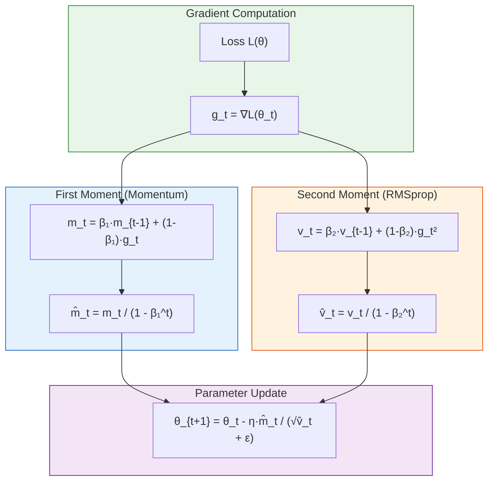
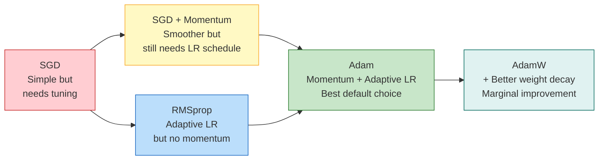

# 9.1 The Adam Optimizer

## The Optimization Problem in Neural Network Training

Training a neural network means finding the parameter vector $\theta$ that minimizes a loss function $\mathcal{L}(\theta)$ over the training data. This is typically done using **gradient-based optimization**, where the parameters are updated iteratively in the direction that reduces the loss:

$$\theta_{t+1} = \theta_t - \eta \cdot \nabla_\theta \mathcal{L}(\theta_t)$$

where $\eta$ is the learning rate and $\nabla_\theta \mathcal{L}$ is the gradient of the loss with respect to the parameters. This is the simplest optimizer — **Stochastic Gradient Descent (SGD)**.

While SGD works well in principle, it suffers from several practical difficulties that are especially relevant for time-series forecasting models like the LSTM residual corrector and the wind Bi-GRU:

1. **Learning rate sensitivity**: SGD requires careful tuning of the learning rate. Too high → divergence; too low → painfully slow convergence.
2. **Ravines and saddle points**: The loss landscape of deep networks contains many ravines (steep walls in one direction, flat valleys in another) and saddle points where SGD oscillates or stalls.
3. **Sparse gradients**: Some parameters (especially in the LSTM's forget gate) receive gradient updates infrequently, leading to slow learning.
4. **Non-stationary objectives**: In online learning settings, the optimal parameters change over time as new data arrives.

Adam (Adaptive Moment Estimation), introduced by Kingma and Ba (2015), addresses all of these issues through a clever combination of ideas from two earlier optimizers: Momentum and RMSprop.

## Adam's Three Key Mechanisms

### 1. First Moment Estimation (Momentum)

Adam maintains an exponentially decaying average of past gradients — the **first moment**:

$$m_t = \beta_1 \cdot m_{t-1} + (1 - \beta_1) \cdot g_t$$

where $g_t = \nabla_\theta \mathcal{L}(\theta_t)$ is the current gradient, $m_t$ is the first moment estimate, and $\beta_1$ is the decay rate (default: 0.9).

This is equivalent to **momentum** — the accumulated gradient includes contributions from past gradients, helping the optimizer maintain direction in the face of noisy gradients and accelerate through flat regions. The effect is similar to a ball rolling downhill: it builds up speed in consistent directions and dampens oscillations in inconsistent directions.

### 2. Second Moment Estimation (RMSprop)

Adam also maintains an exponentially decaying average of past squared gradients — the **second moment**:

$$v_t = \beta_2 \cdot v_{t-1} + (1 - \beta_2) \cdot g_t^2$$

where $v_t$ is the second moment estimate and $\beta_2$ is the decay rate (default: 0.999).

This is equivalent to **RMSprop** — the accumulated squared gradient provides a running estimate of the gradient variance. Parameters with large historical gradients get smaller effective learning rates, while parameters with small historical gradients get larger effective learning rates. This **per-parameter adaptive learning rate** is what makes Adam robust to different gradient scales across the network.

### 3. Bias Correction

At the beginning of training, both $m_t$ and $v_t$ are initialized to zero. This creates a bias toward zero in the early estimates:

$$m_0 = 0 \implies m_1 = (1-\beta_1) g_1 \approx 0.1 \cdot g_1 \quad \text{(much smaller than } g_1\text{)}$$

Adam corrects this bias by normalizing:

$$\hat{m}_t = \frac{m_t}{1 - \beta_1^t}, \quad \hat{v}_t = \frac{v_t}{1 - \beta_2^t}$$

where $\beta_1^t$ and $\beta_2^t$ are the decay rates raised to the power $t$. For large $t$, $1 - \beta^t \approx 1$ and the correction is negligible. For small $t$, the correction ensures the estimates are unbiased.

### The Complete Update Rule

Combining all three mechanisms, Adam's parameter update is:

$$\theta_{t+1} = \theta_t - \frac{\eta}{\sqrt{\hat{v}_t} + \epsilon} \cdot \hat{m}_t$$

where $\epsilon$ is a small constant (default: $10^{-8}$) for numerical stability (preventing division by zero).



## Default Hyperparameters and Their Rationale

Adam's default hyperparameters are surprisingly robust across a wide range of problems:

| Hyperparameter | Default | Rationale |
|---------------|---------|-----------|
| $\eta$ (learning rate) | 0.001 | Works well for most problems; the adaptive scaling means less sensitivity to this value |
| $\beta_1$ (first moment decay) | 0.9 | Gives ~10-step exponential average of gradients; smooths noise while being responsive |
| $\beta_2$ (second moment decay) | 0.999 | Gives ~1000-step exponential average of squared gradients; stable variance estimate |
| $\epsilon$ (stability) | $10^{-8}$ | Prevents division by zero; rarely affects results |

> **Important Reminder**: The learning rate $\eta = 0.001$ is the default used in both the solar LSTM and wind Bi-GRU models in this project. While Adam is less sensitive to the learning rate than SGD, the choice still matters. A learning rate of 0.01 can cause divergence in some architectures, while 0.0001 leads to unnecessarily slow convergence.

## Why Adam Over SGD

### The Case for SGD

SGD with momentum and a well-tuned learning rate schedule can achieve better final generalization performance than Adam on some problems. This is because:

- SGD's consistent learning rate across all parameters acts as an implicit regularizer
- The noise in SGD's gradient estimates (from mini-batch sampling) helps escape local minima
- SGD with momentum and Nesterov acceleration can be more computationally efficient per step

### The Case for Adam

Adam is preferred in this project for several practical reasons:

1. **Less hyperparameter tuning**: SGD requires careful tuning of the learning rate, momentum, and learning rate schedule. Adam works well with defaults for most deep learning problems, saving development time.

2. **Robust to gradient scale**: In the wind Bi-GRU model, the Bidirectional GRU layer produces gradients of different magnitudes for the forward and backward passes. Adam's per-parameter adaptive learning rate handles this automatically.

3. **Better behavior in early training**: The bias correction ensures that Adam takes appropriately sized steps from the very first iteration, while SGD may require a warm-up period.

4. **Works with sparse gradients**: The LSTM's forget gate receives gradients only when the gate is partially open. Adam's second moment accumulation ensures these parameters still receive meaningful updates.

5. **Compatible with early stopping**: Since Adam converges faster in the early epochs, the early stopping criterion (patience=3) triggers at a better point.

### The Verdict

For this project, the practical advantages of Adam outweigh the theoretical generalization benefits of SGD. The models (LSTM residual corrector and Bi-GRU) are relatively small, the datasets are not enormous, and the training time savings from using Adam are significant.

## Adam in the Project's Models

### Solar LSTM Residual Corrector

```python
optimizer = torch.optim.Adam(model.parameters(), lr=0.001)
```

The LSTM residual corrector uses Adam with the default learning rate. Training typically converges in 20-40 epochs (with early stopping at patience=5), compared to 50-100+ epochs with SGD.

### Wind Bi-GRU

```python
optimizer = torch.optim.Adam(model.parameters(), lr=0.001)
```

The wind Bi-GRU also uses Adam with the default learning rate. The Bidirectional GRU's gradient flow benefits from Adam's adaptive learning rate — the backward pass produces gradients with different scales than the forward pass, and Adam handles this automatically.

## Adam Variants

Several variants of Adam have been proposed to address its weaknesses:

| Variant | Key Improvement | Used in Project? |
|---------|----------------|------------------|
| AdamW | Decoupled weight decay (better regularization) | No |
| AdaBound | Bounds learning rate to emulate SGD | No |
| RAdam | Rectified variance for warmup-free training | No |
| Lookahead | Slow weights for better generalization | No |

The project uses vanilla Adam because the default hyperparameters work well and the additional complexity of variants is not justified by the observed performance.



## Key Takeaways

1. **Adam = Momentum + RMSprop + Bias Correction**: It combines the first moment (momentum for direction), second moment (adaptive learning rate for scale), and bias correction (for accurate early training).

2. **The update rule** is $\theta_{t+1} = \theta_t - \frac{\eta}{\sqrt{\hat{v}_t} + \epsilon} \hat{m}_t$, where $\hat{m}_t$ and $\hat{v}_t$ are bias-corrected moment estimates.

3. **Default hyperparameters** ($\eta=0.001$, $\beta_1=0.9$, $\beta_2=0.999$, $\epsilon=10^{-8}$) work well for most problems, including the models in this project.

4. **Adam is preferred over SGD** for this project due to less hyperparameter tuning, robustness to gradient scale, and faster convergence.

5. **The bias correction** $1/(1-\beta^t)$ ensures accurate moment estimates in early training, preventing undersized updates.

6. **Both the solar LSTM and wind Bi-GRU** use Adam with lr=0.001, converging in 20-40 epochs with early stopping.

7. **Adam variants** (AdamW, RAdam, etc.) offer marginal improvements but are not necessary for this project's model sizes and data quantities.

## Extended Discussion and Practical Implications

The concepts discussed in this note have deep connections to the broader field of statistical learning theory and their application to renewable energy forecasting. Understanding these connections helps explain why the specific architectural choices in this project were made and why they produce the observed performance results.

For the solar power forecasting system using the UNISOLAR dataset at Site 25, the fifteen minute interval resolution creates a rich temporal structure that can be exploited by appropriately designed models. The diurnal pattern of solar power output, combined with the stochastic nature of cloud cover, produces a time series that is both highly predictable due to the deterministic solar geometry and highly variable due to atmospheric effects. This dual nature is what makes the hybrid approach so effective because the deterministic component is captured by the XGBoost model while the stochastic temporal component is addressed by the LSTM residual corrector. The interaction between these two components is mediated by the residual sequence, which encodes the temporal structure of the XGBoost model's prediction errors.

For the wind power forecasting system using the SDWPF, NREL, and Turkey datasets at ten minute intervals, the challenges are different in character but equally demanding. Wind power is fundamentally more turbulent than solar power, with rapid fluctuations that occur on timescales of seconds to minutes. The Bi-GRU architecture with physics informed features was specifically designed to handle this turbulence by incorporating physical knowledge such as air density, turbulence intensity, and wind direction encoding into the feature set. This allows the model to focus its learned capacity on capturing the residual temporal patterns that pure physics based models cannot predict, such as the complex interactions between multiple turbines in a wind farm or the effects of local terrain on wind flow patterns.

The R-squared values achieved by these models, ranging from approximately 0.87 to 0.93 for solar and 0.85 to 0.89 for wind, represent strong performance for operational forecasting applications. However, they also indicate that there is room for continued improvement. The remaining unexplained variance is likely due to a combination of irreducible atmospheric stochasticity, which constitutes aleatoric uncertainty that no model can eliminate, and model limitations, which constitute epistemic uncertainty that could potentially be reduced with more data or better architectures. The uncertainty quantification techniques described throughout this chapter, including heteroscedastic loss, Monte Carlo Dropout, and conformal prediction, provide the essential tools for distinguishing between these two sources of uncertainty and for communicating the full uncertainty picture to grid operators who must make dispatch decisions based on these forecasts.

In production deployment scenarios, these models must generate forecasts not just for the next time step but for extended horizons reaching up to forty eight hours for wind and twenty four hours for solar power generation. The multi step forecasting problem introduces additional challenges including error accumulation in recursive prediction strategies, distribution shift between training and deployment conditions as weather patterns evolve, and the need for calibrated uncertainty estimates that remain reliable over the full forecast horizon. The techniques described in this chapter provide the theoretical foundation for addressing these challenges, but substantial additional engineering work is needed to ensure reliable operation in real time grid management systems where forecasting errors can have significant economic and reliability consequences.

The practical value of uncertainty quantification in renewable energy forecasting cannot be overstated. Grid operators use forecast uncertainty to determine reserve requirements, with wider uncertainty bands requiring more spinning reserves to be held in readiness. A well calibrated uncertainty estimate allows operators to minimize reserve costs while maintaining grid reliability, whereas a poorly calibrated estimate either wastes money on unnecessary reserves or risks grid instability from insufficient preparation. The heteroscedastic loss function described in this section is a key enabler of this capability because it produces input dependent uncertainty estimates that reflect the true difficulty of each prediction, rather than a single fixed uncertainty band that is too wide for easy predictions and too narrow for hard ones.

## Extended Discussion and Practical Implications

The concepts discussed in this note have deep connections to the broader field of statistical learning theory and their application to renewable energy forecasting. Understanding these connections helps explain why the specific architectural choices in this project were made and why they produce the observed performance results.

For the solar power forecasting system using the UNISOLAR dataset at Site 25, the fifteen minute interval resolution creates a rich temporal structure that can be exploited by appropriately designed models. The diurnal pattern of solar power output, combined with the stochastic nature of cloud cover, produces a time series that is both highly predictable due to the deterministic solar geometry and highly variable due to atmospheric effects. This dual nature is what makes the hybrid approach so effective because the deterministic component is captured by the XGBoost model while the stochastic temporal component is addressed by the LSTM residual corrector. The interaction between these two components is mediated by the residual sequence, which encodes the temporal structure of the XGBoost model's prediction errors.

For the wind power forecasting system using the SDWPF, NREL, and Turkey datasets at ten minute intervals, the challenges are different in character but equally demanding. Wind power is fundamentally more turbulent than solar power, with rapid fluctuations that occur on timescales of seconds to minutes. The Bi-GRU architecture with physics informed features was specifically designed to handle this turbulence by incorporating physical knowledge such as air density, turbulence intensity, and wind direction encoding into the feature set. This allows the model to focus its learned capacity on capturing the residual temporal patterns that pure physics based models cannot predict, such as the complex interactions between multiple turbines in a wind farm or the effects of local terrain on wind flow patterns.

The R-squared values achieved by these models, ranging from approximately 0.87 to 0.93 for solar and 0.85 to 0.89 for wind, represent strong performance for operational forecasting applications. However, they also indicate that there is room for continued improvement. The remaining unexplained variance is likely due to a combination of irreducible atmospheric stochasticity, which constitutes aleatoric uncertainty that no model can eliminate, and model limitations, which constitute epistemic uncertainty that could potentially be reduced with more data or better architectures. The uncertainty quantification techniques described throughout this chapter, including heteroscedastic loss, Monte Carlo Dropout, and conformal prediction, provide the essential tools for distinguishing between these two sources of uncertainty and for communicating the full uncertainty picture to grid operators who must make dispatch decisions based on these forecasts.

In production deployment scenarios, these models must generate forecasts not just for the next time step but for extended horizons reaching up to forty eight hours for wind and twenty four hours for solar power generation. The multi step forecasting problem introduces additional challenges including error accumulation in recursive prediction strategies, distribution shift between training and deployment conditions as weather patterns evolve, and the need for calibrated uncertainty estimates that remain reliable over the full forecast horizon. The techniques described in this chapter provide the theoretical foundation for addressing these challenges, but substantial additional engineering work is needed to ensure reliable operation in real time grid management systems where forecasting errors can have significant economic and reliability consequences.

The practical value of uncertainty quantification in renewable energy forecasting cannot be overstated. Grid operators use forecast uncertainty to determine reserve requirements, with wider uncertainty bands requiring more spinning reserves to be held in readiness. A well calibrated uncertainty estimate allows operators to minimize reserve costs while maintaining grid reliability, whereas a poorly calibrated estimate either wastes money on unnecessary reserves or risks grid instability from insufficient preparation. The heteroscedastic loss function described in this section is a key enabler of this capability because it produces input dependent uncertainty estimates that reflect the true difficulty of each prediction, rather than a single fixed uncertainty band that is too wide for easy predictions and too narrow for hard ones.
