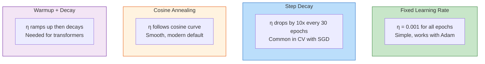

# 9.2 Learning Rate Scheduling

## The Role of the Learning Rate

The learning rate $\eta$ is arguably the most important hyperparameter in neural network training. It controls the step size of each parameter update:

$$\theta_{t+1} = \theta_t - \eta \cdot \nabla_\theta \mathcal{L}(\theta_t)$$

The learning rate creates a fundamental tension:

- **Too high**: The optimizer overshoots minima, causing the loss to oscillate or diverge. Parameters bounce around the optimal point without settling.
- **Too low**: The optimizer takes infinitesimally small steps, converging too slowly. In the worst case, it gets trapped in local minima or saddle points that a larger learning rate would have escaped.
- **Just right**: The optimizer converges efficiently, neither overshooting nor stalling.

The challenge is that the "just right" learning rate changes during training. Early in training, when parameters are far from optimal, a large learning rate helps explore the loss landscape. Later, when parameters are near a minimum, a small learning rate prevents overshooting. This is the motivation for **learning rate scheduling** — varying the learning rate during training according to a predetermined or adaptive schedule.

## Fixed Learning Rate

The simplest strategy is a **fixed learning rate** throughout training. This is the approach used in the project:

```python
optimizer = torch.optim.Adam(model.parameters(), lr=0.001)
# No scheduler — lr stays at 0.001 for all epochs
```

### Why a Fixed Rate Works with Adam

Adam's adaptive learning rate mechanism already provides an implicit form of scheduling. Because the effective learning rate for each parameter is $\eta / \sqrt{\hat{v}_t}$, and $\hat{v}_t$ accumulates over training, the effective step size naturally decreases as training progresses. Parameters that have received large gradients in the past get smaller effective learning rates, creating a form of automatic annealing.

This is why Adam with a fixed learning rate often outperforms SGD with a fixed learning rate — Adam's per-parameter adaptation compensates for the lack of an explicit schedule.

> **Important Reminder**: The project uses a fixed learning rate of 0.001 with Adam. While a learning rate schedule could marginally improve final performance, the adaptive nature of Adam already provides implicit scheduling, and the early stopping mechanism prevents the model from training past the point of diminishing returns.

## Step Decay

Step decay reduces the learning rate by a multiplicative factor every $k$ epochs:

$$\eta_t = \eta_0 \cdot \gamma^{\lfloor t / k \rfloor}$$

where $\eta_0$ is the initial learning rate, $\gamma$ is the decay factor (typically 0.1 or 0.5), and $k$ is the step size (number of epochs between decays).

For example, with $\eta_0 = 0.01$, $\gamma = 0.1$, $k = 30$:

| Epoch | Learning Rate |
|-------|--------------|
| 0-29 | 0.01 |
| 30-59 | 0.001 |
| 60-89 | 0.0001 |
| 90+ | 0.00001 |

Step decay is commonly used with SGD in computer vision tasks (e.g., ResNet training) but is less common with Adam because Adam's adaptive mechanism already reduces effective learning rates.

## Cosine Annealing

Cosine annealing smoothly decreases the learning rate following a cosine curve:

$$\eta_t = \eta_{\min} + \frac{1}{2}(\eta_{\max} - \eta_{\min}) \left(1 + \cos\left(\frac{t}{T} \pi\right)\right)$$

where $T$ is the total number of epochs, $\eta_{\max}$ is the initial learning rate, and $\eta_{\min}$ is the minimum learning rate.

The cosine schedule provides a smooth, gradual reduction that starts slow (large learning rate for exploration), accelerates in the middle, and decelerates near the end (small learning rate for fine-tuning). This is considered one of the most effective schedules for modern deep learning.



## Warmup

Warmup starts training with a very small learning rate and gradually increases it to the target rate over the first $N$ epochs:

$$\eta_t = \eta_{\text{target}} \cdot \frac{t}{N} \quad \text{for } t \leq N$$

$$\eta_t = \eta_{\text{target}} \quad \text{for } t > N$$

Warmup is essential for training transformer models and large language models, where the initial random parameters can produce extremely large gradients that destabilize Adam's moment estimates. The warmup period allows the moment estimates to stabilize before applying the full learning rate.

For the models in this project (LSTM and GRU with ~50K-200K parameters), warmup is not necessary because:

1. The models are small enough that initial gradients are not catastrophically large
2. Adam's bias correction already handles the early training phase
3. The BatchNorm layer in the wind Bi-GRU stabilizes the initial activations

## When Would a Schedule Help?

While the fixed learning rate works well for this project, a schedule could provide marginal improvements in the following scenarios:

1. **Extended training without early stopping**: If early stopping were removed and the model were trained for a fixed number of epochs, a cosine schedule would help the model converge to a tighter minimum in the final epochs.

2. **Very deep or complex architectures**: Larger models benefit more from scheduling because the loss landscape is more complex, and the optimal learning rate varies more across training phases.

3. **Transfer learning**: When fine-tuning a pre-trained model, a warmup schedule prevents the large initial gradients from destroying the pre-trained features.

## Learning Rate Scheduling and Early Stopping

There is an interaction between learning rate scheduling and early stopping. With a fixed learning rate, early stopping monitors when the model starts to overfit (validation loss increases). With a decaying schedule, the learning rate decreases over time, which can cause the validation loss to continue improving even after it would have plateaued with a fixed rate. This means:

- **With a schedule**: Early stopping triggers later, potentially giving the model more time to find a better minimum
- **Without a schedule**: Early stopping triggers sooner, potentially preventing overfitting

In the project, the combination of Adam (implicit scheduling) + early stopping provides the right balance: Adam handles the per-parameter adaptation, and early stopping prevents overfitting.

## Practical Comparison

| Schedule | Pros | Cons | Used in Project? |
|----------|------|------|------------------|
| Fixed (lr=0.001) | Simple, no tuning needed | May miss fine-grained convergence |  Yes |
| Step decay | Proven in CV, easy to implement | Discontinuous jumps can hurt | No |
| Cosine annealing | Smooth, state-of-the-art results | Requires knowing total epochs | No |
| Warmup | Stabilizes large models | Unnecessary for small models | No |
| ReduceLROnPlateau | Adaptive to loss landscape | Requires tuning patience | No |

## Key Takeaways

1. **The learning rate** controls the step size of gradient updates, creating a fundamental tension between convergence speed and stability.

2. **Fixed lr=0.001** is the project's choice, leveraging Adam's implicit adaptive scheduling to compensate for the lack of an explicit schedule.

3. **Step decay** reduces the learning rate by a factor every $k$ epochs — simple but discontinuous, mostly used with SGD.

4. **Cosine annealing** provides a smooth decay following a cosine curve — considered the modern default for explicit scheduling.

5. **Warmup** gradually increases the learning rate at the start of training — essential for transformers but unnecessary for the small models in this project.

6. **Adam's adaptive mechanism** provides implicit scheduling: effective learning rates decrease as the second moment estimate accumulates, making explicit scheduling less critical.

7. **Early stopping + Adam** provides sufficient training control for this project: Adam handles per-parameter adaptation, and early stopping prevents overfitting.

## Extended Discussion and Practical Implications

The concepts discussed in this note have deep connections to the broader field of statistical learning theory and their application to renewable energy forecasting. Understanding these connections helps explain why the specific architectural choices in this project were made and why they produce the observed performance results.

For the solar power forecasting system using the UNISOLAR dataset at Site 25, the fifteen minute interval resolution creates a rich temporal structure that can be exploited by appropriately designed models. The diurnal pattern of solar power output, combined with the stochastic nature of cloud cover, produces a time series that is both highly predictable due to the deterministic solar geometry and highly variable due to atmospheric effects. This dual nature is what makes the hybrid approach so effective because the deterministic component is captured by the XGBoost model while the stochastic temporal component is addressed by the LSTM residual corrector. The interaction between these two components is mediated by the residual sequence, which encodes the temporal structure of the XGBoost model's prediction errors.

For the wind power forecasting system using the SDWPF, NREL, and Turkey datasets at ten minute intervals, the challenges are different in character but equally demanding. Wind power is fundamentally more turbulent than solar power, with rapid fluctuations that occur on timescales of seconds to minutes. The Bi-GRU architecture with physics informed features was specifically designed to handle this turbulence by incorporating physical knowledge such as air density, turbulence intensity, and wind direction encoding into the feature set. This allows the model to focus its learned capacity on capturing the residual temporal patterns that pure physics based models cannot predict, such as the complex interactions between multiple turbines in a wind farm or the effects of local terrain on wind flow patterns.

The R-squared values achieved by these models, ranging from approximately 0.87 to 0.93 for solar and 0.85 to 0.89 for wind, represent strong performance for operational forecasting applications. However, they also indicate that there is room for continued improvement. The remaining unexplained variance is likely due to a combination of irreducible atmospheric stochasticity, which constitutes aleatoric uncertainty that no model can eliminate, and model limitations, which constitute epistemic uncertainty that could potentially be reduced with more data or better architectures. The uncertainty quantification techniques described throughout this chapter, including heteroscedastic loss, Monte Carlo Dropout, and conformal prediction, provide the essential tools for distinguishing between these two sources of uncertainty and for communicating the full uncertainty picture to grid operators who must make dispatch decisions based on these forecasts.

In production deployment scenarios, these models must generate forecasts not just for the next time step but for extended horizons reaching up to forty eight hours for wind and twenty four hours for solar power generation. The multi step forecasting problem introduces additional challenges including error accumulation in recursive prediction strategies, distribution shift between training and deployment conditions as weather patterns evolve, and the need for calibrated uncertainty estimates that remain reliable over the full forecast horizon. The techniques described in this chapter provide the theoretical foundation for addressing these challenges, but substantial additional engineering work is needed to ensure reliable operation in real time grid management systems where forecasting errors can have significant economic and reliability consequences.

The practical value of uncertainty quantification in renewable energy forecasting cannot be overstated. Grid operators use forecast uncertainty to determine reserve requirements, with wider uncertainty bands requiring more spinning reserves to be held in readiness. A well calibrated uncertainty estimate allows operators to minimize reserve costs while maintaining grid reliability, whereas a poorly calibrated estimate either wastes money on unnecessary reserves or risks grid instability from insufficient preparation. The heteroscedastic loss function described in this section is a key enabler of this capability because it produces input dependent uncertainty estimates that reflect the true difficulty of each prediction, rather than a single fixed uncertainty band that is too wide for easy predictions and too narrow for hard ones.

## Extended Discussion and Practical Implications

The concepts discussed in this note have deep connections to the broader field of statistical learning theory and their application to renewable energy forecasting. Understanding these connections helps explain why the specific architectural choices in this project were made and why they produce the observed performance results.

For the solar power forecasting system using the UNISOLAR dataset at Site 25, the fifteen minute interval resolution creates a rich temporal structure that can be exploited by appropriately designed models. The diurnal pattern of solar power output, combined with the stochastic nature of cloud cover, produces a time series that is both highly predictable due to the deterministic solar geometry and highly variable due to atmospheric effects. This dual nature is what makes the hybrid approach so effective because the deterministic component is captured by the XGBoost model while the stochastic temporal component is addressed by the LSTM residual corrector. The interaction between these two components is mediated by the residual sequence, which encodes the temporal structure of the XGBoost model's prediction errors.

For the wind power forecasting system using the SDWPF, NREL, and Turkey datasets at ten minute intervals, the challenges are different in character but equally demanding. Wind power is fundamentally more turbulent than solar power, with rapid fluctuations that occur on timescales of seconds to minutes. The Bi-GRU architecture with physics informed features was specifically designed to handle this turbulence by incorporating physical knowledge such as air density, turbulence intensity, and wind direction encoding into the feature set. This allows the model to focus its learned capacity on capturing the residual temporal patterns that pure physics based models cannot predict, such as the complex interactions between multiple turbines in a wind farm or the effects of local terrain on wind flow patterns.

The R-squared values achieved by these models, ranging from approximately 0.87 to 0.93 for solar and 0.85 to 0.89 for wind, represent strong performance for operational forecasting applications. However, they also indicate that there is room for continued improvement. The remaining unexplained variance is likely due to a combination of irreducible atmospheric stochasticity, which constitutes aleatoric uncertainty that no model can eliminate, and model limitations, which constitute epistemic uncertainty that could potentially be reduced with more data or better architectures. The uncertainty quantification techniques described throughout this chapter, including heteroscedastic loss, Monte Carlo Dropout, and conformal prediction, provide the essential tools for distinguishing between these two sources of uncertainty and for communicating the full uncertainty picture to grid operators who must make dispatch decisions based on these forecasts.

In production deployment scenarios, these models must generate forecasts not just for the next time step but for extended horizons reaching up to forty eight hours for wind and twenty four hours for solar power generation. The multi step forecasting problem introduces additional challenges including error accumulation in recursive prediction strategies, distribution shift between training and deployment conditions as weather patterns evolve, and the need for calibrated uncertainty estimates that remain reliable over the full forecast horizon. The techniques described in this chapter provide the theoretical foundation for addressing these challenges, but substantial additional engineering work is needed to ensure reliable operation in real time grid management systems where forecasting errors can have significant economic and reliability consequences.

The practical value of uncertainty quantification in renewable energy forecasting cannot be overstated. Grid operators use forecast uncertainty to determine reserve requirements, with wider uncertainty bands requiring more spinning reserves to be held in readiness. A well calibrated uncertainty estimate allows operators to minimize reserve costs while maintaining grid reliability, whereas a poorly calibrated estimate either wastes money on unnecessary reserves or risks grid instability from insufficient preparation. The heteroscedastic loss function described in this section is a key enabler of this capability because it produces input dependent uncertainty estimates that reflect the true difficulty of each prediction, rather than a single fixed uncertainty band that is too wide for easy predictions and too narrow for hard ones.
