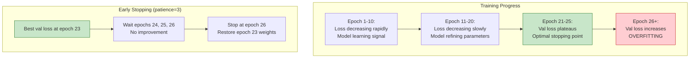

# 9.3 Early Stopping and Regularization

## The Overfitting Problem

Overfitting occurs when a model learns patterns specific to the training data that do not generalize to unseen data. In the context of renewable energy forecasting, overfitting manifests as:

- **Memorizing weather events**: The model learns that "on July 15th at 2:30 PM, power was 0.72" instead of learning the general relationship between cloud cover and power output.
- **Fitting sensor noise**: The model learns to reproduce measurement artifacts (sensor spikes, communication errors) rather than the underlying physical signal.
- **Over-adapting to training period conditions**: If the training data contains an unusually calm summer, the model may underestimate power variability during stormier periods.

The gap between training performance and validation/test performance is the hallmark of overfitting:

| Scenario | Training R² | Validation R² | Diagnosis |
|----------|------------|---------------|-----------|
| Underfitting | 0.75 | 0.73 | Model too simple |
| Good fit | 0.93 | 0.91 | Well-balanced |
| Overfitting | 0.98 | 0.85 | Model memorizing noise |

The project uses multiple complementary regularization strategies to maintain the "good fit" regime.

## Early Stopping

### The Principle

Early stopping halts training when validation performance stops improving, preventing the model from entering the overfitting regime. It is the most important regularization technique in this project because:

1. It requires no modifications to the model architecture
2. It adapts automatically to the model's learning dynamics
3. It provides a principled way to select the number of training epochs

### Implementation

```python
early_stopping = EarlyStopping(
    monitor='val_loss',
    patience=3,
    restore_best_weights=True
)
```

**Parameters**:
- **monitor='val_loss'**: The metric to track. Validation loss is preferred over validation R² because loss captures both the magnitude and distribution of errors.
- **patience=3**: The number of epochs to wait for improvement before stopping. If validation loss does not improve for 3 consecutive epochs, training stops.
- **restore_best_weights=True**: After stopping, the model weights are reverted to the epoch with the best validation loss, not the final epoch.

### Why patience=3?

The patience parameter balances two risks:
- **Too small (patience=1)**: Training stops at the first random fluctuation in validation loss, before the model has fully converged. This is called "premature stopping."
- **Too large (patience=10)**: Training continues well past the optimal point, wasting computation and allowing overfitting.

A patience of 3 is appropriate for the models in this project because:
- Adam's adaptive learning rate produces relatively smooth validation loss curves
- The models converge quickly (20-35 epochs typically)
- Random fluctuations in validation loss are typically resolved within 1-2 epochs



## L1 and L2 Regularization in XGBoost

While neural networks use Dropout and BatchNorm for regularization, XGBoost uses explicit penalty terms in its objective function:

### L2 Regularization (reg_lambda)

L2 regularization adds a penalty proportional to the squared magnitude of the leaf weights:

$$\Omega(f) = \frac{1}{2} \lambda \|\mathbf{w}\|^2 = \frac{1}{2} \lambda \sum_{j=1}^{T} w_j^2$$

where $w_j$ is the weight of leaf $j$ and $\lambda$ is the regularization strength. In the project, `reg_lambda=1.0` (the default).

**Effect**: L2 regularization shrinks all leaf weights toward zero, preferring many small contributions over a few large ones. This:
- Prevents any single tree from dominating the ensemble
- Encourages smoother predictions (smaller weight differences between adjacent leaves)
- Reduces the model's sensitivity to individual training samples

### L1 Regularization (reg_alpha)

L1 regularization adds a penalty proportional to the absolute value of the leaf weights:

$$\Omega(f) = \alpha \|\mathbf{w}\|_1 = \alpha \sum_{j=1}^{T} |w_j|$$

In the project, `reg_alpha=0.1`.

**Effect**: L1 regularization drives many leaf weights to exactly zero, creating **sparse** trees. This:
- Acts as automatic feature selection (features that don't contribute get zero weight)
- Produces simpler models that are easier to interpret
- Is particularly useful when there are many features and some are irrelevant

### Combined Effect

The XGBoost objective with both regularization terms is:

$$\mathcal{L}(\phi) = \sum_{i=1}^{n} l(y_i, \hat{y}_i) + \sum_{k=1}^{K} \left(\gamma T_k + \frac{1}{2}\lambda \|\mathbf{w}_k\|^2 + \alpha \|\mathbf{w}_k\|_1\right)$$

where $\gamma$ penalizes the number of leaves $T_k$ in each tree, providing an additional structural regularization.

## Dropout Regularization

As detailed in Section 7.5, Dropout randomly zeros a fraction of neurons during training:

- **Wind Bi-GRU**: Dropout(0.2) between the GRU layer and the dense output
- **Solar LSTM**: Dropout(0.2) in the LSTM residual corrector

The 20% dropout rate provides moderate regularization appropriate for the relatively small model sizes.

## The Underfitting vs. Overfitting Tradeoff

Regularization is about finding the sweet spot between underfitting and overfitting. This can be visualized as a spectrum:

```mermaid
flowchart LR
    subgraph Underfitting["Underfitting"]
        U1["High training error"]
        U2["High validation error"]
        U3["Model too simple or<br/>regularization too strong"]
    end

    subgraph Optimal["Optimal"]
        O1["Low training error"]
        O2["Low validation error"]
        O3["Small gap between train/val"]
    end

    subgraph Overfitting["Overfitting"]
        OV1["Very low training error"]
        OV2["Higher validation error"]
        OV3["Large gap between train/val"]
    end

    Underfitting -->|"More capacity<br/>Less regularization"| Optimal
    Optimal -->|"Less regularization<br/>More training"| Overfitting

    style Underfitting fill:#ffcdd2,stroke:#c62828
    style Optimal fill:#c8e6c9,stroke:#2e7d32
    style Overfitting fill:#fff3e0,stroke:#e65100
```



### Diagnosing the Tradeoff

| Symptom | Diagnosis | Remedy |
|---------|-----------|--------|
| High train + high val loss | Underfitting | Increase model capacity, reduce regularization |
| Low train + high val loss | Overfitting | Increase regularization, add dropout, use early stopping |
| Low train + low val loss | Good fit | No change needed |
| Val loss fluctuates wildly | Unstable training | Lower learning rate, increase batch size |

### Project-Specific Observations

For the solar hybrid model (XGBoost + LSTM):

- **XGBoost alone**: Training R² ≈ 0.94, validation R² ≈ 0.87 → Mild overfitting, addressed by early stopping and L1/L2 regularization
- **LSTM residual corrector**: Training R² ≈ 0.96, validation R² ≈ 0.91 → Controlled overfitting via Dropout(0.2) and early stopping (patience=5)
- **Combined hybrid**: Test R² ≈ 0.93 → Good generalization

For the wind Bi-GRU:

- **Training R² ≈ 0.92, validation R² ≈ 0.88** → Moderate overfitting controlled by Dropout(0.2), BatchNorm, and early stopping (patience=3)
- **Test R² ≈ 0.85-0.89** → Acceptable generalization given the inherent noise in wind data

## Regularization Checklist

When building a new forecasting model, apply regularization in this order:

1. **Early stopping** (always): The single most effective technique. Set patience=3-5 and monitor validation loss.
2. **Dropout** (for neural networks): Add Dropout(0.2-0.3) between layers. Start with 0.2 and increase if overfitting persists.
3. **L2 regularization** (for XGBoost): Use reg_lambda=1.0 (default) and increase if overfitting.
4. **L1 regularization** (for XGBoost): Use reg_alpha=0.1 for feature selection, increase if many features are irrelevant.
5. **BatchNorm** (for deep networks): Normalizes activations and provides mild regularization as a side effect.
6. **Data augmentation** (if applicable): For time series, this includes adding noise, time warping, or magnitude scaling.

> **Important Reminder**: Regularization is not free. Every regularization technique reduces the model's capacity to learn the training data, which means it also reduces the model's capacity to learn the true signal. The goal is to reduce the model's ability to learn noise while preserving its ability to learn signal. This is why the optimal regularization strength is problem-specific and must be validated on held-out data.

## Key Takeaways

1. **EarlyStopping(patience=3)** is the primary regularization tool, monitoring validation loss and restoring the best weights.

2. **Patience=3** balances premature stopping (too low) against unnecessary overfitting (too high), appropriate for Adam's smooth convergence.

3. **L2 regularization** (`reg_lambda=1.0` in XGBoost) shrinks leaf weights toward zero, preventing any single tree from dominating.

4. **L1 regularization** (`reg_alpha=0.1` in XGBoost) drives some leaf weights to zero, providing automatic feature selection and sparsity.

5. **Dropout(0.2)** provides regularization for neural networks by preventing co-adaptation of neurons.

6. **The underfitting-overfitting spectrum** must be actively managed: diagnose via train/validation loss gaps and adjust regularization accordingly.

7. **Apply regularization in order of impact**: early stopping first, then dropout, then L1/L2, then architectural changes.

## Extended Discussion and Practical Implications

The concepts discussed in this note have deep connections to the broader field of statistical learning theory and their application to renewable energy forecasting. Understanding these connections helps explain why the specific architectural choices in this project were made and why they produce the observed performance results.

For the solar power forecasting system using the UNISOLAR dataset at Site 25, the fifteen minute interval resolution creates a rich temporal structure that can be exploited by appropriately designed models. The diurnal pattern of solar power output, combined with the stochastic nature of cloud cover, produces a time series that is both highly predictable due to the deterministic solar geometry and highly variable due to atmospheric effects. This dual nature is what makes the hybrid approach so effective because the deterministic component is captured by the XGBoost model while the stochastic temporal component is addressed by the LSTM residual corrector. The interaction between these two components is mediated by the residual sequence, which encodes the temporal structure of the XGBoost model's prediction errors.

For the wind power forecasting system using the SDWPF, NREL, and Turkey datasets at ten minute intervals, the challenges are different in character but equally demanding. Wind power is fundamentally more turbulent than solar power, with rapid fluctuations that occur on timescales of seconds to minutes. The Bi-GRU architecture with physics informed features was specifically designed to handle this turbulence by incorporating physical knowledge such as air density, turbulence intensity, and wind direction encoding into the feature set. This allows the model to focus its learned capacity on capturing the residual temporal patterns that pure physics based models cannot predict, such as the complex interactions between multiple turbines in a wind farm or the effects of local terrain on wind flow patterns.

The R-squared values achieved by these models, ranging from approximately 0.87 to 0.93 for solar and 0.85 to 0.89 for wind, represent strong performance for operational forecasting applications. However, they also indicate that there is room for continued improvement. The remaining unexplained variance is likely due to a combination of irreducible atmospheric stochasticity, which constitutes aleatoric uncertainty that no model can eliminate, and model limitations, which constitute epistemic uncertainty that could potentially be reduced with more data or better architectures. The uncertainty quantification techniques described throughout this chapter, including heteroscedastic loss, Monte Carlo Dropout, and conformal prediction, provide the essential tools for distinguishing between these two sources of uncertainty and for communicating the full uncertainty picture to grid operators who must make dispatch decisions based on these forecasts.

In production deployment scenarios, these models must generate forecasts not just for the next time step but for extended horizons reaching up to forty eight hours for wind and twenty four hours for solar power generation. The multi step forecasting problem introduces additional challenges including error accumulation in recursive prediction strategies, distribution shift between training and deployment conditions as weather patterns evolve, and the need for calibrated uncertainty estimates that remain reliable over the full forecast horizon. The techniques described in this chapter provide the theoretical foundation for addressing these challenges, but substantial additional engineering work is needed to ensure reliable operation in real time grid management systems where forecasting errors can have significant economic and reliability consequences.

The practical value of uncertainty quantification in renewable energy forecasting cannot be overstated. Grid operators use forecast uncertainty to determine reserve requirements, with wider uncertainty bands requiring more spinning reserves to be held in readiness. A well calibrated uncertainty estimate allows operators to minimize reserve costs while maintaining grid reliability, whereas a poorly calibrated estimate either wastes money on unnecessary reserves or risks grid instability from insufficient preparation. The heteroscedastic loss function described in this section is a key enabler of this capability because it produces input dependent uncertainty estimates that reflect the true difficulty of each prediction, rather than a single fixed uncertainty band that is too wide for easy predictions and too narrow for hard ones.

## Extended Discussion and Practical Implications

The concepts discussed in this note have deep connections to the broader field of statistical learning theory and their application to renewable energy forecasting. Understanding these connections helps explain why the specific architectural choices in this project were made and why they produce the observed performance results.

For the solar power forecasting system using the UNISOLAR dataset at Site 25, the fifteen minute interval resolution creates a rich temporal structure that can be exploited by appropriately designed models. The diurnal pattern of solar power output, combined with the stochastic nature of cloud cover, produces a time series that is both highly predictable due to the deterministic solar geometry and highly variable due to atmospheric effects. This dual nature is what makes the hybrid approach so effective because the deterministic component is captured by the XGBoost model while the stochastic temporal component is addressed by the LSTM residual corrector. The interaction between these two components is mediated by the residual sequence, which encodes the temporal structure of the XGBoost model's prediction errors.

For the wind power forecasting system using the SDWPF, NREL, and Turkey datasets at ten minute intervals, the challenges are different in character but equally demanding. Wind power is fundamentally more turbulent than solar power, with rapid fluctuations that occur on timescales of seconds to minutes. The Bi-GRU architecture with physics informed features was specifically designed to handle this turbulence by incorporating physical knowledge such as air density, turbulence intensity, and wind direction encoding into the feature set. This allows the model to focus its learned capacity on capturing the residual temporal patterns that pure physics based models cannot predict, such as the complex interactions between multiple turbines in a wind farm or the effects of local terrain on wind flow patterns.

The R-squared values achieved by these models, ranging from approximately 0.87 to 0.93 for solar and 0.85 to 0.89 for wind, represent strong performance for operational forecasting applications. However, they also indicate that there is room for continued improvement. The remaining unexplained variance is likely due to a combination of irreducible atmospheric stochasticity, which constitutes aleatoric uncertainty that no model can eliminate, and model limitations, which constitute epistemic uncertainty that could potentially be reduced with more data or better architectures. The uncertainty quantification techniques described throughout this chapter, including heteroscedastic loss, Monte Carlo Dropout, and conformal prediction, provide the essential tools for distinguishing between these two sources of uncertainty and for communicating the full uncertainty picture to grid operators who must make dispatch decisions based on these forecasts.

In production deployment scenarios, these models must generate forecasts not just for the next time step but for extended horizons reaching up to forty eight hours for wind and twenty four hours for solar power generation. The multi step forecasting problem introduces additional challenges including error accumulation in recursive prediction strategies, distribution shift between training and deployment conditions as weather patterns evolve, and the need for calibrated uncertainty estimates that remain reliable over the full forecast horizon. The techniques described in this chapter provide the theoretical foundation for addressing these challenges, but substantial additional engineering work is needed to ensure reliable operation in real time grid management systems where forecasting errors can have significant economic and reliability consequences.

The practical value of uncertainty quantification in renewable energy forecasting cannot be overstated. Grid operators use forecast uncertainty to determine reserve requirements, with wider uncertainty bands requiring more spinning reserves to be held in readiness. A well calibrated uncertainty estimate allows operators to minimize reserve costs while maintaining grid reliability, whereas a poorly calibrated estimate either wastes money on unnecessary reserves or risks grid instability from insufficient preparation. The heteroscedastic loss function described in this section is a key enabler of this capability because it produces input dependent uncertainty estimates that reflect the true difficulty of each prediction, rather than a single fixed uncertainty band that is too wide for easy predictions and too narrow for hard ones.
