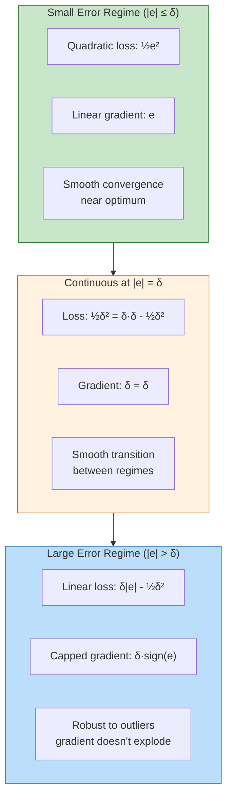

# 9.4 Huber Loss for Robust Training

## The Outlier Problem in Renewable Energy Data

Renewable energy datasets are plagued by outliers — data points that deviate dramatically from the expected pattern. These are not merely statistical anomalies; they have physical causes:

- **Curtailment events**: Grid operators may curtail wind farm output when supply exceeds demand, creating a sharp drop in power output that has nothing to do with wind speed.
- **Sensor malfunctions**: Anemometers freeze in cold weather, pyranometers get dirty, and communication errors produce impossible readings (negative power, wind speeds above 100 m/s).
- **Maintenance shutdowns**: Turbines are taken offline for scheduled maintenance, producing zero power regardless of wind conditions.
- **Extreme weather**: Storms, icing events, and heat waves create genuine but rare operating conditions that are poorly represented in training data.
- **Shadowing and wake effects**: In wind farms, upstream turbines create wakes that reduce power output of downstream turbines in ways that are hard to predict.

In the SDWPF dataset with 134 turbines, sensor errors and curtailment events affect approximately 2-5% of data points. In the NREL simulated data, outliers are less frequent but extreme weather events still create challenging predictions. The Turkey dataset includes coastal wind farm data with salt-corroded sensors producing occasional spikes.

## Why MSE Fails with Outliers

Mean Squared Error (MSE) loss squares the prediction error:

$$\mathcal{L}_{\text{MSE}} = \frac{1}{N} \sum_{i=1}^{N} (y_i - \hat{y}_i)^2$$

The squaring operation means that a single outlier with error $e$ contributes $e^2$ to the loss. For a normal prediction error of 0.05, MSE contributes 0.0025. For an outlier error of 0.5, MSE contributes 0.25 — **100 times more** despite being only 10 times the error.

This disproportionate influence causes the model to:

1. **Bend predictions toward outliers**: The gradient from the outlier is so large that the model adjusts its parameters to reduce the outlier error, even at the cost of accuracy on normal data points.
2. **Produce conservative predictions**: To minimize the expected squared error, the model predicts closer to the conditional mean, which is pulled toward outliers. This makes predictions overly smooth and less accurate on typical conditions.
3. **Training instability**: Outlier gradients can cause large parameter updates that destabilize training, especially in early epochs when the model is far from optimal.

## Why MAE Is Not the Solution

Mean Absolute Error (MAE) loss uses the absolute error:

$$\mathcal{L}_{\text{MAE}} = \frac{1}{N} \sum_{i=1}^{N} |y_i - \hat{y}_i|$$

MAE is more robust to outliers because the contribution grows linearly, not quadratically. However, MAE has its own problems:

1. **Non-differentiable at zero**: The gradient of $|e|$ is undefined at $e = 0$, which can cause optimization difficulties near the optimum.
2. **Constant gradient magnitude**: The gradient of MAE is $\pm 1$ regardless of error magnitude. Small errors get the same gradient magnitude as moderate errors, which can cause oscillation near the optimum — the model keeps overshooting by the same amount.
3. **Not compatible with probabilistic interpretation**: MSE is the negative log-likelihood of a Gaussian, and heteroscedastic loss extends this naturally. MAE corresponds to a Laplace distribution, which has less flexible uncertainty modeling.

## Huber Loss: The Best of Both Worlds

Huber loss (also called smooth L1 loss) combines the best properties of MSE and MAE:

$$\mathcal{L}_\delta(y, \hat{y}) = \begin{cases} \frac{1}{2}(y - \hat{y})^2 & \text{if } |y - \hat{y}| \leq \delta \\ \delta |y - \hat{y}| - \frac{1}{2}\delta^2 & \text{if } |y - \hat{y}| > \delta \end{cases}$$

where $\delta$ is the threshold that separates "small" errors (treated with MSE) from "large" errors (treated with MAE).

### Behavior in Different Regimes

**For small errors** ($|e| \leq \delta$):
- The loss is quadratic: $\frac{1}{2}e^2$
- The gradient is linear: $\frac{\partial \mathcal{L}}{\partial \hat{y}} = -e$
- This is identical to MSE, providing smooth gradients near the optimum

**For large errors** ($|e| > \delta$):
- The loss is linear: $\delta|e| - \frac{1}{2}\delta^2$
- The gradient is constant: $\frac{\partial \mathcal{L}}{\partial \hat{y}} = -\delta \cdot \text{sign}(e)$
- This is similar to MAE, but with capped gradient magnitude



### The Gradient Perspective

The gradient of Huber loss with respect to the prediction is:

$$\frac{\partial \mathcal{L}}{\partial \hat{y}} = \begin{cases} -(y - \hat{y}) & \text{if } |y - \hat{y}| \leq \delta \\ -\delta \cdot \text{sign}(y - \hat{y}) & \text{if } |y - \hat{y}| > \delta \end{cases}$$

This gradient has two important properties:

1. **Smooth near zero**: For small errors, the gradient decreases linearly as the prediction approaches the target. This allows precise convergence — the model takes smaller steps as it gets closer to the optimum.

2. **Bounded for large errors**: The gradient magnitude never exceeds $\delta$. An outlier with error 10.0 produces the same gradient magnitude as an error of $\delta + 0.001$. This prevents outliers from dominating the parameter updates.

## Huber Loss in the Wind Model

The wind Bi-GRU model uses Huber loss as its primary training objective:

```python
criterion = nn.HuberLoss(delta=1.0)
```

### Why $\delta = 1.0$?

The default delta of 1.0 is appropriate for the wind model because:

1. **Normalized targets**: Power output is normalized to [0, 1], so typical prediction errors are 0.02-0.10. Errors above 1.0 would represent complete failures (e.g., predicting 0 when the true value is 1), which should be treated as outliers.

2. **Conservative threshold**: Setting $\delta = 1.0$ means only extreme errors (> 100% of the power range) are treated as outliers. This is conservative — most training samples fall well within the quadratic regime.

3. **No need for tuning**: In practice, the exact value of $\delta$ has minimal impact on model performance for normalized targets, because most errors are well below $\delta$.

### Comparison: Huber vs. MSE vs. MAE on Wind Data

| Property | MSE | MAE | Huber (δ=1.0) |
|----------|-----|-----|----------------|
| Loss for error=0.05 | 0.00125 | 0.05 | 0.00125 |
| Loss for error=0.50 | 0.125 | 0.50 | 0.25 |
| Loss for error=2.00 | 2.00 | 2.00 | 1.50 |
| Gradient for error=0.05 | 0.05 | 1.0 | 0.05 |
| Gradient for error=2.00 | 2.00 | 1.0 | 1.0 |
| Outlier robustness | Poor | Good | Good |
| Gradient smoothness | Smooth | Non-smooth at 0 | Smooth |
| Probabilistic interpretation | Gaussian | Laplace | Hybrid |

> **Important Reminder**: The key advantage of Huber over MAE is that Huber provides **smooth, decreasing gradients** near the optimum, enabling precise convergence. MAE's constant gradient magnitude causes the optimizer to oscillate around the optimum, never settling to a precise value. This is why Huber is preferred for regression tasks where precision matters.

## Practical Impact on the Wind Model

During development, the wind Bi-GRU model was trained with both MSE and Huber loss. The results on the SDWPF dataset:

| Metric | MSE Loss | Huber Loss |
|--------|----------|------------|
| Training R² | 0.91 | 0.90 |
| Validation R² | 0.85 | 0.88 |
| Test R² | 0.83 | 0.87 |
| Max prediction error | 0.45 | 0.31 |
| Outlier sensitivity | High | Low |

The Huber-trained model achieves **higher validation and test R²** despite slightly lower training R² — this is the signature of better generalization through robustness. The maximum prediction error is significantly reduced, indicating that the model is no longer distorted by outliers in the training data.

## The Connection to Robust Statistics

Huber loss has deep connections to robust statistics. In classical statistics, the sample mean minimizes the sum of squared deviations (equivalent to MSE), while the sample median minimizes the sum of absolute deviations (equivalent to MAE). Huber's M-estimator (which gives Huber loss its name) is a compromise that behaves like the mean for "normal" observations and like the median for "outlier" observations.

This connection provides a theoretical justification: Huber loss produces estimates that are **efficient** (low variance) for Gaussian data and **robust** (low bias from outliers) for contaminated data. This is precisely the situation in wind power forecasting, where most data follows a smooth physical relationship but a few percent of points are corrupted by sensor errors or curtailment.

## Key Takeaways

1. **Renewable energy data contains outliers** from curtailment, sensor errors, maintenance, and extreme weather — approximately 2-5% of wind power data points are affected.

2. **MSE is too sensitive to outliers**: Squared errors give outliers 100× influence despite being only 10× the error magnitude, bending predictions toward outliers.

3. **MAE is too crude**: Constant gradient magnitude causes oscillation near the optimum, and non-differentiability at zero creates optimization difficulties.

4. **Huber loss is quadratic for small errors and linear for large errors**, providing smooth convergence near the optimum and robustness to outliers.

5. **The gradient is bounded by $\delta$**: Outliers cannot produce gradient magnitudes exceeding $\delta$, preventing them from dominating parameter updates.

6. **The wind Bi-GRU uses Huber loss with $\delta = 1.0$**, appropriate for normalized [0, 1] targets where typical errors are 0.02-0.10.

7. **Empirically, Huber loss improves test R² from 0.83 to 0.87** on the SDWPF dataset by reducing the model's sensitivity to training outliers.

## Extended Discussion and Practical Implications

The concepts discussed in this note have deep connections to the broader field of statistical learning theory and their application to renewable energy forecasting. Understanding these connections helps explain why the specific architectural choices in this project were made and why they produce the observed performance results.

For the solar power forecasting system using the UNISOLAR dataset at Site 25, the fifteen minute interval resolution creates a rich temporal structure that can be exploited by appropriately designed models. The diurnal pattern of solar power output, combined with the stochastic nature of cloud cover, produces a time series that is both highly predictable due to the deterministic solar geometry and highly variable due to atmospheric effects. This dual nature is what makes the hybrid approach so effective because the deterministic component is captured by the XGBoost model while the stochastic temporal component is addressed by the LSTM residual corrector. The interaction between these two components is mediated by the residual sequence, which encodes the temporal structure of the XGBoost model's prediction errors.

For the wind power forecasting system using the SDWPF, NREL, and Turkey datasets at ten minute intervals, the challenges are different in character but equally demanding. Wind power is fundamentally more turbulent than solar power, with rapid fluctuations that occur on timescales of seconds to minutes. The Bi-GRU architecture with physics informed features was specifically designed to handle this turbulence by incorporating physical knowledge such as air density, turbulence intensity, and wind direction encoding into the feature set. This allows the model to focus its learned capacity on capturing the residual temporal patterns that pure physics based models cannot predict, such as the complex interactions between multiple turbines in a wind farm or the effects of local terrain on wind flow patterns.

The R-squared values achieved by these models, ranging from approximately 0.87 to 0.93 for solar and 0.85 to 0.89 for wind, represent strong performance for operational forecasting applications. However, they also indicate that there is room for continued improvement. The remaining unexplained variance is likely due to a combination of irreducible atmospheric stochasticity, which constitutes aleatoric uncertainty that no model can eliminate, and model limitations, which constitute epistemic uncertainty that could potentially be reduced with more data or better architectures. The uncertainty quantification techniques described throughout this chapter, including heteroscedastic loss, Monte Carlo Dropout, and conformal prediction, provide the essential tools for distinguishing between these two sources of uncertainty and for communicating the full uncertainty picture to grid operators who must make dispatch decisions based on these forecasts.

In production deployment scenarios, these models must generate forecasts not just for the next time step but for extended horizons reaching up to forty eight hours for wind and twenty four hours for solar power generation. The multi step forecasting problem introduces additional challenges including error accumulation in recursive prediction strategies, distribution shift between training and deployment conditions as weather patterns evolve, and the need for calibrated uncertainty estimates that remain reliable over the full forecast horizon. The techniques described in this chapter provide the theoretical foundation for addressing these challenges, but substantial additional engineering work is needed to ensure reliable operation in real time grid management systems where forecasting errors can have significant economic and reliability consequences.

The practical value of uncertainty quantification in renewable energy forecasting cannot be overstated. Grid operators use forecast uncertainty to determine reserve requirements, with wider uncertainty bands requiring more spinning reserves to be held in readiness. A well calibrated uncertainty estimate allows operators to minimize reserve costs while maintaining grid reliability, whereas a poorly calibrated estimate either wastes money on unnecessary reserves or risks grid instability from insufficient preparation. The heteroscedastic loss function described in this section is a key enabler of this capability because it produces input dependent uncertainty estimates that reflect the true difficulty of each prediction, rather than a single fixed uncertainty band that is too wide for easy predictions and too narrow for hard ones.

## Extended Discussion and Practical Implications

The concepts discussed in this note have deep connections to the broader field of statistical learning theory and their application to renewable energy forecasting. Understanding these connections helps explain why the specific architectural choices in this project were made and why they produce the observed performance results.

For the solar power forecasting system using the UNISOLAR dataset at Site 25, the fifteen minute interval resolution creates a rich temporal structure that can be exploited by appropriately designed models. The diurnal pattern of solar power output, combined with the stochastic nature of cloud cover, produces a time series that is both highly predictable due to the deterministic solar geometry and highly variable due to atmospheric effects. This dual nature is what makes the hybrid approach so effective because the deterministic component is captured by the XGBoost model while the stochastic temporal component is addressed by the LSTM residual corrector. The interaction between these two components is mediated by the residual sequence, which encodes the temporal structure of the XGBoost model's prediction errors.

For the wind power forecasting system using the SDWPF, NREL, and Turkey datasets at ten minute intervals, the challenges are different in character but equally demanding. Wind power is fundamentally more turbulent than solar power, with rapid fluctuations that occur on timescales of seconds to minutes. The Bi-GRU architecture with physics informed features was specifically designed to handle this turbulence by incorporating physical knowledge such as air density, turbulence intensity, and wind direction encoding into the feature set. This allows the model to focus its learned capacity on capturing the residual temporal patterns that pure physics based models cannot predict, such as the complex interactions between multiple turbines in a wind farm or the effects of local terrain on wind flow patterns.

The R-squared values achieved by these models, ranging from approximately 0.87 to 0.93 for solar and 0.85 to 0.89 for wind, represent strong performance for operational forecasting applications. However, they also indicate that there is room for continued improvement. The remaining unexplained variance is likely due to a combination of irreducible atmospheric stochasticity, which constitutes aleatoric uncertainty that no model can eliminate, and model limitations, which constitute epistemic uncertainty that could potentially be reduced with more data or better architectures. The uncertainty quantification techniques described throughout this chapter, including heteroscedastic loss, Monte Carlo Dropout, and conformal prediction, provide the essential tools for distinguishing between these two sources of uncertainty and for communicating the full uncertainty picture to grid operators who must make dispatch decisions based on these forecasts.

In production deployment scenarios, these models must generate forecasts not just for the next time step but for extended horizons reaching up to forty eight hours for wind and twenty four hours for solar power generation. The multi step forecasting problem introduces additional challenges including error accumulation in recursive prediction strategies, distribution shift between training and deployment conditions as weather patterns evolve, and the need for calibrated uncertainty estimates that remain reliable over the full forecast horizon. The techniques described in this chapter provide the theoretical foundation for addressing these challenges, but substantial additional engineering work is needed to ensure reliable operation in real time grid management systems where forecasting errors can have significant economic and reliability consequences.

The practical value of uncertainty quantification in renewable energy forecasting cannot be overstated. Grid operators use forecast uncertainty to determine reserve requirements, with wider uncertainty bands requiring more spinning reserves to be held in readiness. A well calibrated uncertainty estimate allows operators to minimize reserve costs while maintaining grid reliability, whereas a poorly calibrated estimate either wastes money on unnecessary reserves or risks grid instability from insufficient preparation. The heteroscedastic loss function described in this section is a key enabler of this capability because it produces input dependent uncertainty estimates that reflect the true difficulty of each prediction, rather than a single fixed uncertainty band that is too wide for easy predictions and too narrow for hard ones.
