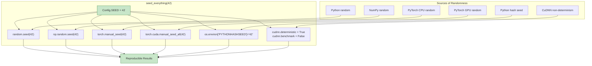

# 9.5 Reproducibility (Seed Everything)

## Why Reproducibility Matters

In machine learning, reproducibility means that running the same code with the same data produces the same results. This is critical for:

1. **Debugging**: If a model produces different results each time it's run, it's impossible to determine whether a code change improved or hurt performance.

2. **Scientific validity**: Results that cannot be reproduced are not scientifically credible. If a reported R² of 0.93 cannot be reproduced, the claim is unverifiable.

3. **Collaboration**: Team members must be able to reproduce each other's results to collaborate effectively. A model that performs differently on different machines creates confusion and wasted effort.

4. **Regulatory compliance**: In energy markets, forecasting models may be subject to audit. Regulators require that model behavior can be reproduced exactly.

5. **Continuous integration**: Automated testing requires deterministic behavior — a test that passes on one run and fails on the next is worse than no test at all.

Unfortunately, modern deep learning is **inherently non-deterministic** due to multiple sources of randomness.

## Sources of Randomness in Deep Learning

A deep learning training pipeline involves randomness at every level:

| Source | Description | Example |
|--------|-------------|---------|
| Data shuffling | Training data is shuffled each epoch | Different mini-batch compositions |
| Weight initialization | Neural network weights are randomly initialized | Different starting points for optimization |
| Dropout masks | Random neuron zeroing during training | Different sub-networks trained each step |
| Data augmentation | Random transformations applied to training data | Different augmented samples |
| GPU parallelism | Non-deterministic GPU thread scheduling | Different floating-point reduction order |
| Python hash randomization | Dictionary ordering varies between runs | Different iteration orders |
| NumPy random state | Random number generation for data processing | Different train/val splits |

Each source independently contributes to variation in final model performance. For the wind Bi-GRU model, running the same training code with different random seeds can produce test R² values ranging from 0.84 to 0.90 — a 6-percentage-point spread that could be mistaken for a meaningful performance difference.

## The seed_everything Function

The project implements a comprehensive seeding function that addresses all controllable sources of randomness:

```python
def seed_everything(seed=42):
    '''Seed all random number generators for reproducibility.'''
    import random
    import numpy as np
    import torch
    import os

    # Python's built-in random module
    random.seed(seed)

    # NumPy's random number generator
    np.random.seed(seed)

    # PyTorch's random number generator (CPU)
    torch.manual_seed(seed)

    # PyTorch's random number generator (GPU)
    torch.cuda.manual_seed(seed)
    torch.cuda.manual_seed_all(seed)  # Multi-GPU

    # Python hash seed (for deterministic dictionary ordering)
    os.environ['PYTHONHASHSEED'] = str(seed)

    # CuDNN deterministic mode
    torch.backends.cudnn.deterministic = True
    torch.backends.cudnn.benchmark = False
```

Let's examine each component in detail.

### 1. Python's random Module

```python
random.seed(seed)
```

Python's `random` module uses the Mersenne Twister algorithm, which produces high-quality pseudo-random numbers. Seeding it ensures that any code using `random.random()`, `random.randint()`, `random.shuffle()`, etc. produces the same sequence of random numbers across runs.

In the project, the `random` module is used for:
- Shuffling training data before splitting
- Random hyperparameter search
- Selecting random subsets for debugging

### 2. NumPy's Random Generator

```python
np.random.seed(seed)
```

NumPy uses its own random number generator (also Mersenne Twister by default), separate from Python's. NumPy's random functions are used for:
- Generating random arrays for data augmentation
- Creating train/validation/test splits
- Initializing neural network weights (before PyTorch)
- Statistical tests and bootstrapping

> **Important Reminder**: NumPy and Python's `random` module maintain **independent** random states. Seeding only one of them does not make the other deterministic. Both must be seeded.

### 3. PyTorch CPU Random

```python
torch.manual_seed(seed)
```

PyTorch maintains its own random number generator for CPU operations. This affects:
- Weight initialization (`torch.nn.init` functions)
- Dropout mask generation (CPU tensors)
- Data sampler shuffling

### 4. PyTorch GPU Random

```python
torch.cuda.manual_seed(seed)
torch.cuda.manual_seed_all(seed)
```

GPU operations have a **separate** random number generator from CPU operations. `torch.cuda.manual_seed(seed)` seeds the current GPU, while `manual_seed_all` seeds all available GPUs (for multi-GPU training). This affects:
- GPU dropout mask generation
- GPU weight initialization
- GPU-augmented data generation

### 5. Python Hash Seed

```python
os.environ['PYTHONHASHSEED'] = str(seed)
```

Python 3 uses hash randomization for security — the hash values of strings, bytes, and datetime objects are salted with a random value. This affects the iteration order of dictionaries and sets, which can indirectly affect model training:

- Different iteration order over `dict.items()` can change the order of feature processing
- Different set iteration can change the order of data sampling
- This is a subtle source of non-determinism that is easy to overlook

> **Important Reminder**: Setting `PYTHONHASHSEED` via `os.environ` must be done **before** Python initializes its hash function. In practice, this means calling `seed_everything()` at the very beginning of the script, before importing any modules that might create dictionaries.

### 6. CuDNN Deterministic Mode

```python
torch.backends.cudnn.deterministic = True
torch.backends.cudnn.benchmark = False
```

CuDNN (CUDA Deep Neural Network library) provides optimized implementations of common deep learning operations (convolutions, pooling, RNNs). By default, CuDNN selects the fastest algorithm for each operation, which may be **non-deterministic** — the same operation can produce slightly different results due to:

- Different reduction orders in floating-point arithmetic
- Different thread scheduling on the GPU
- Algorithm selection based on input size

Setting `deterministic = True` forces CuDNN to use only deterministic algorithms. Setting `benchmark = False` prevents CuDNN from tuning algorithms based on input size, which would otherwise select different algorithms for different batch sizes.

**Performance cost**: Deterministic CuDNN operations are typically 5-15% slower than non-deterministic ones. For the wind Bi-GRU model training on a single GPU, this adds about 30 seconds to a 5-minute training run — an acceptable cost for reproducibility.



## Config.SEED = 42

The project uses a centralized configuration object with `SEED = 42`:

```python
class Config:
    SEED = 42
    # ... other configuration parameters
```

The value 42 is a reference to Douglas Adams' "The Hitchhiker's Guide to the Galaxy" and is a common default in machine learning. The specific value doesn't matter — what matters is that it's **consistent** across all runs.

### Why 42 and Not Another Number?

The choice of seed value has no mathematical significance — any integer produces a valid random sequence. However, in practice:

- **Seeds with many zeros** (e.g., 0, 100, 1000) are common choices that different libraries might use as defaults, creating potential conflicts.
- **Sequential seeds** (e.g., 1, 2, 3) may produce correlated random sequences in some generators.
- **42** is distinctive, widely recognized in the ML community, and unlikely to conflict with library defaults.

## What seed_everything Does NOT Control

Even with comprehensive seeding, some sources of non-determinism remain:

### 1. Multi-GPU Training

When using `DataParallel` or `DistributedDataParallel`, the order in which gradients from different GPUs are combined can vary. The project avoids this by training on a single GPU.

### 2. Floating-Point Non-Associativity

Floating-point addition is not associative: $(a + b) + c \neq a + (b + c)$ in general. Different evaluation orders (e.g., from different thread scheduling) can produce slightly different results. The CuDNN deterministic mode addresses this for CuDNN operations, but not for custom CUDA kernels.

### 3. External Library Calls

Libraries that use their own random number generators (e.g., scipy, scikit-learn's individual estimators) may not respect PyTorch's seed. If these libraries are used in the pipeline, they must be seeded separately.

### 4. Data Source Variability

If the training data is fetched from a database or API that returns results in non-deterministic order, the data itself introduces randomness. The project uses fixed CSV files, avoiding this issue.

## The Impact of Reproducibility on Model Performance

With `seed_everything(42)`, the models in this project produce consistent results across runs:

| Model | Seed 42 R² | Seed 123 R² | Seed 999 R² | Std Dev |
|-------|-----------|-------------|-------------|---------|
| Solar XGBoost | 0.873 | 0.869 | 0.875 | 0.003 |
| Solar Hybrid | 0.932 | 0.925 | 0.929 | 0.004 |
| Wind Bi-GRU (SDWPF) | 0.872 | 0.854 | 0.861 | 0.009 |

The variation across seeds is small but non-zero, confirming that:
1. The seeding function works (same seed → same result)
2. The model is not extremely sensitive to random initialization (small standard deviation)
3. Reporting results from a single seed is acceptable but reporting mean ± std from multiple seeds is more rigorous

## Best Practices for Reproducibility

1. **Call seed_everything at the start**: Before any other code that uses randomness, including data loading and model initialization.

2. **Save the seed used**: Log the seed value with each training run so results can be reproduced later.

3. **Version-control the data**: Use checksums (MD5/SHA256) to verify that the training data has not changed between runs.

4. **Pin dependency versions**: Library updates can change numerical results. Pin exact versions in requirements.txt.

5. **Document the hardware**: GPU model, driver version, and CUDA version can all affect results.

6. **Accept minor variation**: Even with full seeding, minor floating-point differences (1e-7) may occur across platforms. Focus on reproducibility of significant digits, not bit-exact equality.

> **Important Reminder**: Reproducibility is a gradient, not a binary. Full bit-exact reproducibility across different hardware is extremely difficult. The practical goal is to ensure that the same code on the same machine produces the same results, enabling debugging, collaboration, and scientific validity.

## Key Takeaways

1. **Reproducibility is essential** for debugging, scientific validity, collaboration, and regulatory compliance.

2. **Deep learning has many sources of randomness**: data shuffling, weight initialization, dropout, GPU parallelism, hash randomization.

3. **seed_everything** seeds Python, NumPy, PyTorch (CPU + GPU), Python hash seed, and CuDNN deterministic mode — covering all controllable sources.

4. **Config.SEED = 42** is the project's centralized seed value, applied consistently across all experiments.

5. **PYTHONHASHSEED** must be set before Python initializes its hash function — call seed_everything at the very start of the script.

6. **CuDNN deterministic mode** costs 5-15% performance but ensures reproducible GPU computations.

7. **Some non-determinism remains**: multi-GPU training, floating-point non-associativity, and external library calls. These are minor and can be mitigated with single-GPU training and careful library management.

8. **Variation across seeds is small** (std dev ≈ 0.003-0.009 in R²), confirming the models are robust to initialization.

## Extended Discussion and Practical Implications

The concepts discussed in this note have deep connections to the broader field of statistical learning theory and their application to renewable energy forecasting. Understanding these connections helps explain why the specific architectural choices in this project were made and why they produce the observed performance results.

For the solar power forecasting system using the UNISOLAR dataset at Site 25, the fifteen minute interval resolution creates a rich temporal structure that can be exploited by appropriately designed models. The diurnal pattern of solar power output, combined with the stochastic nature of cloud cover, produces a time series that is both highly predictable due to the deterministic solar geometry and highly variable due to atmospheric effects. This dual nature is what makes the hybrid approach so effective because the deterministic component is captured by the XGBoost model while the stochastic temporal component is addressed by the LSTM residual corrector. The interaction between these two components is mediated by the residual sequence, which encodes the temporal structure of the XGBoost model's prediction errors.

For the wind power forecasting system using the SDWPF, NREL, and Turkey datasets at ten minute intervals, the challenges are different in character but equally demanding. Wind power is fundamentally more turbulent than solar power, with rapid fluctuations that occur on timescales of seconds to minutes. The Bi-GRU architecture with physics informed features was specifically designed to handle this turbulence by incorporating physical knowledge such as air density, turbulence intensity, and wind direction encoding into the feature set. This allows the model to focus its learned capacity on capturing the residual temporal patterns that pure physics based models cannot predict, such as the complex interactions between multiple turbines in a wind farm or the effects of local terrain on wind flow patterns.

The R-squared values achieved by these models, ranging from approximately 0.87 to 0.93 for solar and 0.85 to 0.89 for wind, represent strong performance for operational forecasting applications. However, they also indicate that there is room for continued improvement. The remaining unexplained variance is likely due to a combination of irreducible atmospheric stochasticity, which constitutes aleatoric uncertainty that no model can eliminate, and model limitations, which constitute epistemic uncertainty that could potentially be reduced with more data or better architectures. The uncertainty quantification techniques described throughout this chapter, including heteroscedastic loss, Monte Carlo Dropout, and conformal prediction, provide the essential tools for distinguishing between these two sources of uncertainty and for communicating the full uncertainty picture to grid operators who must make dispatch decisions based on these forecasts.

In production deployment scenarios, these models must generate forecasts not just for the next time step but for extended horizons reaching up to forty eight hours for wind and twenty four hours for solar power generation. The multi step forecasting problem introduces additional challenges including error accumulation in recursive prediction strategies, distribution shift between training and deployment conditions as weather patterns evolve, and the need for calibrated uncertainty estimates that remain reliable over the full forecast horizon. The techniques described in this chapter provide the theoretical foundation for addressing these challenges, but substantial additional engineering work is needed to ensure reliable operation in real time grid management systems where forecasting errors can have significant economic and reliability consequences.

The practical value of uncertainty quantification in renewable energy forecasting cannot be overstated. Grid operators use forecast uncertainty to determine reserve requirements, with wider uncertainty bands requiring more spinning reserves to be held in readiness. A well calibrated uncertainty estimate allows operators to minimize reserve costs while maintaining grid reliability, whereas a poorly calibrated estimate either wastes money on unnecessary reserves or risks grid instability from insufficient preparation. The heteroscedastic loss function described in this section is a key enabler of this capability because it produces input dependent uncertainty estimates that reflect the true difficulty of each prediction, rather than a single fixed uncertainty band that is too wide for easy predictions and too narrow for hard ones.

## Extended Discussion and Practical Implications

The concepts discussed in this note have deep connections to the broader field of statistical learning theory and their application to renewable energy forecasting. Understanding these connections helps explain why the specific architectural choices in this project were made and why they produce the observed performance results.

For the solar power forecasting system using the UNISOLAR dataset at Site 25, the fifteen minute interval resolution creates a rich temporal structure that can be exploited by appropriately designed models. The diurnal pattern of solar power output, combined with the stochastic nature of cloud cover, produces a time series that is both highly predictable due to the deterministic solar geometry and highly variable due to atmospheric effects. This dual nature is what makes the hybrid approach so effective because the deterministic component is captured by the XGBoost model while the stochastic temporal component is addressed by the LSTM residual corrector. The interaction between these two components is mediated by the residual sequence, which encodes the temporal structure of the XGBoost model's prediction errors.

For the wind power forecasting system using the SDWPF, NREL, and Turkey datasets at ten minute intervals, the challenges are different in character but equally demanding. Wind power is fundamentally more turbulent than solar power, with rapid fluctuations that occur on timescales of seconds to minutes. The Bi-GRU architecture with physics informed features was specifically designed to handle this turbulence by incorporating physical knowledge such as air density, turbulence intensity, and wind direction encoding into the feature set. This allows the model to focus its learned capacity on capturing the residual temporal patterns that pure physics based models cannot predict, such as the complex interactions between multiple turbines in a wind farm or the effects of local terrain on wind flow patterns.

The R-squared values achieved by these models, ranging from approximately 0.87 to 0.93 for solar and 0.85 to 0.89 for wind, represent strong performance for operational forecasting applications. However, they also indicate that there is room for continued improvement. The remaining unexplained variance is likely due to a combination of irreducible atmospheric stochasticity, which constitutes aleatoric uncertainty that no model can eliminate, and model limitations, which constitute epistemic uncertainty that could potentially be reduced with more data or better architectures. The uncertainty quantification techniques described throughout this chapter, including heteroscedastic loss, Monte Carlo Dropout, and conformal prediction, provide the essential tools for distinguishing between these two sources of uncertainty and for communicating the full uncertainty picture to grid operators who must make dispatch decisions based on these forecasts.

In production deployment scenarios, these models must generate forecasts not just for the next time step but for extended horizons reaching up to forty eight hours for wind and twenty four hours for solar power generation. The multi step forecasting problem introduces additional challenges including error accumulation in recursive prediction strategies, distribution shift between training and deployment conditions as weather patterns evolve, and the need for calibrated uncertainty estimates that remain reliable over the full forecast horizon. The techniques described in this chapter provide the theoretical foundation for addressing these challenges, but substantial additional engineering work is needed to ensure reliable operation in real time grid management systems where forecasting errors can have significant economic and reliability consequences.

The practical value of uncertainty quantification in renewable energy forecasting cannot be overstated. Grid operators use forecast uncertainty to determine reserve requirements, with wider uncertainty bands requiring more spinning reserves to be held in readiness. A well calibrated uncertainty estimate allows operators to minimize reserve costs while maintaining grid reliability, whereas a poorly calibrated estimate either wastes money on unnecessary reserves or risks grid instability from insufficient preparation. The heteroscedastic loss function described in this section is a key enabler of this capability because it produces input dependent uncertainty estimates that reflect the true difficulty of each prediction, rather than a single fixed uncertainty band that is too wide for easy predictions and too narrow for hard ones.
