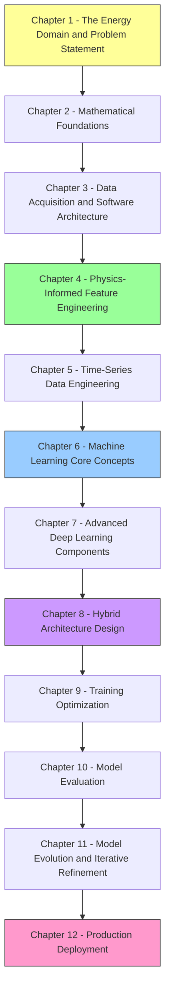

# Solar and Wind Power Forecasting - Complete Learning Vault

## Course Structure

## Course Name: Solar and Wind Power Forecasting with AI

### Chapter 1: The Energy Domain and Problem Statement
- 1.1 The Renewable Intermittency Problem
- 1.2 Grid Economics and System Goals
- 1.3 Why Forecasting Matters Beyond Accuracy

### Chapter 2: Mathematical Foundations
- 2.1 Linear Algebra Essentials for ML
- 2.2 Calculus and Optimization
- 2.3 Probability and Statistics
- 2.4 Information Theory Basics

### Chapter 3: Data Acquisition and Software Architecture
- 3.1 The Adapter Design Pattern
- 3.2 The Wide Format Disaster and Reshaping
- 3.3 Data Harmonization and Canonical Schemas
- 3.4 Handling Missing Data and The dropna Trap
- 3.5 Merging Multi-Source Data

### Chapter 4: Physics-Informed Feature Engineering
- 4.1 The Geometry of Time
- 4.2 Solar Physics and the Clear Sky Index
- 4.3 Fluid Dynamics in Wind Power
- 4.4 Wind Vectors and Dimensional Continuity
- 4.5 Lag Features and Rolling Statistics
- 4.6 The Cubic Power Law and Betz Limit

### Chapter 5: Time-Series Data Engineering
- 5.1 The Sliding Window Strategy and 3D Tensors
- 5.2 Stride Optimization and Memory Management
- 5.3 Feature Scaling and Normalization
- 5.4 Data Leakage in Time Series

### Chapter 6: Machine Learning Core Concepts
- 6.1 Decision Trees and XGBoost Mathematics
- 6.2 Recurrent Neural Networks and Vanishing Gradients
- 6.3 Long Short-Term Memory Networks
- 6.4 Gated Recurrent Units and Bidirectional Logic
- 6.5 Convolutional Neural Networks for Time Series

### Chapter 7: Advanced Deep Learning Components
- 7.1 The Residual Correction Paradigm
- 7.2 Heteroscedastic Loss and Uncertainty Quantification
- 7.3 Monte Carlo Dropout and Ensemble Methods
- 7.4 Conformal Prediction
- 7.5 Batch Normalization and Dropout

### Chapter 8: Hybrid Architecture Design
- 8.1 The Solar Hybrid System (XGBoost + LSTM)
- 8.2 The Wind Bi-GRU System
- 8.3 The CNN-BiLSTM Differential Architecture
- 8.4 The Anchor Logic and Lag Prevention

### Chapter 9: Training Optimization
- 9.1 The Adam Optimizer
- 9.2 Learning Rate Scheduling
- 9.3 Early Stopping and Regularization
- 9.4 Huber Loss for Robust Training
- 9.5 Reproducibility (Seed Everything)

### Chapter 10: Model Evaluation
- 10.1 Chronological Integrity and Data Leakage
- 10.2 Statistical Evaluation Metrics
- 10.3 Probabilistic Metrics (PICP, MPIW, CRPS, Pinball Loss)
- 10.4 Model Artifacts and Serialization

### Chapter 11: Model Evolution and Iterative Refinement
- 11.1 Iteration 1 - Initial XGBoost Baseline (Wind)
- 11.2 Iteration 2 - Initial LSTM/GRU Experimentation (Wind)
- 11.3 Iteration 3 - The Ultimate Physics-Augmented GRU (Wind)

### Chapter 12: Production Deployment
- 12.1 Real-World Edge Deployment
- 12.2 Streamlit and Real-Time Inference
- 12.3 The Circular Buffer Pattern
- 12.4 GPU Acceleration and Infrastructure

## The Two Systems At a Glance

| Feature | Solar AI (Residual Hybrid) | Wind AI (Bi-GRU) |
| :--- | :--- | :--- |
| **Dataset** | UNISOLAR (Site 25) | SDWPF + NREL + Turkey |
| **Scale** | ~10k intervals | 4.7M rows (134 turbines) |
| **Granularity** | 15-minute | 10-minute |
| **Physics Rule** | Sun Elevation and Irradiance | Vector Decomp and Cubic Law |
| **Architecture** | XGBoost + PyTorch LSTM | Bi-GRU (TensorFlow/Keras) |
| **Logic** | Fixes errors made by XGBoost | Predicts change from anchor power |
| **Result (R-squared)** | ~0.87-0.93 | ~0.76-0.87 |
| **Output** | Point Forecast + Confidence (sigma) | 48-Hour Continuous Multi-Step |
| **Loss Function** | Heteroscedastic (Gaussian NLL) | Huber Loss |

## How to Use This Vault

1. **Read chapters in order** - each chapter builds on the previous one
2. **Pay attention to Important Reminders** - these highlight common pitfalls
3. **Study Mermaid diagrams** - they visualize architecture and data flow
4. **Connect theory to code** - every concept maps to a specific file in the project
5. **Re-read iteratively** - some concepts (like backpropagation) require multiple passes
