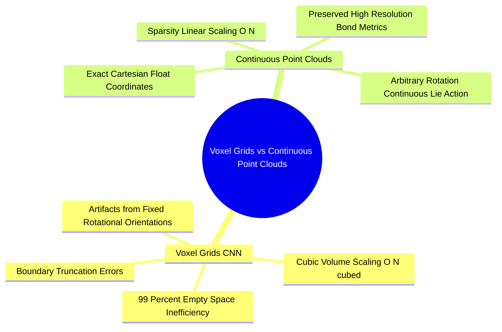

## 1.1. Limitations of Grid Convolutions for Molecular Geometry
```text
File: SynPath-3D AI Systems Knowledge System/1. Prerequisites and The Transition Beyond CNNs/1.1. Limitations of Grid Convolutions for Molecular Geometry.md
Tags: #ml/cnn-limitations #representations/molecular-grids #systems/spatial-complexity
```

### 1. Concept Definition & Intuition
A standard Convolutional Neural Network (CNN) operates on dense, uniformly discretized Cartesian grids in $\mathbb{R}^2$ (images: $[C, H, W]$) or $\mathbb{R}^3$ (volumetric voxel grids: $[C, D, H, W]$). In computer vision, a $3\times3$ or $3\times3\times3$ convolutional kernel slides across pixel indices, applying a shared linear transformation over contiguous array offsets.



In molecular biophysics, representing a binding pocket by discretizing a $20\text{ \AA} \times 20\text{ \AA} \times 20\text{ \AA}$ volume into $0.5\text{ \AA}$ cubic voxels yields an input tensor of size $40 \times 40 \times 40 = 64,000$ spatial cells. If each voxel stores an 8-channel one-hot element vector ($\text{C, N, O, S, H, P, Halogen, Solvent}$), the resulting representation requires $512,000$ floating-point elements per complex.

### 2. Physical and Mathematical Failure Modes of CNNs for Pockets
1. **Extreme Structural Sparsity**: Biological macromolecular systems are largely empty space. A typical pocket contains between $100$ and $200$ heavy atoms. In a $64,000$-voxel volume, fewer than $1\%$ of the voxels are occupied by atomic nuclei. Standard dense 3D convolutions waste over $99\%$ of GPU floating-point operations (FLOPs) and memory bandwidth multiplying zeros.
2. **Loss of Sub-Angstrom Geometric Precision**: Chemical interactions depend on sub-angstrom distances:
   * A hydrogen bond distance expanding from $1.8\text{ \AA}$ to $2.4\text{ \AA}$ reduces the interaction energy by $>70\%$.
   * A carbon-carbon overlap contracting from $3.4\text{ \AA}$ to $2.8\text{ \AA}$ triggers steep Pauli repulsion ($V_{\text{rep}} \propto r^{-12}$), increasing potential energy by tens of $\text{kcal/mol}$.
   Voxelizing space into $0.5\text{ \AA}$ or $1.0\text{ \AA}$ bins quantizes continuous atomic positions. Two atoms separated by $1.3\text{ \AA}$ may be mapped to adjacent voxels or to the same voxel depending on the choice of grid origin, destroying the continuous distance metrics required for accurate biophysical modeling.
3. **Rotational Invariance Failures**: A 3D CNN kernel is translationally equivariant across grid shifts, but it is **not rotationally equivariant**. If a protein-ligand complex is rotated by $37^\circ$ in continuous space, the voxelized pattern changes, forcing the CNN to relearn the interaction across thousands of augmented orientations.