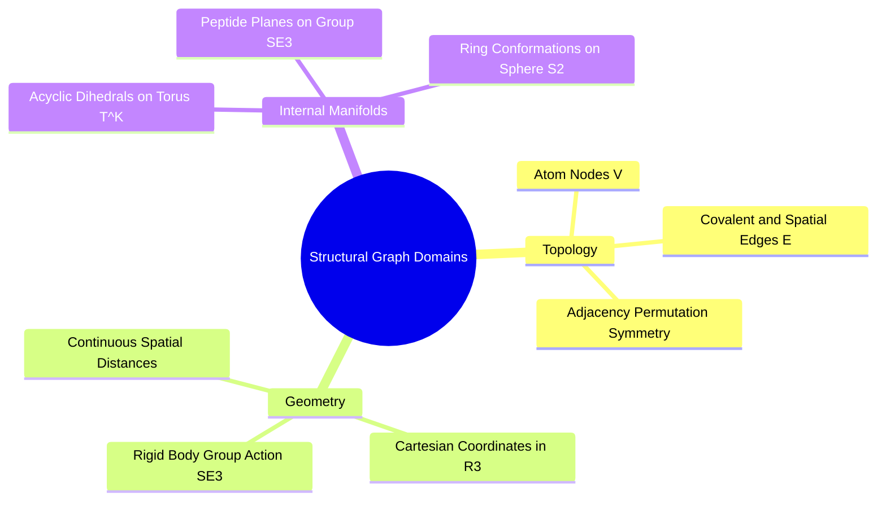

## 1.2. The Shift from Euclidean Grids to Non-Euclidean Manifolds
---
File: SynPath-3D AI Systems Knowledge System/1. Prerequisites and The Transition Beyond CNNs/1.2. The Shift from Euclidean Grids to Non-Euclidean Manifolds.md
Tags: #ml/geometric-dl #representations/graphs #math/topology

---

### 1. Concept Definition & Intuition
To address the limitations of voxel grids, geometric deep learning reformulates molecular modeling using **sparse graphs embedded in continuous 3D Euclidean space**, combined with internal coordinates defined on **non-Euclidean Lie groups**.

A molecular complex is defined as a tuple:
$$\mathcal{G} = (\mathcal{V}, \mathcal{E}, \mathbf{X})$$
* $\mathcal{V} = \{1, \dots, N\}$: Set of atoms (nodes), where each atom carries a feature vector $\mathbf{h}_i \in \mathbb{R}^d$ (element identity, formal charge, hybridization, surface area).
* $\mathcal{E} \subset \mathcal{V} \times \mathcal{V}$: Set of chemical bonds or spatial radius edges linking interacting pairs $(i, j)$.
* $\mathbf{X} = [\vec{x}_1, \vec{x}_2, \dots, \vec{x}_N]^T \in \mathbb{R}^{N \times 3}$: Continuous Cartesian coordinates.

### 2. Mathematical Structure of the Transformation
Instead of sliding fixed convolution weights over an index grid, spatial transformations must respect the physical symmetries of the coordinate space:
1. **Permutation Invariance**: Relabeling the arbitrary indexing of atoms within the graph cannot alter predicted physical properties (e.g., binding free energy):
   $$\mathbf{f}(\mathbf{P}\mathbf{A}\mathbf{P}^T, \mathbf{P}\mathbf{H}, \mathbf{P}\mathbf{X}) = \mathbf{f}(\mathbf{A}, \mathbf{H}, \mathbf{X}) \quad \forall \mathbf{P} \in \mathcal{S}_N$$
   where $\mathcal{S}_N$ is the symmetric group of all $N \times N$ permutation matrices.
2. **Rigid-Body Isometry Group ($\mathrm{SE}(3)$)**: Rotating or translating the protein-ligand complex in space cannot alter scalar physical outputs (e.g., binding affinity), while spatial vectors (e.g., predicted forces, exit vectors) must rotate along with the input:
   $$\text{Invariant Scalar:} \quad s(\mathbf{R}\mathbf{X} + \vec{t}) = s(\mathbf{X})$$
   $$\text{Equivariant Vector:} \quad \vec{v}(\mathbf{R}\mathbf{X} + \vec{t}) = \mathbf{R}\vec{v}(\mathbf{X}) \quad \forall \mathbf{R} \in \mathrm{SO}(3), \, \vec{t} \in \mathbb{R}^3$$
3. **Internal Torsional Torus ($\mathbb{T}^K$)**: Molecules do not deform via arbitrary unconstrained coordinate changes. Covalent bond lengths and angles remain near equilibrium, while conformational changes occur primarily through dihedral rotations around single bonds. These internal degrees of freedom define a flat, periodic $K$-dimensional torus:
   $$\vec{\theta} = (\theta_1, \theta_2, \dots, \theta_K) \in \mathbb{T}^K = \mathrm{SO}(2)^K = [-\pi, \pi)^K$$

---

# 2. Computational Graphs, Autograd, and Differentiation