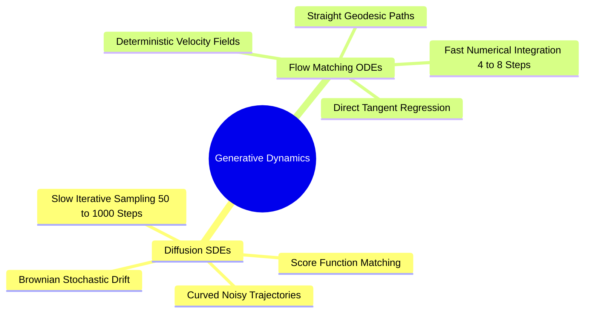

## 10.1. Score-Based Diffusion SDEs versus Continuous Normalizing Flows
```text
File: SynPath-3D AI Systems Knowledge System/10. Continuous-Time Generative Modeling and Flow Matching/10.1. Score-Based Diffusion SDEs versus Continuous Normalizing Flows.md
Tags: #generative/diffusion #generative/flow-matching #math/sde
```

### 1. Concept Definition & Intuition
Generative modeling transforms unstructured noise into structured data. Two primary continuous-time paradigms govern modern generative modeling:
1. **Denoising Diffusion Probabilistic Models (DDPM / Score-Based SDEs, Song et al., 2020)**: Formulates generation as the reverse-time solution of a Stochastic Differential Equation (SDE). Forward diffusion progressively destroys data by injecting Gaussian Brownian noise:
   $$d\mathbf{x} = \mathbf{f}(\mathbf{x}, t)dt + g(t)d\mathbf{w}$$
   Generation requires solving the reverse-time SDE:
   $$d\mathbf{x} = \left[ \mathbf{f}(\mathbf{x}, t) - g(t)^2 \nabla_{\mathbf{x}}\log p_t(\mathbf{x}) \right] dt + g(t)d\bar{\mathbf{w}}$$
   *Failure Mode*: Reverse Brownian motion introduces high trajectory variance, requiring small numerical steps ($50\text{ to }1000$ steps) to avoid numerical divergence.
2. **Flow Matching (Lipman et al., 2023)**: Discards stochastic Brownian noise in favor of a deterministic **Ordinary Differential Equation (ODE)**:
   $$\frac{d\mathbf{x}}{dt} = \mathbf{v}_t(\mathbf{x}_t), \quad \mathbf{x}_0 \sim p_0, \quad \mathbf{x}_1 \sim p_{\text{data}}$$
   The neural network is trained via standard regression to predict the vector field $\mathbf{v}_t$ generating straight probability paths between noise and data.

```text
Diffusion SDE Trajectory vs Flow Matching Geodesic:
Diffusion SDE:       Noise ───~─/\──~──/\─~───► Data (High variance stochastic walk, 100+ steps)
Flow Matching ODE:   Noise ───────────────────► Data (Deterministic straight trajectory, 4-8 steps)
```

