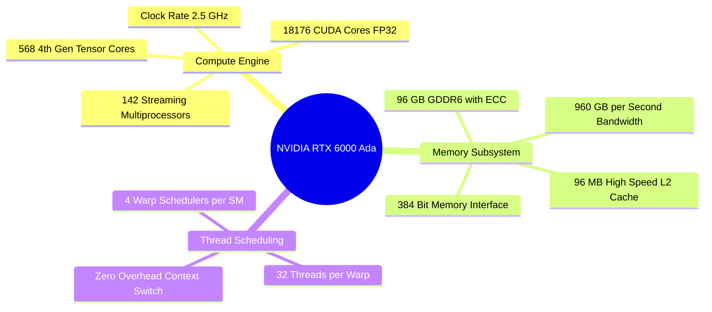

## 14.1. NVIDIA Ada Lovelace Silicon: SMs, Warps, and Thread Scheduling
```text
File: SynPath-3D AI Systems Knowledge System/14. GPU Hardware Architecture and CUDA Mechanics/14.1. NVIDIA Ada Lovelace Silicon SMs Warps and Thread Scheduling.md
Tags: #hardware/ada-lovelace #cuda/sm #systems/gpu
```

### 1. Hardware Architecture of the RTX 6000 Ada
The NVIDIA RTX 6000 Ada Generation workstation GPU is built on the AD102 die (TSMC 4N process):
* **142 Streaming Multiprocessors (SMs)**.
* **18,176 CUDA Cores** (128 FP32 cores per SM).
* **568 4th-Generation Tensor Cores** (4 Tensor Cores per SM).
* **96 GB GDDR6 ECC Memory** across a 384-bit memory bus.
* **Peak Memory Bandwidth**: $960\text{ GB/s}$.
* **L2 Cache Capacity**: $96\text{ MB}$ (a $16\times$ increase over the Ampere architecture).



### 2. Warps, Divergence, and Thread Block Scheduling
1. **The Warp (32 Threads)**: The fundamental execution unit on NVIDIA GPUs. An SM executes instructions via **Single Instruction, Multiple Threads (SIMT)** across a warp of 32 threads.
2. **Warp Divergence**: If an `if-else` condition causes threads within the same warp to follow different execution paths, the SM must **serialize** the execution of each branch, masking out inactive threads and cutting hardware throughput:
   ```python
   # WARP DIVERGENCE BUG: Data-dependent branching across atoms
   if atom_charge > 0: # If some atoms in a 32-warp are positive and some negative:
       run_cation_code() # Half the warp runs; other half stalls!
   else:
       run_anion_code()  # Other half runs; first half stalls!
   ```
   *SynPath-3D Fix*: Node and edge operations avoid data-dependent branching, using uniform matrix operations with continuous floating-point masks.
3. **Latency Hiding via Occupancy**: Unlike CPUs with complex branch predictors and large out-of-order execution logic, an SM hides memory latency through rapid hardware context switching: while Warp 0 waits for a VRAM memory fetch (taking 200–400 clock cycles), the Warp Scheduler switches execution to Warp 1 in a single clock cycle.